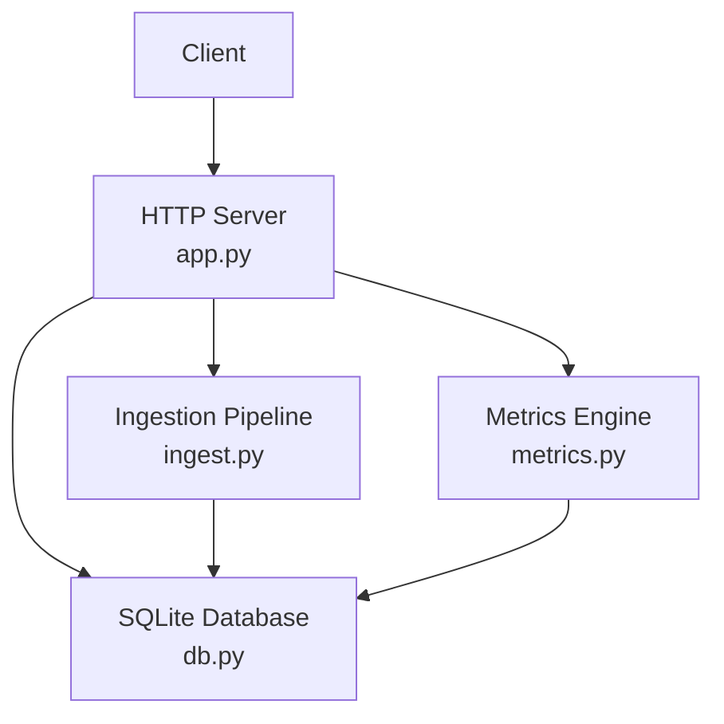
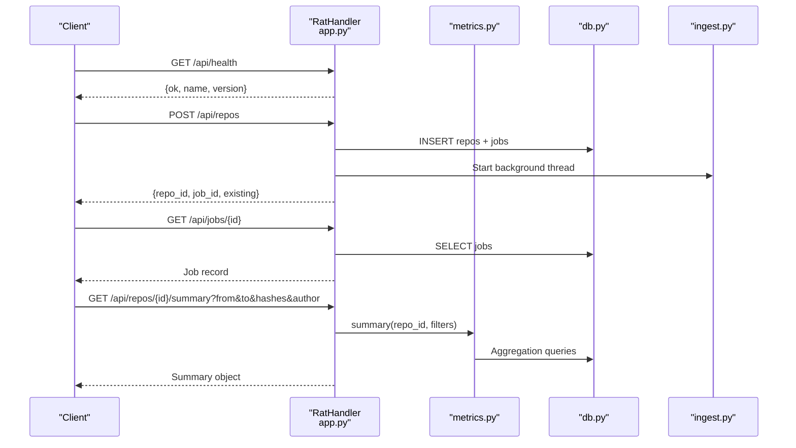
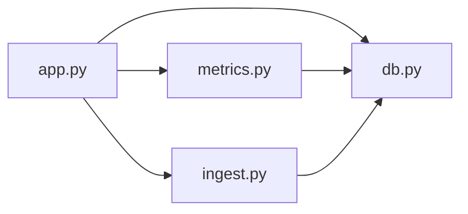

# API Reference

<cite>
**Referenced Files in This Document**
- [app.py](file://app.py)
- [metrics.py](file://metrics.py)
- [db.py](file://db.py)
- [ingest.py](file://ingest.py)
- [README.md](file://README.md)
</cite>

## Table of Contents
1. [Introduction](#introduction)
2. [Project Structure](#project-structure)
3. [Core Components](#core-components)
4. [Architecture Overview](#architecture-overview)
5. [Detailed Component Analysis](#detailed-component-analysis)
6. [Dependency Analysis](#dependency-analysis)
7. [Performance Considerations](#performance-considerations)
8. [Troubleshooting Guide](#troubleshooting-guide)
9. [Conclusion](#conclusion)
10. [Appendices](#appendices)

## Introduction
RAT is a local, offline repository analysis tool that ingests Git repositories from public URLs or ZIP archives and exposes REST endpoints for repository management, metric queries, job monitoring, and health checks. The server binds to a loopback address by default and does not implement authentication; it is intended for local-only deployment.

Key characteristics:
- Local-only HTTP server with no authentication.
- Repository ingestion runs asynchronously in background threads.
- Metrics are computed over commit sets defined by time ranges, author filters, and explicit commit hashes.
- All responses are JSON unless otherwise specified.

**Section sources**
- [README.md:1-46](file://README.md#L1-L46)
- [app.py:1-10](file://app.py#L1-L10)

## Project Structure
The application is a single-process Python web server using the standard library. Core modules:
- app.py: HTTP server, routing, request/response handling, and integration with other modules.
- metrics.py: Metric computation engine, filter parsing, aggregation, and chart generation.
- db.py: SQLite schema, connection helpers, and data directory management.
- ingest.py: Background ingestion pipeline (ZIP extraction, URL cloning, Git history parsing).

**Diagram sources**
- [app.py:56-196](file://app.py#L56-L196)
- [metrics.py:50-225](file://metrics.py#L50-L225)
- [ingest.py:356-421](file://ingest.py#L356-L421)
- [db.py:77-86](file://db.py#L77-L86)

**Section sources**
- [app.py:1-31](file://app.py#L1-L31)
- [metrics.py:1-21](file://metrics.py#L1-L21)
- [db.py:1-11](file://db.py#L1-L11)
- [ingest.py:1-20](file://ingest.py#L1-L20)

## Core Components
- RatHandler: HTTP request handler implementing routing for /api/* endpoints and static file serving.
- Metrics engine: Provides summary, tree, file detail, authors table, commits list, and chart computations.
- Ingestion pipeline: Handles asynchronous ingestion via background threads, updating jobs and repos status.
- Database layer: Manages SQLite connections, schema initialization, and data directory paths.

Authentication: None. The server is designed for local use only.

Error model:
- ApiError exceptions map to JSON error responses with appropriate HTTP status codes.
- FilterError and NotFound exceptions from metrics map to 400 and 404 respectively.

**Section sources**
- [app.py:47-91](file://app.py#L47-L91)
- [app.py:121-196](file://app.py#L121-L196)
- [metrics.py:30-35](file://metrics.py#L30-L35)
- [metrics.py:50-78](file://metrics.py#L50-L78)

## Architecture Overview
The API routes requests to handlers that validate inputs, interact with the metrics engine and database, and return JSON responses. Asynchronous ingestion updates job progress and repository status.

**Diagram sources**
- [app.py:121-196](file://app.py#L121-L196)
- [app.py:279-304](file://app.py#L279-L304)
- [app.py:338-363](file://app.py#L338-L363)
- [metrics.py:205-225](file://metrics.py#L205-L225)
- [db.py:77-86](file://db.py#L77-L86)
- [ingest.py:356-421](file://ingest.py#L356-L421)

## Detailed Component Analysis

### Health Check Endpoint
- Method: GET
- Path: /api/health
- Authentication: None
- Response:
  - ok: boolean
  - name: string
  - version: string
- Status Codes:
  - 200 OK on success

Example response payload:
{
  "ok": true,
  "name": "RAT",
  "version": "1.0"
}

**Section sources**
- [app.py:124-127](file://app.py#L124-L127)

### Repository Management Endpoints

#### List Repositories
- Method: GET
- Path: /api/repos
- Authentication: None
- Response: Array of repository objects with fields including id, name, source, status, error, ref_hash, created_at, commits, files, authors.
- Status Codes:
  - 200 OK on success

Example response payload:
[
  {
    "id": 1,
    "name": "example-repo",
    "source": "url",
    "status": "ready",
    "error": null,
    "ref_hash": "abc123def456",
    "created_at": 1710000000,
    "commits": 120,
    "files": 45,
    "authors": 8
  }
]

**Section sources**
- [app.py:128-130](file://app.py#L128-L130)
- [app.py:262-277](file://app.py#L262-L277)

#### Create Repository from URL
- Method: POST
- Path: /api/repos
- Request Body: JSON object
  - url: string (required, must be http/https)
  - name: string (optional)
- Authentication: None
- Response:
  - repo_id: integer
  - job_id: integer
  - existing: boolean
- Status Codes:
  - 201 Created on success
  - 400 Bad Request if URL validation fails
  - 404 Not Found if repository does not exist during related operations
  - 411 Length Required if Content-Length missing
  - 413 Payload Too Large if body exceeds limit

Example request payload:
{
  "url": "https://github.com/DaveGamble/cJSON.git",
  "name": "cJSON"
}

Example response payload:
{
  "repo_id": 2,
  "job_id": 3,
  "existing": false
}

**Section sources**
- [app.py:177-180](file://app.py#L177-L180)
- [app.py:338-349](file://app.py#L338-L349)
- [ingest.py:70-78](file://ingest.py#L70-L78)

#### Create Repository from Upload
- Method: POST
- Path: /api/repos/upload
- Query Parameters:
  - name: string (optional, .zip suffix stripped)
- Request Body: Binary ZIP archive
- Authentication: None
- Response:
  - repo_id: integer
  - job_id: integer
  - existing: boolean
- Status Codes:
  - 201 Created on success
  - 400 Bad Request if uploaded file is not a ZIP
  - 411 Length Required if Content-Length missing
  - 413 Payload Too Large if body exceeds limit

Example request: multipart/form-data or raw binary with Content-Type indicating ZIP.

Example response payload:
{
  "repo_id": 4,
  "job_id": 5,
  "existing": false
}

**Section sources**
- [app.py:181-183](file://app.py#L181-L183)
- [app.py:351-363](file://app.py#L351-L363)

#### Create Sample Repository
- Method: POST
- Path: /api/repos/sample
- Authentication: None
- Response:
  - repo_id: integer
  - job_id: integer or null
  - existing: boolean
- Status Codes:
  - 201 Created on success
  - 404 Not Found if sample fixture is missing
  - 500 Internal Server Error if demo/fixture.zip is missing

Example response payload:
{
  "repo_id": 6,
  "job_id": 7,
  "existing": false
}

**Section sources**
- [app.py:184-186](file://app.py#L184-L186)
- [app.py:365-381](file://app.py#L365-L381)

#### Merge Authors
- Method: POST
- Path: /api/repos/{id}/authors/merge
- Request Body: JSON object
  - canonical_id: integer (required)
  - merge_ids: array of integers (required)
- Authentication: None
- Response:
  - ok: boolean
  - merged: integer (number of identities merged)
- Status Codes:
  - 200 OK on success
  - 400 Bad Request if input validation fails
  - 404 Not Found if repository does not exist

Example request payload:
{
  "canonical_id": 1,
  "merge_ids": [2, 3]
}

Example response payload:
{
  "ok": true,
  "merged": 2
}

**Section sources**
- [app.py:187-190](file://app.py#L187-L190)
- [app.py:242-259](file://app.py#L242-L259)
- [metrics.py:364-396](file://metrics.py#L364-L396)

#### Delete Repository
- Method: DELETE
- Path: /api/repos/{id}
- Authentication: None
- Response:
  - ok: boolean
- Status Codes:
  - 200 OK on success
  - 404 Not Found if repository does not exist

Example response payload:
{
  "ok": true
}

**Section sources**
- [app.py:191-195](file://app.py#L191-L195)
- [app.py:383-398](file://app.py#L383-L398)

### Metric Query Endpoints

Common query parameters for metric endpoints:
- from: integer epoch seconds (inclusive), optional
- to: integer epoch seconds (exclusive), optional
- hashes: comma-separated commit hash strings or prefixes, optional
- author: integer canonical author id, optional

Filter behavior:
- Filters combine with AND.
- Empty hashes parameter means empty commit set.
- Hash tokens must be 4-40 hex characters; up to 900 allowed.

Validation errors raise FilterError mapped to 400.

#### Repository Summary
- Method: GET
- Path: /api/repos/{id}/summary
- Query Parameters: from, to, hashes, author
- Authentication: None
- Response:
  - added: integer
  - removed: integer
  - growth: integer
  - churn: integer
  - modifications: integer
  - frequency: number
  - churn_rate: number
  - commits: integer
  - files: integer
  - authors: integer
- Status Codes:
  - 200 OK on success
  - 400 Bad Request if filters invalid
  - 404 Not Found if repository does not exist

Example response payload:
{
  "added": 1200,
  "removed": 300,
  "growth": 900,
  "churn": 1500,
  "modifications": 45,
  "frequency": 0.375,
  "churn_rate": 1.25,
  "commits": 120,
  "files": 45,
  "authors": 8
}

**Section sources**
- [app.py:139-142](file://app.py#L139-L142)
- [metrics.py:205-225](file://metrics.py#L205-L225)
- [metrics.py:50-78](file://metrics.py#L50-L78)

#### Directory Tree
- Method: GET
- Path: /api/repos/{id}/tree
- Query Parameters: path (directory path), from, to, hashes, author
- Authentication: None
- Response:
  - path: string
  - children: array of items with fields:
    - name: string
    - path: string
    - kind: "dir" | "file"
    - added, removed, growth, churn, modifications, frequency, churn_rate
- Status Codes:
  - 200 OK on success
  - 400 Bad Request if filters invalid
  - 404 Not Found if repository does not exist

Example response payload:
{
  "path": "src",
  "children": [
    {
      "name": "lib",
      "path": "src/lib",
      "kind": "dir",
      "added": 500,
      "removed": 100,
      "growth": 400,
      "churn": 600,
      "modifications": 20,
      "frequency": 0.1667,
      "churn_rate": 0.5
    },
    {
      "name": "main.py",
      "path": "src/main.py",
      "kind": "file",
      "added": 120,
      "removed": 30,
      "growth": 90,
      "churn": 150,
      "modifications": 5,
      "frequency": 0.0417,
      "churn_rate": 0.125
    }
  ]
}

**Section sources**
- [app.py:143-151](file://app.py#L143-L151)
- [metrics.py:228-262](file://metrics.py#L228-L262)
- [metrics.py:81-88](file://metrics.py#L81-L88)

#### File Detail
- Method: GET
- Path: /api/repos/{id}/file
- Query Parameters: path (required file path), from, to, hashes, author
- Authentication: None
- Response:
  - path: string
  - added, removed, growth, churn, modifications, frequency, churn_rate
  - authors: array of author entries with fields:
    - id: integer
    - name: string
    - email: string
    - commits: integer
    - modifications: integer
    - added, removed, churn
    - ownership: number
- Status Codes:
  - 200 OK on success
  - 400 Bad Request if filters invalid or path missing
  - 404 Not Found if repository does not exist

Example response payload:
{
  "path": "src/main.py",
  "added": 120,
  "removed": 30,
  "growth": 90,
  "churn": 150,
  "modifications": 5,
  "frequency": 0.0417,
  "churn_rate": 0.125,
  "authors": [
    {
      "id": 1,
      "name": "Alice",
      "email": "alice@example.com",
      "commits": 3,
      "modifications": 4,
      "added": 100,
      "removed": 20,
      "churn": 120,
      "ownership": 0.8
    }
  ]
}

**Section sources**
- [app.py:152-160](file://app.py#L152-L160)
- [metrics.py:265-307](file://metrics.py#L265-L307)

#### Authors Table
- Method: GET
- Path: /api/repos/{id}/authors
- Query Parameters: from, to, hashes, author
- Authentication: None
- Response: Array of author groups with fields:
  - id: integer
  - name: string
  - email: string
  - identities: array of identity objects (id, name, email)
  - commits: integer
  - modifications: integer
  - churn: integer
  - ownership: number
- Status Codes:
  - 200 OK on success
  - 400 Bad Request if filters invalid
  - 404 Not Found if repository does not exist

Example response payload:
[
  {
    "id": 1,
    "name": "Alice",
    "email": "alice@example.com",
    "identities": [
      {"id": 1, "name": "Alice", "email": "alice@example.com"},
      {"id": 2, "name": "A. Smith", "email": "a.smith@example.com"}
    ],
    "commits": 45,
    "modifications": 30,
    "churn": 1200,
    "ownership": 0.8
  }
]

**Section sources**
- [app.py:161-164](file://app.py#L161-L164)
- [metrics.py:310-361](file://metrics.py#L310-L361)

#### Commits List
- Method: GET
- Path: /api/repos/{id}/commits
- Query Parameters:
  - limit: integer (default 500, range 1-5000)
  - offset: integer (default 0)
  - query: string (search subject/hash prefix, max length 80)
  - from, to, hashes, author
- Authentication: None
- Response:
  - total: integer
  - commits: array of commit objects with fields:
    - hash: string
    - ts: integer
    - subject: string
    - author_id: integer
    - author: string
- Status Codes:
  - 200 OK on success
  - 400 Bad Request if filters invalid or query too long
  - 404 Not Found if repository does not exist

Example response payload:
{
  "total": 120,
  "commits": [
    {
      "hash": "abc123def456",
      "ts": 1710000000,
      "subject": "Initial commit",
      "author_id": 1,
      "author": "Alice"
    }
  ]
}

**Section sources**
- [app.py:165-168](file://app.py#L165-L168)
- [app.py:212-240](file://app.py#L212-L240)
- [metrics.py:399-435](file://metrics.py#L399-L435)

#### Chart Data
- Method: GET
- Path: /api/repos/{id}/chart
- Query Parameters:
  - type: "churn" | "topfiles" | "authorshare"
  - from, to, hashes, author
- Authentication: None
- Response:
  - For "churn":
    - labels: array of date strings
    - bucket: "day" | "week" | "month"
    - series: array of series objects with name and data arrays
  - For "topfiles":
    - labels: array of file paths
    - series: array of series objects with name and data arrays
  - For "authorshare":
    - labels: array of author names
    - series: array of series objects with name and data arrays
    - total: integer
- Status Codes:
  - 200 OK on success
  - 400 Bad Request if unknown chart type or filters invalid
  - 404 Not Found if repository does not exist

Example response payload (churn):
{
  "labels": ["2024-01-01", "2024-01-02"],
  "bucket": "day",
  "series": [
    {"name": "Added", "data": [100, 150]},
    {"name": "Removed", "data": [20, 30]},
    {"name": "Churn", "data": [120, 180]}
  ]
}

**Section sources**
- [app.py:169-176](file://app.py#L169-L176)
- [metrics.py:463-543](file://metrics.py#L463-L543)

### Job Monitoring Endpoints

#### Get Job by ID
- Method: GET
- Path: /api/jobs/{id}
- Authentication: None
- Response: Job record with fields:
  - id: integer
  - repo_id: integer
  - kind: string ("ingest")
  - status: "running" | "done" | "error"
  - progress: number
  - message: string
  - created_at: integer
- Status Codes:
  - 200 OK on success
  - 404 Not Found if job does not exist

Example response payload:
{
  "id": 3,
  "repo_id": 2,
  "kind": "ingest",
  "status": "running",
  "progress": 0.45,
  "message": "Reading history - 50 of 120 commits",
  "created_at": 1710000000
}

**Section sources**
- [app.py:131-134](file://app.py#L131-L134)
- [app.py:279-291](file://app.py#L279-L291)

#### Get Latest Job for Repository
- Method: GET
- Path: /api/repos/{id}/job
- Authentication: None
- Response: Job record or null if none exists
- Status Codes:
  - 200 OK on success

Example response payload:
{
  "id": 5,
  "repo_id": 4,
  "kind": "ingest",
  "status": "done",
  "progress": 1.0,
  "message": "Ready - 120 commits, 45 file rows",
  "created_at": 1710000000
}

**Section sources**
- [app.py:135-138](file://app.py#L135-L138)
- [app.py:293-304](file://app.py#L293-L304)

### Error Responses and Status Codes
Common error patterns:
- 400 Bad Request: Invalid filters, malformed JSON, invalid integer parameters, unknown chart type, path validation failures.
- 404 Not Found: Unknown endpoint, repository or job does not exist.
- 411 Length Required: Missing Content-Length header.
- 413 Payload Too Large: Request body exceeds configured limits.
- 500 Internal Server Error: Unexpected exceptions or missing fixtures.

Error response format:
{
  "error": "Human-readable message"
}

**Section sources**
- [app.py:47-54](file://app.py#L47-L54)
- [app.py:84-90](file://app.py#L84-L90)
- [app.py:401-424](file://app.py#L401-L424)
- [metrics.py:30-35](file://metrics.py#L30-L35)

### Client Implementation Guidelines
- Base URL: Use the printed URL at startup (e.g., http://127.0.0.1:8000).
- Authentication: None required.
- Content-Type: application/json for JSON payloads.
- Pagination: Use limit and offset for commits list.
- Filtering: Apply from/to/hashes/author for metric endpoints.
- Polling: Poll /api/jobs/{id} for ingestion progress; backoff strategy recommended.
- Error Handling: Parse error field in JSON responses and handle status codes appropriately.

Common use cases:
- Load sample repository: POST /api/repos/sample, then monitor job and query metrics.
- Clone public repository: POST /api/repos with url, then poll job until done.
- Analyze directory churn: GET /api/repos/{id}/tree with path and filters.
- Track author contributions: GET /api/repos/{id}/authors with filters.

**Section sources**
- [README.md:14-21](file://README.md#L14-L21)
- [app.py:455-487](file://app.py#L455-L487)

## Dependency Analysis
Component relationships:
- app.py depends on db.py, metrics.py, ingest.py.
- metrics.py depends on db.py for data access.
- ingest.py depends on db.py for persistence and uses git CLI for cloning/history.
- No circular dependencies detected.

**Diagram sources**
- [app.py:28-30](file://app.py#L28-L30)
- [metrics.py:1-21](file://metrics.py#L1-L21)
- [ingest.py:30-35](file://ingest.py#L30-L35)
- [db.py:77-86](file://db.py#L77-L86)

**Section sources**
- [app.py:28-30](file://app.py#L28-L30)
- [metrics.py:1-21](file://metrics.py#L1-L21)
- [ingest.py:30-35](file://ingest.py#L30-L35)

## Performance Considerations
- Large repositories:
  - Use commit set filters (from/to/hashes/author) to reduce computation scope.
  - Avoid broad path queries; specify exact file paths for detailed metrics.
  - Limit commits list pagination with reasonable limit values.
- Database performance:
  - SQLite WAL mode improves concurrent reads during ingestion.
  - Indexes on files(repo_id, commit_id), files(repo_id, path), commits(repo_id, ts), commits(repo_id, hash) optimize common queries.
- Network considerations:
  - Local-only binding reduces exposure; ensure firewall rules restrict access.
  - Use efficient polling intervals for job monitoring to avoid excessive load.

**Section sources**
- [db.py:77-86](file://db.py#L77-L86)
- [db.py:58-62](file://db.py#L58-L62)
- [metrics.py:50-78](file://metrics.py#L50-L78)

## Troubleshooting Guide
Common issues:
- Port conflicts: Server tries multiple ports; check printed URL.
- Missing git: Ensure git is installed and available in PATH.
- Stale jobs: On restart, running jobs are marked as error; re-ingest if needed.
- Data reset: Delete data/ directory to clear all state.

Debugging steps:
- Verify health endpoint responds.
- Check job status for ingestion progress and messages.
- Validate filter parameters for metric queries.
- Inspect repository status and error fields for ingestion failures.

**Section sources**
- [README.md:36-40](file://README.md#L36-L40)
- [ingest.py:443-457](file://ingest.py#L443-L457)
- [app.py:455-487](file://app.py#L455-L487)

## Conclusion
RAT provides a comprehensive REST API for local repository analysis, covering repository lifecycle management, rich metric queries, and asynchronous job monitoring. Designed for local-only deployment without authentication, it emphasizes simplicity and performance through SQLite and efficient filtering. Clients should leverage filters and pagination to optimize queries and implement robust error handling for reliable integration.

## Appendices

### Environment Variables
- PORT: First port tried (default 8000), falls back to 8080, 8888, 9000.
- HOST: Bind address (default 127.0.0.1).
- DATA_DIR: Data directory for SQLite and ingested repos (default <repo>/data).

**Section sources**
- [README.md:28-34](file://README.md#L28-L34)
- [app.py:6-10](file://app.py#L6-L10)