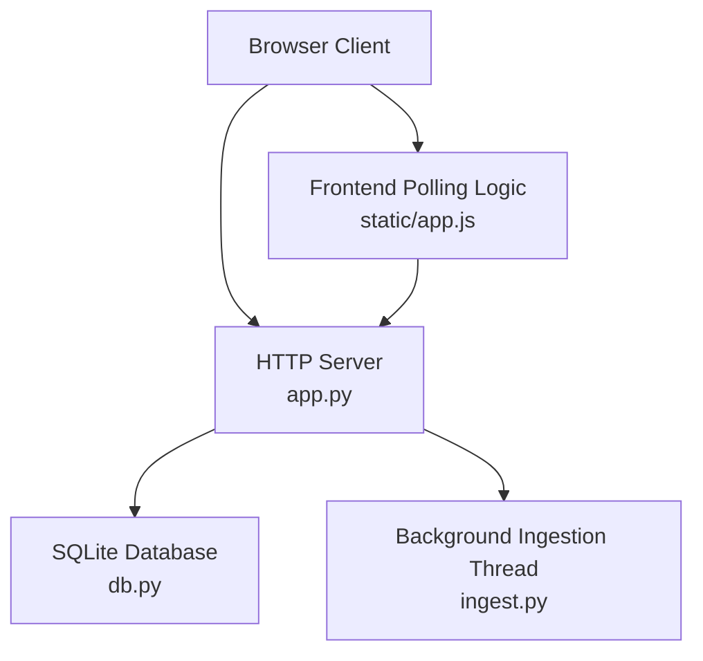
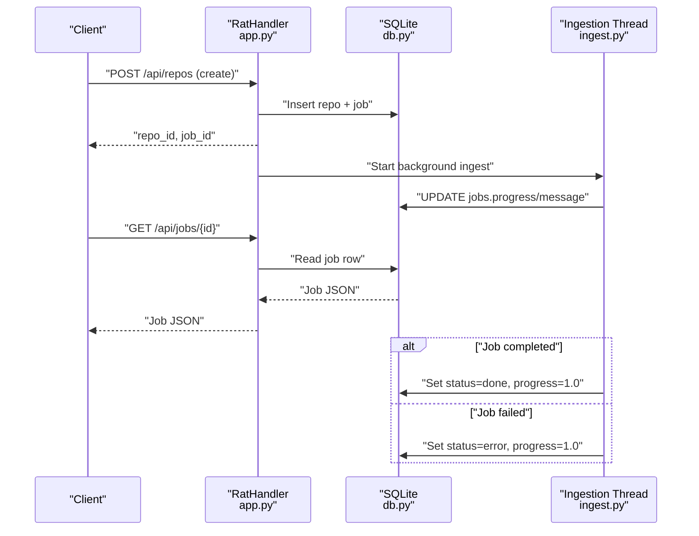
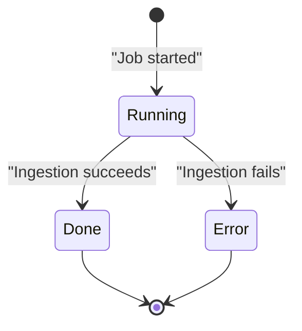
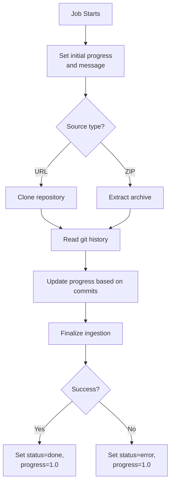
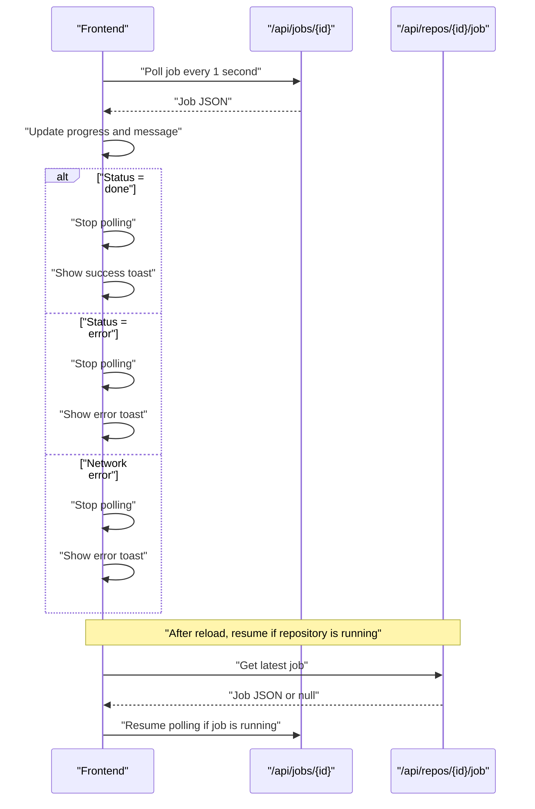
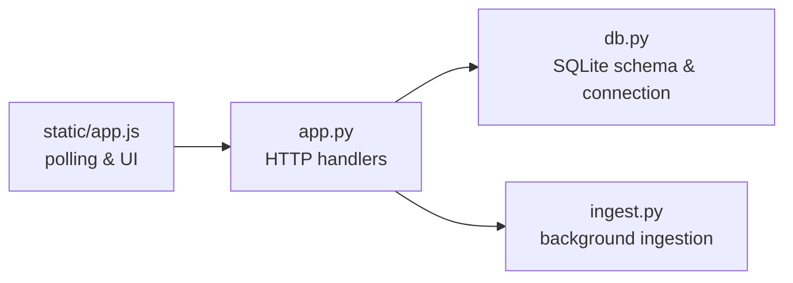

# Job Monitoring

<cite>
**Referenced Files in This Document**
- [app.py](file://app.py)
- [db.py](file://db.py)
- [ingest.py](file://ingest.py)
- [static/app.js](file://static/app.js)
- [README.md](file://README.md)
</cite>

## Table of Contents
1. [Introduction](#introduction)
2. [Project Structure](#project-structure)
3. [Core Components](#core-components)
4. [Architecture Overview](#architecture-overview)
5. [Detailed Component Analysis](#detailed-component-analysis)
6. [Dependency Analysis](#dependency-analysis)
7. [Performance Considerations](#performance-considerations)
8. [Troubleshooting Guide](#troubleshooting-guide)
9. [Conclusion](#conclusion)

## Introduction
This document describes the background job monitoring API for the Repo Analysis Tool. It focuses on:
- Polling an individual job with `GET /api/jobs/{id}` to track progress, status updates, and error messages.
- Resuming a running ingestion after a page reload using `GET /api/repos/{id}/job`.
- The job lifecycle, how progress is calculated, how messages are formatted, and recommended client-side polling strategies.

The system ingests Git repositories from URLs or ZIP archives, stores ingestion state in SQLite, and exposes lightweight JSON endpoints suitable for browser-based polling.

**Section sources**
- [README.md:1-20](file://README.md#L1-L20)

## Project Structure
The job monitoring functionality spans three main layers:
- HTTP routing and response handling in the web server.
- Background ingestion logic that updates job state.
- Frontend polling and UI resumption.

**Diagram sources**
- [app.py:56-96](file://app.py#L56-L96)
- [db.py:77-86](file://db.py#L77-L86)
- [ingest.py:356-441](file://ingest.py#L356-L441)
- [static/app.js:248-285](file://static/app.js#L248-L285)

**Section sources**
- [app.py:56-96](file://app.py#L56-L96)
- [db.py:77-86](file://db.py#L77-L86)
- [ingest.py:356-441](file://ingest.py#L356-L441)
- [static/app.js:248-285](file://static/app.js#L248-L285)

## Core Components
The job monitoring API consists of two primary GET endpoints:
- `GET /api/jobs/{id}` returns the current state of a specific job.
- `GET /api/repos/{id}/job` returns the latest job for a repository, enabling UI resumption after reloads.

Both endpoints return JSON objects containing job metadata such as identifier, repository association, kind, status, progress, message, and creation timestamp.

Key behaviors:
- `/api/jobs/{id}` returns 404 when no matching job exists.
- `/api/repos/{id}/job` returns `null` when no job exists for the repository.
- Progress is a floating-point value between 0 and 1.
- Status values include `running`, `done`, and `error`.
- Messages describe human-readable progress or failure details.

**Section sources**
- [app.py:121-196](file://app.py#L121-L196)
- [app.py:279-304](file://app.py#L279-L304)
- [db.py:49-57](file://db.py#L49-L57)

## Architecture Overview
The ingestion workflow starts when a repository is created through URL cloning, ZIP upload, or sample loading. A background thread performs the ingestion and periodically updates the job record. Clients poll the job endpoint until completion or failure.

**Diagram sources**
- [app.py:306-336](file://app.py#L306-L336)
- [app.py:279-304](file://app.py#L279-L304)
- [ingest.py:320-349](file://ingest.py#L320-L349)
- [ingest.py:356-441](file://ingest.py#L356-L441)
- [db.py:77-86](file://db.py#L77-L86)

## Detailed Component Analysis

### Endpoint: `GET /api/jobs/{id}`
Purpose:
- Return the current state of a job identified by its numeric ID.
- Support polling clients tracking ingestion progress.

Routing:
- Matches paths like `/api/jobs/123`.
- Dispatches to `_send_job(job_id)`.

Response model:
- `id`: integer job identifier.
- `repo_id`: integer repository identifier.
- `kind`: string job type; currently `ingest`.
- `status`: string lifecycle state.
- `progress`: float percentage expressed as a fraction.
- `message`: string describing current stage or error.
- `created_at`: integer Unix timestamp.

Status values:
- `running`: ingestion is active.
- `done`: ingestion succeeded.
- `error`: ingestion failed.

Error behavior:
- Returns 404 with an error message when the job does not exist.

Progress semantics:
- Progress is updated incrementally during ingestion.
- Final successful ingestion sets progress to 1.0.
- Failed ingestion also sets progress to 1.0.

Example progression:
- Initial job creation may set progress near zero with a queued or starting message.
- During cloning or extraction, progress increases while reading history.
- On success, status becomes `done` with a summary message.
- On failure, status becomes `error` with an error message.

**Section sources**
- [app.py:131-134](file://app.py#L131-L134)
- [app.py:279-291](file://app.py#L279-L291)
- [db.py:49-57](file://db.py#L49-L57)
- [ingest.py:320-349](file://ingest.py#L320-L349)
- [ingest.py:408-420](file://ingest.py#L408-L420)

### Endpoint: `GET /api/repos/{id}/job`
Purpose:
- Retrieve the most recent job associated with a repository.
- Enable the UI to resume polling after a page reload without losing progress context.

Routing:
- Matches paths like `/api/repos/42/job`.
- Dispatches to `_send_latest_job(repo_id)`.

Behavior:
- Queries the latest job by descending job ID for the given repository.
- Returns the job JSON if present.
- Returns `null` when no job exists.

Use case:
- After reloading the dashboard, the frontend checks whether the selected repository is still running.
- If so, it calls this endpoint to obtain the active job ID and resumes polling `/api/jobs/{id}`.

**Section sources**
- [app.py:135-138](file://app.py#L135-L138)
- [app.py:293-304](file://app.py#L293-L304)
- [static/app.js:279-285](file://static/app.js#L279-L285)

### Job Lifecycle States
The job lifecycle is driven by the ingestion pipeline and reflected in the database schema and API responses.

Lifecycle states:
- `running`: The job is active. Progress increases as ingestion proceeds.
- `done`: The ingestion completed successfully. Progress is 1.0.
- `error`: The ingestion failed. Progress is 1.0 and the message contains failure details.

Repository status interaction:
- Repository status can be `pending`, `running`, `ready`, or `error`.
- During ingestion, repository status is set to `running`.
- On success, repository status becomes `ready`.
- On failure, repository status becomes `error`.

Startup recovery:
- On server restart, any jobs still marked `running` are converted to `error` with a restart-related message.
- Repositories in `pending` or `running` are also marked `error`.

**Diagram sources**
- [db.py:49-57](file://db.py#L49-L57)
- [ingest.py:320-349](file://ingest.py#L320-L349)
- [ingest.py:408-420](file://ingest.py#L408-L420)
- [ingest.py:443-457](file://ingest.py#L443-L457)

**Section sources**
- [db.py:15-57](file://db.py#L15-L57)
- [ingest.py:320-349](file://ingest.py#L320-L349)
- [ingest.py:408-420](file://ingest.py#L408-L420)
- [ingest.py:443-457](file://ingest.py#L443-L457)

### Progress Percentage Calculation
Progress is represented as a float between 0 and 1.

How it is computed:
- Early stages assign fixed progress values:
  - Starting phase: small non-zero value.
  - Cloning or extraction phase: intermediate value.
  - History reading phase: scaled proportionally to commits processed.
- Finalization sets progress close to completion before marking done.
- Successful completion sets progress to exactly 1.0.
- Failure sets progress to 1.0.

Message formatting:
- Progress messages describe the current stage, such as starting, cloning, unzipping, reading history, finalizing, or readiness.
- Success messages include counts of commits and file rows.
- Error messages contain user-readable failure descriptions.

**Diagram sources**
- [ingest.py:372-398](file://ingest.py#L372-L398)
- [ingest.py:408-420](file://ingest.py#L408-L420)
- [ingest.py:320-349](file://ingest.py#L320-L349)

**Section sources**
- [ingest.py:320-349](file://ingest.py#L320-L349)
- [ingest.py:372-398](file://ingest.py#L372-L398)
- [ingest.py:408-420](file://ingest.py#L408-L420)

### Client-Side Polling Strategy
The frontend implements polling for job progress and handles completion or failure.

Polling flow:
- When a repository is added, the client receives a job ID.
- It polls `/api/jobs/{id}` at a fixed interval.
- On each response, it updates the UI chip, progress bar, and status message.
- When status is `done`, polling stops, a success toast is shown, and the repository view refreshes.
- When status is `error`, polling stops, an error toast is shown, and the repository view refreshes.
- On network errors, polling stops and an error toast is displayed.

Resumption after reload:
- If the selected repository has status `running`, the frontend calls `/api/repos/{id}/job`.
- If a running job is returned, polling resumes using the job ID.

Recommended intervals:
- Use a short polling interval such as one second, as implemented by the frontend.
- Avoid excessive polling by stopping immediately on terminal states (`done` or `error`).
- Handle transient network failures gracefully by stopping polling and surfacing the error.

**Diagram sources**
- [static/app.js:248-285](file://static/app.js#L248-L285)

**Section sources**
- [static/app.js:248-285](file://static/app.js#L248-L285)

### Typical Job Progression Examples

#### Successful Ingestion
1. Job created with initial progress and a starting message.
2. Progress increases during cloning or extraction.
3. Progress scales with commit processing during history reading.
4. Finalization sets progress near completion.
5. Status becomes `done`, progress becomes 1.0, and the message includes ingestion statistics.

#### Failed Ingestion
1. Job starts normally.
2. An ingestion error occurs, such as invalid input, missing `.git`, or subprocess failure.
3. Status becomes `error`, progress becomes 1.0, and the message contains the failure description.
4. Partially ingested data is cleaned up for the repository.

**Section sources**
- [ingest.py:320-349](file://ingest.py#L320-L349)
- [ingest.py:356-441](file://ingest.py#L356-L441)

## Dependency Analysis
The job monitoring endpoints depend on:
- HTTP routing and request handling in the server.
- SQLite database access for job persistence.
- Background ingestion threads that update job state.
- Frontend polling logic that consumes the API.

**Diagram sources**
- [app.py:121-196](file://app.py#L121-L196)
- [db.py:77-86](file://db.py#L77-L86)
- [ingest.py:356-441](file://ingest.py#L356-L441)
- [static/app.js:248-285](file://static/app.js#L248-L285)

**Section sources**
- [app.py:121-196](file://app.py#L121-L196)
- [db.py:77-86](file://db.py#L77-L86)
- [ingest.py:356-441](file://ingest.py#L356-L441)
- [static/app.js:248-285](file://static/app.js#L248-L285)

## Performance Considerations
- Polling frequency should balance responsiveness and server load. One-second intervals are reasonable for typical ingestion durations.
- Stop polling immediately on terminal states to avoid unnecessary requests.
- The server suppresses console logs for job polling endpoints to keep output readable under frequent polling.
- Database connections use WAL mode and busy timeouts to allow concurrent reads during ingestion writes.
- Large repositories may take longer to process; clients should tolerate extended running states.

[No sources needed since this section provides general guidance]

## Troubleshooting Guide
Common issues and resolutions:
- Job not found:
  - `GET /api/jobs/{id}` returns 404 when the job ID does not exist.
  - Verify the job ID returned when creating the repository.
- No latest job for repository:
  - `GET /api/repos/{id}/job` returns `null` when no job exists.
  - Ensure a repository ingestion was initiated.
- Stale running jobs after restart:
  - Jobs marked `running` at shutdown become `error` with a restart message.
  - Restart the server and re-initiate ingestion if necessary.
- Network errors during polling:
  - The frontend stops polling and displays an error toast.
  - Retry manually or refresh the repository list.

**Section sources**
- [app.py:84-90](file://app.py#L84-L90)
- [app.py:279-291](file://app.py#L279-L291)
- [app.py:293-304](file://app.py#L293-L304)
- [ingest.py:443-457](file://ingest.py#L443-L457)
- [static/app.js:269-277](file://static/app.js#L269-L277)

## Conclusion
The job monitoring API provides a simple, reliable mechanism for tracking background ingestion work. Clients poll `/api/jobs/{id}` for real-time progress and use `/api/repos/{id}/job` to resume operation after reloads. The backend maps ingestion phases to clear status values, progress fractions, and human-readable messages, making it straightforward to build responsive dashboards.

[No sources needed since this section summarizes without analyzing specific files]