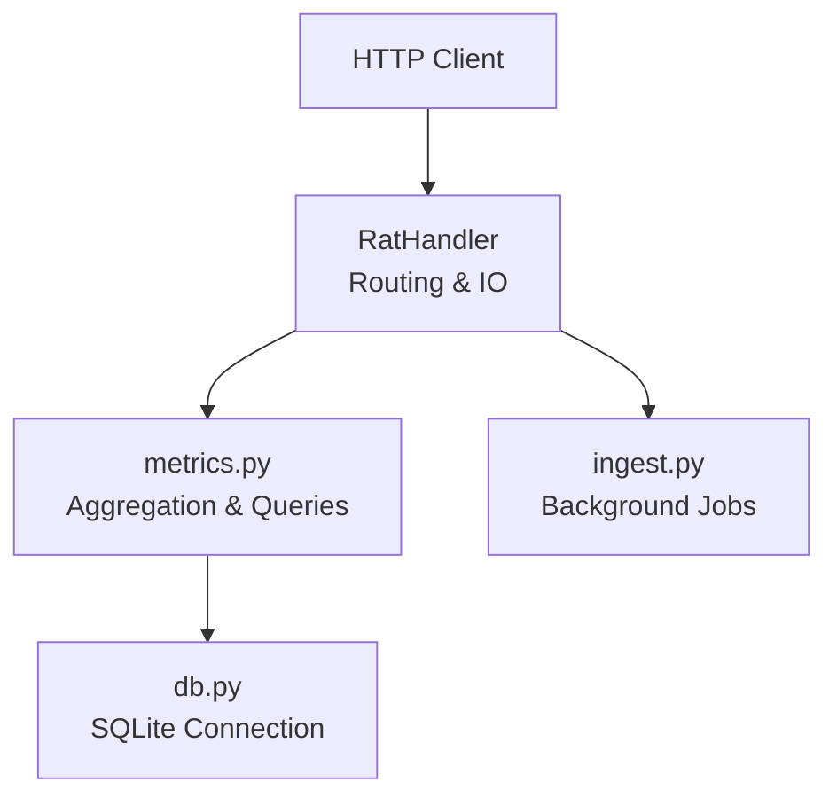
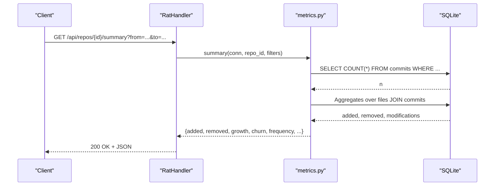
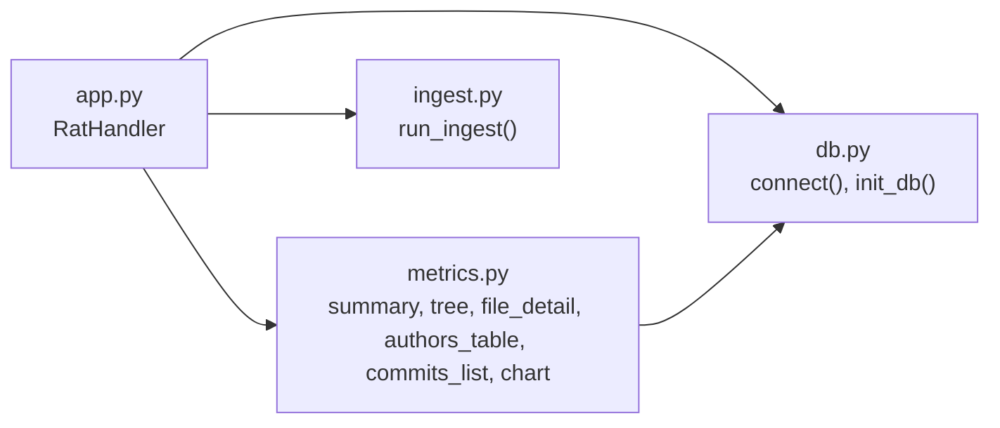

# Metrics Query Endpoints

<cite>
**Referenced Files in This Document**
- [app.py](file://app.py)
- [metrics.py](file://metrics.py)
- [db.py](file://db.py)
- [ingest.py](file://ingest.py)
- [README.md](file://README.md)
</cite>

## Table of Contents
1. [Introduction](#introduction)
2. [Project Structure](#project-structure)
3. [Core Components](#core-components)
4. [Architecture Overview](#architecture-overview)
5. [Detailed Component Analysis](#detailed-component-analysis)
6. [Dependency Analysis](#dependency-analysis)
7. [Performance Considerations](#performance-considerations)
8. [Troubleshooting Guide](#troubleshooting-guide)
9. [Conclusion](#conclusion)

## Introduction
This document provides comprehensive API documentation for the metrics query endpoints exposed by the Repo Analysis Tool (RAT). It covers repository-level metrics, hierarchical file/directory navigation, detailed file metrics and ownership, author contribution statistics, commit timeline with pagination, and chart data generation. It also documents shared filter parameters, response schemas, error handling, and performance considerations for large datasets.

The server is a standard-library Python HTTP service that routes requests to metric functions backed by a SQLite database. All metrics are computed over a selected commit set defined by filters such as date ranges, commit hashes, and authors.

**Section sources**
- [README.md:1-46](file://README.md#L1-L46)

## Project Structure
At runtime, the application exposes an HTTP API under `/api/...`. The routing layer parses paths and delegates to metric functions in the metrics module. Data is persisted in SQLite via a small database helper. Ingestion runs asynchronously in background threads and populates commits, files, and authors tables.

**Diagram sources**
- [app.py:56-196](file://app.py#L56-L196)
- [metrics.py:205-543](file://metrics.py#L205-L543)
- [db.py:77-86](file://db.py#L77-L86)
- [ingest.py:356-431](file://ingest.py#L356-L431)

**Section sources**
- [app.py:56-196](file://app.py#L56-L196)
- [db.py:15-62](file://db.py#L15-L62)
- [ingest.py:181-315](file://ingest.py#L181-L315)

## Core Components
- RatHandler: HTTP request handler and router for all API endpoints.
- metrics module: Implements aggregation logic, filtering, and endpoint-specific computations.
- db module: Database schema, connection management, and helpers.
- ingest module: Background ingestion pipeline that populates commits, files, and authors.

Key responsibilities:
- Routing and parameter parsing live in app.py.
- Metric calculations and SQL composition live in metrics.py.
- Persistence and schema live in db.py.
- Asynchronous ingestion lives in ingest.py.

**Section sources**
- [app.py:56-196](file://app.py#L56-L196)
- [metrics.py:30-78](file://metrics.py#L30-L78)
- [db.py:15-62](file://db.py#L15-L62)
- [ingest.py:356-431](file://ingest.py#L356-L431)

## Architecture Overview
The API follows a layered design:
- HTTP Layer: RatHandler validates inputs, parses query strings, and returns JSON responses.
- Metrics Layer: Functions compute aggregates over filtered commit sets and return structured results.
- Data Layer: SQLite stores normalized entities (repos, authors, commits, files) with indexes for efficient querying.
- Ingestion Layer: Background jobs parse Git history into the database.

**Diagram sources**
- [app.py:121-176](file://app.py#L121-L176)
- [metrics.py:205-225](file://metrics.py#L205-L225)
- [db.py:77-86](file://db.py#L77-L86)

## Detailed Component Analysis

### Shared Filter Parameters
All metrics endpoints accept common filters through query parameters:
- from: epoch seconds (inclusive). Must be non-negative integer.
- to: epoch seconds (exclusive). Must be non-negative integer.
- hashes: comma-separated list of commit hashes or prefixes. Supports exact 12+ char prefixes and short prefixes. Max 900 tokens.
- author: canonical author id (integer >= 1).

Filter validation rules:
- Invalid integers raise a 400 Bad Request.
- Out-of-range values raise a 400 Bad Request.
- Too many hashes raise a 400 Bad Request.
- Invalid hash format raises a 400 Bad Request.

Commit-set semantics:
- Filters combine with AND.
- Empty hashes list means empty commit set (no commits selected).
- Date range uses ts >= from AND ts < to.
- Author filter resolves identity via COALESCE(canonical_id, id).

**Section sources**
- [metrics.py:30-78](file://metrics.py#L30-L78)
- [metrics.py:91-124](file://metrics.py#L91-L124)

### GET /api/repos/{id}/summary
Purpose:
- Repository-level metrics including growth, churn, frequency, and ownership analysis over the selected commit set.

Path parameters:
- id: repository id (integer).

Query parameters:
- from, to, hashes, author (as described above).

Response fields:
- added: total lines added across selected commits.
- removed: total lines removed across selected commits.
- growth: added - removed.
- churn: added + removed.
- modifications: number of distinct commits that modified any file in the scope.
- frequency: modifications / |H| (0 when |H| = 0).
- churn_rate: churn / |H| (0 when |H| = 0).
- commits: size of selected commit set |H|.
- files: number of distinct file paths touched in the selected commit set.
- authors: number of distinct canonical authors in the selected commit set.

Error handling:
- 404 if repository not found.
- 400 if filters are invalid.

Example usage:
- GET /api/repos/1/summary?from=1700000000&to=1700086400&author=3

**Section sources**
- [app.py:139-142](file://app.py#L139-L142)
- [metrics.py:205-225](file://metrics.py#L205-L225)

### GET /api/repos/{id}/tree
Purpose:
- Hierarchical file/directory navigation under a given path with per-item metrics.

Path parameters:
- id: repository id (integer).

Query parameters:
- path: directory prefix to list children. Root is empty string. Path normalization removes leading/trailing slashes and disallows segments like "." or "..".
- from, to, hashes, author (as described above).

Response fields:
- path: normalized base path.
- children: array of items sorted with directories first then files, each containing:
  - name: child name.
  - path: full path relative to repo root.
  - kind: "dir" or "file".
  - added, removed, growth, churn, modifications, frequency, churn_rate: aggregated metrics for the subtree or file.

Notes:
- Directory listing is filter-independent; metrics are computed over the selected commit set.
- Subtree matching uses a safe substring predicate to avoid LIKE escaping issues.

Error handling:
- 400 if path is invalid or too long.
- 404 if repository not found.

Example usage:
- GET /api/repos/1/tree?path=src&from=1700000000

**Section sources**
- [app.py:143-151](file://app.py#L143-L151)
- [metrics.py:81-88](file://metrics.py#L81-L88)
- [metrics.py:129-135](file://metrics.py#L129-L135)
- [metrics.py:228-262](file://metrics.py#L228-L262)

### GET /api/repos/{id}/file
Purpose:
- Detailed file-level metrics and change history breakdown by author.

Path parameters:
- id: repository id (integer).

Query parameters:
- path: required file path (non-empty after normalization).
- from, to, hashes, author (as described above).

Response fields:
- path: requested file path.
- added, removed, growth, churn, modifications, frequency, churn_rate: aggregated metrics for the file over the selected commit set.
- authors: array of author entries sorted by churn descending, then name ascending, each containing:
  - id: canonical author id.
  - name, email: display identity.
  - commits: number of distinct commits touching this file.
  - modifications: number of distinct commits with changes on this file.
  - added, removed: totals for this author on this file.
  - churn: added + removed.
  - ownership: churn / total_churn for the file (0 when total_churn = 0).

Error handling:
- 400 if path is missing or invalid.
- 404 if repository not found.

Example usage:
- GET /api/repos/1/file?path=src/main.c&hashes=abc123def456

**Section sources**
- [app.py:152-160](file://app.py#L152-L160)
- [metrics.py:265-307](file://metrics.py#L265-L307)

### GET /api/repos/{id}/authors
Purpose:
- Author contribution statistics and identity management overview.

Path parameters:
- id: repository id (integer).

Query parameters:
- from, to, hashes, author (as described above).

Response fields:
- Array of author groups keyed by canonical id, each containing:
  - id: canonical author id.
  - name, email: display identity.
  - identities: array of raw author rows contributing to this canonical identity, each with id, name, email.
  - commits: number of distinct commits authored.
  - modifications: number of distinct commits that changed at least one file.
  - churn: sum of added + removed across all files authored.
  - ownership: churn / total_repo_churn (0 when total_repo_churn = 0).

Sorting:
- Results sorted by churn descending, then name ascending.

Error handling:
- 404 if repository not found.

Example usage:
- GET /api/repos/1/authors?from=1700000000&to=1700086400

**Section sources**
- [app.py:161-164](file://app.py#L161-L164)
- [metrics.py:310-361](file://metrics.py#L310-L361)

### GET /api/repos/{id}/commits
Purpose:
- Commit timeline with pagination support and optional search.

Path parameters:
- id: repository id (integer).

Query parameters:
- limit: number of commits to return (default 500, range 1..5000).
- offset: page offset (default 0, range 0..10^9).
- query: optional text search against commit hash prefix and subject (case-insensitive).
- from, to, hashes, author (as described above).

Response fields:
- total: total number of commits matching filters and search.
- commits: array of commit objects, each containing:
  - hash: commit hash.
  - ts: UNIX timestamp.
  - subject: commit subject.
  - author_id: canonical author id.
  - author: display author name.

Search behavior:
- If query provided, matches commit hash prefix (LIKE) or case-insensitive subject substring.
- Query length limited to 80 characters.

Pagination:
- Ordered by commit timestamp descending, then commit id descending.

Error handling:
- 400 if limit or offset out of range or invalid integer.
- 400 if query too long.
- 404 if repository not found.

Example usage:
- GET /api/repos/1/commits?limit=50&offset=100&query=fix

**Section sources**
- [app.py:165-168](file://app.py#L165-L168)
- [app.py:212-240](file://app.py#L212-L240)
- [metrics.py:399-435](file://metrics.py#L399-L435)

### GET /api/repos/{id}/chart
Purpose:
- Chart data generation with different chart types over the selected commit set.

Path parameters:
- id: repository id (integer).

Query parameters:
- type: chart type ("churn", "topfiles", "authorshare").
- from, to, hashes, author (as described above).

Chart types:
- churn:
  - Adaptive time bucketing based on span: day (<=62 days), week (>62 and <=400 days), month (>400 days).
  - Response includes labels (bucket keys), bucket mode, and series: Added, Removed, Churn.
- topfiles:
  - Top 10 files by churn within the selected commit set.
  - Response includes labels (file paths) and series: Churn, Added, Removed.
- authorshare:
  - Top 10 authors by churn plus an "Others" aggregate for the rest.
  - Response includes labels (author names), series: Churn, and total churn.

Error handling:
- 400 if unknown chart type.
- 404 if repository not found.

Example usage:
- GET /api/repos/1/chart?type=churn&from=1700000000

**Section sources**
- [app.py:169-176](file://app.py#L169-L176)
- [metrics.py:438-543](file://metrics.py#L438-L543)

## Dependency Analysis
The API depends on the following modules and relationships:

Coupling and cohesion:
- app.py has high coupling to metrics.py for endpoint implementations and low coupling to db.py for connection lifecycle.
- metrics.py encapsulates all metric computation logic and SQL fragments, maintaining cohesion around aggregation and filtering.
- db.py provides a focused interface for database operations and schema.
- ingest.py is decoupled from the API but shares the same schema and is invoked by app.py.

Potential circular dependencies:
- None detected; imports are unidirectional.

External dependencies:
- SQLite via Python’s sqlite3 standard library.
- Git CLI used by ingest.py for cloning and history extraction.

**Diagram sources**
- [app.py:28-30](file://app.py#L28-L30)
- [metrics.py:1-21](file://metrics.py#L1-L21)
- [db.py:77-86](file://db.py#L77-L86)
- [ingest.py:356-431](file://ingest.py#L356-L431)

**Section sources**
- [app.py:28-30](file://app.py#L28-L30)
- [metrics.py:1-21](file://metrics.py#L1-L21)
- [db.py:77-86](file://db.py#L77-L86)
- [ingest.py:356-431](file://ingest.py#L356-L431)

## Performance Considerations
- Commit-set size impacts derived metrics: frequency and churn_rate divide by |H|; ensure appropriate filters to avoid computing over excessively large sets.
- Hash filtering supports up to 900 tokens; prefer short prefixes where possible to reduce query complexity.
- Tree listing computes metrics per child; for deep hierarchies, consider narrowing path to reduce aggregation cost.
- Commits list pagination: use reasonable limits (default 500, max 5000) and offsets to avoid scanning large result sets.
- Charts:
  - churn chart adapts bucket granularity; very wide date ranges may produce coarse buckets.
  - topfiles and authorshare are limited to top 10 plus “Others” to bound output size.
- Database:
  - WAL mode and busy timeouts improve concurrency during ingestion.
  - Indexes exist on files(repo_id, commit_id), files(repo_id, path), commits(repo_id, ts), commits(repo_id, hash).
- Binary files are skipped for line metrics; they still count toward commit membership in churn chart.

[No sources needed since this section provides general guidance]

## Troubleshooting Guide
Common errors and resolutions:
- 400 Bad Request:
  - Invalid integer for from/to/author/limit/offset: ensure numeric values within allowed ranges.
  - Too many hashes: reduce the number of hash tokens to 900 or fewer.
  - Invalid commit hash: ensure hex characters and length constraints (4..40).
  - Search query too long: keep query under 80 characters.
  - Unknown chart type: use one of churn, topfiles, authorshare.
- 404 Not Found:
  - Repository id does not exist: verify id and ensure ingestion completed successfully.
- 500 Internal Server Error:
  - Unexpected exceptions are logged; check server logs for stack traces.

Ingestion-related notes:
- Ensure git is installed and accessible on PATH.
- For URL-based repos, network access must be available; timeouts apply for cloning.
- For zip uploads, payload must be a valid zip archive containing .git.

**Section sources**
- [app.py:47-90](file://app.py#L47-L90)
- [metrics.py:30-78](file://metrics.py#L30-L78)
- [metrics.py:403-408](file://metrics.py#L403-L408)
- [metrics.py:543-543](file://metrics.py#L543-L543)
- [ingest.py:356-431](file://ingest.py#L356-L431)

## Conclusion
The RAT metrics API provides a robust set of endpoints for analyzing repository activity across multiple dimensions. By leveraging shared filters, well-defined response schemas, and efficient SQL-backed aggregations, clients can obtain repository summaries, navigate file trees, inspect file-level ownership, explore author contributions, paginate commit timelines, and generate chart-ready data. Proper use of filters and pagination ensures scalable performance even for large repositories.

[No sources needed since this section summarizes without analyzing specific files]