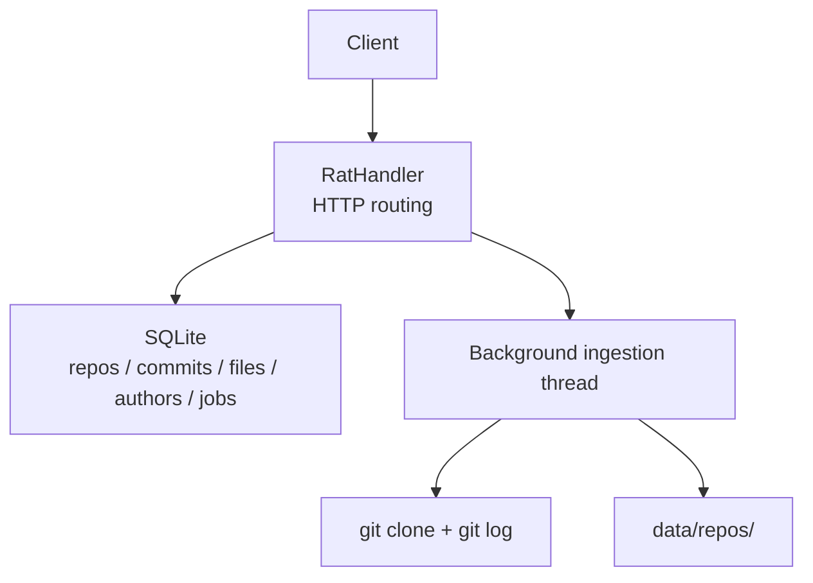
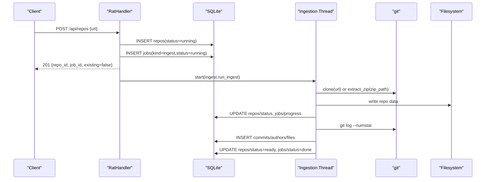
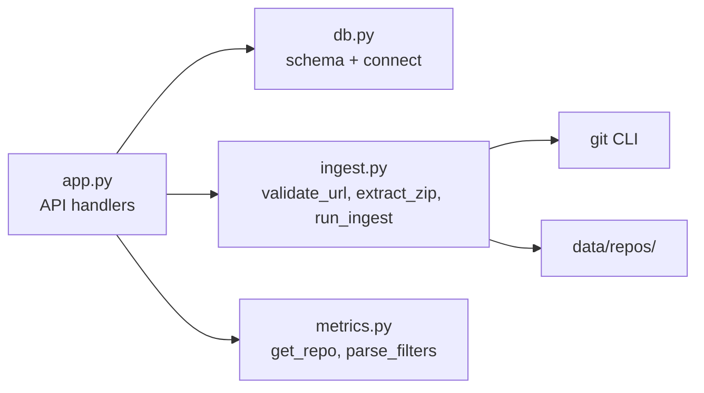

# Repository Management

<cite>
**Referenced Files in This Document**
- [app.py](file://app.py)
- [db.py](file://db.py)
- [ingest.py](file://ingest.py)
- [metrics.py](file://metrics.py)
- [selftest.py](file://selftest.py)
- [README.md](file://README.md)
</cite>

## Table of Contents
1. [Introduction](#introduction)
2. [Project Structure](#project-structure)
3. [Core Components](#core-components)
4. [Architecture Overview](#architecture-overview)
5. [Detailed Component Analysis](#detailed-component-analysis)
6. [Dependency Analysis](#dependency-analysis)
7. [Performance Considerations](#performance-considerations)
8. [Troubleshooting Guide](#troubleshooting-guide)
9. [Conclusion](#conclusion)

## Introduction
This document provides detailed API documentation for repository management endpoints exposed by the local web server. The endpoints support:

- Listing repositories with status, commit count, file count, and author count.
- Adding repositories from Git URLs.
- Uploading local zip archives containing a Git repository.
- Loading sample fixtures.
- Deleting repositories and cleaning associated data.

The server is implemented using Python’s standard library HTTP server and SQLite. Ingestion runs asynchronously in background threads, updating job and repository status through the database.

## Project Structure
The repository management functionality is primarily implemented in `app.py`, with supporting logic in `db.py` (database schema and helpers), `ingest.py` (URL validation, zip extraction, history ingestion), and `metrics.py` (repository queries and metrics).



**Diagram sources**
- [app.py:56-196](file://app.py#L56-L196)
- [db.py:15-62](file://db.py#L15-L62)
- [ingest.py:356-440](file://ingest.py#L356-L440)

**Section sources**
- [app.py:1-492](file://app.py#L1-L492)
- [db.py:1-100](file://db.py#L1-L100)
- [ingest.py:1-458](file://ingest.py#L1-L458)
- [metrics.py:1-544](file://metrics.py#L1-L544)
- [README.md:1-46](file://README.md#L1-L46)

## Core Components
- HTTP handler and routing: `RatHandler` dispatches `/api/repos*` requests to dedicated methods.
- Database layer: `db.connect`, `db.init_db`, and schema definitions for repositories, commits, files, authors, and jobs.
- Ingestion pipeline: URL validation, zip extraction with zip-slip protection, Git cloning, and history parsing into SQLite.
- Metrics engine: repository summary, tree, file detail, authors table, commits list, and chart generation.

Key responsibilities:
- Request validation and error mapping to JSON responses.
- Background job creation and progress updates.
- Cleanup on deletion and failure paths.

**Section sources**
- [app.py:47-91](file://app.py#L47-L91)
- [app.py:121-196](file://app.py#L121-L196)
- [db.py:15-62](file://db.py#L15-L62)
- [ingest.py:70-86](file://ingest.py#L70-L86)
- [ingest.py:91-143](file://ingest.py#L91-L143)
- [metrics.py:179-183](file://metrics.py#L179-L183)

## Architecture Overview
The repository management workflow follows this sequence:



**Diagram sources**
- [app.py:338-349](file://app.py#L338-L349)
- [app.py:306-336](file://app.py#L306-L336)
- [ingest.py:356-440](file://ingest.py#L356-L440)
- [db.py:15-62](file://db.py#L15-L62)

## Detailed Component Analysis

### GET /api/repos
Lists all repositories with their status, commit counts, file counts, and author counts.

- Method: GET
- Path: `/api/repos`
- Authentication: None
- Query parameters: None
- Success response: 200 OK
- Error responses:
  - 500 Internal Server Error: unexpected exception during processing.

Response schema:
- Array of objects, each containing:
  - id: integer
  - name: string
  - source: string ("url", "zip", or "sample")
  - status: string ("pending", "running", "ready", "error")
  - error: string or null
  - ref_hash: string or null
  - created_at: integer (UNIX seconds)
  - commits: integer (commit count)
  - files: integer (distinct file path count)
  - authors: integer (distinct canonical author count)

Example request:
```
GET /api/repos
```

Example response:
```json
[
  {
    "id": 1,
    "name": "cJSON",
    "source": "url",
    "status": "ready",
    "error": null,
    "ref_hash": "a1b2c3d4e5f6...",
    "created_at": 1700000000,
    "commits": 1200,
    "files": 45,
    "authors": 3
  }
]
```

Notes:
- Commit count is computed via a subquery counting commits per repository.
- File count uses distinct file paths.
- Author count uses distinct canonical author identifiers.

**Section sources**
- [app.py:128-130](file://app.py#L128-L130)
- [app.py:262-277](file://app.py#L262-L277)

### POST /api/repos
Adds a repository from a Git URL. Validates the URL and creates a background ingestion job.

- Method: POST
- Path: `/api/repos`
- Content-Type: application/json
- Request body schema:
  - url: string (required; must be http or https with a netloc)
  - name: string (optional; trimmed, max 200 characters)
- Success response: 201 Created
- Error responses:
  - 400 Bad Request: invalid URL or malformed JSON.
  - 413 Payload Too Large: request body exceeds limit.
  - 500 Internal Server Error: unexpected exception.

Request schema:
```json
{
  "url": "https://github.com/DaveGamble/cJSON.git",
  "name": "cJSON"
}
```

Success response schema:
```json
{
  "repo_id": 1,
  "job_id": 1,
  "existing": false
}
```

Behavior:
- URL validation enforces http/https scheme and presence of a network location.
- A new repository row is inserted with status "running".
- A job row is inserted with kind "ingest" and status "running".
- A background thread starts ingestion; the client polls job status separately.

Validation details:
- Empty or non-http(s) URLs raise an ingestion error mapped to 400.
- Name defaults to derived repository name if omitted.

**Section sources**
- [app.py:177-180](file://app.py#L177-L180)
- [app.py:338-349](file://app.py#L338-L349)
- [ingest.py:70-86](file://ingest.py#L70-L86)
- [app.py:401-424](file://app.py#L401-L424)

### POST /api/repos/upload
Uploads a local zip archive containing a Git repository. Enforces size limits and zip-slip protection.

- Method: POST
- Path: `/api/repos/upload`
- Content-Type: multipart/form-data or application/octet-stream
- Query parameters:
  - name: string (optional; trailing ".zip" is stripped before use)
- Size limit: 1 GiB maximum payload.
- Zip-slip protection: rejects entries that escape the destination directory.
- Success response: 201 Created
- Error responses:
  - 400 Bad Request: not a zip archive or invalid request body.
  - 411 Length Required: missing Content-Length header.
  - 413 Payload Too Large: exceeds 1 GiB.
  - 500 Internal Server Error: unexpected exception.

Request constraints:
- Must include Content-Length.
- Body must begin with ZIP magic bytes "PK".
- Archive must contain a `.git` directory at root, single top-level folder, or nested single-folder level.

Success response schema:
```json
{
  "repo_id": 2,
  "job_id": 2,
  "existing": false
}
```

Zip-slip protection behavior:
- Rejects any entry whose resolved path escapes the destination directory.
- Raises an ingestion error when unsafe paths are detected.

**Section sources**
- [app.py:181-183](file://app.py#L181-L183)
- [app.py:351-363](file://app.py#L351-L363)
- [app.py:401-412](file://app.py#L401-L412)
- [ingest.py:91-122](file://ingest.py#L91-L122)

### POST /api/repos/sample
Loads a sample fixture repository from the bundled demo archive.

- Method: POST
- Path: `/api/repos/sample`
- Authentication: None
- Success response: 201 Created
- Duplicate handling:
  - If a "sample" repository exists and is not in error state, returns its id with existing=true and no job.
- Error responses:
  - 500 Internal Server Error: demo/fixture.zip is missing.

Behavior:
- Checks for an existing "sample" repository.
- If none or it is errored, ingests `demo/fixture.zip`.
- Creates a background ingestion job unless an existing suitable repository is found.

Response schema:
```json
{
  "repo_id": 3,
  "job_id": 3,
  "existing": false
}
```

If existing:
```json
{
  "repo_id": 1,
  "job_id": null,
  "existing": true
}
```

**Section sources**
- [app.py:184-186](file://app.py#L184-L186)
- [app.py:365-381](file://app.py#L365-L381)

### DELETE /api/repos/{id}
Deletes a repository and cleans up associated data.

- Method: DELETE
- Path: `/api/repos/{id}`
- URL parameter:
  - id: integer (repository identifier)
- Success response: 200 OK
- Error responses:
  - 404 Not Found: repository does not exist.
  - 500 Internal Server Error: unexpected exception.

Cleanup behavior:
- Deletes rows from files, commits, authors, and jobs tables for the repository.
- Deletes the repository row.
- Removes the repository directory under `data/repos/<id>` if present.

Success response schema:
```json
{
  "ok": true
}
```

**Section sources**
- [app.py:191-195](file://app.py#L191-L195)
- [app.py:383-398](file://app.py#L383-L398)

## Dependency Analysis
Repository management endpoints depend on:

- Database schema and connection helpers.
- Ingestion pipeline for URL validation, zip extraction, and Git operations.
- Metrics module for repository existence checks and query utilities.



**Diagram sources**
- [app.py:28-30](file://app.py#L28-L30)
- [db.py:15-62](file://db.py#L15-L62)
- [ingest.py:356-440](file://ingest.py#L356-L440)
- [metrics.py:179-183](file://metrics.py#L179-L183)

**Section sources**
- [app.py:28-30](file://app.py#L28-L30)
- [db.py:15-62](file://db.py#L15-L62)
- [ingest.py:356-440](file://ingest.py#L356-L440)
- [metrics.py:179-183](file://metrics.py#L179-L183)

## Performance Considerations
- Ingestion runs in background threads to avoid blocking HTTP requests.
- Progress updates are throttled every N commits to reduce database writes.
- Batched inserts for file rows improve throughput during history parsing.
- SQLite WAL mode allows concurrent reads while ingestion writes.
- Maximum upload size is enforced at the HTTP layer to prevent large payloads.

Recommendations:
- Monitor job status via `/api/jobs/{id}` to track ingestion progress.
- Use pagination for large commit lists where applicable.
- Ensure sufficient disk space for cloned repositories and extracted archives.

[No sources needed since this section provides general guidance]

## Troubleshooting Guide
Common issues and resolutions:

- Invalid URL:
  - Cause: Non-http(s) scheme or missing netloc.
  - Resolution: Provide a valid public clone URL starting with http:// or https://.

- Upload rejected as not a zip:
  - Cause: Missing ZIP magic bytes or incorrect content type.
  - Resolution: Ensure the uploaded file is a valid zip archive.

- Zip-slip error:
  - Cause: Archive contains entries escaping the destination directory.
  - Resolution: Rebuild the archive ensuring safe relative paths.

- Missing demo fixture:
  - Cause: `demo/fixture.zip` is absent.
  - Resolution: Regenerate the fixture using the provided tooling.

- Stale jobs after restart:
  - Cause: Background threads do not survive process restarts.
  - Resolution: The server marks running jobs as error on startup; re-trigger ingestion.

**Section sources**
- [ingest.py:70-86](file://ingest.py#L70-L86)
- [ingest.py:91-122](file://ingest.py#L91-L122)
- [app.py:365-381](file://app.py#L365-L381)
- [ingest.py:443-458](file://ingest.py#L443-L458)

## Conclusion
The repository management API provides a robust set of endpoints for listing, adding, uploading, sampling, and deleting repositories. It integrates URL validation, secure zip extraction, asynchronous ingestion, and comprehensive cleanup. Clients should handle job polling for long-running operations and validate inputs according to the documented schemas.

[No sources needed since this section summarizes without analyzing specific files]