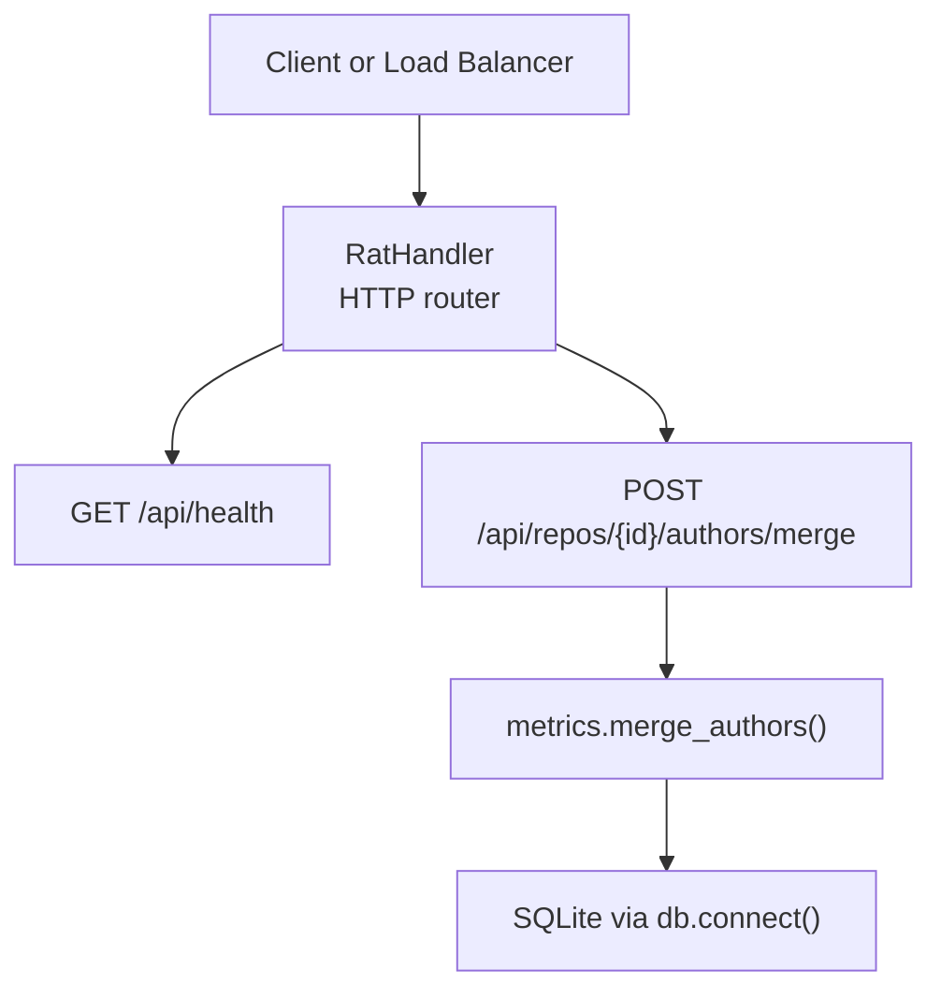
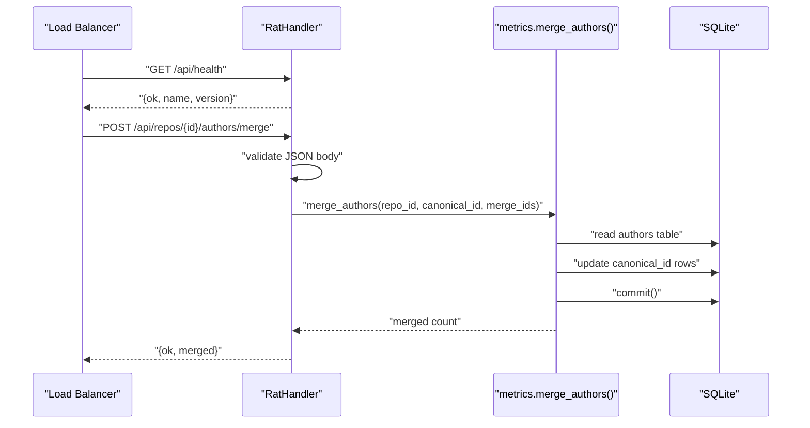
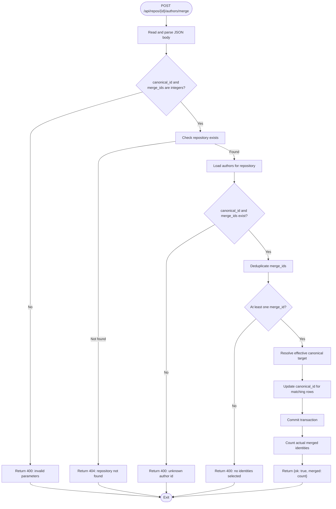
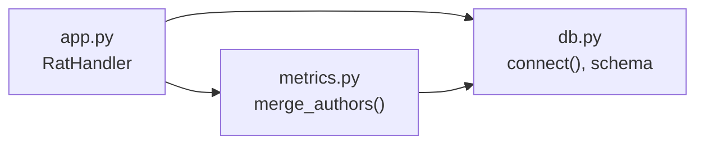

# Utility Endpoints

<cite>
**Referenced Files in This Document**
- [app.py](file://app.py)
- [metrics.py](file://metrics.py)
- [db.py](file://db.py)
- [selftest.py](file://selftest.py)
</cite>

## Table of Contents
1. [Introduction](#introduction)
2. [Project Structure](#project-structure)
3. [Core Components](#core-components)
4. [Architecture Overview](#architecture-overview)
5. [Detailed Component Analysis](#detailed-component-analysis)
6. [Dependency Analysis](#dependency-analysis)
7. [Performance Considerations](#performance-considerations)
8. [Troubleshooting Guide](#troubleshooting-guide)
9. [Conclusion](#conclusion)

## Introduction
This document describes the utility and health check endpoints exposed by the RAT web server, focusing on:
- Service health verification through a simple GET endpoint.
- Manual author identity merging through a POST endpoint that consolidates duplicate author entries into a canonical identity.

These endpoints are intended for operational monitoring (for example, load balancer health checks) and for data quality workflows where multiple Git identities should be unified under one canonical author.

## Project Structure
The relevant implementation is concentrated in three files:
- The HTTP server and request routing live in `app.py`.
- The metric engine, including author merge logic, lives in `metrics.py`.
- Database schema and connection helpers live in `db.py`.
- Automated tests demonstrate expected merge behavior in `selftest.py`.



**Diagram sources**
- [app.py:121-196](file://app.py#L121-L196)
- [app.py:242-259](file://app.py#L242-L259)
- [metrics.py:364-396](file://metrics.py#L364-L396)
- [db.py:77-86](file://db.py#L77-L86)

**Section sources**
- [app.py:1-492](file://app.py#L1-L492)
- [metrics.py:1-544](file://metrics.py#L1-L544)
- [db.py:1-100](file://db.py#L1-L100)

## Core Components
- Health endpoint: returns application name, version, and an operational flag.
- Author merge endpoint: validates input, verifies repository existence, merges selected author identities into a canonical author, and commits the change to the database.

Key responsibilities:
- `app.py` parses HTTP requests, routes paths, reads JSON bodies, converts exceptions to JSON error responses, and calls metric functions.
- `metrics.py` implements business rules for author merging, including validation and transactional updates.
- `db.py` provides SQLite connections with WAL mode and schema initialization.

**Section sources**
- [app.py:47-90](file://app.py#L47-L90)
- [app.py:121-196](file://app.py#L121-L196)
- [app.py:242-259](file://app.py#L242-L259)
- [metrics.py:364-396](file://metrics.py#L364-L396)
- [db.py:77-86](file://db.py#L77-L86)

## Architecture Overview
The utility endpoints follow a thin HTTP layer over a focused metric engine:



**Diagram sources**
- [app.py:121-196](file://app.py#L121-L196)
- [app.py:242-259](file://app.py#L242-L259)
- [metrics.py:364-396](file://metrics.py#L364-L396)
- [db.py:77-86](file://db.py#L77-L86)

## Detailed Component Analysis

### GET /api/health
Purpose:
- Provide a lightweight health check for service liveness and readiness.
- Return application metadata useful for dashboards and logs.

Request:
- Method: GET
- Path: `/api/health`
- Headers: None required
- Body: None

Response:
- Status code: 200 when the server is running.
- Content type: `application/json; charset=utf-8`
- Response body schema:
  - `ok`: boolean indicating operational status.
  - `name`: string identifying the application.
  - `version`: string identifying the application version.

Example response:
```json
{
  "ok": true,
  "name": "RAT",
  "version": "1.0"
}
```

Error handling:
- Unexpected exceptions are converted to JSON errors with status 500.
- Malformed routing results in a 404 JSON error.

Use cases:
- Load balancer health probes.
- Kubernetes liveness/readiness checks.
- Monitoring systems polling service availability.

**Section sources**
- [app.py:121-127](file://app.py#L121-L127)
- [app.py:73-90](file://app.py#L73-L90)

### POST /api/repos/{id}/authors/merge
Purpose:
- Manually consolidate duplicate author identities into a single canonical author within a repository.
- Update the `canonical_id` field so that historical commit attribution reflects the merged identity.

Request:
- Method: POST
- Path: `/api/repos/{id}/authors/merge`
- Path parameter:
  - `id`: integer repository identifier.
- Headers:
  - `Content-Type`: `application/json; charset=utf-8`
  - `Content-Length`: required by the server’s request reader.
- Request body schema:
  - `canonical_id`: integer ID of the target canonical author row.
  - `merge_ids`: array of integer IDs representing author identities to merge into the canonical author.

Validation rules:
- `canonical_id` must be an integer.
- Each element in `merge_ids` must be an integer.
- The request body must be valid JSON and must be a JSON object.
- The repository identified by `{id}` must exist.
- `canonical_id` must refer to an existing author row in the repository.
- Every ID in `merge_ids` must refer to an existing author row in the repository.
- At least one ID must be present in `merge_ids`; an empty list is rejected.
- Duplicate IDs in `merge_ids` are deduplicated before processing.

Transaction behavior:
- The operation reads all author rows for the repository.
- It validates the canonical and merge targets against the loaded rows.
- It updates matching author rows so their `canonical_id` points to the effective canonical target.
- It commits the changes atomically.
- It returns the number of distinct author identities that were actually merged.

Response:
- Success:
  - Status code: 200
  - Content type: `application/json; charset=utf-8`
  - Response body schema:
    - `ok`: boolean indicating success.
    - `merged`: integer count of identities merged.
- Errors:
  - 400: invalid JSON, non-integer parameters, missing merge IDs, unknown author IDs, or invalid filter-like inputs propagated from the metric engine.
  - 404: repository not found.
  - 411: missing `Content-Length`.
  - 413: payload too large.
  - 500: unexpected internal server error.

Example request:
```json
{
  "canonical_id": 1,
  "merge_ids": [2, 3]
}
```

Example success response:
```json
{
  "ok": true,
  "merged": 1
}
```

Common use cases:
- Identity resolution workflow:
  1. Query the authors table for a repository.
  2. Identify duplicate identities based on similar names or emails.
  3. Choose one canonical identity.
  4. Call this endpoint with the canonical ID and the duplicate IDs.
  5. Re-query the authors table to confirm consolidation.
- Data cleanup after ingestion:
  - After ingesting repositories with inconsistent author names or emails, run targeted merges to normalize authorship metrics.

Author identity semantics:
- Author identity resolution uses `COALESCE(canonical_id, id)` throughout the metric engine.
- Merging updates `canonical_id` so that queries and charts treat merged identities as one logical author.
- Existing relationships between commits and author rows remain intact; only the canonical mapping changes.



**Diagram sources**
- [app.py:242-259](file://app.py#L242-L259)
- [metrics.py:364-396](file://metrics.py#L364-L396)

**Section sources**
- [app.py:177-190](file://app.py#L177-L190)
- [app.py:242-259](file://app.py#L242-L259)
- [app.py:400-424](file://app.py#L400-L424)
- [metrics.py:364-396](file://metrics.py#L364-L396)
- [db.py:77-86](file://db.py#L77-L86)

## Dependency Analysis
The utility endpoints depend on:
- HTTP routing and exception handling in `app.py`.
- Metric engine validation and merge logic in `metrics.py`.
- SQLite connection management and schema in `db.py`.



**Diagram sources**
- [app.py:121-196](file://app.py#L121-L196)
- [app.py:242-259](file://app.py#L242-L259)
- [metrics.py:364-396](file://metrics.py#L364-L396)
- [db.py:77-86](file://db.py#L77-L86)

**Section sources**
- [app.py:121-196](file://app.py#L121-L196)
- [metrics.py:364-396](file://metrics.py#L364-L396)
- [db.py:77-86](file://db.py#L77-L86)

## Performance Considerations
- Health checks are stateless and return immediately, making them suitable for frequent probing.
- Author merging loads all author rows for the repository into memory for validation and then performs targeted updates followed by a single commit.
- For very large repositories with many authors, consider batching merge operations to avoid long-running transactions.
- The database uses WAL mode, allowing readers to remain active while writes occur.

[No sources needed since this section provides general guidance]

## Troubleshooting Guide
Common issues and resolutions:
- 400 Bad Request:
  - Cause: invalid JSON, non-integer `canonical_id` or `merge_ids`, empty `merge_ids`, or unknown author IDs.
  - Resolution: ensure the request body is a JSON object with integer fields and that all referenced author IDs exist in the repository.
- 404 Not Found:
  - Cause: repository ID does not exist.
  - Resolution: verify the repository was successfully ingested and query the repository list endpoint if available.
- 411 Length Required:
  - Cause: missing `Content-Length` header.
  - Resolution: include `Content-Length` when sending JSON payloads.
- 413 Payload Too Large:
  - Cause: request body exceeds the configured maximum.
  - Resolution: reduce payload size or split merge operations.
- 500 Internal Server Error:
  - Cause: unexpected exception during request processing.
  - Resolution: inspect server logs and retry after resolving underlying issues.

Operational tips:
- Use the health endpoint for load balancer health checks.
- Before merging, retrieve the authors table to identify duplicates and choose the correct canonical identity.
- After merging, re-query the authors table and related metrics to confirm that identity consolidation took effect.

**Section sources**
- [app.py:73-90](file://app.py#L73-L90)
- [app.py:242-259](file://app.py#L242-L259)
- [app.py:400-424](file://app.py#L400-L424)
- [metrics.py:364-396](file://metrics.py#L364-L396)

## Conclusion
The utility endpoints provide essential operational and data-quality capabilities:
- `GET /api/health` offers a simple, fast health check for service monitoring.
- `POST /api/repos/{id}/authors/merge` enables manual author identity consolidation with clear validation rules and transactional behavior.

Together, these endpoints support reliable deployment monitoring and accurate author attribution across repository histories.