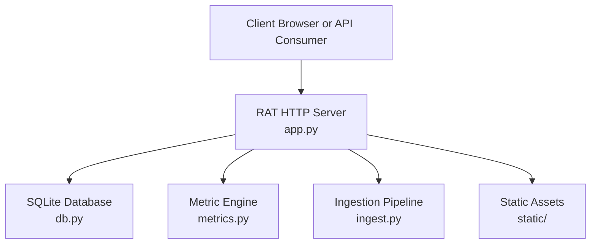
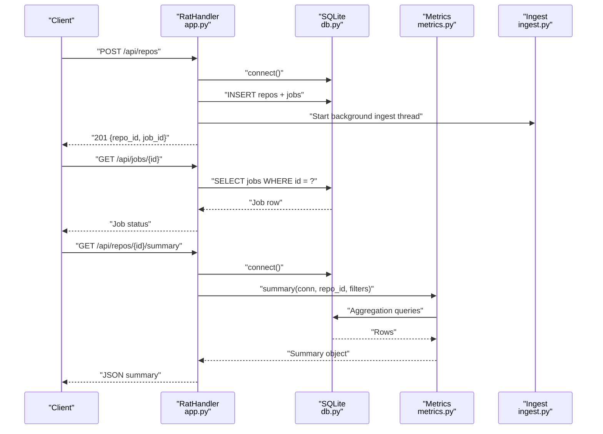
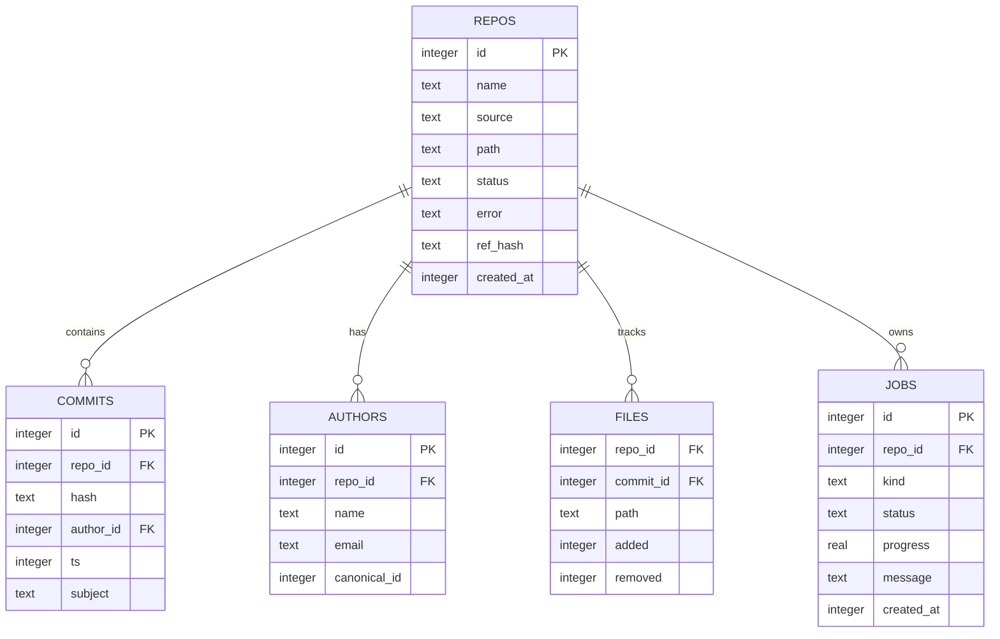
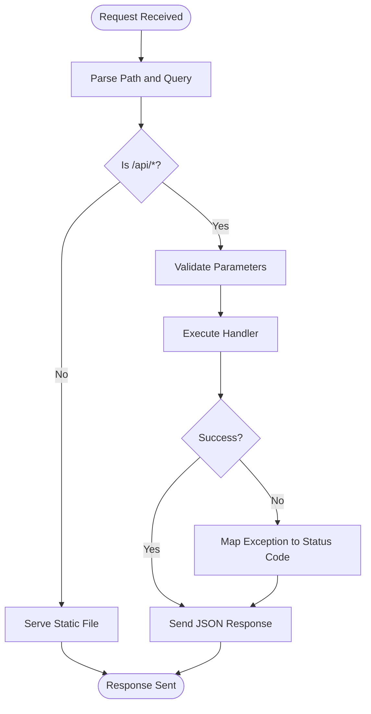
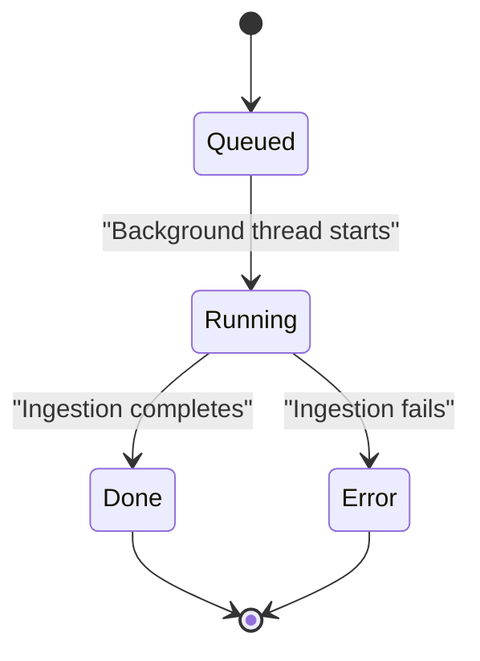
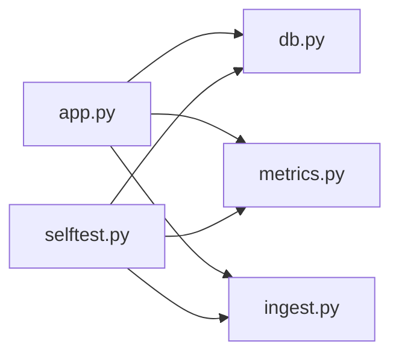

# Configuration & Deployment

<cite>
**Referenced Files in This Document**
- [README.md](file://README.md)
- [app.py](file://app.py)
- [db.py](file://db.py)
- [start.sh](file://start.sh)
- [metrics.py](file://metrics.py)
- [selftest.py](file://selftest.py)
</cite>

## Table of Contents
1. [Introduction](#introduction)
2. [Project Structure](#project-structure)
3. [Core Components](#core-components)
4. [Architecture Overview](#architecture-overview)
5. [Detailed Component Analysis](#detailed-component-analysis)
6. [Dependency Analysis](#dependency-analysis)
7. [Performance Considerations](#performance-considerations)
8. [Troubleshooting Guide](#troubleshooting-guide)
9. [Conclusion](#conclusion)
10. [Appendices](#appendices)

## Introduction
This document provides configuration and deployment guidance for RAT, a local, offline Git repository analysis dashboard. It explains environment variables, runtime behavior, SQLite database configuration, production hardening, monitoring, scaling, containerization, and troubleshooting. The application is implemented with Python standard libraries only and uses an embedded SQLite database to store repository metadata, commit history, file changes, authors, and ingestion jobs.

RAT exposes a small HTTP API and serves static frontend assets. Ingestion runs asynchronously in background threads so the web server remains responsive while large repositories are processed.

## Project Structure
The repository is intentionally minimal:

- `app.py` — Web server, request routing, API handlers, port binding, and startup logic.
- `db.py` — SQLite connection helpers, schema initialization, data directory resolution, and WAL configuration.
- `metrics.py` — Metric computation engine, filter parsing, aggregation queries, chart generation, and author identity merging.
- `ingest.py` — Repository ingestion pipeline (referenced by `app.py`).
- `metrics.py` — Metrics engine used by API endpoints.
- `selftest.py` — Automated tests that validate metric semantics against a fixture.
- `start.sh` — Convenience wrapper that runs the application.
- `static/` — Frontend assets served by the server.
- `demo/` — Fixture generator and sample data.

**Diagram sources**
- [app.py:56-196](file://app.py#L56-L196)
- [db.py:77-86](file://db.py#L77-L86)
- [metrics.py:50-78](file://metrics.py#L50-L78)

**Section sources**
- [README.md:1-46](file://README.md#L1-L46)
- [app.py:1-31](file://app.py#L1-L31)
- [db.py:1-11](file://db.py#L1-L11)

## Core Components
RAT’s runtime consists of four main layers:

- HTTP server layer: Handles requests, routes `/api/*` endpoints, serves static files, enforces payload limits, and returns JSON errors.
- Data access layer: Creates per-call SQLite connections, initializes schema, resolves `DATA_DIR`, and configures WAL mode.
- Metric engine: Parses filters, computes repo/file/directory/author metrics, generates charts, and supports author identity merging.
- Ingestion subsystem: Runs asynchronously to clone or extract repositories, compute diffs, and populate database tables.

Key behaviors relevant to deployment:

- Port selection tries the configured `PORT`, then falls back through 8080, 8888, 9000, and finally OS-assigned port 0 if needed.
- Host binding defaults to loopback unless overridden by `HOST`.
- Data storage defaults to `<repo>/data`, but can be relocated via `DATA_DIR`.
- All filesystem paths are anchored to the repository root or `DATA_DIR`; working directory changes do not affect data location.
- Background ingestion uses daemon threads; job state is persisted in SQLite.

**Section sources**
- [app.py:444-491](file://app.py#L444-L491)
- [db.py:65-86](file://db.py#L65-L86)
- [metrics.py:30-78](file://metrics.py#L30-L78)

## Architecture Overview
The following diagram maps the runtime architecture to actual source components:

**Diagram sources**
- [app.py:177-196](file://app.py#L177-L196)
- [app.py:306-336](file://app.py#L306-L336)
- [app.py:279-304](file://app.py#L279-L304)
- [app.py:199-210](file://app.py#L199-L210)
- [db.py:77-86](file://db.py#L77-L86)
- [metrics.py:205-225](file://metrics.py#L205-L225)

## Detailed Component Analysis

### Environment Variables
RAT supports three optional environment variables:

| Variable | Default | Validation Rules | Usage Scenarios |
|---|---|---|---|
| `PORT` | `8000` | Must be a digit representing a valid TCP port from 0 to 65535. If invalid, the default `8000` is used. | Use when you need a specific port, such as `80` or `443` behind a reverse proxy. Falls back automatically if the port is busy. |
| `HOST` | `127.0.0.1` | No strict validation; empty values fall back to loopback. Bind to `0.0.0.0` only when exposing the service externally through a trusted network boundary. | Use for development on localhost, staging on internal networks, or production when bound behind a reverse proxy or load balancer. |
| `DATA_DIR` | `<repo>/data` | Resolved as an absolute path after expanding user home directories. The directory is created automatically if missing. | Use to place databases and ingested repositories on a dedicated volume, shared filesystem, or cloud storage mount. |

Port fallback behavior:

- First candidate: parsed `PORT`.
- Fallback candidates: `8080`, `8888`, `9000`.
- Last resort: OS-assigned port `0`.

Host binding:

- If `HOST` is empty or whitespace-only, it becomes `127.0.0.1`.
- The server prints the final URL at startup, including the resolved port.

Data directory behavior:

- `DATA_DIR` overrides the default `<repo>/data`.
- Paths are always resolved relative to `DATA_DIR`, never to the process working directory.
- The `repos/` subdirectory stores ingested repositories.

**Section sources**
- [README.md:28-34](file://README.md#L28-L34)
- [app.py:6-9](file://app.py#L6-L9)
- [app.py:444-452](file://app.py#L444-L452)
- [app.py:458-478](file://app.py#L458-L478)
- [db.py:65-74](file://db.py#L65-L74)

### SQLite Database Configuration
RAT uses SQLite with the following configuration:

- Journal mode: Write-Ahead Logging (`WAL`) to allow readers to remain active during ingestion writes.
- Busy timeout: 10 seconds to reduce lock contention under concurrent reads and writes.
- Synchronous mode: `NORMAL`, balancing durability and performance.
- Connection model: One connection per caller, closed in `finally` blocks.
- Schema: Tables for repositories, authors, commits, files, and jobs, plus indexes for common query patterns.

Connection lifecycle:

- Connections are created through `db.connect()`.
- Each handler opens a connection, performs operations, and closes it in a `finally` block.
- There is no persistent connection pool; concurrency is handled by SQLite’s WAL mode and busy timeout.

Backup strategy recommendations:

- Stop ingestion before backup, or use consistent snapshots if running on a filesystem that supports atomic snapshots.
- Prefer copying the entire `DATA_DIR`, including `rat.db`, `rat.db-wal`, and `rat.db-shm`.
- For online backups, consider using SQLite backup APIs or tools that respect WAL mode.
- Schedule regular backups for production environments and verify restore procedures.

Schema overview:

**Diagram sources**
- [db.py:15-62](file://db.py#L15-L62)

**Section sources**
- [db.py:77-86](file://db.py#L77-L86)
- [db.py:15-62](file://db.py#L15-L62)

### Request Handling and Security Controls
The HTTP server implements several security-oriented controls:

- Payload size limit: Uploads are limited to 1 GiB. Requests exceeding this receive a 413 response.
- Content-Type enforcement: Responses set appropriate content types and cache headers.
- Security headers: `X-Content-Type-Options: nosniff` is added to responses.
- Path traversal protection: Static file serving validates that requested paths stay within the static root.
- Error handling: Unexpected exceptions return JSON 500 responses; known API errors return structured JSON with status codes.
- Input validation: Query parameters and JSON bodies are validated before processing.

API error handling flow:

**Diagram sources**
- [app.py:73-90](file://app.py#L73-L90)
- [app.py:120-196](file://app.py#L120-L196)
- [app.py:400-424](file://app.py#L400-L424)
- [app.py:426-440](file://app.py#L426-L440)

**Section sources**
- [app.py:47-90](file://app.py#L47-L90)
- [app.py:100-118](file://app.py#L100-L118)
- [app.py:400-440](file://app.py#L400-L440)

### Metric Engine and Filters
The metric engine supports:

- Commit-set filtering by date range, explicit commit hashes, and author identity.
- Aggregation over files, directories, repositories, and authors.
- Chart generation for churn, top files, and author share.
- Author identity merging to consolidate duplicate identities.

Filter validation rules:

- `from` and `to`: Epoch seconds; must be non-negative integers up to a very large upper bound.
- `hashes`: Comma-separated hexadecimal strings; each token must be between 4 and 40 characters. A maximum of 900 hashes is allowed.
- `author`: Canonical author ID; must be a positive integer.
- Path inputs are normalized and rejected if they contain unsafe segments like `.` or `..`.

Complexity considerations:

- Large hash lists increase query construction and parameter binding overhead.
- Date-range filters rely on indexed columns where applicable.
- Directory tree queries avoid expensive `LIKE` patterns by using substring predicates.

**Section sources**
- [metrics.py:30-78](file://metrics.py#L30-L78)
- [metrics.py:91-124](file://metrics.py#L91-L124)
- [metrics.py:129-168](file://metrics.py#L129-L168)
- [metrics.py:438-543](file://metrics.py#L438-L543)

### Ingestion and Job Management
Ingestion is asynchronous:

- Creating a repository inserts a `repos` row and a `jobs` row.
- A daemon thread runs the ingestion pipeline without blocking the HTTP server.
- Clients poll `/api/jobs/{id}` to track progress.
- Stale jobs are recovered at startup.

Job lifecycle:

**Diagram sources**
- [app.py:306-336](file://app.py#L306-L336)
- [db.py:49-57](file://db.py#L49-L57)

**Section sources**
- [app.py:306-336](file://app.py#L306-L336)
- [app.py:279-304](file://app.py#L279-L304)

## Dependency Analysis
RAT has low external dependency coupling:

- `app.py` imports `db`, `ingest`, and `metrics`.
- `db.py` depends only on Python standard library modules.
- `metrics.py` depends on SQLite through `db.connect()` and uses standard library time and datetime modules.
- `selftest.py` exercises the ingestion and metric pipelines against a deterministic fixture.

**Diagram sources**
- [app.py:28-30](file://app.py#L28-L30)
- [selftest.py:37-39](file://selftest.py#L37-L39)

**Section sources**
- [app.py:28-30](file://app.py#L28-L30)
- [selftest.py:37-39](file://selftest.py#L37-L39)

## Performance Considerations
Recommended tuning and operational practices:

- Use WAL mode: Already enabled; it improves read concurrency during ingestion.
- Tune busy timeout: Current value is 10 seconds; increase under heavy write loads if lock timeouts occur.
- Limit upload size: Keep `MAX_UPLOAD_BYTES` aligned with expected repository sizes to prevent memory pressure.
- Avoid excessive hash filters: Keep `hashes` below the 900-item limit to reduce query complexity.
- Index usage: Existing indexes cover common query patterns; avoid unbounded scans by using filters.
- Background ingestion: Ensure sufficient CPU and disk I/O capacity for large repositories.
- Static asset caching: Vendor assets are cached for a day; keep them immutable in production.

[No sources needed since this section provides general guidance]

## Troubleshooting Guide
Common deployment issues and resolutions:

- Port already in use:
  - The server automatically tries fallback ports and prints the final URL.
  - Verify the printed URL rather than assuming the default port.
- Git not available:
  - Ensure `git` is installed and on `PATH`; ingestion requires it for cloning and history extraction.
- Data directory permissions:
  - The process must have write access to `DATA_DIR`.
  - Delete `data/` to reset state if necessary.
- Invalid request payloads:
  - JSON bodies must be valid objects.
  - Uploads must be ZIP archives and within the size limit.
- Missing static assets:
  - Ensure `static/index.html` and related assets exist.
- Stale ingestion jobs:
  - The server recovers stale jobs at startup; check job status via the API.

Operational checks:

- Health endpoint: `GET /api/health` returns a simple success response.
- Repository listing: `GET /api/repos` shows repository metadata and counts.
- Job polling: `GET /api/jobs/{id}` tracks ingestion progress.

**Section sources**
- [README.md:36-40](file://README.md#L36-L40)
- [app.py:124-127](file://app.py#L124-L127)
- [app.py:400-424](file://app.py#L400-L424)
- [app.py:444-478](file://app.py#L444-L478)

## Conclusion
RAT is a compact, standards-compliant repository analysis tool suitable for local and controlled production environments. Its configuration surface is small, centered around `PORT`, `HOST`, and `DATA_DIR`. Production deployments should bind to a reverse proxy, secure the data directory, schedule backups, monitor ingestion jobs, and tune SQLite settings according to workload characteristics. Scaling beyond a single instance requires careful consideration of shared storage and eventual consistency, since SQLite is embedded and not designed for multi-writer concurrency.

[No sources needed since this section summarizes without analyzing specific files]

## Appendices

### Production Deployment Checklist
- Bind only to trusted interfaces; prefer loopback or internal networks.
- Place `DATA_DIR` on durable, backed-up storage.
- Configure a reverse proxy for TLS termination and access control.
- Restrict upload size and validate input.
- Monitor health, job status, and disk usage.
- Back up `DATA_DIR` regularly and test restores.
- Log application errors and resource utilization.

### Containerization Patterns
- Run one RAT process per container.
- Mount `DATA_DIR` as a persistent volume.
- Expose only the required port.
- Use environment variables for configuration.
- Add health checks against `/api/health`.
- Set resource limits for CPU and memory.

### Cloud Platform Integration
- Deploy behind a managed reverse proxy or ingress controller.
- Use platform secrets for any future credentials.
- Store `DATA_DIR` on persistent cloud storage.
- Enable platform logging and metrics collection.
- Use auto-scaling policies based on CPU, memory, or queue depth.

### Development, Staging, and Production Topologies
- Development:
  - `HOST=127.0.0.1`
  - `PORT=8000`
  - Local `DATA_DIR`
- Staging:
  - Internal host binding
  - Dedicated `DATA_DIR` on shared storage
  - Reverse proxy with internal access controls
- Production:
  - Loopback binding behind reverse proxy
  - Encrypted storage for `DATA_DIR`
  - Monitoring, alerting, and automated backups

[No sources needed since this section provides general guidance]