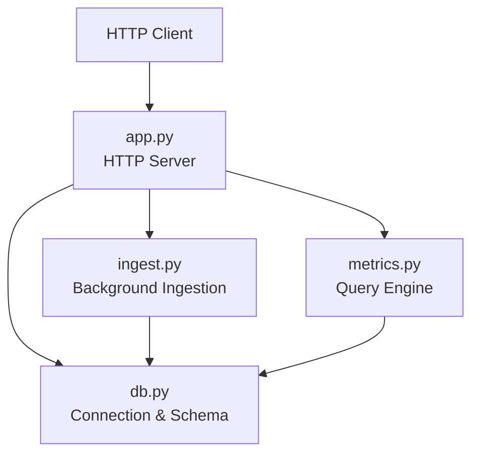
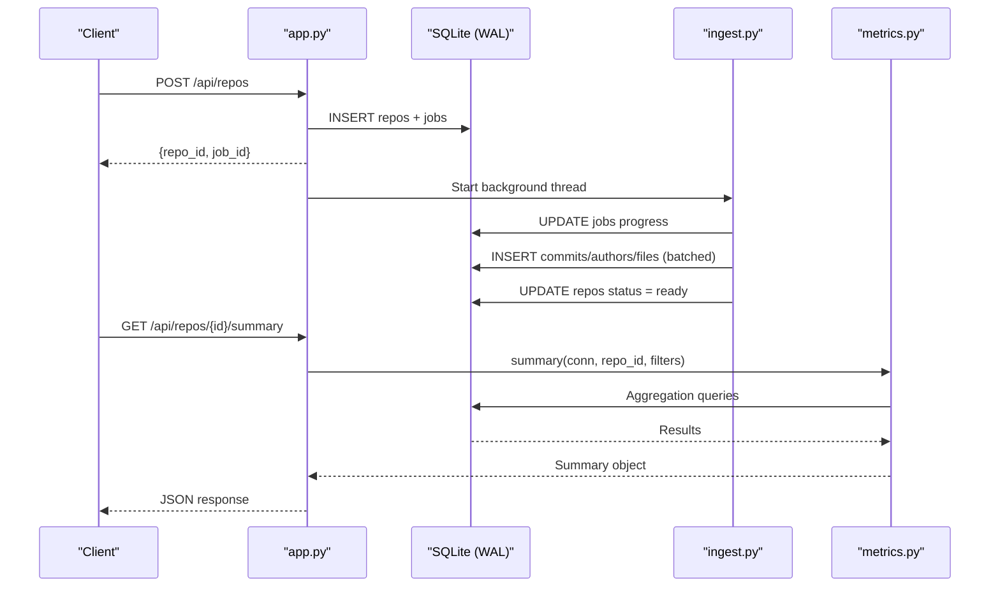
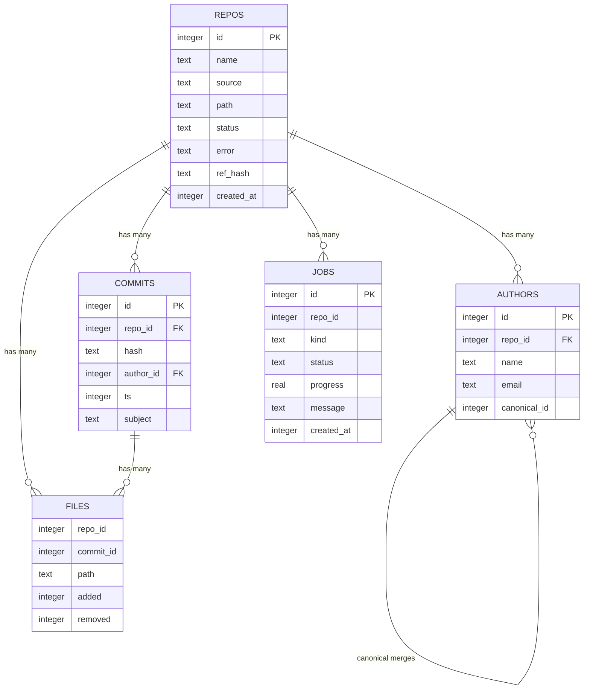
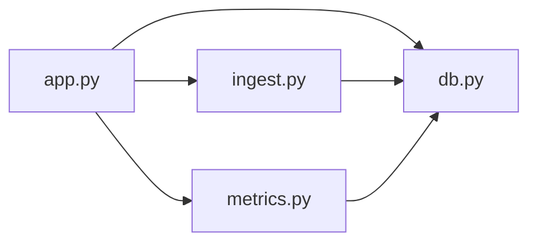

# Database Management

<cite>
**Referenced Files in This Document**
- [db.py](file://db.py)
- [app.py](file://app.py)
- [ingest.py](file://ingest.py)
- [metrics.py](file://metrics.py)
- [README.md](file://README.md)
</cite>

## Table of Contents
1. [Introduction](#introduction)
2. [Project Structure](#project-structure)
3. [Core Components](#core-components)
4. [Architecture Overview](#architecture-overview)
5. [Detailed Component Analysis](#detailed-component-analysis)
6. [Dependency Analysis](#dependency-analysis)
7. [Performance Considerations](#performance-considerations)
8. [Troubleshooting Guide](#troubleshooting-guide)
9. [Conclusion](#conclusion)
10. [Appendices](#appendices)

## Introduction
This document describes the database management layer for RAT’s SQLite implementation. It covers WAL configuration and concurrency, schema design for repositories, authors, commits, files, and jobs, connection and transaction strategies, ingestion and query workflows, backup and recovery procedures, maintenance tasks, migration guidance, integrity checks, index optimization, and storage considerations for large datasets.

RAT is a local, offline dashboard that ingests Git repositories (from zip archives or public clone URLs), computes metrics such as added/removed lines, growth, churn, modifications, churn rate, and ownership, and exposes them through a small HTTP API. The database stores repository metadata, author identities, commit history, and per-commit file changes.

**Section sources**
- [README.md:1-46](file://README.md#L1-L46)

## Project Structure
The database-related code is primarily implemented in four modules:

- `db.py`: Schema definition, connection helpers, data directory resolution, and initialization.
- `app.py`: HTTP server that creates repositories, starts ingestion jobs, and serves read-only metrics endpoints using the database.
- `ingest.py`: Background ingestion pipeline that clones or extracts repositories, parses Git history, and writes commits, authors, and file rows into SQLite.
- `metrics.py`: Query engine that aggregates metrics over the stored schema with filters by time range, commit hashes, and author identity.

**Diagram sources**
- [app.py:28-30](file://app.py#L28-L30)
- [db.py:77-86](file://db.py#L77-L86)
- [ingest.py:30-31](file://ingest.py#L30-L31)
- [metrics.py:1-21](file://metrics.py#L1-L21)

**Section sources**
- [app.py:1-492](file://app.py#L1-L492)
- [db.py:1-100](file://db.py#L1-L100)
- [ingest.py:1-458](file://ingest.py#L1-L458)
- [metrics.py:1-544](file://metrics.py#L1-L544)

## Core Components
- Database schema and initialization are defined in `db.py`. It includes tables for repositories, authors, commits, files, and jobs, along with indexes to support common queries.
- Connection management uses one connection per caller, enabling concurrent readers while ingestion writes occur. WAL mode is enabled, busy timeout is configured, and synchronous behavior is tuned for performance.
- Ingestion runs in background threads, updating job progress and repository status, and writing batches of file rows to optimize throughput.
- Metrics queries aggregate across commits and files, supporting filters by time range, commit hash prefixes or exact short hashes, and canonical author identity.

Key responsibilities:
- `db.connect()`: Creates a new SQLite connection with WAL, busy timeout, and row factory.
- `db.init_db()`: Executes schema creation once at startup.
- `ingest.run_ingest()`: Orchestrates cloning/extraction, history parsing, and batched inserts.
- `metrics.*`: Provides summary, tree, file detail, authors table, commits list, and chart endpoints.

**Section sources**
- [db.py:15-62](file://db.py#L15-L62)
- [db.py:77-95](file://db.py#L77-L95)
- [ingest.py:356-441](file://ingest.py#L356-L441)
- [metrics.py:205-544](file://metrics.py#L205-L544)

## Architecture Overview
The system architecture centers on SQLite with WAL mode. The HTTP server spawns ingestion jobs in background threads. Readers (API endpoints) use separate connections and can proceed concurrently with writers (ingestion).

**Diagram sources**
- [app.py:306-336](file://app.py#L306-L336)
- [ingest.py:320-349](file://ingest.py#L320-L349)
- [ingest.py:400-421](file://ingest.py#L400-L421)
- [metrics.py:205-225](file://metrics.py#L205-L225)

## Detailed Component Analysis

### WAL Configuration and Concurrency Benefits
- WAL mode is enabled via PRAGMA journal_mode=WAL. This allows multiple readers to proceed while a writer updates the database, improving concurrency during ingestion.
- Busy timeout is set to reduce lock contention under load.
- Synchronous=NORMAL balances durability and performance for this workload.

Benefits:
- Concurrent reads do not block ingestion writes.
- Reduced lock contention for UI polling and metric queries.
- Faster checkpointing and less blocking during heavy ingestion.

Operational notes:
- WAL files are created alongside the main database file within the data directory.
- Backups should include both the main database and WAL files when consistent snapshots are required.

**Section sources**
- [db.py:77-86](file://db.py#L77-L86)

### Database Schema Design
Tables and relationships:
- repos: Repository metadata including source type, path, status, error message, reference hash, and timestamp.
- authors: Author identities per repository with optional canonical_id to merge duplicate identities. Unique constraint prevents duplicates per (repo_id, name, email).
- commits: Commit records linked to repo and author, storing hash, timestamp, and subject.
- files: Per-commit file change records with added/removed line counts; supports renames by attributing changes to the new path.
- jobs: Background ingestion job tracking with status, progress, and messages.

Indexes:
- idx_files_commit: Optimizes lookups by (repo_id, commit_id).
- idx_files_path: Optimizes path-based queries per repository.
- idx_commits_ts: Optimizes time-range filtering.
- idx_commits_hash: Optimizes hash-based filtering.

Relationships and constraints:
- authors.repo_id references repos.id implicitly via application logic.
- commits.repo_id references repos.id implicitly.
- files.repo_id references repos.id implicitly.
- files.commit_id references commits.id implicitly.
- authors.canonical_id points to another authors.id within the same repository for identity merging.

**Diagram sources**
- [db.py:15-62](file://db.py#L15-L62)

**Section sources**
- [db.py:15-62](file://db.py#L15-L62)

### Connection Management Strategies
- One connection per caller pattern ensures isolation and avoids shared state between requests.
- Connections are created with row_factory=sqlite3.Row for convenient column access.
- Data directory is resolved from environment variable DATA_DIR or defaults to <repo>/data.
- Initialization function executes schema creation safely and closes connections in finally blocks.

Best practices observed:
- Explicit conn.close() in finally blocks to prevent resource leaks.
- Using executemany for batch inserts during ingestion.
- Avoiding long-lived global connections.

**Section sources**
- [db.py:65-86](file://db.py#L65-L86)
- [app.py:199-210](file://app.py#L199-L210)
- [app.py:212-240](file://app.py#L212-L240)

### Transaction Handling
- Ingestion batches file inserts and commits periodically to balance memory usage and write throughput.
- Job progress updates are committed after each update to reflect real-time status.
- Repository deletion deletes related rows in files, commits, authors, and jobs before removing the repository record, then commits.

Considerations:
- Batch size is configurable via BATCH_ROWS constant.
- Progress updates ensure UI responsiveness even during long-running ingestion.

**Section sources**
- [ingest.py:204-219](file://ingest.py#L204-L219)
- [ingest.py:320-349](file://ingest.py#L320-L349)
- [app.py:383-398](file://app.py#L383-L398)

### Performance Optimizations
- WAL mode enables concurrent reads and writes.
- Indexes on files(repo_id, commit_id), files(repo_id, path), commits(repo_id, ts), and commits(repo_id, hash) accelerate common queries.
- Batched inserts reduce round-trips and improve ingestion speed.
- Path matching uses substr predicates instead of LIKE to avoid escaping issues and leverage indexes where applicable.
- Commit set size calculation and aggregation functions minimize redundant scans.

Potential improvements:
- Periodic VACUUM and ANALYZE to reclaim space and refresh statistics.
- Monitoring WAL size and checkpoint frequency.
- Tuning synchronous mode based on durability requirements.

**Section sources**
- [db.py:58-62](file://db.py#L58-L62)
- [ingest.py:33-34](file://ingest.py#L33-L34)
- [metrics.py:129-155](file://metrics.py#L129-L155)

### Backup and Recovery Procedures
Backup recommendations:
- Stop ingestion or ensure no active writers before copying the database file.
- Include the WAL file if present to capture uncommitted changes.
- Use consistent snapshots (e.g., filesystem snapshots) if stopping the service is not feasible.

Recovery steps:
- Restore the main database file and associated WAL file to the data directory.
- Restart the service; it will initialize the schema if missing and recover stale jobs.

Startup hygiene:
- On startup, ingest.recover_stale_jobs marks running jobs as error and resets repository statuses to error, preventing orphaned states.

**Section sources**
- [ingest.py:443-458](file://ingest.py#L443-L458)
- [app.py:455-457](file://app.py#L455-L457)

### Maintenance Tasks
Recommended periodic tasks:
- Run VACUUM to compact the database and reclaim free pages.
- Run ANALYZE to update query planner statistics.
- Monitor disk usage for the data directory, especially WAL files.
- Review and prune old repositories if necessary.

Operational commands:
- Execute maintenance SQL against the database using sqlite3 CLI or an admin tool.
- Schedule maintenance during low-traffic periods to minimize impact.

Note: These tasks are not implemented in the current codebase but are recommended for production environments.

[No sources needed since this section provides general guidance]

### Migration Strategies for Schema Updates
Guidance:
- Add new tables or columns using CREATE TABLE IF NOT EXISTS and ALTER TABLE statements.
- Preserve backward compatibility by avoiding destructive changes to existing columns.
- Version the schema explicitly if needed, and apply migrations conditionally based on version checks.
- Test migrations against sample fixtures before deployment.

Current implementation:
- Schema is defined inline and executed once at startup via init_db.
- No explicit versioning or migration framework is present.

**Section sources**
- [db.py:15-62](file://db.py#L15-L62)
- [db.py:89-95](file://db.py#L89-L95)

### Data Integrity Checks
Built-in checks:
- Unique constraint on authors(repo_id, name, email) prevents duplicate identities.
- Application-level validation ensures repository existence before querying metrics.
- Ingestion failure paths clean up partial data and mark jobs/repositories as error.

Additional checks:
- Validate foreign key relationships at query time (e.g., get_repo raises NotFound).
- Ensure commit timestamps and hash formats are valid during ingestion.

**Section sources**
- [db.py:26-33](file://db.py#L26-L33)
- [metrics.py:179-183](file://metrics.py#L179-L183)
- [ingest.py:332-349](file://ingest.py#L332-L349)

### Index Optimization
Existing indexes:
- idx_files_commit: Supports joins between files and commits by (repo_id, commit_id).
- idx_files_path: Supports path-based filtering per repository.
- idx_commits_ts: Supports time-range queries.
- idx_commits_hash: Supports hash-based filtering.

Recommendations:
- Monitor query plans for complex aggregations and add composite indexes if needed.
- Avoid over-indexing write-heavy tables like files unless read patterns justify it.
- Rebuild indexes after bulk imports using REINDEX.

**Section sources**
- [db.py:58-62](file://db.py#L58-L62)

### Storage Considerations for Large Datasets
- WAL mode generates additional files; monitor disk space.
- Batch sizes affect memory usage during ingestion; tune BATCH_ROWS based on available RAM.
- File rows can grow significantly; consider partitioning or archival strategies if datasets become very large.
- Use efficient path representations and avoid excessive nesting if possible.

[No sources needed since this section provides general guidance]

## Dependency Analysis
The following diagram shows how modules depend on each other regarding database operations:

**Diagram sources**
- [app.py:28-30](file://app.py#L28-L30)
- [ingest.py:30-31](file://ingest.py#L30-L31)
- [metrics.py:1-21](file://metrics.py#L1-L21)

Coupling and cohesion:
- db.py is cohesive around connection and schema concerns.
- app.py orchestrates HTTP routing and delegates to ingest and metrics.
- ingest.py encapsulates Git interaction and batched writes.
- metrics.py focuses on query composition and aggregation.

External dependencies:
- SQLite via Python standard library.
- Git CLI for cloning and history extraction.

**Section sources**
- [app.py:28-30](file://app.py#L28-L30)
- [ingest.py:22-31](file://ingest.py#L22-L31)

## Performance Considerations
- WAL mode improves concurrency; ensure sufficient disk I/O capacity.
- Tune synchronous mode based on durability needs; NORMAL is a good default.
- Use batched inserts to reduce overhead; adjust BATCH_ROWS for optimal throughput.
- Leverage indexes for common query patterns; avoid unnecessary LIKE operations.
- Monitor query performance and adjust filters to limit result sets.

[No sources needed since this section provides general guidance]

## Troubleshooting Guide
Common issues and resolutions:
- Port conflicts: The server tries multiple ports automatically; check the printed URL.
- Missing git: Ensure git is installed and accessible on PATH.
- Stale jobs: On restart, running jobs are marked as error; re-run ingestion if needed.
- Invalid uploads: ZIP validation rejects non-ZIP payloads and unsafe paths.

Diagnostics:
- Check repository status and job messages via API endpoints.
- Inspect error fields in repos and jobs tables for ingestion failures.
- Verify data directory permissions and disk space.

**Section sources**
- [README.md:36-40](file://README.md#L36-L40)
- [ingest.py:332-349](file://ingest.py#L332-L349)
- [app.py:455-487](file://app.py#L455-L487)

## Conclusion
RAT’s SQLite implementation uses WAL mode for concurrent access, a well-defined schema with appropriate indexes, and careful connection and transaction management. The ingestion pipeline batches writes and updates job progress, while the metrics engine provides flexible aggregation with filters. For production use, consider adding maintenance tasks, explicit schema versioning, and monitoring for WAL size and disk usage.

[No sources needed since this section summarizes without analyzing specific files]

## Appendices

### API Endpoints That Interact With the Database
- Health check: GET /api/health
- List repositories: GET /api/repos
- Create repository from URL: POST /api/repos
- Create repository from upload: POST /api/repos/upload
- Create sample repository: POST /api/repos/sample
- Delete repository: DELETE /api/repos/{id}
- Get job status: GET /api/jobs/{id}
- Latest job for repository: GET /api/repos/{id}/job
- Repository summary: GET /api/repos/{id}/summary
- Repository tree: GET /api/repos/{id}/tree
- File detail: GET /api/repos/{id}/file
- Authors table: GET /api/repos/{id}/authors
- Commits list: GET /api/repos/{id}/commits
- Chart data: GET /api/repos/{id}/chart
- Merge authors: POST /api/repos/{id}/authors/merge

These endpoints delegate to metrics functions or ingestion routines that interact with the database.

**Section sources**
- [app.py:121-196](file://app.py#L121-L196)
- [metrics.py:205-544](file://metrics.py#L205-L544)