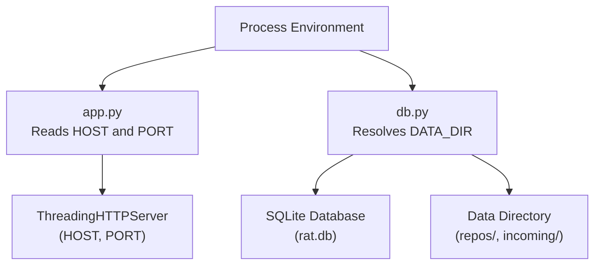
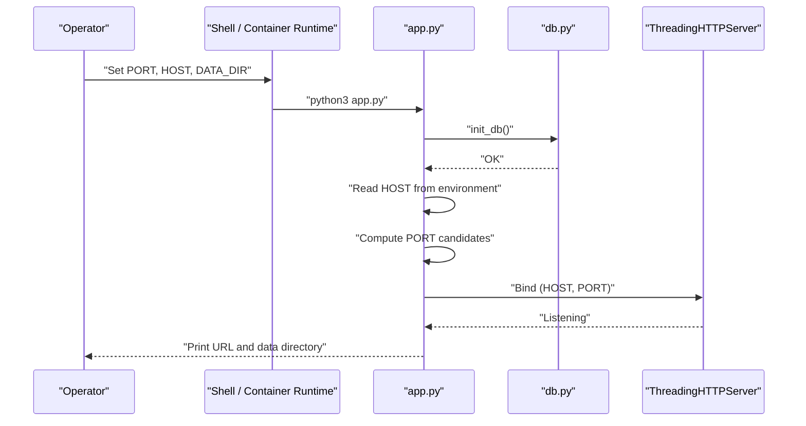
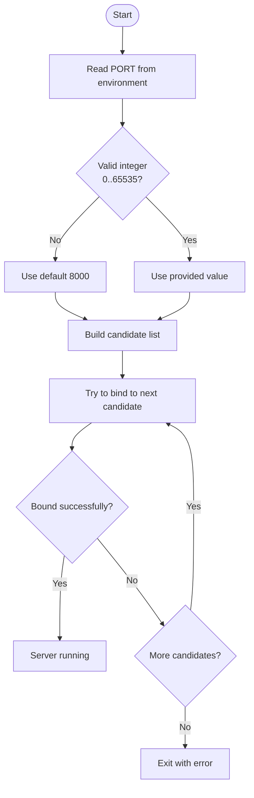
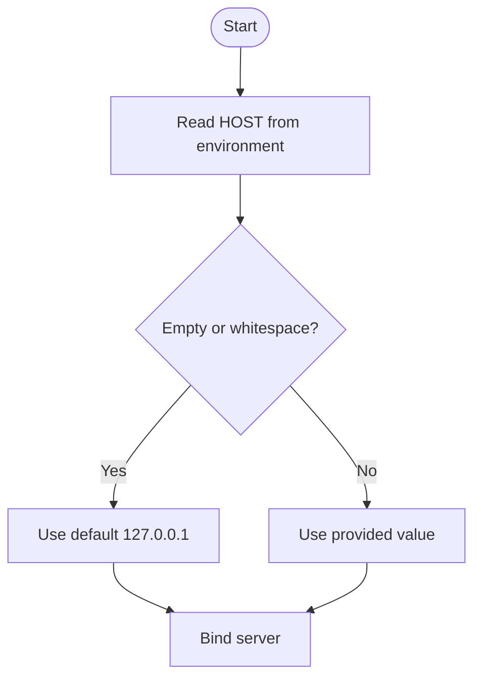
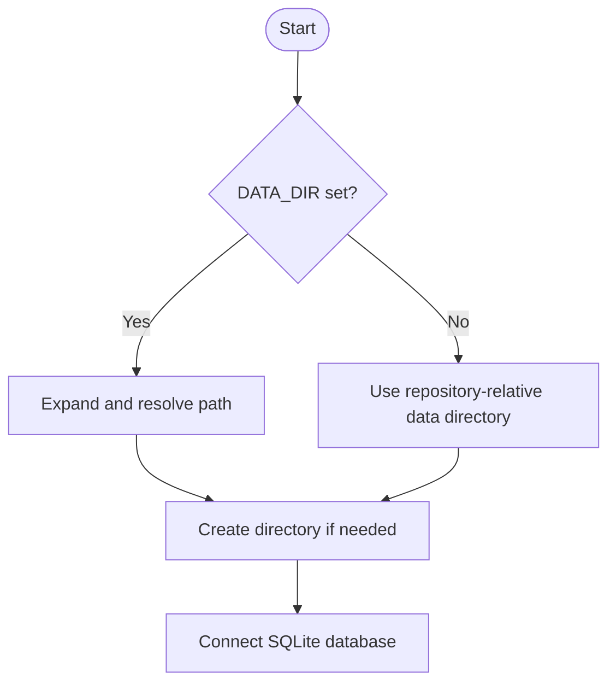
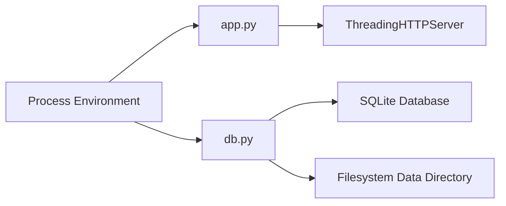

# Environment Configuration

<cite>
**Referenced Files in This Document**
- [app.py](file://app.py)
- [db.py](file://db.py)
- [start.sh](file://start.sh)
- [README.md](file://README.md)
</cite>

## Table of Contents
1. [Introduction](#introduction)
2. [Project Structure](#project-structure)
3. [Core Components](#core-components)
4. [Architecture Overview](#architecture-overview)
5. [Detailed Component Analysis](#detailed-component-analysis)
6. [Dependency Analysis](#dependency-analysis)
7. [Performance Considerations](#performance-considerations)
8. [Troubleshooting Guide](#troubleshooting-guide)
9. [Conclusion](#conclusion)

## Introduction
This document explains how to configure RAT through environment variables. It covers supported variables, validation rules, acceptable values, usage scenarios, and environment-specific setup guidance for development, testing, and production. It also documents configuration precedence, override behavior, security considerations, and best practices for managing environment-specific settings.

RAT is a local web server that reads environment variables at startup to determine the bind address, port selection, and data directory location. The application uses only Python standard library modules and does not load external configuration files such as .env by default.

## Project Structure
The environment configuration is primarily implemented in two modules:
- app.py: Reads HOST and PORT from the process environment and starts the HTTP server.
- db.py: Resolves DATA_DIR and initializes the SQLite database under that directory.

**Diagram sources**
- [app.py:444-487](file://app.py#L444-L487)
- [db.py:65-86](file://db.py#L65-L86)

**Section sources**
- [app.py:1-10](file://app.py#L1-L10)
- [db.py:1-10](file://db.py#L1-L10)

## Core Components
RAT supports three environment variables:

- PORT
  - Purpose: First port to try when starting the server.
  - Default: 8000.
  - Validation: Must be a decimal integer in the range 0–65535; otherwise, defaults to 8000.
  - Behavior: If the chosen port is unavailable or inaccessible, RAT tries additional fallback ports (8080, 8888, 9000, then OS-assigned).
  - Usage scenarios:
    - Development: Use a non-privileged port like 8000 or 8080.
    - Testing: Use an ephemeral port (for example, 0) to let the OS assign one dynamically.
    - Production: Bind to a privileged port if permitted by the runtime environment, or use a reverse proxy on port 80/443.

- HOST
  - Purpose: Network interface address to bind.
  - Default: 127.0.0.1.
  - Validation: Any valid host string accepted by the underlying socket layer; empty or whitespace-only values fall back to 127.0.0.1.
  - Usage scenarios:
    - Development: Keep localhost binding for safety.
    - Testing: Bind to 0.0.0.0 when running inside containers or VMs where the test harness connects from outside.
    - Production: Typically bound via a reverse proxy; avoid exposing directly unless required.

- DATA_DIR
  - Purpose: Root directory for the SQLite database and ingested repository data.
  - Default: <repository-root>/data.
  - Validation: If set, treated as an absolute path after user expansion and resolution; if unset, defaults to a data directory relative to the repository root.
  - Usage scenarios:
    - Development: Leave default to keep data alongside the codebase.
    - Testing: Set to a temporary directory per test run to isolate state.
    - Production: Point to a persistent, backed-up volume with appropriate permissions.

Configuration precedence and override mechanisms:
- Environment variables take effect at process start time.
- There is no built-in .env file loader; only the process environment is read.
- Variables are read once during startup; changing them requires restarting the process.
- For PORT, invalid values silently revert to the default before attempting to bind.
- For HOST, empty or whitespace-only values revert to the default.
- For DATA_DIR, any non-empty value overrides the default; it is expanded and resolved to an absolute path.

Security considerations:
- Avoid binding to 0.0.0.0 in untrusted environments unless behind a reverse proxy or firewall.
- Prefer using a reverse proxy for TLS termination and access control rather than exposing the server directly.
- Ensure DATA_DIR points to a secure filesystem with restricted permissions.
- Do not log sensitive environment values.

Best practices:
- Pin PORT to a known value in production for consistent service discovery.
- Use HOST=127.0.0.1 locally and rely on a reverse proxy for external access.
- Isolate DATA_DIR per environment to prevent cross-environment interference.
- Manage environment variables through your deployment platform’s secret/config management instead of hardcoding them.

**Section sources**
- [app.py:6-10](file://app.py#L6-L10)
- [app.py:444-487](file://app.py#L444-L487)
- [db.py:65-70](file://db.py#L65-L70)
- [README.md:28-35](file://README.md#L28-L35)

## Architecture Overview
The following sequence diagram shows how environment variables influence startup and server binding.

**Diagram sources**
- [app.py:455-487](file://app.py#L455-L487)
- [db.py:89-95](file://db.py#L89-L95)

## Detailed Component Analysis

### PORT Configuration
- Resolution logic:
  - Read from environment.
  - Validate as a decimal integer within 0–65535.
  - If invalid, default to 8000.
  - Attempt to bind to the first candidate; if unavailable, try subsequent candidates.
- Acceptable values:
  - Valid integers between 0 and 65535.
  - Port 0 requests the OS to choose a free port.
- Fallback order:
  - First candidate (from PORT), then 8080, 8888, 9000, and finally OS-assigned.
- Error handling:
  - If all attempts fail due to permission or address conflicts, the process exits after printing an error.

**Diagram sources**
- [app.py:444-472](file://app.py#L444-L472)

**Section sources**
- [app.py:444-472](file://app.py#L444-L472)

### HOST Configuration
- Resolution logic:
  - Read from environment.
  - Strip whitespace.
  - If empty, default to 127.0.0.1.
- Acceptable values:
  - Any host string accepted by the socket layer.
- Security implications:
  - Binding to 127.0.0.1 restricts access to the local machine.
  - Binding to 0.0.0.0 exposes the server to all interfaces; use with caution.

**Diagram sources**
- [app.py:458-463](file://app.py#L458-L463)

**Section sources**
- [app.py:458-463](file://app.py#L458-L463)

### DATA_DIR Configuration
- Resolution logic:
  - If set, expand user paths and resolve to an absolute path.
  - If unset, default to a data directory relative to the repository root.
- Side effects:
  - The directory is created if missing.
  - The SQLite database file is stored under this directory.
  - Ingested repositories and temporary uploads are stored beneath this directory.

**Diagram sources**
- [db.py:65-86](file://db.py#L65-L86)

**Section sources**
- [db.py:65-86](file://db.py#L65-L86)

### Startup Wrapper
- start.sh provides a simple wrapper to launch app.py.
- It changes into the script’s directory and executes the Python application.
- Environment variables should be set in the shell or container runtime before invoking the wrapper.

**Section sources**
- [start.sh:1-5](file://start.sh#L1-L5)

## Dependency Analysis
Environment variable consumption occurs in two places:
- app.py consumes HOST and PORT to configure the HTTP server.
- db.py consumes DATA_DIR to locate the database and data storage.

**Diagram sources**
- [app.py:444-487](file://app.py#L444-L487)
- [db.py:65-86](file://db.py#L65-L86)

**Section sources**
- [app.py:444-487](file://app.py#L444-L487)
- [db.py:65-86](file://db.py#L65-L86)

## Performance Considerations
- PORT fallback: Rapidly trying multiple ports can cause transient errors if many processes compete for common ports. Prefer setting a unique PORT in automated environments.
- DATA_DIR placement: Placing DATA_DIR on fast, reliable storage improves ingestion and query performance.
- Host binding: Binding to 127.0.0.1 avoids unnecessary network stack overhead when clients are local.

[No sources needed since this section provides general guidance]

## Troubleshooting Guide
Common issues and resolutions:
- Cannot bind to PORT:
  - Symptom: Application prints that the port is unavailable and tries the next candidate.
  - Resolution: Choose a different PORT or allow the OS to assign one by setting PORT=0.
- Unexpected HOST binding:
  - Symptom: Service not reachable from other hosts.
  - Resolution: Verify HOST is set appropriately; consider using a reverse proxy instead of binding to 0.0.0.0.
- DATA_DIR not found or permission denied:
  - Symptom: Errors creating directories or writing the database.
  - Resolution: Ensure the process has write permissions to the configured DATA_DIR or adjust the path to a writable location.

Operational tips:
- Always check the printed URL and data directory at startup to confirm effective configuration.
- Reset state by removing the data directory if necessary.

**Section sources**
- [app.py:461-472](file://app.py#L461-L472)
- [README.md:36-40](file://README.md#L36-L40)

## Conclusion
RAT’s environment configuration is intentionally minimal and robust:
- PORT controls the initial port attempt with safe fallback behavior.
- HOST controls the bind address with a safe default.
- DATA_DIR controls persistent storage location with automatic creation.

For predictable deployments, explicitly set these variables in your environment or container configuration. Avoid relying on implicit defaults in production, and always validate that the effective HOST, PORT, and DATA_DIR match your operational requirements.

[No sources needed since this section summarizes without analyzing specific files]