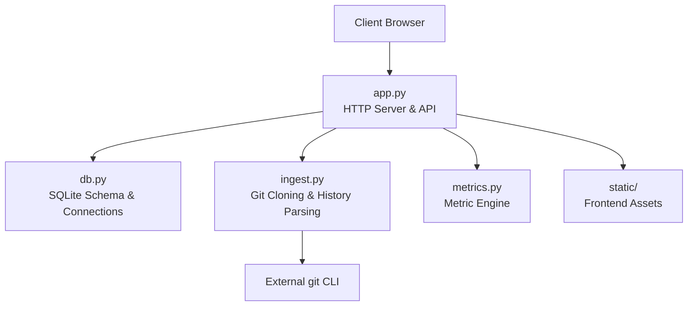
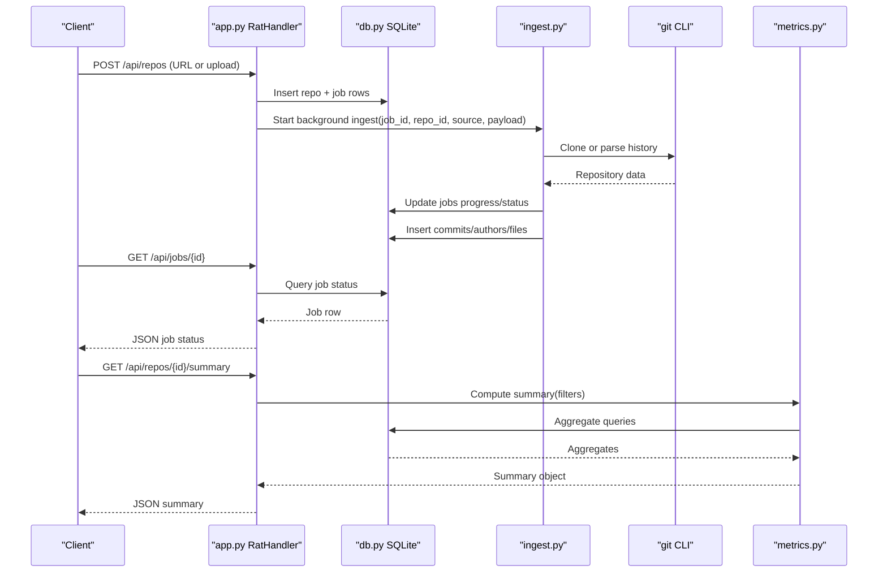
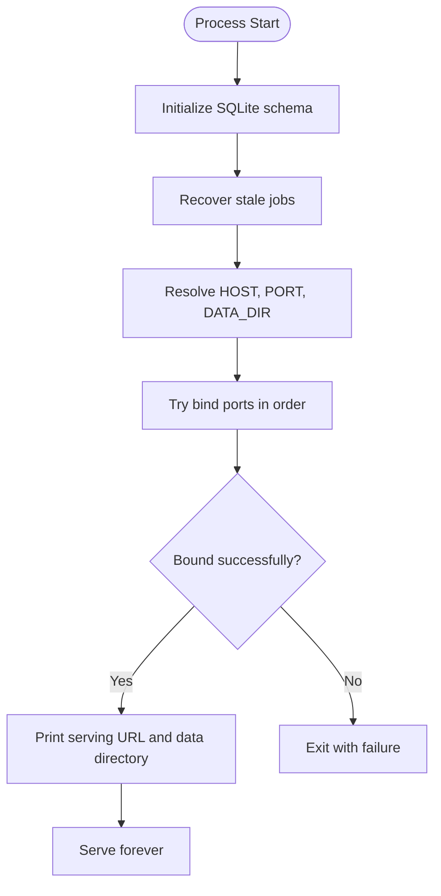
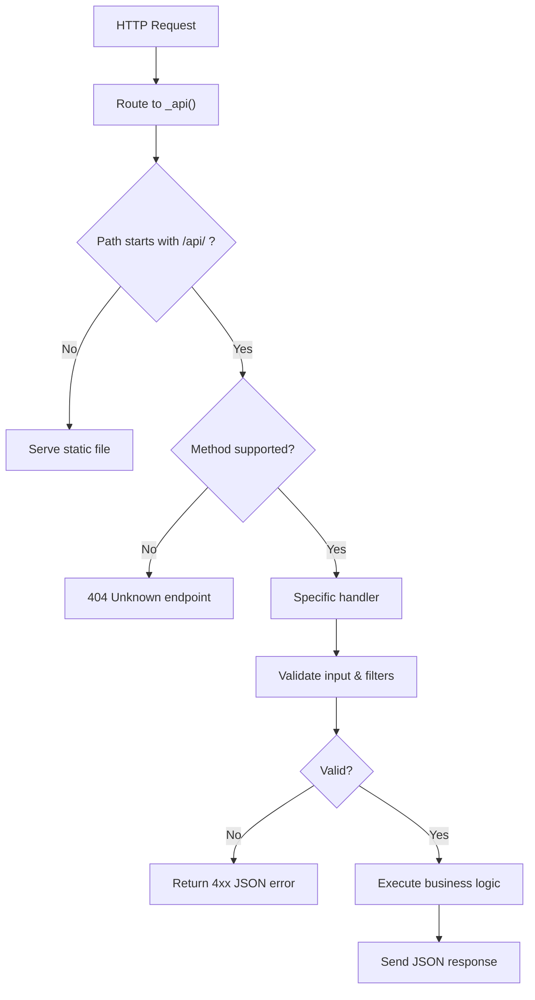
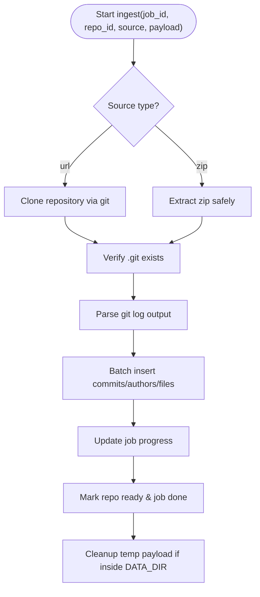
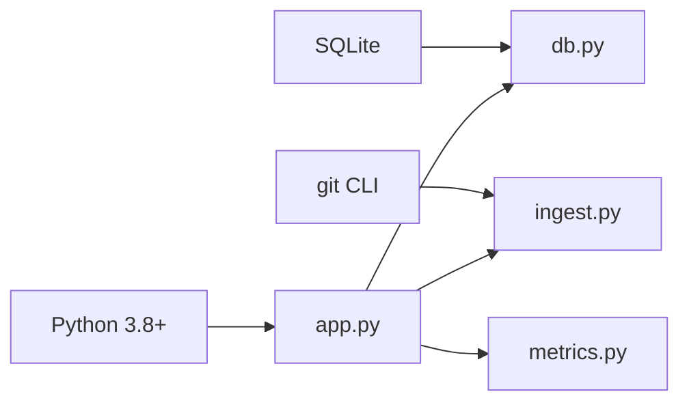

# Production Deployment

<cite>
**Referenced Files in This Document**
- [README.md](file://README.md)
- [start.sh](file://start.sh)
- [app.py](file://app.py)
- [db.py](file://db.py)
- [ingest.py](file://ingest.py)
- [metrics.py](file://metrics.py)
- [selftest.py](file://selftest.py)
</cite>

## Table of Contents
1. [Introduction](#introduction)
2. [Project Structure](#project-structure)
3. [Core Components](#core-components)
4. [Architecture Overview](#architecture-overview)
5. [Detailed Component Analysis](#detailed-component-analysis)
6. [Dependency Analysis](#dependency-analysis)
7. [Performance Considerations](#performance-considerations)
8. [Security Hardening](#security-hardening)
9. [Monitoring, Logging, and Health Checks](#monitoring-logging-and-health-checks)
10. [Deployment Examples](#deployment-examples)
11. [Troubleshooting Guide](#troubleshooting-guide)
12. [Conclusion](#conclusion)

## Introduction
RAT is a local, offline repository analysis tool that ingests Git repositories from zip archives or public clone URLs and computes metrics such as added/removed lines, growth, churn, modifications, churn rate, and author ownership. It exposes a lightweight HTTP server with JSON APIs for listing repositories, querying metrics, managing ingestion jobs, and serving the static dashboard.

This document provides production deployment guidance, including system requirements, startup procedures, resource recommendations, security hardening, monitoring, health checks, and deployment examples for bare metal, virtual machines, and containerized environments.

## Project Structure
The project is intentionally small and uses only the Python standard library plus an external `git` CLI:

- `app.py`: HTTP server, API routing, request validation, static file serving, and background ingestion orchestration.
- `db.py`: SQLite schema, connection helpers, data directory resolution, and database initialization.
- `ingest.py`: Zip extraction, URL cloning, Git history parsing, job progress tracking, and error recovery.
- `metrics.py`: Metric calculations, filter parsing, commit-set queries, charts, and author identity handling.
- `start.sh`: Convenience wrapper to run the application.
- `selftest.py`: Automated tests validating metric semantics and ingestion edge cases.
- `demo/make_fixture.py`: Fixture generator used by tests.
- `static/`: Frontend assets served by the server.

**Diagram sources**
- [app.py:21-30](file://app.py#L21-L30)
- [db.py:15-62](file://db.py#L15-L62)
- [ingest.py:30-36](file://ingest.py#L30-L36)
- [metrics.py:1-21](file://metrics.py#L1-L21)

**Section sources**
- [README.md:1-46](file://README.md#L1-L46)
- [app.py:1-31](file://app.py#L1-L31)
- [db.py:1-12](file://db.py#L1-L12)
- [ingest.py:1-20](file://ingest.py#L1-L20)
- [metrics.py:1-21](file://metrics.py#L1-L21)

## Core Components
- HTTP Server and API Router: Handles GET/POST/DELETE requests, routes `/api/*` endpoints, serves static files, validates inputs, enforces upload size limits, and returns structured JSON responses.
- Database Layer: Initializes SQLite schema, manages connections with WAL mode, sets busy timeouts, and resolves the data directory via environment variables.
- Ingestion Pipeline: Validates URLs, extracts zip archives safely, clones repositories using Git, parses history in one pass, batches inserts, tracks job progress, and handles errors gracefully.
- Metric Engine: Parses filters (date ranges, hashes, authors), computes aggregates (added, removed, growth, churn, frequency, churn rate), supports tree/file detail views, author tables, commits list, and chart generation.

Key operational characteristics:
- Standard library only; no pip, venv, or build step required.
- Background ingestion runs in daemon threads.
- Data persistence uses SQLite with WAL enabled.
- External dependency: `git` must be available on PATH.

**Section sources**
- [app.py:56-90](file://app.py#L56-L90)
- [app.py:121-196](file://app.py#L121-L196)
- [db.py:65-86](file://db.py#L65-L86)
- [ingest.py:70-87](file://ingest.py#L70-L87)
- [ingest.py:181-315](file://ingest.py#L181-L315)
- [metrics.py:50-88](file://metrics.py#L50-L88)
- [metrics.py:205-225](file://metrics.py#L205-L225)

## Architecture Overview
The runtime architecture consists of a single-process Python HTTP server backed by SQLite and driven by external Git operations. Requests are handled concurrently via ThreadingHTTPServer. Ingestion tasks are offloaded to background threads and report progress through the jobs table.

**Diagram sources**
- [app.py:306-336](file://app.py#L306-L336)
- [app.py:338-363](file://app.py#L338-L363)
- [app.py:455-487](file://app.py#L455-L487)
- [ingest.py:356-441](file://ingest.py#L356-L441)
- [db.py:77-86](file://db.py#L77-L86)
- [metrics.py:205-225](file://metrics.py#L205-L225)

## Detailed Component Analysis

### Startup Process
- Direct execution: Run `python3 app.py`. The server initializes the database, recovers stale jobs, binds to a host/port, prints the serving URL, and starts serving requests.
- Wrapper script: `./start.sh` changes into the script’s directory and executes `python3 app.py`.
- Environment variables:
  - `PORT`: First port tried; falls back to 8080, 8888, 9000, then OS-assigned.
  - `HOST`: Bind address; default is loopback.
  - `DATA_DIR`: Directory for SQLite database and ingested repositories; defaults to `<repo>/data`.

**Diagram sources**
- [app.py:455-487](file://app.py#L455-L487)
- [start.sh:1-5](file://start.sh#L1-L5)

**Section sources**
- [README.md:14-21](file://README.md#L14-L21)
- [start.sh:1-5](file://start.sh#L1-L5)
- [app.py:455-487](file://app.py#L455-L487)

### API Endpoints and Validation
- Health check: `GET /api/health` returns a simple JSON object indicating service readiness.
- Repository management:
  - `GET /api/repos`: List repositories with counts and metadata.
  - `POST /api/repos`: Create repository from URL; validates URL scheme and netloc.
  - `POST /api/repos/upload`: Create repository from uploaded zip; enforces magic bytes and maximum payload size.
  - `POST /api/repos/sample`: Load bundled sample fixture if present.
  - `DELETE /api/repos/{id}`: Delete repository and associated files/commits/authors/jobs.
- Job polling:
  - `GET /api/jobs/{id}`: Retrieve job status, progress, and message.
  - `GET /api/repos/{id}/job`: Latest job for a repository.
- Metrics:
  - `GET /api/repos/{id}/summary`, `/tree`, `/file`, `/authors`, `/commits`, `/chart`: Compute metrics based on query parameters and filters.

Input validation highlights:
- JSON bodies are parsed and validated; invalid payloads return 400.
- Uploads require `Content-Length`; oversized payloads return 413.
- Path parameters and query strings are sanitized; invalid filters raise 400.
- Unknown endpoints return 404.

**Diagram sources**
- [app.py:73-90](file://app.py#L73-L90)
- [app.py:121-196](file://app.py#L121-L196)
- [app.py:400-424](file://app.py#L400-L424)

**Section sources**
- [app.py:121-196](file://app.py#L121-L196)
- [app.py:400-424](file://app.py#L400-L424)

### Ingestion Pipeline
- URL ingestion:
  - Validates URL scheme (`http`/`https`) and presence of netloc.
  - Clones repository quietly under `DATA_DIR/repos/{id}` with timeout protection.
- Zip ingestion:
  - Extracts archive safely, rejecting unsafe paths (zip-slip protection).
  - Locates `.git` directory at root or within nested folders.
- History parsing:
  - Uses `git log` with custom format to extract commits, authors, and file changes in one pass.
  - Batches inserts for performance; updates job progress periodically.
- Error handling:
  - Marks jobs and repos as failed on ingestion errors.
  - Cleans up partially ingested data on failure.

**Diagram sources**
- [ingest.py:356-441](file://ingest.py#L356-L441)
- [ingest.py:91-143](file://ingest.py#L91-L143)
- [ingest.py:181-315](file://ingest.py#L181-L315)

**Section sources**
- [ingest.py:70-87](file://ingest.py#L70-L87)
- [ingest.py:91-143](file://ingest.py#L91-L143)
- [ingest.py:181-315](file://ingest.py#L181-L315)
- [ingest.py:356-441](file://ingest.py#L356-L441)

### Metric Engine
- Filters:
  - Date range: `from` and `to` epoch seconds.
  - Hashes: Comma-separated commit hashes or prefixes; limited count.
  - Author: Canonical author ID.
- Aggregations:
  - Added, removed, growth, churn, modifications, frequency, churn rate.
  - Directory tree with per-child metrics.
  - File detail with author ownership breakdown.
  - Authors table with merged identities.
  - Commits list with pagination and search.
  - Charts: churn over time, top files, author share.

Validation and safety:
- Filter parameters are strictly typed and bounded.
- Paths are normalized and rejected if they contain traversal segments.
- Large hash lists are capped to prevent excessive SQL construction.

**Section sources**
- [metrics.py:50-88](file://metrics.py#L50-L88)
- [metrics.py:138-168](file://metrics.py#L138-L168)
- [metrics.py:205-225](file://metrics.py#L205-L225)
- [metrics.py:228-262](file://metrics.py#L228-L262)
- [metrics.py:265-307](file://metrics.py#L265-L307)
- [metrics.py:310-361](file://metrics.py#L310-L361)
- [metrics.py:399-435](file://metrics.py#L399-L435)
- [metrics.py:463-543](file://metrics.py#L463-L543)

## Dependency Analysis
- Python version: 3.8+ (standard library only).
- External CLI: `git` must be installed and accessible on PATH.
- Database: SQLite (built-in); WAL mode enabled for concurrent reads during writes.
- Network: Built-in `http.server.ThreadingHTTPServer`.

**Diagram sources**
- [README.md:9-12](file://README.md#L9-L12)
- [db.py:77-86](file://db.py#L77-L86)
- [ingest.py:50-67](file://ingest.py#L50-L67)

**Section sources**
- [README.md:9-12](file://README.md#L9-L12)
- [db.py:77-86](file://db.py#L77-L86)
- [ingest.py:50-67](file://ingest.py#L50-L67)

## Performance Considerations
Resource allocation should account for repository size, number of commits, file change volume, and concurrent user load.

- CPU:
  - Ingestion is CPU-intensive due to Git history parsing and SQL batching.
  - Metric queries can be expensive for large commit sets; consider indexing and query optimization if needed.
- Memory:
  - Ingestion streams Git output and batches file rows; memory usage scales with batch size and repository size.
  - Avoid extremely large uploads; the server enforces a maximum payload size.
- Disk space:
  - SQLite database grows with commits, files, and authors.
  - Ingested repositories are stored under `DATA_DIR/repos/{id}`.
  - Ensure sufficient disk capacity for multiple repositories and backups.

Recommendations:
- Size disks based on expected repository count and average commit volume.
- Use fast storage (SSD) for SQLite and repository data to reduce ingestion latency.
- Monitor job queue length and job duration; scale horizontally by running multiple instances behind a reverse proxy if necessary.
- Tune SQLite pragmas cautiously; current settings use WAL and NORMAL synchronous mode for balanced durability/performance.

[No sources needed since this section provides general guidance]

## Security Hardening
File permissions:
- Restrict access to `DATA_DIR` so only the RAT process user can read/write.
- Ensure `static/` is readable but not writable by the web process unless necessary.
- Prevent world-writable directories to avoid privilege escalation.

Network binding restrictions:
- Default bind address is loopback (`127.0.0.1`). For production exposure, place RAT behind a reverse proxy (e.g., Nginx, Caddy) and do not expose the internal server directly.
- If binding to non-loopback interfaces, restrict firewall rules to trusted networks.

Input validation:
- All JSON bodies are validated; malformed requests return 400.
- Uploads enforce maximum payload size and require valid ZIP magic bytes.
- URL ingestion validates scheme and netloc; only `http`/`https` are allowed.
- Path parameters are sanitized; traversal attempts are rejected.
- Query filters are strictly typed and bounded; excessive hash lists are capped.

Operational safeguards:
- Background ingestion runs in daemon threads; failures update job and repo status without crashing the server.
- Stale jobs are recovered on startup to avoid hanging states.
- Git commands are executed with explicit argument lists (no shell) and non-interactive environment variables.

**Section sources**
- [app.py:32-32](file://app.py#L32-L32)
- [app.py:400-424](file://app.py#L400-L424)
- [app.py:455-458](file://app.py#L455-L458)
- [ingest.py:70-87](file://ingest.py#L70-L87)
- [ingest.py:91-143](file://ingest.py#L91-L143)
- [ingest.py:44-47](file://ingest.py#L44-L47)
- [ingest.py:443-457](file://ingest.py#L443-L457)

## Monitoring, Logging, and Health Checks
Health check endpoint:
- `GET /api/health` returns a JSON object indicating service readiness. Use this for liveness probes in orchestrators.

Logging:
- The server prints startup information and selected request logs to stdout.
- Ingestion progress and completion messages are printed when jobs complete.
- For production, capture stdout/stderr and forward to centralized logging (e.g., journald, Docker logs, cloud logging agents).

Metrics collection:
- No built-in Prometheus exporter is present. Expose application-level metrics by wrapping requests or integrating a lightweight metrics library if needed.
- Track job queue length, ingestion duration, and error rates externally.

Database monitoring:
- Monitor SQLite file sizes and WAL files under `DATA_DIR`.
- Set alerts for disk usage thresholds.

Backup strategy:
- Back up `DATA_DIR` regularly, ensuring consistency (stop ingestion or use snapshots).
- Consider periodic exports of critical tables if needed.

**Section sources**
- [app.py:125-127](file://app.py#L125-L127)
- [app.py:92-97](file://app.py#L92-L97)
- [ingest.py:423-426](file://ingest.py#L423-L426)
- [db.py:77-86](file://db.py#L77-L86)

## Deployment Examples

### Bare Metal Servers
- Install Python 3.8+ and `git`.
- Place the repository in a dedicated directory.
- Configure `DATA_DIR` on a sufficiently sized disk partition.
- Start the service:
  - `./start.sh`
  - Or `python3 app.py`
- Optionally set `HOST` and `PORT` environment variables.
- Place behind a reverse proxy if exposing externally.

**Section sources**
- [README.md:9-12](file://README.md#L9-L12)
- [README.md:14-21](file://README.md#L14-L21)
- [start.sh:1-5](file://start.sh#L1-L5)
- [app.py:455-487](file://app.py#L455-L487)

### Virtual Machines
- Provision a VM with adequate CPU, memory, and disk for expected repository load.
- Install Python and Git.
- Configure systemd service:
  - ExecStart: `python3 /path/to/app.py`
  - Environment: `HOST=127.0.0.1`, `PORT=8000`, `DATA_DIR=/var/lib/rat/data`
  - Restart policy: always
- Use firewall rules to allow only the reverse proxy to reach the service.

**Section sources**
- [app.py:455-487](file://app.py#L455-L487)
- [db.py:65-70](file://db.py#L65-L70)

### Containerized Environments
- Build an image with Python 3.8+ and `git`.
- Mount a persistent volume to `DATA_DIR`.
- Run the container with environment variables:
  - `HOST=0.0.0.0` (if exposed directly) or keep loopback and use ingress.
  - `PORT=8000`
  - `DATA_DIR=/data`
- Use Kubernetes liveness probe against `/api/health`.
- Scale horizontally with a stateless frontend and shared `DATA_DIR` only if using network storage with proper locking considerations.

**Section sources**
- [app.py:455-487](file://app.py#L455-L487)
- [db.py:65-70](file://db.py#L65-L70)

## Troubleshooting Guide
Common issues and resolutions:
- Port conflicts: The server tries fallback ports automatically; the actual bound URL is printed at startup.
- Git not found: Ensure `git` is installed and on PATH; ingestion requires it for cloning and history extraction.
- Data corruption or stale state: Reset by deleting the `DATA_DIR` contents; the server recreates the schema on startup.
- Invalid uploads: Ensure the uploaded file is a valid ZIP archive; the server checks magic bytes and size limits.
- URL ingestion failures: Verify the URL is a public `http`/`https` repository; authentication prompts are disabled.

Diagnostic steps:
- Check stdout for startup messages and ingestion logs.
- Query `/api/jobs/{id}` to inspect job status and messages.
- Inspect `DATA_DIR` for SQLite files and repository data.
- Run `python3 selftest.py` to validate metric engine behavior against the fixture.

**Section sources**
- [README.md:36-40](file://README.md#L36-L40)
- [app.py:461-472](file://app.py#L461-L472)
- [app.py:400-424](file://app.py#L400-L424)
- [ingest.py:70-87](file://ingest.py#L70-L87)
- [selftest.py:1-22](file://selftest.py#L1-L22)

## Conclusion
RAT provides a compact, standards-compliant repository analysis platform suitable for production when deployed with appropriate system dependencies, secure configurations, and operational monitoring. By following the guidelines in this document—installing Python and Git, configuring environment variables, hardening file and network permissions, and setting up health checks and logging—you can reliably operate RAT across bare metal, virtual machines, and containerized environments.

[No sources needed since this section summarizes without analyzing specific files]