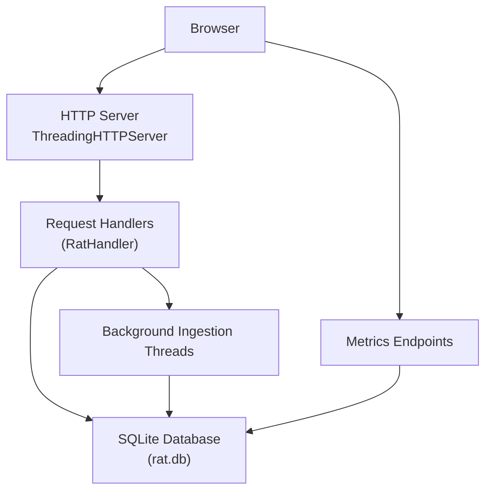
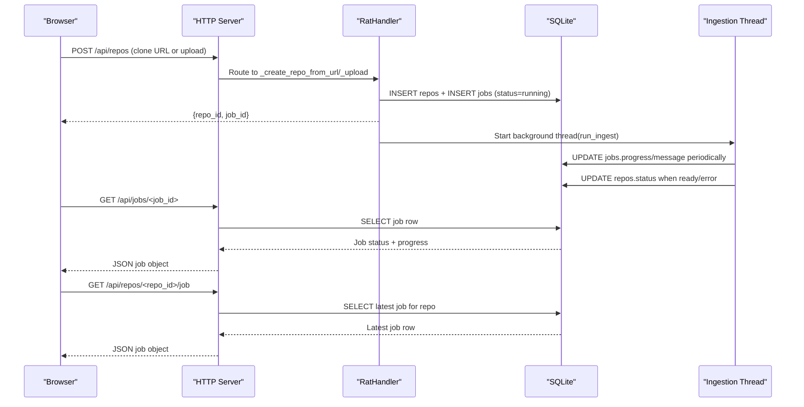
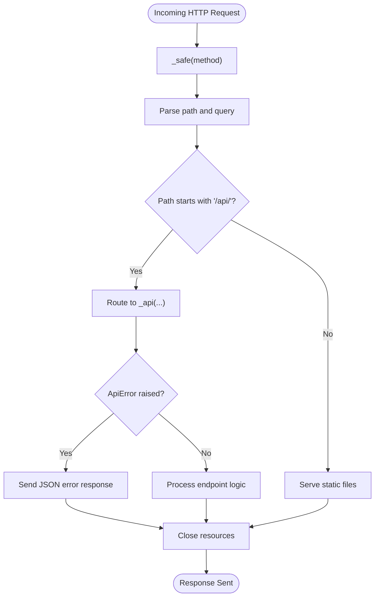
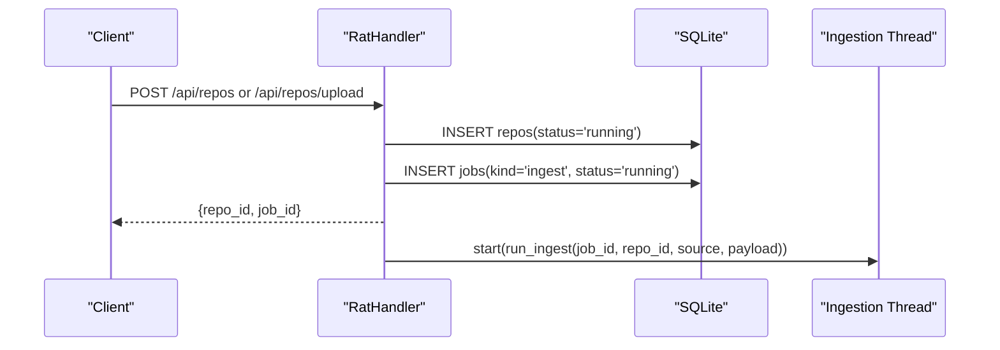
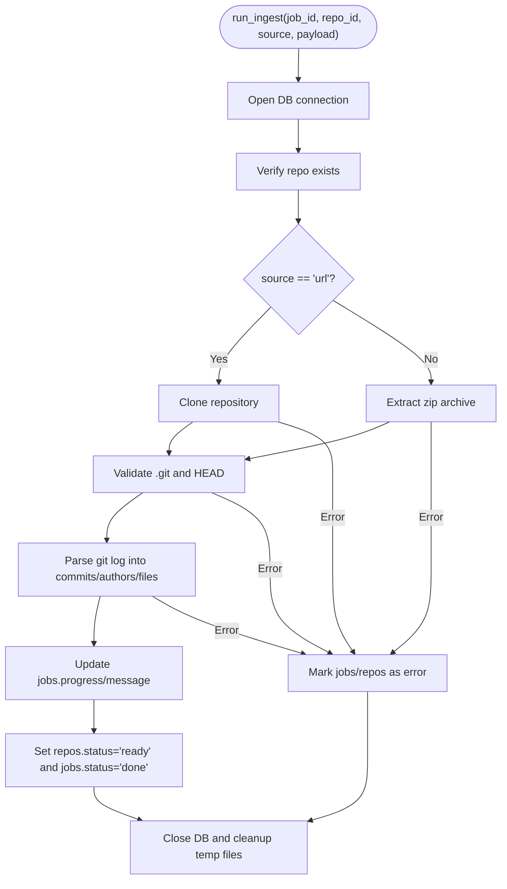
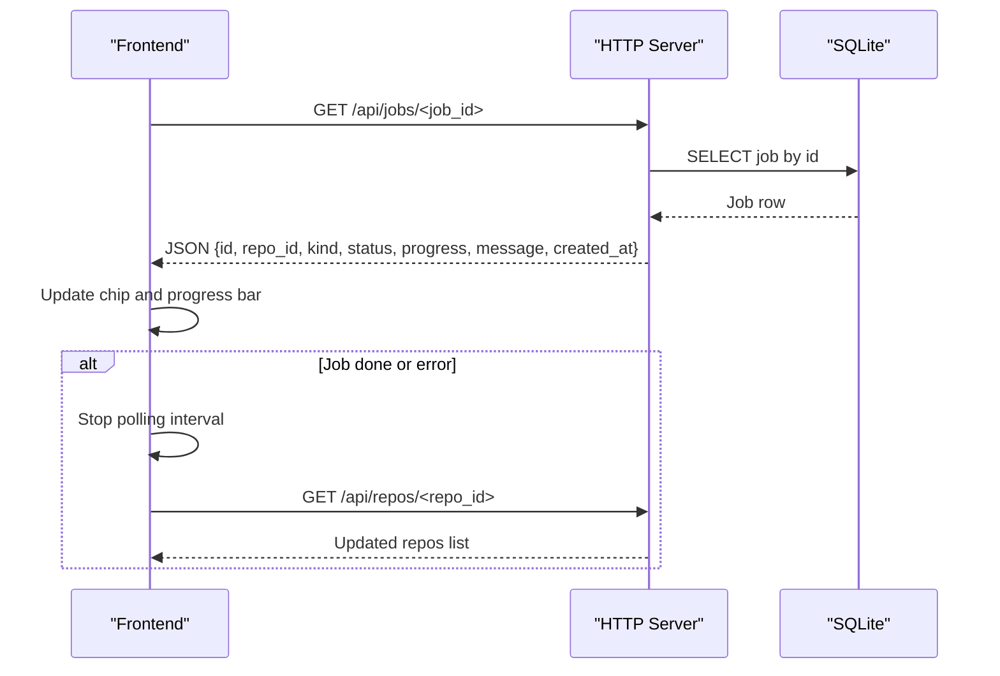
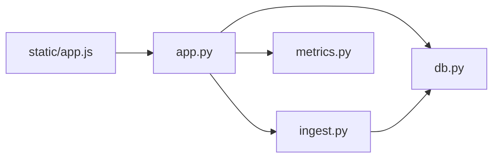

# Background Job Processing

<cite>
**Referenced Files in This Document**
- [app.py](file://app.py)
- [db.py](file://db.py)
- [ingest.py](file://ingest.py)
- [metrics.py](file://metrics.py)
- [app.js](file://static/app.js)
</cite>

## Table of Contents
1. [Introduction](#introduction)
2. [Project Structure](#project-structure)
3. [Core Components](#core-components)
4. [Architecture Overview](#architecture-overview)
5. [Detailed Component Analysis](#detailed-component-analysis)
6. [Dependency Analysis](#dependency-analysis)
7. [Performance Considerations](#performance-considerations)
8. [Troubleshooting Guide](#troubleshooting-guide)
9. [Conclusion](#conclusion)

## Introduction
This document explains the background job processing system used by the repository analysis tool. It covers how jobs are created, queued, executed asynchronously, and tracked until completion. It also documents the thread-safe request handling mechanism, the real-time job polling interface for the frontend, error handling strategies, resource management for long-running repository analyses, and examples of job status responses.

The system is built around:
- A threaded HTTP server that accepts user requests concurrently.
- SQLite-backed persistence for repositories, ingestion jobs, and ingested metrics.
- Background threads that perform Git cloning or zip extraction and history parsing.
- A lightweight frontend that polls job progress and updates the UI in real time.

## Project Structure
At a high level, the application consists of:
- An HTTP API server that routes requests to handlers.
- A database layer providing connection helpers and schema initialization.
- An ingestion pipeline that performs repository preparation and Git history parsing.
- A metrics engine that reads ingested data and serves analytical endpoints.
- A frontend JavaScript application that drives the dashboard and job polling.

**Diagram sources**
- [app.py:455-487](file://app.py#L455-L487)
- [db.py:77-86](file://db.py#L77-L86)
- [ingest.py:356-441](file://ingest.py#L356-L441)

**Section sources**
- [app.py:1-492](file://app.py#L1-L492)
- [db.py:1-100](file://db.py#L1-L100)
- [ingest.py:1-458](file://ingest.py#L1-L458)
- [metrics.py:1-544](file://metrics.py#L1-L544)
- [app.js:1-1952](file://static/app.js#L1-L1952)

## Core Components
- Threaded HTTP server and request handler: Accepts concurrent requests, routes API calls, and wraps all requests with safe error handling.
- Database helper: Initializes schema, provides per-call connections, and configures SQLite for concurrency (WAL mode).
- Ingestion pipeline: Performs repository cloning or zip extraction, parses Git history into commits/authors/files, and updates job progress.
- Metrics engine: Provides read-only analytical endpoints over ingested data.
- Frontend job polling: Periodically fetches job status and updates the UI while ingestion runs.

Key responsibilities:
- Job creation: The API creates repository and job rows, then starts a background thread.
- Job execution: The background thread clones or extracts the repository, parses history, and updates progress and final status.
- Job tracking: The frontend polls `/api/jobs/<id>` and `/api/repos/<id>/job` to display progress.
- Error handling: Errors during ingestion mark both repo and job as failed; the server catches unexpected exceptions and returns JSON errors.

**Section sources**
- [app.py:56-91](file://app.py#L56-L91)
- [app.py:306-336](file://app.py#L306-L336)
- [db.py:77-86](file://db.py#L77-L86)
- [ingest.py:356-441](file://ingest.py#L356-L441)
- [app.js:248-285](file://static/app.js#L248-L285)

## Architecture Overview
The background job lifecycle spans multiple components:

**Diagram sources**
- [app.py:338-363](file://app.py#L338-L363)
- [app.py:279-304](file://app.py#L279-L304)
- [ingest.py:356-441](file://ingest.py#L356-L441)

## Detailed Component Analysis

### Request Handling and Concurrency
The server uses `ThreadingHTTPServer`, which spawns a new thread per request. Each request is wrapped in `_safe`, which converts unexpected exceptions into JSON 500 responses and suppresses noisy logs for job polling endpoints.

Concurrency characteristics:
- Multiple users can submit jobs simultaneously.
- Each request gets its own database connection via `db.connect()`.
- SQLite is configured with WAL mode and busy timeouts to allow concurrent readers and writers.

**Diagram sources**
- [app.py:73-91](file://app.py#L73-L91)
- [app.py:121-196](file://app.py#L121-L196)

**Section sources**
- [app.py:56-91](file://app.py#L56-L91)
- [app.py:455-487](file://app.py#L455-L487)
- [db.py:77-86](file://db.py#L77-L86)

### Job Creation and Queuing
Job creation occurs when a user submits a repository clone URL or uploads a zip archive. The handler validates input, creates a repository row, sets initial status to running, inserts a job row with kind `ingest`, and starts a background thread.

Key behaviors:
- Input validation for URLs and zip archives.
- Immediate return of `repo_id` and `job_id` to the client.
- Background thread runs independently using `threading.Thread(daemon=True)`.

**Diagram sources**
- [app.py:338-363](file://app.py#L338-L363)
- [app.py:306-336](file://app.py#L306-L336)

**Section sources**
- [app.py:338-363](file://app.py#L338-L363)
- [app.py:306-336](file://app.py#L306-L336)

### Background Execution and Progress Tracking
The ingestion thread performs:
- Repository cloning from URL or extraction from zip.
- Validation that the target is a valid Git repository.
- Single-pass parsing of Git history into commits, authors, and file changes.
- Periodic progress updates to the jobs table and repository status.

Progress callbacks:
- The ingestion pipeline calls a progress function that updates `jobs.progress` and `jobs.message`.
- Repository status transitions from pending/running to ready or error.

**Diagram sources**
- [ingest.py:356-441](file://ingest.py#L356-L441)
- [ingest.py:320-349](file://ingest.py#L320-L349)

**Section sources**
- [ingest.py:356-441](file://ingest.py#L356-L441)
- [ingest.py:320-349](file://ingest.py#L320-L349)

### Job Polling Interface
The frontend polls job status to provide real-time feedback:
- `pollJob(repoId, jobId)` repeatedly calls `GET /api/jobs/<job_id>`.
- On success, it updates the UI chip and progress bar.
- When the job completes or fails, it stops polling and refreshes repository data.
- `resumeRunningRepo()` retrieves the latest job for a running repository to resume progress after page reload.

**Diagram sources**
- [app.js:248-285](file://static/app.js#L248-L285)
- [app.py:279-304](file://app.py#L279-L304)

**Section sources**
- [app.js:248-285](file://static/app.js#L248-L285)
- [app.js:279-285](file://static/app.js#L279-L285)
- [app.py:279-304](file://app.py#L279-L304)

### Error Handling Strategies
Error handling is layered:
- API layer: Converts `ApiError` instances into JSON responses with appropriate HTTP status codes.
- Ingestion layer: Catches `IngestError` and general exceptions, marks jobs and repos as failed, and cleans up partial data.
- Startup hygiene: On restart, stale running jobs are marked as error with a clear message.

Examples:
- Invalid URL or malformed zip triggers a 400 error before job creation.
- Git command failures or invalid repository structure result in job failure.
- Unexpected exceptions in ingestion threads are caught and logged.

**Section sources**
- [app.py:47-54](file://app.py#L47-L54)
- [app.py:73-91](file://app.py#L73-L91)
- [ingest.py:38-47](file://ingest.py#L38-L47)
- [ingest.py:427-441](file://ingest.py#L427-L441)
- [ingest.py:443-458](file://ingest.py#L443-L458)

### Resource Management for Long-Running Analyses
Resource management includes:
- Connection-per-call pattern: Each request and ingestion thread opens its own SQLite connection, reducing contention.
- WAL mode and busy timeout: Allows concurrent readers and writers without locking out operations.
- Subprocess timeouts: Git commands have explicit timeouts to prevent hanging processes.
- File size limits: Uploads are limited to 1 GiB; payloads exceeding this are rejected.
- Temporary file cleanup: Uploaded zips and partially ingested directories are removed on failure.

**Section sources**
- [db.py:77-86](file://db.py#L77-L86)
- [ingest.py:50-67](file://ingest.py#L50-L67)
- [app.py:401-412](file://app.py#L401-L412)
- [ingest.py:432-441](file://ingest.py#L432-L441)

### Job Status Responses
Job status responses include:
- `id`: Unique job identifier.
- `repo_id`: Associated repository identifier.
- `kind`: Always `ingest` for current implementation.
- `status`: One of `running`, `done`, or `error`.
- `progress`: Float between 0.0 and 1.0 indicating completion percentage.
- `message`: Human-readable status message.
- `created_at`: Timestamp when the job was created.

Example responses:
- Running: `{ "id": 1, "repo_id": 1, "kind": "ingest", "status": "running", "progress": 0.45, "message": "Reading history - 450 of 1000 commits", "created_at": 1710000000 }`
- Done: `{ "id": 1, "repo_id": 1, "kind": "ingest", "status": "done", "progress": 1.0, "message": "Ready - 1000 commits, 5000 file rows", "created_at": 1710000000 }`
- Error: `{ "id": 1, "repo_id": 1, "kind": "ingest", "status": "error", "progress": 1.0, "message": "Not a valid git repository - .git could not be read.", "created_at": 1710000000 }`

**Section sources**
- [app.py:279-304](file://app.py#L279-L304)
- [ingest.py:320-349](file://ingest.py#L320-L349)

### Preventing Resource Exhaustion
To prevent resource exhaustion under load:
- ThreadingHTTPServer handles each request in a separate thread, avoiding blocking the main loop.
- SQLite WAL mode allows concurrent access without excessive locking.
- Subprocess timeouts prevent indefinite hangs during Git operations.
- Upload size limits protect against memory exhaustion.
- Background threads are daemon threads, ensuring they do not prevent process shutdown.
- Stale job recovery on startup prevents orphaned running jobs from accumulating.

**Section sources**
- [app.py:455-487](file://app.py#L455-L487)
- [db.py:77-86](file://db.py#L77-L86)
- [ingest.py:50-67](file://ingest.py#L50-L67)
- [ingest.py:443-458](file://ingest.py#L443-L458)

## Dependency Analysis
The system has clear separation of concerns:
- `app.py` depends on `db`, `ingest`, and `metrics`.
- `ingest.py` depends on `db`.
- `metrics.py` is independent and only reads from `db`.
- `app.js` interacts with the HTTP API endpoints defined in `app.py`.

**Diagram sources**
- [app.py:28-30](file://app.py#L28-L30)
- [ingest.py:30](file://ingest.py#L30)

**Section sources**
- [app.py:28-30](file://app.py#L28-L30)
- [ingest.py:30](file://ingest.py#L30)

## Performance Considerations
- Batched database writes: The ingestion pipeline batches file records to reduce commit overhead.
- Throttled progress updates: Progress is updated every N commits to avoid excessive database writes.
- Efficient Git parsing: Uses a single-pass approach to parse Git history without loading entire history into memory.
- Adaptive chart bucketing: Metrics charts adapt bucket granularity based on time span to maintain readability.
- Debounced frontend interactions: User inputs like search and resize events are debounced to reduce unnecessary re-renders.

**Section sources**
- [ingest.py:181-315](file://ingest.py#L181-L315)
- [metrics.py:440-460](file://metrics.py#L440-L460)
- [app.js:56-63](file://static/app.js#L56-L63)

## Troubleshooting Guide
Common issues and resolutions:
- Job stuck in running state: Check if the server was restarted; stale jobs are marked as error on startup.
- Git command timeouts: Verify network connectivity and repository accessibility; check subprocess timeout settings.
- Zip extraction failures: Ensure the uploaded file is a valid zip containing a `.git` directory.
- Database locking errors: WAL mode should handle most conflicts; monitor SQLite busy timeout configuration.
- Memory issues with large uploads: Enforce upload size limits and verify system memory availability.

**Section sources**
- [ingest.py:443-458](file://ingest.py#L443-L458)
- [ingest.py:50-67](file://ingest.py#L50-L67)
- [ingest.py:91-143](file://ingest.py#L91-L143)
- [db.py:77-86](file://db.py#L77-L86)

## Conclusion
The background job processing system provides a robust, thread-safe mechanism for asynchronous repository analysis. It combines a threaded HTTP server, SQLite-backed persistence, background ingestion threads, and a responsive frontend polling interface. The design emphasizes safety through comprehensive error handling, resource limits, and cleanup procedures. Users can submit multiple jobs concurrently, track progress in real time, and rely on consistent status updates even after server restarts.