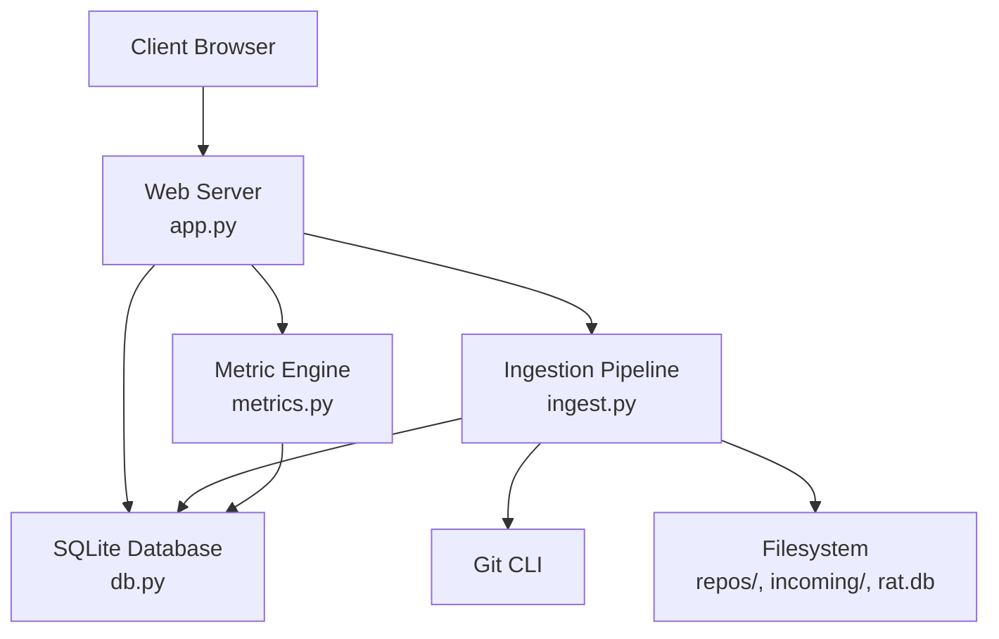
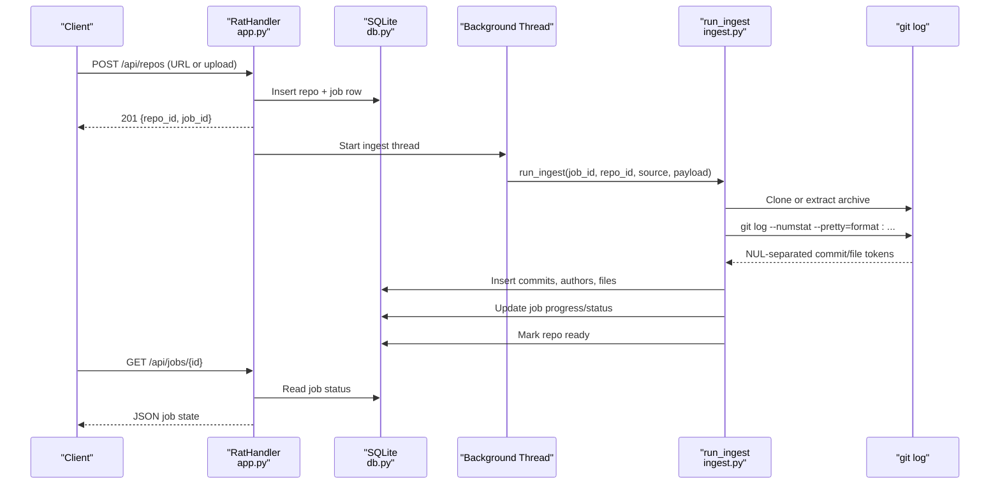
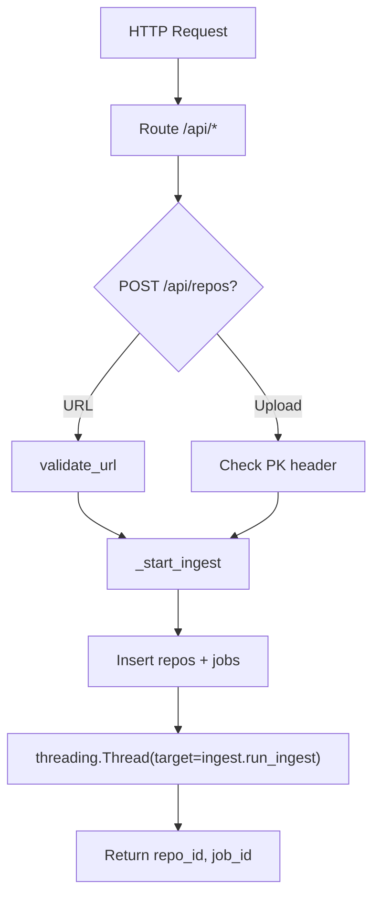
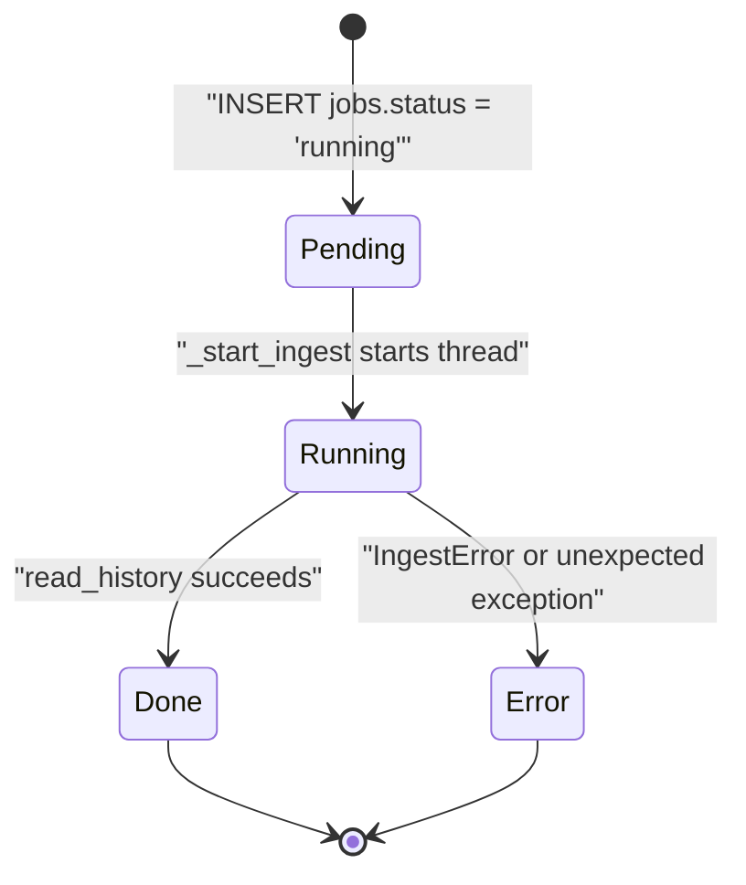
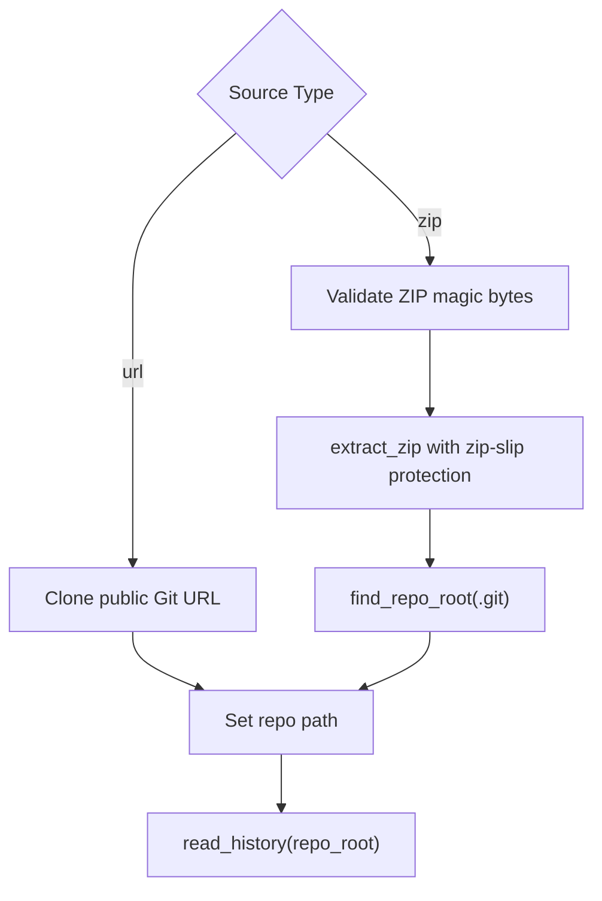
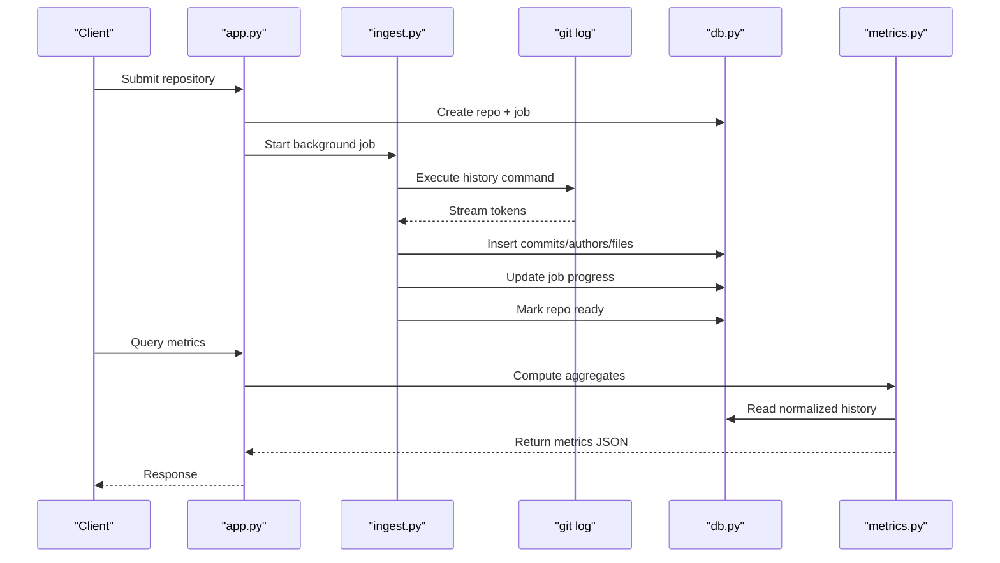
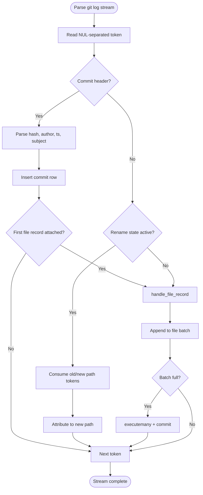
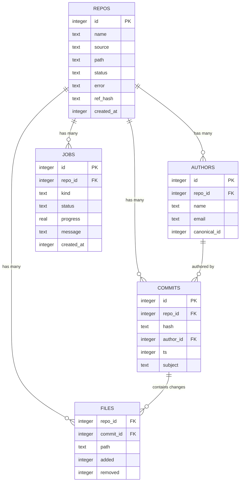
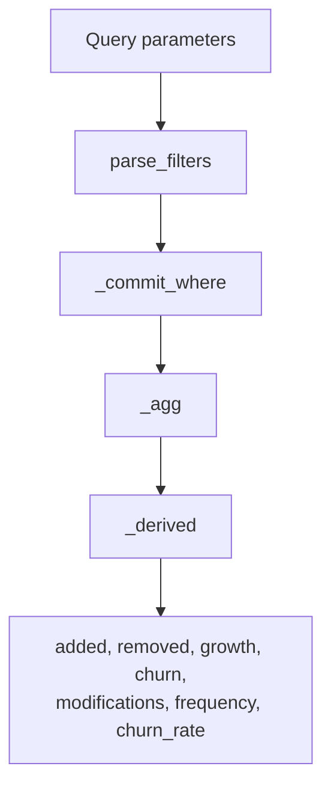
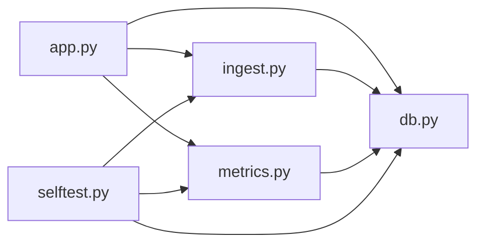

# Core Concepts

<cite>
**Referenced Files in This Document**
- [README.md](file://README.md)
- [app.py](file://app.py)
- [ingest.py](file://ingest.py)
- [metrics.py](file://metrics.py)
- [db.py](file://db.py)
- [selftest.py](file://selftest.py)
</cite>

## Table of Contents
1. [Introduction](#introduction)
2. [Project Structure](#project-structure)
3. [Core Components](#core-components)
4. [Architecture Overview](#architecture-overview)
5. [Detailed Component Analysis](#detailed-component-analysis)
6. [Dependency Analysis](#dependency-analysis)
7. [Performance Considerations](#performance-considerations)
8. [Troubleshooting Guide](#troubleshooting-guide)
9. [Conclusion](#conclusion)

## Introduction
RAT is a local, offline repository analysis tool that ingests Git repositories and computes metrics for files, directories, repositories, commit sets, and authors. It supports two ingestion sources:
- A zip archive containing the full `.git` history.
- A public Git clone URL over HTTP or HTTPS.

The system exposes a lightweight web API, runs background ingestion jobs, persists data in SQLite, and provides metric endpoints for summary, tree, file detail, author ownership, commits, and charts.

Key concepts defined by the codebase:
- Added lines: total lines added across selected commits.
- Removed lines: total lines removed across selected commits.
- Growth: added minus removed.
- Churn: added plus removed.
- Modifications: number of distinct commits where churn is greater than zero.
- Frequency: modifications divided by the number of selected commits.
- Churn rate: churn divided by the number of selected commits.
- Ownership: an author’s churn divided by the object’s total churn.

**Section sources**
- [README.md:1-5](file://README.md#L1-L5)
- [metrics.py:1-21](file://metrics.py#L1-L21)

## Project Structure
The project is small and layered:
- `app.py`: Web server, request routing, job lifecycle, and static asset serving.
- `ingest.py`: Repository cloning, zip extraction, Git history parsing, and background job execution.
- `metrics.py`: Metric calculations, filters, aggregation, and chart generation.
- `db.py`: SQLite schema, connection helpers, and data directory management.
- `selftest.py`: Automated tests validating metric semantics and edge cases.
- `static/`: Frontend assets served by the server.
- `demo/fixture.zip`: Deterministic sample repository used for testing and demonstration.

**Diagram sources**
- [app.py:56-196](file://app.py#L56-L196)
- [ingest.py:356-441](file://ingest.py#L356-L441)
- [metrics.py:138-176](file://metrics.py#L138-L176)
- [db.py:15-62](file://db.py#L15-L62)

**Section sources**
- [app.py:1-30](file://app.py#L1-L30)
- [ingest.py:1-20](file://ingest.py#L1-L20)
- [metrics.py:1-21](file://metrics.py#L1-L21)
- [db.py:1-12](file://db.py#L1-L12)

## Core Components
This section defines the fundamental metrics and how they are computed.

### Fundamental Metrics
- Added lines: Sum of per-file added values under the selected commit set.
- Removed lines: Sum of per-file removed values under the selected commit set.
- Growth: Added minus removed; can be negative when deletions dominate.
- Churn: Added plus removed; measures total line-level activity.
- Modifications: Count of distinct commits where at least one file has nonzero churn.
- Frequency: Modifications divided by the size of the selected commit set; zero when the set is empty.
- Churn rate: Churn divided by the size of the selected commit set; zero when the set is empty.
- Ownership: An author’s churn on an object divided by the object’s total churn; zero when the object’s churn is zero.

These definitions are implemented through SQL aggregation over the `files`, `commits`, and `authors` tables, with derived fields computed after aggregation.

**Section sources**
- [metrics.py:138-168](file://metrics.py#L138-L168)
- [metrics.py:205-225](file://metrics.py#L205-L225)
- [metrics.py:265-307](file://metrics.py#L265-L307)
- [metrics.py:310-361](file://metrics.py#L310-L361)

### Practical Examples
- Repository summary example: For the fixture repository, the full commit set yields 35 added lines, 7 removed lines, growth of 28, churn of 42, 9 commits, 7 modifications, 7 files, and 3 authors.
- Pure rename example: A commit that only renames a file contributes zero added, zero removed, zero churn, and zero modifications, but still counts as one commit in the selected set.
- Rename plus edit example: When a file is renamed and edited, the change is attributed to the new path; the old path sees no churn for that commit.
- Deletion example: Removing lines from a file increases removed and reduces growth; churn remains positive because deletions count toward churn.
- Binary file example: Binary changes are skipped for line metrics; the commit is still stored, but no file rows are inserted for binary entries.
- Author ownership example: On a file with 11 total churn, an author contributing 8 churn has ownership of approximately 8/11, while another contributing 3 churn has ownership of approximately 3/11.

**Section sources**
- [selftest.py:135-147](file://selftest.py#L135-L147)
- [selftest.py:149-165](file://selftest.py#L149-L165)
- [selftest.py:167-184](file://selftest.py#L167-L184)
- [selftest.py:291-301](file://selftest.py#L291-L301)

## Architecture Overview
RAT follows a request-driven architecture with asynchronous background processing:
- The web server handles API requests and serves static frontend assets.
- Repository ingestion is offloaded to background threads so long-running Git operations do not block the server.
- The ingestion pipeline writes normalized history into SQLite.
- The metric engine reads from SQLite and returns structured results for the UI.

**Diagram sources**
- [app.py:306-336](file://app.py#L306-L336)
- [app.py:338-363](file://app.py#L338-L363)
- [ingest.py:356-441](file://ingest.py#L356-L441)
- [ingest.py:181-315](file://ingest.py#L181-L315)
- [db.py:77-86](file://db.py#L77-L86)

## Detailed Component Analysis

### Web Server and API Routing
The server uses Python’s standard library HTTP server with threading support. It routes `/api/*` endpoints to handlers and serves static assets under `/static`. Key responsibilities:
- Normalize and validate requests.
- Convert exceptions into JSON error responses.
- Create repositories from URLs or uploaded zip archives.
- Start background ingestion jobs.
- Expose metrics endpoints for summary, tree, file detail, authors, commits, and charts.
- Provide health, job polling, and repository listing endpoints.

**Diagram sources**
- [app.py:73-96](file://app.py#L73-L96)
- [app.py:121-196](file://app.py#L121-L196)
- [app.py:306-336](file://app.py#L306-L336)
- [app.py:338-363](file://app.py#L338-L363)

**Section sources**
- [app.py:56-96](file://app.py#L56-L96)
- [app.py:121-196](file://app.py#L121-L196)
- [app.py:306-336](file://app.py#L306-L336)
- [app.py:338-363](file://app.py#L338-L363)
- [app.py:443-491](file://app.py#L443-L491)

### Background Job Processing System
Background ingestion is implemented using daemon threads. Each ingestion job:
- Creates a repo row with status `running`.
- Creates a job row with kind `ingest`, status `running`, and initial progress.
- Runs `ingest.run_ingest` in a separate thread.
- Updates job progress and repo status during ingestion.
- Marks the job done and repo ready on success.
- Marks both job and repo as error on failure, cleaning partial data.

Concurrency model:
- Multiple ingestion jobs can run concurrently because each uses its own database connection and repository directory.
- SQLite WAL mode allows readers to coexist with writers.
- Startup recovery marks stale running jobs as interrupted.

**Diagram sources**
- [app.py:306-336](file://app.py#L306-L336)
- [ingest.py:320-349](file://ingest.py#L320-L349)
- [ingest.py:356-441](file://ingest.py#L356-L441)
- [ingest.py:443-458](file://ingest.py#L443-L458)
- [db.py:77-86](file://db.py#L77-L86)

**Section sources**
- [app.py:306-336](file://app.py#L306-L336)
- [ingest.py:320-349](file://ingest.py#L320-L349)
- [ingest.py:356-441](file://ingest.py#L356-L441)
- [ingest.py:443-458](file://ingest.py#L443-L458)

### Repository Ingestion Process
RAT supports two ingestion sources:

#### Zip Archive Ingestion
- Validates the uploaded body as a ZIP archive by checking the ZIP magic bytes.
- Extracts safely with zip-slip protection, rejecting paths that escape the destination directory.
- Locates the repository root by finding `.git` at the archive root, inside a single top-level folder, or one level deeper.
- Stores the relative path under the data directory.

#### Public Git URL Ingestion
- Validates that the URL uses HTTP or HTTPS and has a network location.
- Clones the repository into a dedicated directory under the data directory.
- Sets the repo path to a stable relative location.

Both paths then proceed to history parsing.

**Diagram sources**
- [app.py:338-363](file://app.py#L338-L363)
- [ingest.py:70-86](file://ingest.py#L70-L86)
- [ingest.py:91-143](file://ingest.py#L91-L143)
- [ingest.py:356-398](file://ingest.py#L356-L398)

**Section sources**
- [app.py:338-363](file://app.py#L338-L363)
- [ingest.py:70-86](file://ingest.py#L70-L86)
- [ingest.py:91-143](file://ingest.py#L91-L143)
- [ingest.py:356-398](file://ingest.py#L356-L398)

### Data Flow: Cloning Through History Parsing to Metrics
The end-to-end flow is:
1. Client submits a repository via URL or zip upload.
2. Server creates repo and job records and starts a background thread.
3. Ingestion clones or extracts the repository.
4. Ingestion runs `git log` with a custom format producing NUL-separated tokens.
5. Tokens are parsed into commits, authors, and file change rows.
6. Rows are batch-inserted into SQLite.
7. Job progress is updated periodically.
8. On completion, the repo is marked ready and the job is done.
9. Metrics endpoints read from SQLite and compute aggregates.

**Diagram sources**
- [app.py:306-336](file://app.py#L306-L336)
- [ingest.py:181-315](file://ingest.py#L181-L315)
- [ingest.py:356-441](file://ingest.py#L356-L441)
- [metrics.py:138-176](file://metrics.py#L138-L176)

**Section sources**
- [ingest.py:181-315](file://ingest.py#L181-L315)
- [ingest.py:356-441](file://ingest.py#L356-L441)
- [metrics.py:138-176](file://metrics.py#L138-L176)

### Commit History Parsing Logic
The history parser consumes `git log` output in a streaming fashion:
- Commits start with a special token carrying hash, author name, author email, timestamp, and subject.
- File change records follow commit headers.
- Renames are represented by an empty path field followed by old and new path tokens; attribution goes to the new path.
- Binary files are marked with `-` instead of numeric line counts and are skipped for metrics.
- Commits are inserted first, then file rows are batched and committed in groups.

**Diagram sources**
- [ingest.py:159-176](file://ingest.py#L159-L176)
- [ingest.py:181-315](file://ingest.py#L181-L315)

**Section sources**
- [ingest.py:159-176](file://ingest.py#L159-L176)
- [ingest.py:181-315](file://ingest.py#L181-L315)

### SQLite Schema Relationships
The schema models repositories, authors, commits, files, and jobs with clear relationships:
- `repos`: Top-level repository metadata, including source type, path, status, reference hash, and creation time.
- `authors`: Per-repository author identities with optional canonical identity merging.
- `commits`: Per-repository commits linked to an author and timestamped.
- `files`: Per-commit file changes with added and removed line counts; renames are attributed to the final path.
- `jobs`: Background ingestion tasks with progress and status.

Indexes optimize queries by commit ID, file path, commit timestamp, and commit hash.

**Diagram sources**
- [db.py:15-62](file://db.py#L15-L62)

**Section sources**
- [db.py:15-62](file://db.py#L15-L62)

### Metric Computation and Filters
The metric engine supports:
- Date range filters using epoch timestamps (`from` inclusive, `to` exclusive).
- Manual commit selection using exact hashes or prefixes.
- Author filtering using canonical author identity.
- Path matching for files and directory subtrees without using unsafe `LIKE` patterns.
- Aggregation over commits and files to compute added, removed, modifications, frequency, churn, and churn rate.
- Ownership calculation per author per object.

**Diagram sources**
- [metrics.py:50-78](file://metrics.py#L50-L78)
- [metrics.py:91-124](file://metrics.py#L91-L124)
- [metrics.py:138-168](file://metrics.py#L138-L168)

**Section sources**
- [metrics.py:50-78](file://metrics.py#L50-L78)
- [metrics.py:91-124](file://metrics.py#L91-L124)
- [metrics.py:138-168](file://metrics.py#L138-L168)
- [metrics.py:205-225](file://metrics.py#L205-L225)
- [metrics.py:265-307](file://metrics.py#L265-L307)
- [metrics.py:310-361](file://metrics.py#L310-L361)

## Dependency Analysis
The main dependencies are:
- `app.py` depends on `db`, `ingest`, and `metrics`.
- `ingest.py` depends on `db` and the external `git` CLI.
- `metrics.py` depends on `db`.
- `selftest.py` imports all core modules to validate behavior against the fixture repository.

**Diagram sources**
- [app.py:28-30](file://app.py#L28-L30)
- [ingest.py:30-31](file://ingest.py#L30-L31)
- [selftest.py:37-39](file://selftest.py#L37-L39)

**Section sources**
- [app.py:28-30](file://app.py#L28-L30)
- [ingest.py:30-31](file://ingest.py#L30-L31)
- [selftest.py:37-39](file://selftest.py#L37-L39)

## Performance Considerations
- SQLite WAL mode improves concurrency by allowing readers to proceed while writers update the database.
- Busy timeout prevents immediate failures under contention.
- File rows are inserted in batches to reduce transaction overhead.
- Progress updates are throttled to avoid excessive database writes during large histories.
- Git commands use timeouts to prevent hanging operations.
- Maximum hash filter length is limited to prevent overly large query clauses.
- Directory path matching avoids `LIKE` with user input to prevent escaping issues and performance problems.

[No sources needed since this section provides general guidance]

## Troubleshooting Guide
Common operational issues and their handling:
- Occupied ports: The server tries multiple ports and prints the actual bound address.
- Missing Git: Ensure `git` is available on the system PATH because cloning and history extraction require it.
- Invalid ZIP uploads: The server checks the ZIP magic bytes and rejects non-ZIP payloads.
- Unsafe ZIP paths: Zip-slip protection raises ingestion errors for path traversal attempts.
- Invalid Git URLs: Only HTTP and HTTPS URLs with a valid network location are accepted.
- Stale jobs after restart: Startup recovery marks running jobs and pending/running repos as interrupted.
- Resetting state: Deleting the data directory removes the SQLite database and ingested repositories.

**Section sources**
- [app.py:443-491](file://app.py#L443-L491)
- [README.md:36-40](file://README.md#L36-L40)
- [app.py:351-363](file://app.py#L351-L363)
- [ingest.py:91-143](file://ingest.py#L91-L143)
- [ingest.py:70-86](file://ingest.py#L70-L86)
- [ingest.py:443-458](file://ingest.py#L443-L458)

## Conclusion
RAT provides a focused, standards-library-only workflow for ingesting Git repositories and computing meaningful contribution metrics. Its design separates concerns clearly:
- The web server manages requests and background jobs.
- The ingestion pipeline normalizes Git history into a relational schema.
- The metric engine computes consistent, filterable metrics for objects and authors.
- SQLite stores normalized data with indexes optimized for common queries.

The result is a transparent, testable system where every metric definition maps directly to SQL aggregation and derived calculations, validated by automated tests against a deterministic fixture.

[No sources needed since this section summarizes without analyzing specific files]