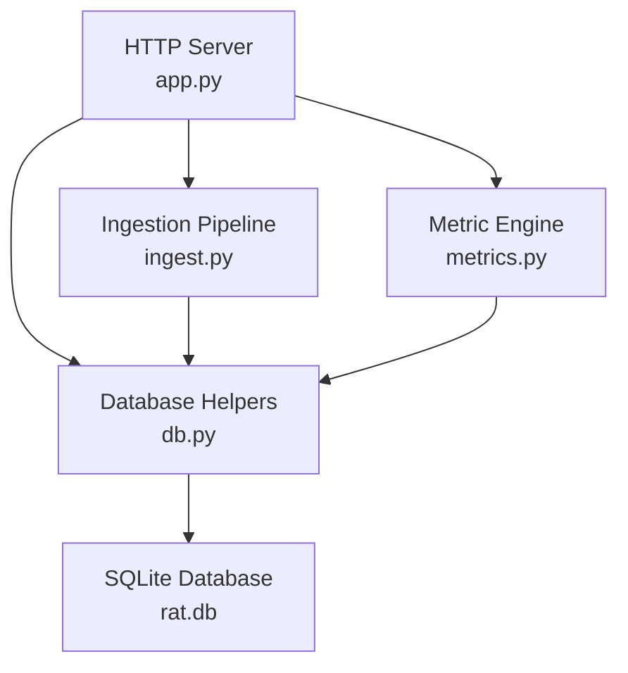
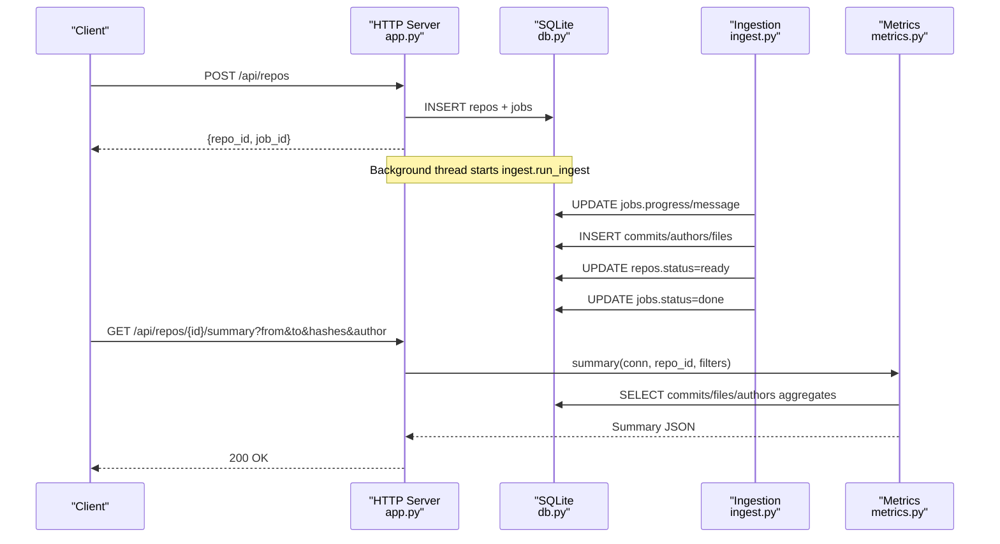
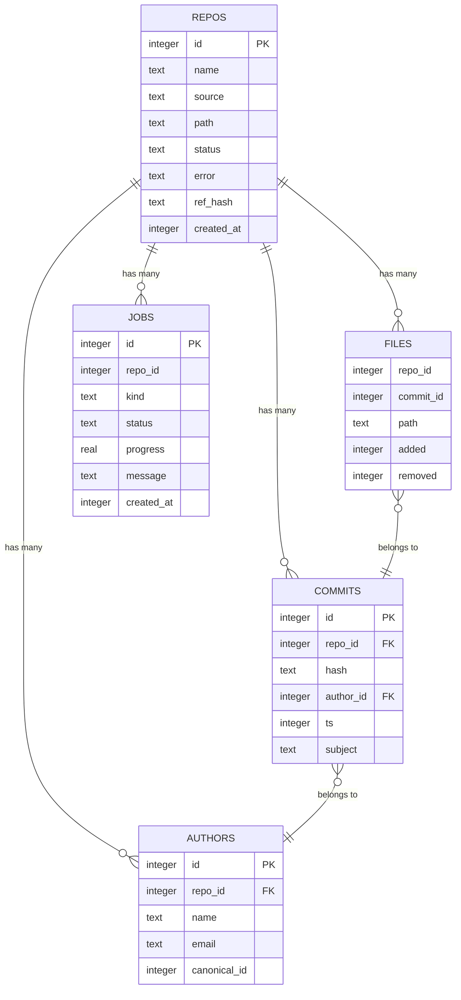
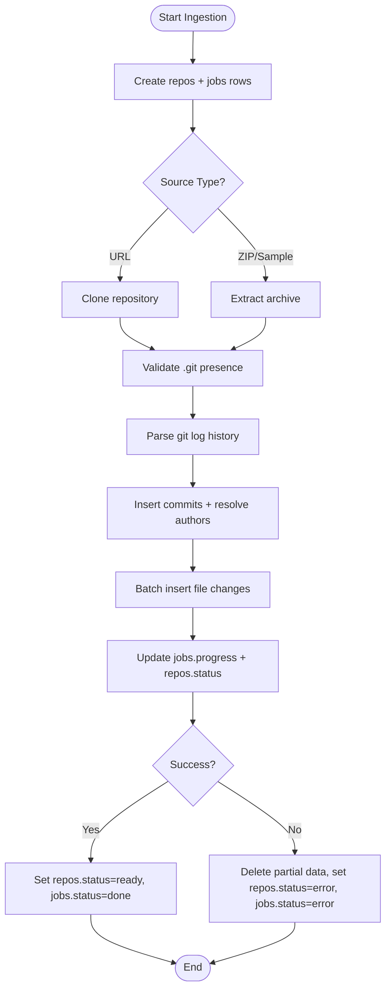
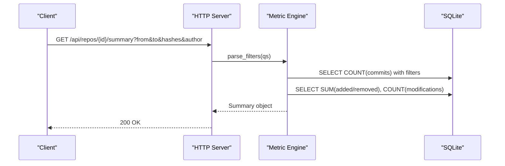
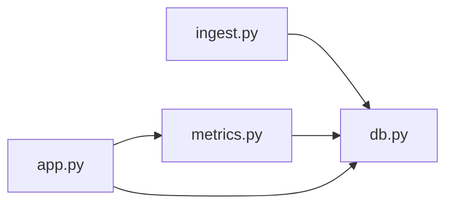

# Data Models and Schema

<cite>
**Referenced Files in This Document**
- [db.py](file://db.py)
- [ingest.py](file://ingest.py)
- [app.py](file://app.py)
- [metrics.py](file://metrics.py)
- [selftest.py](file://selftest.py)
- [README.md](file://README.md)
</cite>

## Table of Contents
1. [Introduction](#introduction)
2. [Project Structure](#project-structure)
3. [Core Components](#core-components)
4. [Architecture Overview](#architecture-overview)
5. [Detailed Component Analysis](#detailed-component-analysis)
6. [Dependency Analysis](#dependency-analysis)
7. [Performance Considerations](#performance-considerations)
8. [Troubleshooting Guide](#troubleshooting-guide)
9. [Conclusion](#conclusion)

## Introduction
This document describes the SQLite data model used by the Repo Analysis Tool. It explains the entity relationships between repositories, authors, commits, files, and jobs; documents field definitions, types, keys, constraints, and indexing; outlines database-level validation and business rules; and shows how data flows through ingestion and querying. It also covers WAL mode configuration and provides example query patterns that the schema supports.

The repository is a local, offline dashboard that ingests Git repositories from URLs or zip archives and computes metrics such as added/removed lines, growth, churn, modifications, churn rate, and ownership across files, directories, repositories, commit sets, and authors.

**Section sources**
- [README.md:1-46](file://README.md#L1-L46)

## Project Structure
At the database layer, the schema and connection helpers live in one module, while ingestion, API routing, and metric queries are implemented in separate modules. The application initializes the database on startup, runs background ingestion jobs, and exposes HTTP endpoints that translate user filters into SQL against the schema.

**Diagram sources**
- [app.py:28-30](file://app.py#L28-L30)
- [db.py:77-86](file://db.py#L77-L86)
- [ingest.py:30-31](file://ingest.py#L30-L31)
- [metrics.py:1-21](file://metrics.py#L1-L21)

**Section sources**
- [app.py:28-30](file://app.py#L28-L30)
- [db.py:77-86](file://db.py#L77-L86)
- [ingest.py:30-31](file://ingest.py#L30-L31)
- [metrics.py:1-21](file://metrics.py#L1-L21)

## Core Components
The database contains five core tables:

- repos: Repository metadata and lifecycle state.
- authors: Author identities scoped to a repository, with optional canonical identity merging.
- commits: Non-merge commits linked to a repository and author.
- files: Per-commit file change records (added/removed line counts), including rename handling.
- jobs: Background ingestion job progress and status.

Key design points:
- All foreign-key-like relationships are enforced via application logic and indexes rather than explicit SQLite foreign key constraints.
- Authors are deduplicated per repository using a unique constraint on name and email, and merged identities are supported via a canonical_id column.
- Commits exclude merge commits during ingestion.
- Binary files are excluded from line-change measurements but still contribute to commit counts.
- Jobs track ingestion progress and allow recovery after server restarts.

**Section sources**
- [db.py:15-62](file://db.py#L15-L62)
- [ingest.py:181-315](file://ingest.py#L181-L315)
- [metrics.py:179-183](file://metrics.py#L179-L183)

## Architecture Overview
The system uses SQLite with Write-Ahead Logging enabled for concurrent access. The HTTP server creates repo and job rows, then starts background threads that clone or extract repositories and parse Git history into commits, authors, and files. Metric queries combine these tables to compute summaries, tree listings, file details, author breakdowns, charts, and paginated commit lists.

**Diagram sources**
- [app.py:306-336](file://app.py#L306-L336)
- [ingest.py:356-441](file://ingest.py#L356-L441)
- [metrics.py:205-225](file://metrics.py#L205-L225)

## Detailed Component Analysis

### Entity Relationship Model
The logical model centers on repositories. Each repository has many authors, commits, files, and jobs. Commits link to authors; files link to commits and repositories.

**Diagram sources**
- [db.py:15-62](file://db.py#L15-L62)

#### Table Definitions and Constraints

- repos
  - Primary key: id (autoincrement).
  - Fields: name, source, path, status, error, ref_hash, created_at.
  - Constraints: Not-null fields include name, source, path, status, created_at; status defaults to pending; error is nullable.
  - Purpose: Tracks repository metadata, source type, filesystem path, lifecycle status, and reference hash.

- authors
  - Primary key: id (autoincrement).
  - Fields: repo_id, name, email, canonical_id.
  - Constraints: Unique(repo_id, name, email); canonical_id is nullable and points to another author row within the same repository when identities are merged.
  - Purpose: Stores author identities scoped to a repository and supports manual identity merging.

- commits
  - Primary key: id (autoincrement).
  - Fields: repo_id, hash, author_id, ts, subject.
  - Constraints: Not-null fields include repo_id, hash, author_id, ts; subject is nullable.
  - Purpose: Stores non-merge commits with committer timestamp and optional subject.

- files
  - Composite key: None declared at schema level; logically identified by (repo_id, commit_id, path).
  - Fields: repo_id, commit_id, path, added, removed.
  - Constraints: Not-null fields include repo_id, commit_id, path, added, removed.
  - Purpose: Records per-commit file changes; binary files are not inserted; renames are attributed to the new path.

- jobs
  - Primary key: id (autoincrement).
  - Fields: repo_id, kind, status, progress, message, created_at.
  - Constraints: Not-null fields include kind, status, progress, created_at; status defaults to running; progress defaults to 0.
  - Purpose: Tracks ingestion job lifecycle and progress.

**Section sources**
- [db.py:15-62](file://db.py#L15-L62)

#### Indexing Strategy
Indexes are defined to optimize common query patterns:

- idx_files_commit: (repo_id, commit_id)
  - Optimizes joins between files and commits for aggregation and chart queries.
- idx_files_path: (repo_id, path)
  - Optimizes file detail and directory subtree queries.
- idx_commits_ts: (repo_id, ts)
  - Optimizes date-range filtering and time-series chart bucketing.
- idx_commits_hash: (repo_id, hash)
  - Optimizes exact or prefix-based commit selection via hashes filter.

These indexes support:
- Aggregation over files joined to commits.
- Path-based filtering for files and directories.
- Commit set filtering by timestamps and hashes.
- Efficient pagination and search over commits.

**Section sources**
- [db.py:58-62](file://db.py#L58-L62)
- [metrics.py:91-124](file://metrics.py#L91-L124)
- [metrics.py:463-543](file://metrics.py#L463-L543)

#### Validation Rules and Business Logic at the Database Level
- Unique author identity per repository:
  - Enforced by UNIQUE(repo_id, name, email) on authors.
  - Application logic inserts OR IGNORE and then selects to resolve IDs consistently.
- Canonical author merging:
  - canonical_id allows multiple author rows to represent the same identity.
  - Query logic uses COALESCE(canonical_id, id) to aggregate by canonical identity.
- Commit set semantics:
  - Date range: ts >= from AND ts < to.
  - Hash filter: exact 12-character prefixes and short prefixes combined with LIKE.
  - Author filter: resolved via canonical mapping.
- File measurement rules:
  - Binary files are excluded from added/removed counts and modification counts.
  - Pure renames produce zero-churn entries attributed to the new path.
- Job lifecycle:
  - Jobs start as running and transition to done or error.
  - On failure, partial data for the repository is cleaned up and statuses updated.

**Section sources**
- [db.py:26-33](file://db.py#L26-L33)
- [metrics.py:50-78](file://metrics.py#L50-L78)
- [metrics.py:91-124](file://metrics.py#L91-L124)
- [ingest.py:221-236](file://ingest.py#L221-L236)
- [ingest.py:332-349](file://ingest.py#L332-L349)

#### Data Flow During Ingestion
1. HTTP request creates a repo row and a job row.
2. Background thread clones or extracts the repository.
3. Git history is parsed in a single pass:
   - Commits are inserted with author resolution.
   - File change records are batched and inserted; renames are handled.
   - Binary files are skipped for line metrics.
4. Progress updates are written to jobs and repos.
5. On success, repo status becomes ready and job status becomes done.
6. On failure, partial data is deleted and statuses become error.

**Diagram sources**
- [app.py:306-336](file://app.py#L306-L336)
- [ingest.py:356-441](file://ingest.py#L356-L441)

#### Data Flow During Querying
1. Client sends an API request with filters (date range, hashes, author).
2. Server validates parameters and builds a commit-set WHERE clause.
3. Metric engine executes aggregated queries joining commits, authors, and files.
4. Results are returned as JSON summaries, trees, file details, author tables, charts, or paginated commit lists.

**Diagram sources**
- [metrics.py:50-78](file://metrics.py#L50-L78)
- [metrics.py:205-225](file://metrics.py#L205-L225)

### WAL Mode Configuration and Benefits
WAL (Write-Ahead Logging) is enabled for every connection:
- journal_mode = WAL
- synchronous = NORMAL
- busy_timeout configured for contention handling

Benefits:
- Readers can proceed while writers update the database.
- Reduces locking conflicts during ingestion and concurrent API requests.
- Improves throughput for read-heavy workloads typical of dashboard queries.

Connection setup includes:
- Creating the data directory if missing.
- Setting row factory to sqlite3.Row for dict-like access.
- Configuring busy timeout and PRAGMAs.

**Section sources**
- [db.py:77-86](file://db.py#L77-L86)

### Example Queries and Supported Operations
Below are representative query patterns derived from the metric engine and API handlers. These illustrate how the schema supports filtering and aggregation.

- Repository summary
  - Count commits in the selected commit set.
  - Sum added/removed lines across files.
  - Count distinct modified files and distinct canonical authors.
  - Compute frequency and churn rate based on commit set size.

- Tree listing
  - List immediate children under a directory path.
  - For each child, compute added/removed/modifications relative to the commit set.
  - Use path substring matching for directory subtrees.

- File detail
  - Aggregate added/removed/modifications for a specific file path.
  - Break down contributions by canonical author identity.
  - Compute ownership as fraction of total churn.

- Authors table
  - Group commits and churn by canonical author identity.
  - Include all identities belonging to the canonical group.
  - Compute ownership as fraction of total churn.

- Charts
  - Churn chart: Bucket commits by day/week/month and sum added/removed per bucket.
  - Top files: Rank files by churn within the commit set.
  - Author share: Rank authors by churn within the commit set.

- Commits list
  - Paginate commits ordered by timestamp and id.
  - Optional full-text-like search on hash prefix or subject.

Filter composition:
- Date range: ts >= from AND ts < to.
- Hashes: Exact 12-character prefixes and short prefixes combined with LIKE.
- Author: Resolved via canonical mapping.
- Path: Exact match for files; substring match for directories.

**Section sources**
- [metrics.py:91-124](file://metrics.py#L91-L124)
- [metrics.py:138-168](file://metrics.py#L138-L168)
- [metrics.py:205-225](file://metrics.py#L205-L225)
- [metrics.py:228-262](file://metrics.py#L228-L262)
- [metrics.py:265-307](file://metrics.py#L265-L307)
- [metrics.py:310-361](file://metrics.py#L310-L361)
- [metrics.py:463-543](file://metrics.py#L463-L543)
- [metrics.py:399-435](file://metrics.py#L399-L435)

## Dependency Analysis
The database schema is consumed by three main components:

- Ingestion writes:
  - Inserts authors, commits, and files.
  - Updates jobs and repos status.
  - Cleans up partial data on failure.

- API reads:
  - Validates inputs and delegates to metric engine.
  - Returns JSON responses built from aggregated queries.

- Metric engine:
  - Builds WHERE clauses and parameter bindings.
  - Joins commits, authors, and files to compute metrics.
  - Supports path-based and author-based aggregations.

**Diagram sources**
- [ingest.py:30-31](file://ingest.py#L30-L31)
- [app.py:28-30](file://app.py#L28-L30)
- [metrics.py:1-21](file://metrics.py#L1-L21)

**Section sources**
- [ingest.py:356-441](file://ingest.py#L356-L441)
- [app.py:199-240](file://app.py#L199-L240)
- [metrics.py:91-124](file://metrics.py#L91-L124)

## Performance Considerations
- Batched file inserts:
  - File rows are accumulated in memory and flushed in batches to reduce transaction overhead.
- Indexed joins:
  - Indexes on (repo_id, commit_id) and (repo_id, path) accelerate joins and path-based filtering.
- Commit set optimization:
  - Date and hash filters are composed efficiently; short hash prefixes use LIKE with trailing wildcard.
- WAL mode:
  - Allows concurrent readers and writers, improving responsiveness during ingestion.
- Synchronous mode:
  - NORMAL reduces fsync frequency for better write performance while maintaining reasonable durability.

[No sources needed since this section provides general guidance]

## Troubleshooting Guide
Common issues and their database-related causes:

- Stale running jobs after restart:
  - Recovery routine marks running jobs as error and resets repo statuses.
- Zip-slip attacks:
  - Extraction validates paths and rejects unsafe entries before writing.
- Invalid URL or malformed upload:
  - Input validation raises errors before creating repo/job rows.
- Missing fixture:
  - Sample ingestion checks for demo/fixture.zip and returns an error if absent.

Operational tips:
- Ensure git is available for cloning and history extraction.
- Reset state by deleting the data directory if corruption occurs.
- Monitor jobs via API endpoints to track ingestion progress.

**Section sources**
- [ingest.py:443-458](file://ingest.py#L443-L458)
- [ingest.py:91-143](file://ingest.py#L91-L143)
- [ingest.py:70-86](file://ingest.py#L70-L86)
- [app.py:365-381](file://app.py#L365-L381)
- [README.md:36-40](file://README.md#L36-L40)

## Conclusion
The SQLite schema provides a compact, indexed model for repository analysis. It enforces author uniqueness per repository, supports canonical identity merging, excludes binary files from line metrics, and tracks ingestion jobs for reliability. WAL mode and carefully chosen indexes enable efficient concurrent access and fast aggregation queries. The metric engine translates user filters into precise SQL operations over commits, authors, and files, supporting summaries, trees, file details, author breakdowns, charts, and paginated commit lists.

[No sources needed since this section summarizes without analyzing specific files]