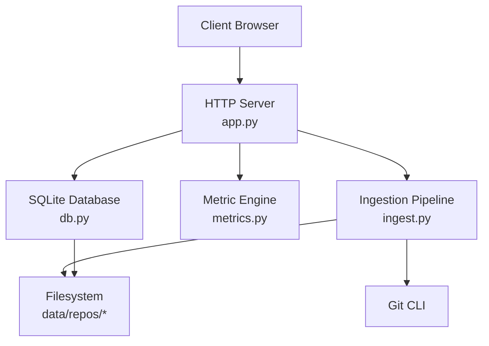
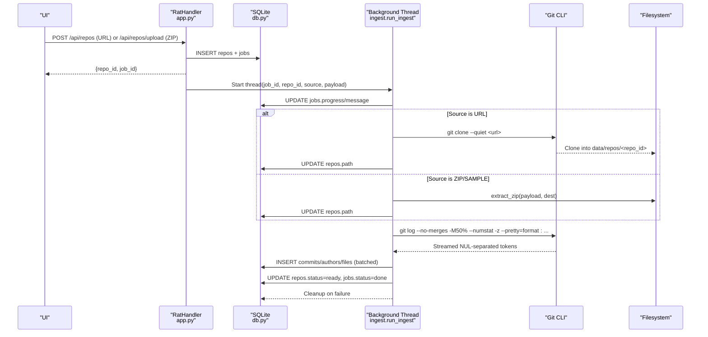
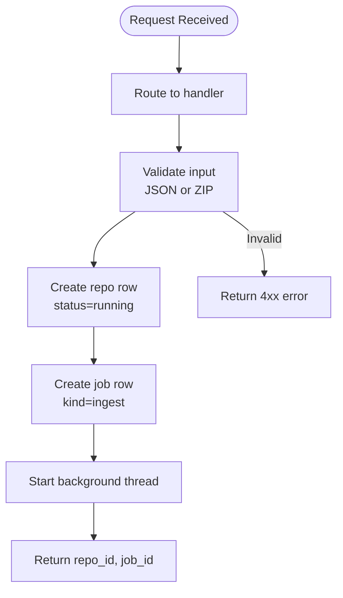
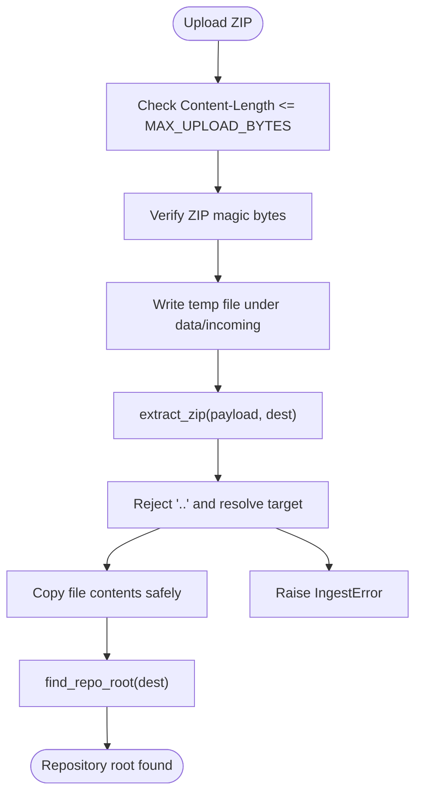
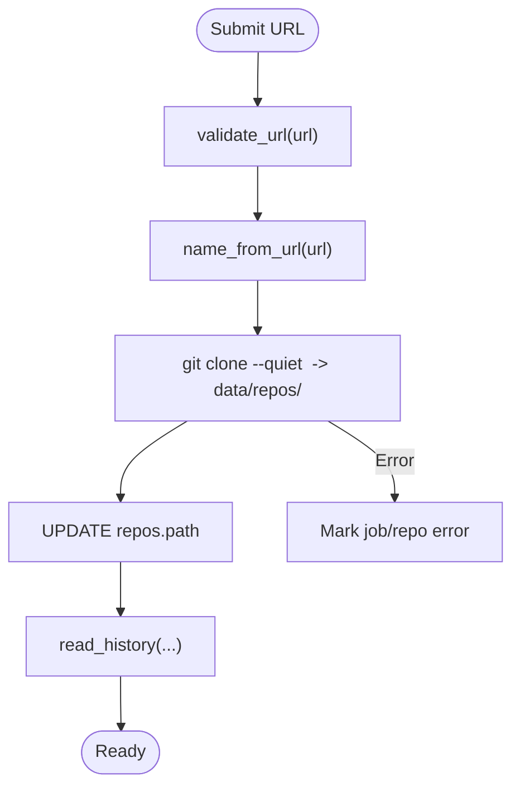
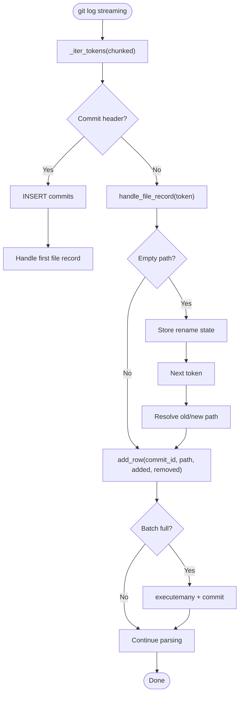
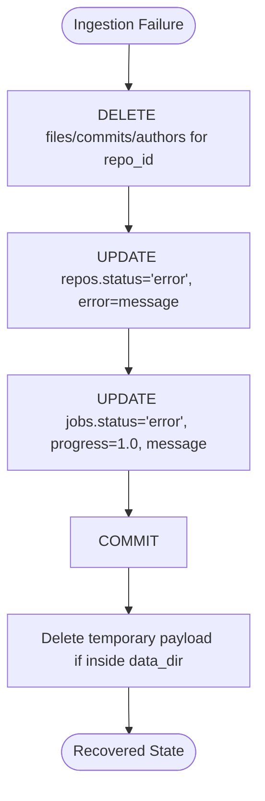
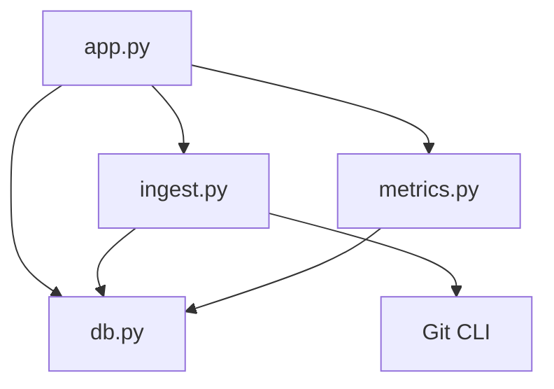

# Repository Ingestion Process

<cite>
**Referenced Files in This Document**   
- [README.md](file://README.md)
- [app.py](file://app.py)
- [ingest.py](file://ingest.py)
- [db.py](file://db.py)
- [metrics.py](file://metrics.py)
</cite>

## Table of Contents
1. [Introduction](#introduction)
2. [Project Structure](#project-structure)
3. [Core Components](#core-components)
4. [Architecture Overview](#architecture-overview)
5. [Detailed Component Analysis](#detailed-component-analysis)
6. [Dependency Analysis](#dependency-analysis)
7. [Performance Considerations](#performance-considerations)
8. [Troubleshooting Guide](#troubleshooting-guide)
9. [Conclusion](#conclusion)

## Introduction
This document explains the complete repository ingestion pipeline for the Repo Analysis Tool. The system accepts repositories through two ingestion methods:
- Zip archive extraction with zip-slip protection, where a `.zip` containing a full Git history (including `.git`) is uploaded and safely extracted.
- Public Git URL cloning, where a public `http://` or `https://` clone URL is cloned using Git.

After acquisition, the system parses Git history into SQLite, computes metrics, and exposes results through a local HTTP API. Background threads handle concurrent ingestion jobs, publish progress, and provide recovery mechanisms when ingestions fail or the server restarts.

The README describes the project as an offline dashboard that ingests Git repositories and computes metrics such as added/removed lines, growth, churn, modifications, churn rate, and ownership across files, directories, repositories, commit sets, and authors. It also documents environment variables, startup behavior, and basic usage.

**Section sources**
- [README.md:1-46](file://README.md#L1-L46)

## Project Structure
The repository is small and focused on a single-purpose web application:
- `app.py`: HTTP server, request routing, job creation, and background thread dispatch.
- `ingest.py`: Ingestion pipeline, including zip extraction, URL validation, Git cloning, and history parsing.
- `db.py`: SQLite schema, connection helpers, data directory management, and initialization.
- `metrics.py`: Metric computation, filtering, aggregation, and chart generation.
- `static/`: Frontend assets served by the server.
- `demo/`: Sample fixture generator and bundled sample archive.

**Diagram sources**
- [app.py:28-30](file://app.py#L28-L30)
- [db.py:15-62](file://db.py#L15-L62)
- [ingest.py:30-35](file://ingest.py#L30-L35)
- [metrics.py:1-21](file://metrics.py#L1-L21)

**Section sources**
- [app.py:1-492](file://app.py#L1-L492)
- [ingest.py:1-458](file://ingest.py#L1-L458)
- [db.py:1-100](file://db.py#L1-L100)
- [metrics.py:1-544](file://metrics.py#L1-L544)

## Core Components
- HTTP API layer (`app.py`): Routes requests, validates inputs, creates repository and job records, starts background ingestion threads, and serves static assets.
- Ingestion pipeline (`ingest.py`): Validates URLs, extracts zip archives safely, clones public repositories, reads Git history efficiently, and updates database tables.
- Database layer (`db.py`): Initializes schema, manages connections with WAL mode, and provides path helpers anchored to a data directory.
- Metric engine (`metrics.py`): Parses filters, aggregates changes, computes derived metrics, and generates charts and lists.

Key responsibilities:
- Input validation and error mapping to JSON responses.
- Safe file handling and zip-slip protection.
- Concurrent job execution with progress tracking.
- Efficient Git history parsing using a single-pass stream.
- Robust error handling and recovery on failure or restart.

**Section sources**
- [app.py:47-91](file://app.py#L47-L91)
- [ingest.py:38-87](file://ingest.py#L38-L87)
- [db.py:15-86](file://db.py#L15-L86)
- [metrics.py:30-78](file://metrics.py#L30-L78)

## Architecture Overview
The ingestion workflow begins at the HTTP API and proceeds through background processing to database storage.

**Diagram sources**
- [app.py:306-336](file://app.py#L306-L336)
- [app.py:338-363](file://app.py#L338-L363)
- [ingest.py:356-441](file://ingest.py#L356-L441)
- [ingest.py:181-315](file://ingest.py#L181-L315)
- [db.py:15-62](file://db.py#L15-L62)

## Detailed Component Analysis

### HTTP API and Job Creation
The API handles repository submission via:
- `/api/repos` (POST): Accepts a JSON body with `url` and optional `name`. Validates the URL and starts ingestion.
- `/api/repos/upload` (POST): Accepts a zip archive upload. Validates content length and magic bytes, writes to an incoming directory, and starts ingestion.
- `/api/repos/sample` (POST): Loads a bundled sample fixture if present.

For each submission:
- A repository row is inserted with status `running`.
- A job row is inserted with kind `ingest`, status `running`, and initial progress `0`.
- A daemon thread runs `ingest.run_ingest` with the job and repository identifiers.

Progress polling endpoints:
- `/api/jobs/<id>`: Returns job details.
- `/api/repos/<id>/job`: Returns the latest job for a repository.

Error handling:
- All exceptions are wrapped; unexpected errors return JSON 500.
- Known API errors map to appropriate HTTP statuses.

**Diagram sources**
- [app.py:121-196](file://app.py#L121-L196)
- [app.py:306-336](file://app.py#L306-L336)
- [app.py:338-363](file://app.py#L338-L363)

**Section sources**
- [app.py:121-196](file://app.py#L121-L196)
- [app.py:279-304](file://app.py#L279-L304)
- [app.py:306-336](file://app.py#L306-L336)
- [app.py:338-363](file://app.py#L338-L363)
- [app.py:400-424](file://app.py#L400-L424)

### Zip Archive Extraction with Zip-Slip Protection
Zip ingestion flow:
- Upload size is enforced by `MAX_UPLOAD_BYTES`.
- Uploaded body must start with ZIP magic bytes (`PK`).
- Temporary file is written under `data/incoming`.
- `extract_zip` performs safe extraction:
  - Normalizes paths and rejects entries with unsafe components like `..`.
  - Resolves target paths and ensures they remain within the destination directory.
  - Skips directories and copies file contents safely.
- After extraction, `find_repo_root` locates the repository root by searching for `.git` at multiple levels.

Security considerations:
- Zip-slip attack prevention by validating path components and resolved targets.
- Strict content-type and size checks prevent oversized or malformed uploads.
- Temporary files are cleaned up after ingestion unless they reside outside the data directory.

**Diagram sources**
- [app.py:351-363](file://app.py#L351-L363)
- [ingest.py:91-143](file://ingest.py#L91-L143)

**Section sources**
- [app.py:351-363](file://app.py#L351-L363)
- [ingest.py:91-143](file://ingest.py#L91-L143)

### Public Git URL Cloning
URL ingestion flow:
- URL validation ensures scheme is `http` or `https` and includes a network location.
- Name derivation from URL path is used if not provided.
- Cloning uses `git clone --quiet` with a timeout to avoid blocking indefinitely.
- Destination path is set to `data/repos/<repo_id>`.

Network failure handling:
- Git subprocess errors raise `IngestError`, which marks the job and repository as failed.
- Timeouts are handled explicitly for cloning and history reading.

**Diagram sources**
- [app.py:338-349](file://app.py#L338-L349)
- [ingest.py:70-87](file://ingest.py#L70-L87)
- [ingest.py:373-388](file://ingest.py#L373-L388)

**Section sources**
- [app.py:338-349](file://app.py#L338-L349)
- [ingest.py:70-87](file://ingest.py#L70-L87)
- [ingest.py:373-388](file://ingest.py#L373-L388)

### Git History Parsing Optimization
The history parser uses a single-pass approach to minimize memory and CPU overhead:
- Git command: `git log --no-merges --use-mailmap -M50% --numstat -z --pretty=format:<custom_format>`.
- Output format:
  - Records are NUL-separated.
  - Commit headers start with a control character and include hash, author name, email, timestamp, and subject.
  - File change records follow immediately after the commit header.
  - Renames are indicated by empty path fields followed by old and new paths.
  - Binary files are marked with `-` instead of numeric stats and are skipped for line counting.

Streaming tokenization:
- `_iter_tokens` reads large chunks and yields NUL-separated tokens without loading the entire output into memory.
- Batched inserts: File rows are accumulated and committed in batches of `BATCH_ROWS` to reduce transaction overhead.
- Progress throttling: Progress updates occur every `PROGRESS_EVERY` commits to avoid excessive database writes.

Complexity considerations:
- Time complexity is linear in the number of commits and file changes due to single-pass parsing.
- Space complexity is bounded by batch size and token buffer, avoiding full-history materialization.

**Diagram sources**
- [ingest.py:159-176](file://ingest.py#L159-L176)
- [ingest.py:181-315](file://ingest.py#L181-L315)

**Section sources**
- [ingest.py:1-20](file://ingest.py#L1-L20)
- [ingest.py:159-176](file://ingest.py#L159-L176)
- [ingest.py:181-315](file://ingest.py#L181-L315)

### Data Validation Steps
Validation occurs at multiple layers:
- URL validation: Ensures scheme and netloc are valid for public cloning.
- Upload validation: Checks content length and ZIP magic bytes.
- Path validation: Rejects unsafe paths during zip extraction and normalizes metric query paths.
- Filter validation: Enforces integer ranges, hash formats, and path constraints for metric queries.

Error mapping:
- User-facing errors raise `IngestError` or `FilterError`, mapped to JSON responses with appropriate HTTP statuses.

**Section sources**
- [ingest.py:70-87](file://ingest.py#L70-L87)
- [ingest.py:91-143](file://ingest.py#L91-L143)
- [metrics.py:40-88](file://metrics.py#L40-L88)
- [app.py:400-424](file://app.py#L400-L424)

### Recovery Mechanisms for Failed Ingestions
Recovery strategies:
- On ingestion failure, `_fail` deletes partially ingested rows for the repository and marks both job and repository as `error`.
- On server restart, `recover_stale_jobs` resets running jobs and pending/running repositories to error states, preventing orphaned work.
- Temporary payloads inside the data directory are cleaned up after successful or failed ingestion.

**Diagram sources**
- [ingest.py:332-349](file://ingest.py#L332-L349)
- [ingest.py:432-441](file://ingest.py#L432-L441)
- [ingest.py:443-458](file://ingest.py#L443-L458)

**Section sources**
- [ingest.py:332-349](file://ingest.py#L332-L349)
- [ingest.py:432-441](file://ingest.py#L432-L441)
- [ingest.py:443-458](file://ingest.py#L443-L458)

### Handling Large Repositories and Network Failures
Large repositories:
- Streaming tokenization avoids loading entire Git output into memory.
- Batched inserts reduce transaction overhead.
- Progress updates are throttled to balance responsiveness and performance.
- Binary files are skipped for line counting to avoid bloating metrics.

Network failures:
- Git subprocess errors raise `IngestError`, which triggers failure handling.
- Cloning has a maximum timeout to prevent indefinite hangs.
- History reading has explicit process cleanup and stderr capture for diagnostics.

**Section sources**
- [ingest.py:159-176](file://ingest.py#L159-L176)
- [ingest.py:181-315](file://ingest.py#L181-L315)
- [ingest.py:373-388](file://ingest.py#L373-L388)

## Dependency Analysis
The ingestion pipeline depends on several modules:
- `app.py` imports `db`, `ingest`, and `metrics`.
- `ingest.py` imports `db` for database operations.
- `metrics.py` operates on the database schema defined in `db.py`.
- Git CLI is invoked externally for cloning and history extraction.

**Diagram sources**
- [app.py:28-30](file://app.py#L28-L30)
- [ingest.py:30-35](file://ingest.py#L30-L35)
- [db.py:15-62](file://db.py#L15-L62)

**Section sources**
- [app.py:28-30](file://app.py#L28-L30)
- [ingest.py:30-35](file://ingest.py#L30-L35)
- [db.py:15-62](file://db.py#L15-L62)

## Performance Considerations
- Use WAL mode and busy timeouts in SQLite to allow concurrent readers during ingestion.
- Batch database inserts to reduce transaction overhead.
- Stream Git output to avoid high memory usage for large histories.
- Throttle progress updates to minimize database write frequency.
- Skip binary files to keep metrics focused on textual changes.

[No sources needed since this section provides general guidance]

## Troubleshooting Guide
Common issues and resolutions:
- Port conflicts: The server tries multiple ports automatically and prints the actual URL at startup.
- Missing Git: Ensure Git is installed and available on PATH.
- Corrupted or invalid ZIP: The server validates ZIP magic bytes and raises a user-friendly error.
- Invalid URL: Only public `http://` or `https://` URLs are accepted.
- Stale jobs after restart: The server resets running jobs and repositories to error states on startup.

Diagnostics:
- Job status and messages can be polled via `/api/jobs/<id>`.
- Latest job per repository can be retrieved via `/api/repos/<id>/job`.
- Repository list includes status, error messages, and counts for commits, files, and authors.

**Section sources**
- [README.md:36-40](file://README.md#L36-L40)
- [app.py:444-487](file://app.py#L444-L487)
- [app.py:279-304](file://app.py#L279-L304)
- [app.py:262-277](file://app.py#L262-L277)
- [ingest.py:443-458](file://ingest.py#L443-L458)

## Conclusion
The repository ingestion pipeline combines secure file handling, efficient Git history parsing, and robust background job management. It supports both zip archives and public Git URLs, with comprehensive validation, error handling, and recovery mechanisms. The design emphasizes safety against zip-slip attacks, performance for large repositories, and resilience against network failures. The resulting data is stored in SQLite and exposed through a clear API for analysis and visualization.

[No sources needed since this section summarizes without analyzing specific files]