# Understanding Git Metrics

<cite>
**Referenced Files in This Document**   
- [README.md](file://README.md)
- [app.py](file://app.py)
- [db.py](file://db.py)
- [ingest.py](file://ingest.py)
- [metrics.py](file://metrics.py)
</cite>

## Table of Contents
1. [Introduction](#introduction)
2. [Project Structure](#project-structure)
3. [Core Components](#core-components)
4. [Architecture Overview](#architecture-overview)
5. [Detailed Component Analysis](#detailed-component-analysis)
6. [Dependency Analysis](#dependency-analysis)
7. [Performance Considerations](#performance-considerations)
8. [Troubleshooting Guide](#troubleshooting-guide)
9. [Conclusion](#conclusion)

## Introduction
This document explains how RAT computes and interprets Git metrics. It focuses on the five metric categories defined by the project: added/removed lines, growth, churn, modifications, and ownership. It also covers derived measures such as modification frequency and churn rate, and shows how filters over time, commit hashes, authors, paths, and directories shape the results.

RAT is a local, offline dashboard that ingests Git repositories from a zip archive or public clone URL and computes metrics for every file, directory, repository, commit set, and author. The core computation lives in the metric engine, which aggregates raw per-commit line changes stored in SQLite after ingestion.

**Section sources**
- [README.md:1-6](file://README.md#L1-L6)

## Project Structure
At a high level, RAT consists of:
- A lightweight HTTP server exposing API endpoints for repositories, jobs, metrics, charts, and commits.
- An ingestion pipeline that clones or extracts a repository, runs `git log`, and writes normalized rows into SQLite.
- A database layer defining schema, connection helpers, and indexes.
- A metric engine that applies filters and computes aggregated metrics and charts.

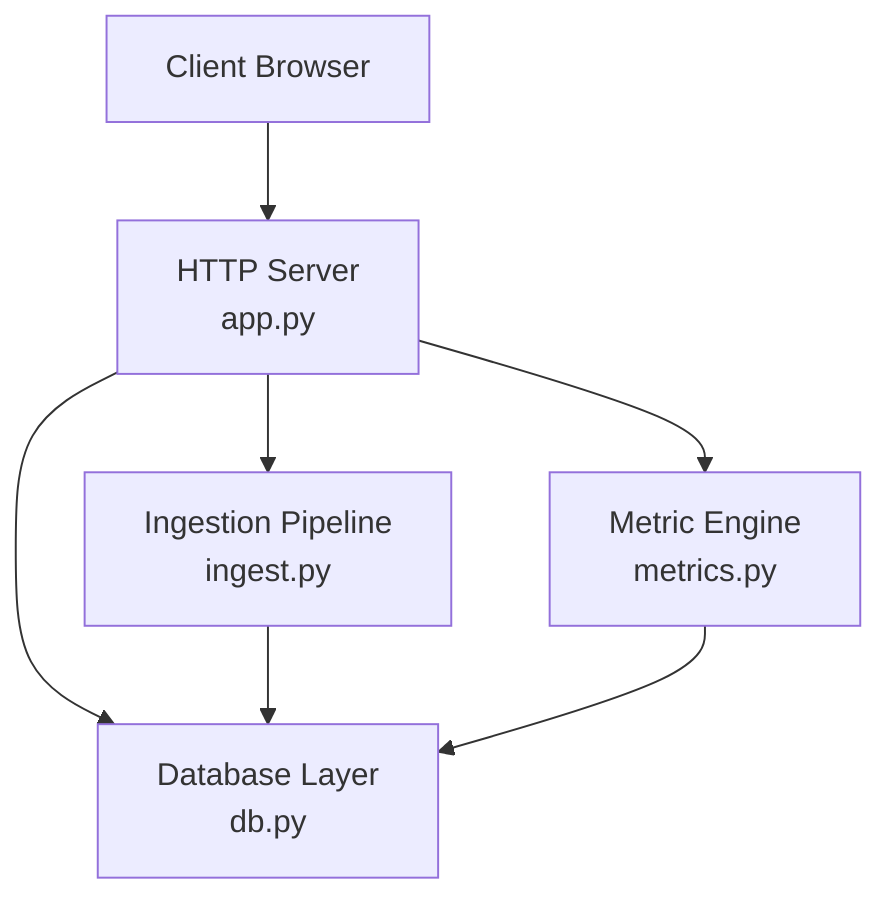

**Diagram sources**
- [app.py:56-196](file://app.py#L56-L196)
- [db.py:15-62](file://db.py#L15-L62)
- [ingest.py:181-315](file://ingest.py#L181-L315)
- [metrics.py:138-168](file://metrics.py#L138-L168)

**Section sources**
- [app.py:1-30](file://app.py#L1-L30)
- [db.py:1-12](file://db.py#L1-L12)
- [ingest.py:1-20](file://ingest.py#L1-L20)
- [metrics.py:1-21](file://metrics.py#L1-L21)

## Core Components
The metric engine defines the semantics for all computed values:
- Per commit and file: added lines, removed lines, growth (net change), and churn (total change).
- Per commit set: aggregation across selected commits with date range, explicit hash list, and author identity filters.
- Per object: file, directory, repository, commit set, and author aggregations.
- Derived metrics: modifications count, modification frequency, churn rate, and ownership share.

Key implementation points:
- Filters combine with AND logic.
- Path matching uses exact match for files and substring prefix matching for directories.
- Author identity resolution uses canonical IDs when available.
- Binary files are skipped during line counting but still belong to the selected commit set.

**Section sources**
- [metrics.py:1-21](file://metrics.py#L1-L21)
- [metrics.py:50-78](file://metrics.py#L50-L78)
- [metrics.py:91-124](file://metrics.py#L91-L124)
- [metrics.py:129-168](file://metrics.py#L129-L168)

## Architecture Overview
The end-to-end flow starts with ingestion and continues through metric queries.

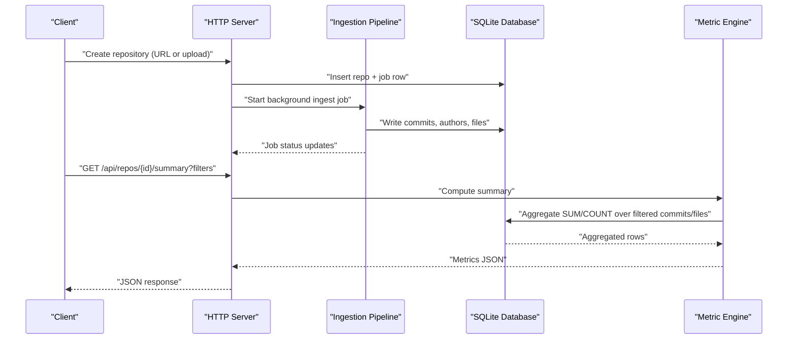

**Diagram sources**
- [app.py:306-336](file://app.py#L306-L336)
- [ingest.py:356-421](file://ingest.py#L356-L421)
- [metrics.py:205-225](file://metrics.py#L205-L225)

## Detailed Component Analysis

### Raw Data Model and Ingestion
RAT stores normalized history data in four primary tables:
- `repos`: repository metadata and status.
- `authors`: author identities with optional canonical mapping.
- `commits`: commit identifiers, author reference, timestamp, and subject.
- `files`: per-commit per-file line deltas.

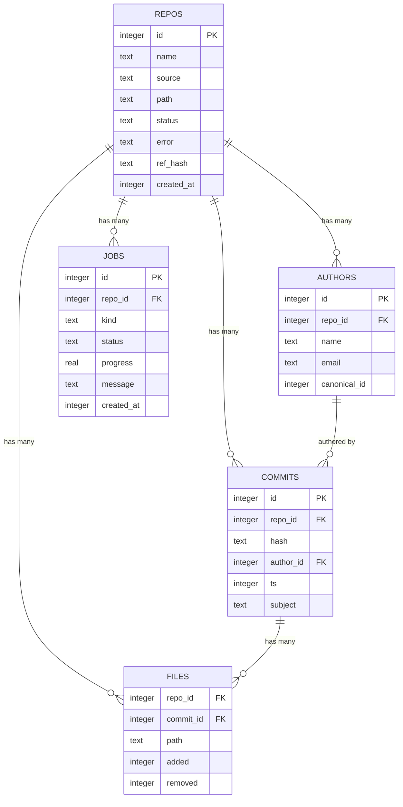

**Diagram sources**
- [db.py:15-62](file://db.py#L15-L62)

Ingestion parses `git log` output in a single pass:
- Commits are parsed from NUL-separated tokens.
- File records include added/removed line counts; binary files are marked and skipped for line metrics.
- Renames are resolved so changes are attributed to the new path.
- Rows are batched and inserted into SQLite.

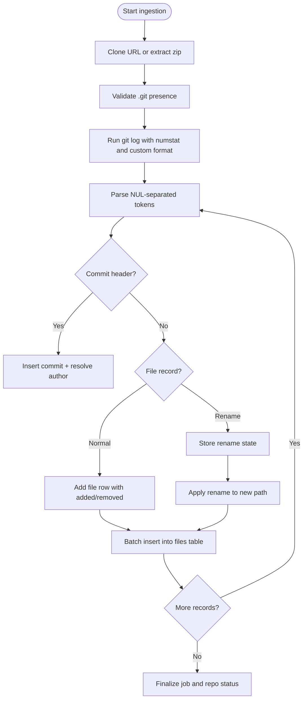

**Diagram sources**
- [ingest.py:181-315](file://ingest.py#L181-L315)

**Section sources**
- [db.py:15-62](file://db.py#L15-L62)
- [ingest.py:181-315](file://ingest.py#L181-L315)

### Filter Semantics and Commit Set Construction
Filters define the commit set H used for all aggregations:
- Date range: `from` inclusive, `to` exclusive.
- Hash filter: comma-separated short or full commit hashes.
- Author filter: canonical author ID.
- All filters combine with AND.

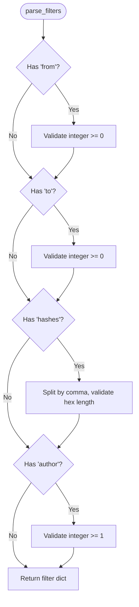

**Diagram sources**
- [metrics.py:50-78](file://metrics.py#L50-L78)

The WHERE clause for commits adds:
- Repository scoping.
- Optional timestamp bounds.
- Optional canonical author identity join.
- Optional hash prefix or exact match.

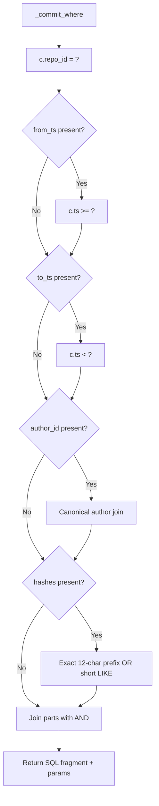

**Diagram sources**
- [metrics.py:91-124](file://metrics.py#L91-L124)

**Section sources**
- [metrics.py:50-78](file://metrics.py#L50-L78)
- [metrics.py:91-124](file://metrics.py#L91-L124)

### Aggregation Logic and Metric Definitions
The central aggregation function computes:
- Added lines: sum of added per file in the filtered set.
- Removed lines: sum of removed per file in the filtered set.
- Modifications: number of distinct commits where at least one file changed.

Derived metrics:
- Growth: added minus removed.
- Churn: added plus removed.
- Frequency: modifications divided by commit set size.
- Churn rate: churn divided by commit set size.
- Ownership: per-author churn divided by total churn.

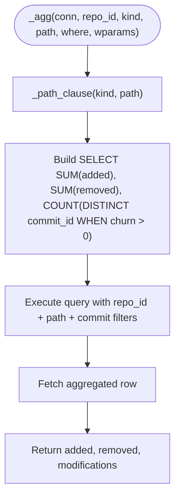

**Diagram sources**
- [metrics.py:129-155](file://metrics.py#L129-L155)

Derived metrics computation:

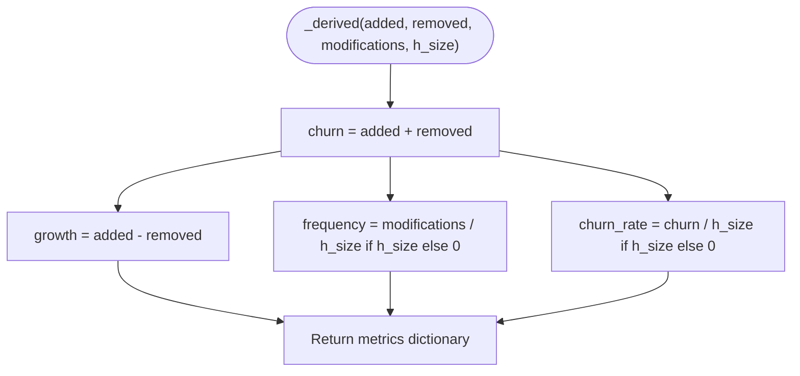

**Diagram sources**
- [metrics.py:158-168](file://metrics.py#L158-L168)

**Section sources**
- [metrics.py:129-168](file://metrics.py#L129-L168)

### Dimensions of Analysis

#### Repository Summary
The repository summary returns aggregate metrics across all files and commits in the selected commit set, plus counts of distinct files and distinct authors.

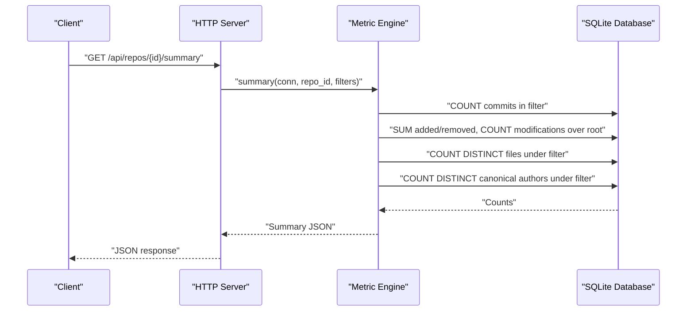

**Diagram sources**
- [metrics.py:205-225](file://metrics.py#L205-L225)

**Section sources**
- [metrics.py:205-225](file://metrics.py#L205-L225)

#### Directory Tree
The tree endpoint lists immediate children of a directory, including both subdirectories and files. Each child includes its own metrics computed over the same commit set.

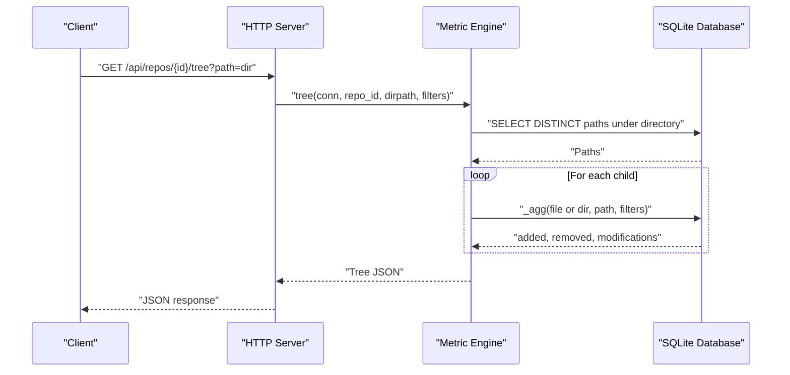

**Diagram sources**
- [metrics.py:228-262](file://metrics.py#L228-L262)

**Section sources**
- [metrics.py:228-262](file://metrics.py#L228-L262)

#### File Detail and Ownership
The file detail endpoint computes metrics for a specific file and breaks down ownership by author. Ownership is calculated as the author’s churn divided by the total churn for that file within the selected commit set.

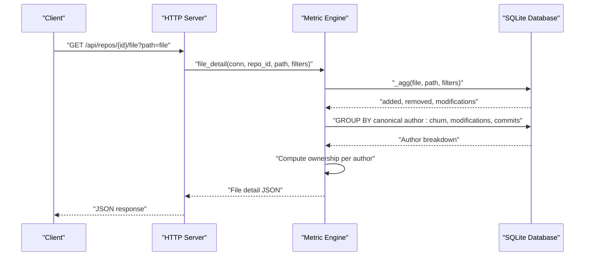

**Diagram sources**
- [metrics.py:265-307](file://metrics.py#L265-L307)

**Section sources**
- [metrics.py:265-307](file://metrics.py#L265-L307)

#### Authors Table
The authors table aggregates churn, modifications, and commit counts per canonical author across the entire repository under the selected commit set. Ownership share is computed relative to total repository churn.

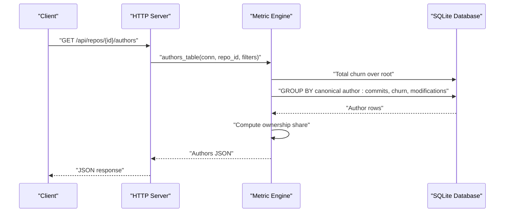

**Diagram sources**
- [metrics.py:310-361](file://metrics.py#L310-L361)

**Section sources**
- [metrics.py:310-361](file://metrics.py#L310-L361)

### Charts and Time-Based Visualization
Charts provide visualizations of metrics over time and across top files or authors.

- Churn chart: groups commit timestamps into adaptive day/week/month buckets and plots added, removed, and churn series.
- Top files chart: ranks files by churn and displays added/removed breakdowns.
- Author share chart: shows top authors by churn and groups the rest into an “Others” category.

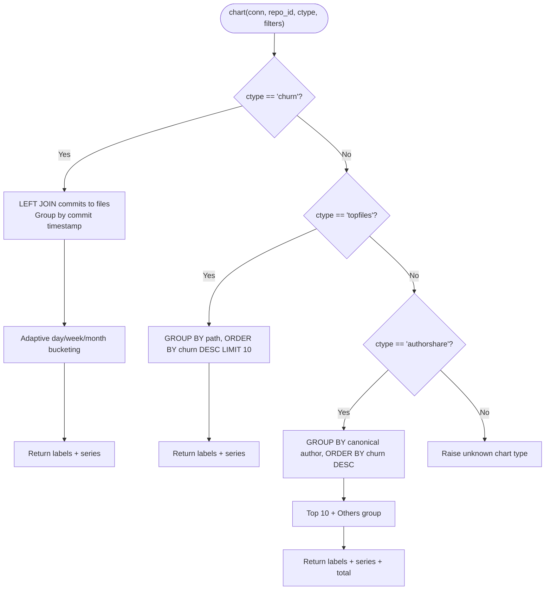

**Diagram sources**
- [metrics.py:463-543](file://metrics.py#L463-L543)

**Section sources**
- [metrics.py:440-543](file://metrics.py#L440-L543)

## Dependency Analysis
The following diagram maps module dependencies and responsibilities:

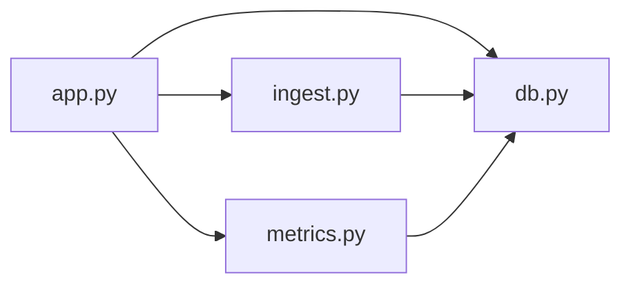

**Diagram sources**
- [app.py:28-30](file://app.py#L28-L30)
- [ingest.py:30](file://ingest.py#L30)
- [metrics.py:1-21](file://metrics.py#L1-L21)

Coupling and cohesion observations:
- The HTTP server depends on all other modules but remains thin, delegating business logic to ingestion and metrics.
- Ingestion depends only on the database layer for persistence.
- Metrics depend only on the database layer for querying.
- There are no circular imports among these modules.

**Section sources**
- [app.py:28-30](file://app.py#L28-L30)
- [ingest.py:30](file://ingest.py#L30)
- [metrics.py:1-21](file://metrics.py#L1-L21)

## Performance Considerations
- Ingestion batches file rows to reduce transaction overhead.
- SQLite WAL mode allows concurrent reads during ingestion.
- Indexes exist on key columns: files commit and path, commits timestamp and hash.
- Chart bucketing adapts granularity based on time span to keep visualization readable.
- Hash filters split into exact prefixes and short prefixes to optimize SQL construction.

[No sources needed since this section provides general guidance]

## Troubleshooting Guide
Common issues and their handling:
- Invalid integers or out-of-range values in filters raise filter errors surfaced as HTTP 400.
- Unknown repositories raise not found errors surfaced as HTTP 404.
- Ingestion failures mark jobs and repos as error and clean up partial data.
- Port binding falls back automatically; the actual URL is printed at startup.
- Missing `.git` in archives raises ingestion errors requiring full Git history.

Practical steps:
- Verify `git` availability on PATH.
- Reset state by deleting the data directory.
- Check job status via the jobs API to diagnose ingestion problems.
- Use the sample fixture to validate the pipeline without network access.

**Section sources**
- [metrics.py:30-35](file://metrics.py#L30-L35)
- [metrics.py:40-47](file://metrics.py#L40-L47)
- [ingest.py:332-349](file://ingest.py#L332-L349)
- [app.py:444-472](file://app.py#L444-L472)
- [ingest.py:125-143](file://ingest.py#L125-L143)

## Conclusion
RAT computes Git metrics by normalizing raw history into structured tables and then applying consistent aggregation rules across multiple dimensions. The core metrics—added/removed lines, growth, churn, modifications, and ownership—are derived from simple sums and counts over filtered commit sets. Filters allow precise scoping by time, author, and explicit commits, while path-based analysis supports file and directory views. Charts translate these computations into time-series and distribution visuals, enabling practical interpretation of code evolution, contributor activity, and repository health.

[No sources needed since this section summarizes without analyzing specific files]