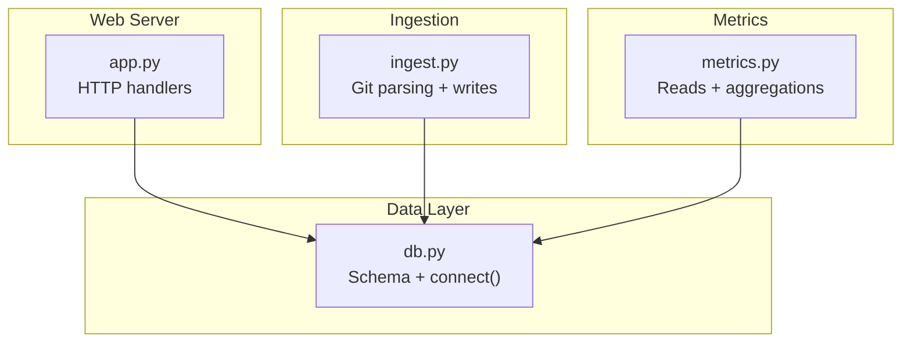
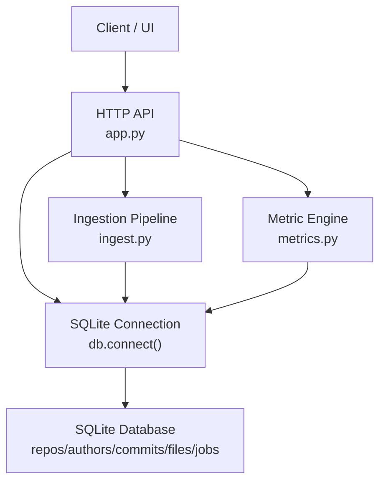
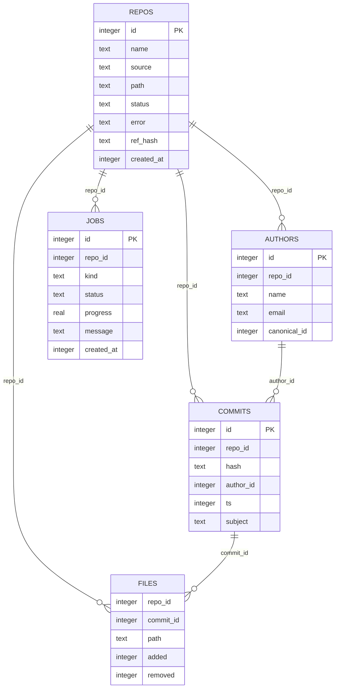
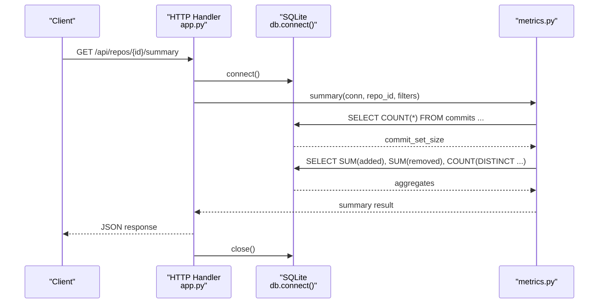
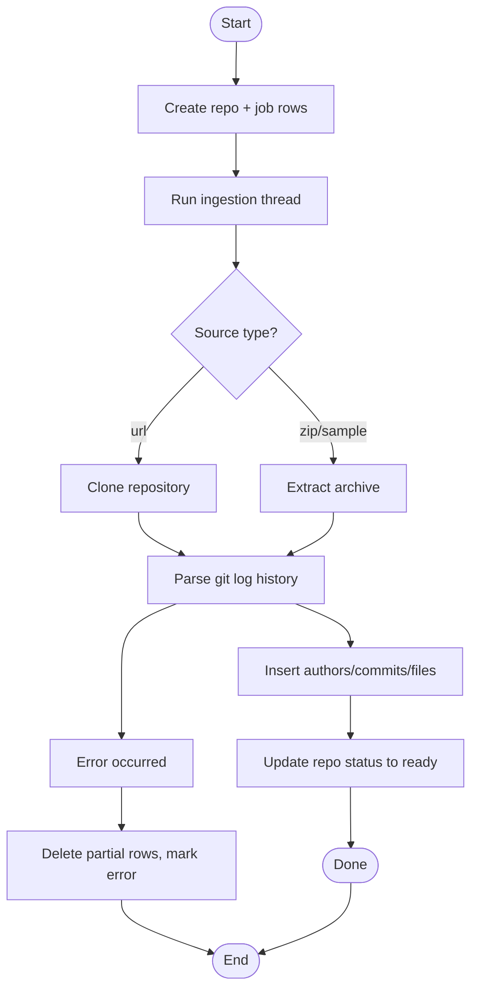
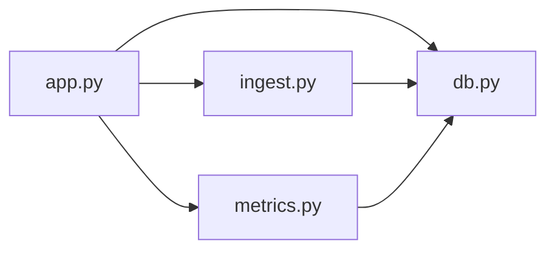
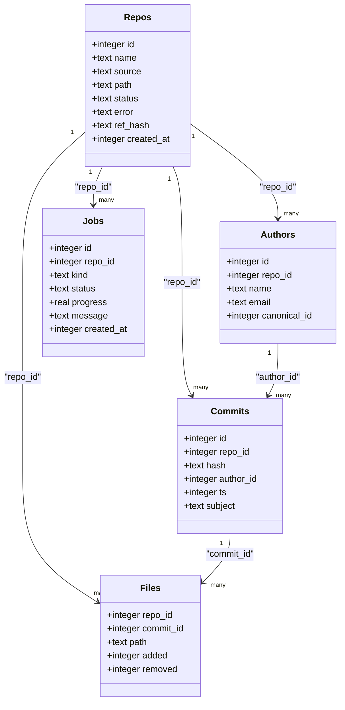

# Data Models & Schema

<cite>
**Referenced Files in This Document**   
- [db.py](file://db.py)
- [app.py](file://app.py)
- [ingest.py](file://ingest.py)
- [metrics.py](file://metrics.py)
- [README.md](file://README.md)
</cite>

## Table of Contents
1. [Introduction](#introduction)
2. [Project Structure](#project-structure)
3. [Core Components](#core-components)
4. [Architecture Overview](#architecture-overview)
5. [Detailed Component Analysis](#detailed-component-analysis)
6. [Dependency Analysis](#dependency-analysis)
7. [Performance Considerations](#performance-considerations)
8. [Troubleshooting Guide](#troubleshooting-guide)
9. [Conclusion](#conclusion)
10. [Appendices](#appendices)

## Introduction
This document describes the SQLite data model used by RAT (Repo Analysis Tool). It explains the entity relationships between repositories, authors, commits, files, and jobs; documents field definitions, types, keys, indexes, and constraints; outlines validation rules enforced at the database level; and provides diagrams for schema relationships, connection management, WAL configuration, data lifecycle, migration/versioning, backup strategies, sample data, and query examples.

RAT is a local, offline dashboard that ingests Git repositories from zip archives or public clone URLs and computes metrics such as added/removed lines, growth, churn, modifications, churn rate, and ownership per file, directory, repository, commit set, and author.

**Section sources**
- [README.md:1-46](file://README.md#L1-L46)

## Project Structure
The data model lives in the database layer module and is consumed by the web API, ingestion pipeline, and metric engine.

**Diagram sources**
- [app.py:28-30](file://app.py#L28-L30)
- [db.py:77-86](file://db.py#L77-L86)
- [ingest.py:30-31](file://ingest.py#L30-L31)
- [metrics.py:1-21](file://metrics.py#L1-L21)

**Section sources**
- [app.py:1-31](file://app.py#L1-L31)
- [db.py:1-11](file://db.py#L1-L11)
- [ingest.py:1-31](file://ingest.py#L1-L31)
- [metrics.py:1-21](file://metrics.py#L1-L21)

## Core Components
RAT’s SQLite schema defines five core tables:

- repos: repository metadata and lifecycle state
- authors: author identities with canonicalization support
- commits: commit records linked to authors and repos
- files: per-commit file change rows (added/removed lines)
- jobs: background ingestion job status and progress

Key characteristics:
- All primary keys are auto-increment integers.
- Foreign key relationships are logical (enforced by application code), not declared via foreign key constraints.
- Indexes exist on frequently queried columns to optimize reads.
- Validation and business logic are primarily enforced in Python, with some uniqueness enforced via UNIQUE constraints.

**Section sources**
- [db.py:15-62](file://db.py#L15-L62)

## Architecture Overview
The following diagram maps the runtime components to their responsibilities over the data model.

**Diagram sources**
- [app.py:121-196](file://app.py#L121-L196)
- [db.py:77-86](file://db.py#L77-L86)
- [ingest.py:356-441](file://ingest.py#L356-L441)
- [metrics.py:179-183](file://metrics.py#L179-L183)

## Detailed Component Analysis

### Entity Relationship Model
The conceptual ERD below shows entities and cardinalities. Relationships are enforced by application logic rather than declarative foreign keys.

**Diagram sources**
- [db.py:15-62](file://db.py#L15-L62)

### Table Definitions and Constraints

#### repos
- Purpose: Tracks each ingested repository, its source type, filesystem path, lifecycle status, optional error message, target ref hash, and creation timestamp.
- Fields:
  - id: INTEGER PRIMARY KEY AUTOINCREMENT
  - name: TEXT NOT NULL
  - source: TEXT NOT NULL (values include url, zip, sample)
  - path: TEXT NOT NULL (relative to DATA_DIR)
  - status: TEXT NOT NULL DEFAULT 'pending' (values include pending, running, ready, error)
  - error: TEXT
  - ref_hash: TEXT
  - created_at: INTEGER NOT NULL
- Keys:
  - Primary Key: id
- Indexes: None defined explicitly.
- Constraints:
  - Application enforces status transitions and path updates during ingestion.
  - No declarative foreign keys to other tables.

**Section sources**
- [db.py:16-25](file://db.py#L16-L25)
- [app.py:306-336](file://app.py#L306-L336)
- [ingest.py:400-421](file://ingest.py#L400-L421)

#### authors
- Purpose: Stores author identity entries per repository, supporting canonicalization to merge duplicate identities.
- Fields:
  - id: INTEGER PRIMARY KEY AUTOINCREMENT
  - repo_id: INTEGER NOT NULL
  - name: TEXT NOT NULL
  - email: TEXT NOT NULL
  - canonical_id: INTEGER (NULL means self; otherwise points to another author row)
- Keys:
  - Primary Key: id
  - Unique Constraint: UNIQUE(repo_id, name, email)
- Indexes: None defined explicitly.
- Constraints:
  - Uniqueness ensures one identity tuple per repository.
  - Canonicalization is managed by application logic; queries use COALESCE(canonical_id, id) to resolve display identity.

**Section sources**
- [db.py:26-33](file://db.py#L26-L33)
- [metrics.py:186-200](file://metrics.py#L186-L200)
- [metrics.py:364-396](file://metrics.py#L364-L396)

#### commits
- Purpose: Records commits belonging to a repository, linking to an author and including timestamp and optional subject.
- Fields:
  - id: INTEGER PRIMARY KEY AUTOINCREMENT
  - repo_id: INTEGER NOT NULL
  - hash: TEXT NOT NULL
  - author_id: INTEGER NOT NULL
  - ts: INTEGER NOT NULL (UNIX seconds)
  - subject: TEXT
- Keys:
  - Primary Key: id
- Indexes:
  - idx_commits_ts: ON commits(repo_id, ts)
  - idx_commits_hash: ON commits(repo_id, hash)
- Constraints:
  - No declarative foreign keys; application ensures author_id exists within the same repo context.

**Section sources**
- [db.py:34-41](file://db.py#L34-L41)
- [db.py:60-61](file://db.py#L60-L61)
- [ingest.py:276-282](file://ingest.py#L276-L282)

#### files
- Purpose: Per-commit file change rows capturing added and removed line counts; binary changes are skipped but tracked in stats.
- Fields:
  - repo_id: INTEGER NOT NULL
  - commit_id: INTEGER NOT NULL
  - path: TEXT NOT NULL (final path after renames)
  - added: INTEGER NOT NULL
  - removed: INTEGER NOT NULL
- Keys:
  - Composite Primary Key: Not declared; table has no explicit PK.
- Indexes:
  - idx_files_commit: ON files(repo_id, commit_id)
  - idx_files_path: ON files(repo_id, path)
- Constraints:
  - No declarative foreign keys; application ensures commit_id belongs to the same repo context.

**Section sources**
- [db.py:42-48](file://db.py#L42-L48)
- [db.py:58-59](file://db.py#L58-L59)
- [ingest.py:204-219](file://ingest.py#L204-L219)

#### jobs
- Purpose: Background ingestion job tracking with status, progress, message, and timestamps.
- Fields:
  - id: INTEGER PRIMARY KEY AUTOINCREMENT
  - repo_id: INTEGER (nullable)
  - kind: TEXT NOT NULL (value includes ingest)
  - status: TEXT NOT NULL DEFAULT 'running' (values include running, done, error)
  - progress: REAL NOT NULL DEFAULT 0
  - message: TEXT
  - created_at: INTEGER NOT NULL
- Keys:
  - Primary Key: id
- Indexes: None defined explicitly.
- Constraints:
  - Status transitions are managed by application logic.

**Section sources**
- [db.py:49-57](file://db.py#L49-L57)
- [app.py:306-336](file://app.py#L306-L336)
- [ingest.py:320-349](file://ingest.py#L320-L349)

### Data Validation Rules and Business Logic at the Database Level
- Authors uniqueness: UNIQUE(repo_id, name, email) prevents duplicate identity tuples per repository.
- Status fields: Values like pending/running/ready/error and running/done/error are enforced by application logic; no CHECK constraints are present.
- Path normalization and validation: File paths are validated in the metrics layer before querying; invalid paths raise errors.
- Commit filters: Hash prefixes and full hashes are validated; too many hashes or invalid characters raise errors.
- Timestamp ranges: from/to timestamps are validated as non-negative integers within safe bounds.
- Binary files: Skipped from measurement but counted in ingestion statistics.

**Section sources**
- [db.py:26-33](file://db.py#L26-L33)
- [metrics.py:50-78](file://metrics.py#L50-L78)
- [metrics.py:81-88](file://metrics.py#L81-L88)
- [ingest.py:238-260](file://ingest.py#L238-L260)

### Data Access Patterns and Query Examples

#### Common Read Patterns
- Repository list with aggregate counts:
  - Selects repos and aggregates commits count, distinct file paths, and distinct canonical authors.
  - Example reference: [app.py:262-277](file://app.py#L262-L277)
- Latest job per repository:
  - Retrieves most recent job for a given repo.
  - Example reference: [app.py:293-304](file://app.py#L293-L304)
- Commits listing with filters:
  - Supports date range, hash prefix/full matches, author filter, and search on subject/hash.
  - Example reference: [metrics.py:399-435](file://metrics.py#L399-L435)
- Tree view aggregation:
  - Lists directories and files under a path with aggregated metrics.
  - Example reference: [metrics.py:228-262](file://metrics.py#L228-L262)
- File detail with author breakdown:
  - Aggregates per-author contributions for a specific file.
  - Example reference: [metrics.py:265-307](file://metrics.py#L265-L307)
- Author table with ownership:
  - Groups authors by canonical identity and computes ownership share.
  - Example reference: [metrics.py:310-361](file://metrics.py#L310-L361)

#### Write Patterns
- Create repository and job:
  - Inserts into repos and jobs, sets initial status and path, then starts ingestion thread.
  - Example reference: [app.py:306-336](file://app.py#L306-L336)
- Ingest history writing:
  - Batches inserts into files; commits periodically; resolves authors using INSERT OR IGNORE and lookup.
  - Example reference: [ingest.py:204-219](file://ingest.py#L204-L219), [ingest.py:221-236](file://ingest.py#L221-L236), [ingest.py:276-282](file://ingest.py#L276-L282)
- Merge authors:
  - Updates canonical_id to consolidate identities.
  - Example reference: [metrics.py:364-396](file://metrics.py#L364-L396)

#### Sample Queries
- List all repositories with commit/file/author counts:
  - See [app.py:262-277](file://app.py#L262-L277)
- Get latest job for a repository:
  - See [app.py:293-304](file://app.py#L293-L304)
- Filter commits by date range and author:
  - See [metrics.py:91-124](file://metrics.py#L91-L124), [metrics.py:399-435](file://metrics.py#L399-L435)
- Aggregate metrics for a directory subtree:
  - See [metrics.py:129-155](file://metrics.py#L129-L155), [metrics.py:228-262](file://metrics.py#L228-L262)

**Section sources**
- [app.py:262-304](file://app.py#L262-L304)
- [metrics.py:91-155](file://metrics.py#L91-L155)
- [metrics.py:228-307](file://metrics.py#L228-L307)
- [metrics.py:310-396](file://metrics.py#L310-L396)
- [ingest.py:204-282](file://ingest.py#L204-L282)

### Connection Management and WAL Mode Configuration
- Connection-per-call pattern:
  - Each HTTP handler opens a new connection via db.connect(), uses it, and closes it in finally blocks.
  - Example references: [app.py:199-210](file://app.py#L199-L210), [app.py:212-240](file://app.py#L212-L240), [app.py:262-277](file://app.py#L262-L277)
- WAL mode and pragmas:
  - journal_mode = WAL enables concurrent readers while writers update.
  - synchronous = NORMAL balances durability and performance.
  - busy_timeout and timeout ensure robustness under contention.
  - Reference: [db.py:77-86](file://db.py#L77-L86)

**Diagram sources**
- [app.py:199-210](file://app.py#L199-L210)
- [metrics.py:205-225](file://metrics.py#L205-L225)
- [db.py:77-86](file://db.py#L77-L86)

**Section sources**
- [db.py:77-86](file://db.py#L77-L86)
- [app.py:199-210](file://app.py#L199-L210)

### Data Lifecycle: Creation, Updates, Cleanup

#### Creation
- Repositories:
  - Created via API endpoints for URL, upload, or sample fixture.
  - Initial status set to 'running'; path updated after ingestion completes.
  - References: [app.py:338-381](file://app.py#L338-L381), [app.py:306-336](file://app.py#L306-L336)
- Jobs:
  - Created alongside repos with kind='ingest', status='running'.
  - Progress and messages updated during ingestion.
  - References: [app.py:306-336](file://app.py#L306-L336), [ingest.py:320-329](file://ingest.py#L320-L329)
- Authors and Commits:
  - Inserted during history parsing; authors resolved via unique constraint.
  - References: [ingest.py:221-282](file://ingest.py#L221-L282)
- Files:
  - Batch-inserted per commit; renames handled by attributing to new path.
  - References: [ingest.py:204-219](file://ingest.py#L204-L219), [ingest.py:238-300](file://ingest.py#L238-L300)

#### Updates
- Job progress:
  - Updated periodically with fraction and message.
  - References: [ingest.py:320-329](file://ingest.py#L320-L329)
- Repo status:
  - Transitions from 'running' to 'ready' upon success; set to 'error' on failure.
  - References: [ingest.py:400-421](file://ingest.py#L400-L421), [ingest.py:332-349](file://ingest.py#L332-L349)
- Author merging:
  - Updates canonical_id to consolidate identities.
  - References: [metrics.py:364-396](file://metrics.py#L364-L396)

#### Cleanup
- Delete repository:
  - Removes related rows in files, commits, authors, jobs; deletes repo record; removes filesystem directory.
  - References: [app.py:383-398](file://app.py#L383-L398)
- Failed ingestion cleanup:
  - Drops partially ingested files/commits/authors; marks repo/job as error.
  - References: [ingest.py:332-349](file://ingest.py#L332-L349)

**Diagram sources**
- [app.py:306-336](file://app.py#L306-L336)
- [ingest.py:356-441](file://ingest.py#L356-L441)

**Section sources**
- [app.py:306-398](file://app.py#L306-L398)
- [ingest.py:320-441](file://ingest.py#L320-L441)

### Migration Paths, Version Management, and Backup Strategies

#### Migration and Versioning
- Schema initialization:
  - Uses CREATE TABLE IF NOT EXISTS and CREATE INDEX IF NOT EXISTS to make schema idempotent.
  - Initialization occurs at server startup via db.init_db().
  - References: [db.py:89-95](file://db.py#L89-L95), [app.py:455-457](file://app.py#L455-L457)
- Version management:
  - No explicit schema version table or migration script is present.
  - Future migrations should introduce a schema_version table and apply incremental ALTER statements.

#### Backup Strategy
- WAL mode:
  - Enables consistent backups without locking out readers.
  - Reference: [db.py:84](file://db.py#L84)
- Recommended approach:
  - Use sqlite3's backup API or copy the .db file when idle; WAL files (.wal, .shm) must be included if present.
  - Ensure consistent snapshots by stopping writes or using a transaction boundary.

**Section sources**
- [db.py:15-62](file://db.py#L15-L62)
- [db.py:89-95](file://db.py#L89-L95)
- [app.py:455-457](file://app.py#L455-L457)

### Sample Data and Query Examples

#### Sample Data Generation
- The project includes a demo fixture generator:
  - Command: python3 demo/make_fixture.py
  - Produces demo/fixture.zip used by the sample repository endpoint.
  - Reference: [README.md:42-46](file://README.md#L42-L46)

#### Example Queries
- Repository list with aggregates:
  - See [app.py:262-277](file://app.py#L262-L277)
- Latest job per repository:
  - See [app.py:293-304](file://app.py#L293-L304)
- Commits listing with filters:
  - See [metrics.py:399-435](file://metrics.py#L399-L435)
- Directory tree aggregation:
  - See [metrics.py:228-262](file://metrics.py#L228-L262)
- File detail with author breakdown:
  - See [metrics.py:265-307](file://metrics.py#L265-L307)
- Author table with ownership:
  - See [metrics.py:310-361](file://metrics.py#L310-L361)

**Section sources**
- [README.md:42-46](file://README.md#L42-L46)
- [app.py:262-304](file://app.py#L262-L304)
- [metrics.py:228-361](file://metrics.py#L228-L361)

## Dependency Analysis
The following diagram illustrates how modules depend on each other and the database.

**Diagram sources**
- [app.py:28-30](file://app.py#L28-L30)
- [ingest.py:30-31](file://ingest.py#L30-L31)
- [metrics.py:1-21](file://metrics.py#L1-L21)
- [db.py:1-11](file://db.py#L1-L11)

**Section sources**
- [app.py:28-30](file://app.py#L28-L30)
- [ingest.py:30-31](file://ingest.py#L30-L31)
- [metrics.py:1-21](file://metrics.py#L1-L21)
- [db.py:1-11](file://db.py#L1-L11)

## Performance Considerations
- WAL mode improves concurrency for read-heavy workloads typical of dashboards.
- Indexes on files(repo_id, commit_id) and files(repo_id, path) accelerate common joins and path-based queries.
- Indexes on commits(repo_id, ts) and commits(repo_id, hash) support time-range filtering and hash lookups.
- Batch inserts for files reduce round-trips and improve throughput during ingestion.
- Avoid LIKE on large datasets where possible; prefer exact matches or indexed substrings.

[No sources needed since this section provides general guidance]

## Troubleshooting Guide
- Stale jobs after restart:
  - On startup, running jobs are marked as error with a message indicating interruption.
  - Reference: [ingest.py:443-457](file://ingest.py#L443-L457)
- Failed ingestion cleanup:
  - Partially ingested rows are dropped; repo/job statuses set to error.
  - Reference: [ingest.py:332-349](file://ingest.py#L332-L349)
- Invalid inputs:
  - Filter errors and path validation raise user-readable errors surfaced as HTTP 400.
  - References: [metrics.py:30-47](file://metrics.py#L30-L47), [metrics.py:81-88](file://metrics.py#L81-L88)

**Section sources**
- [ingest.py:332-349](file://ingest.py#L332-L349)
- [ingest.py:443-457](file://ingest.py#L443-L457)
- [metrics.py:30-47](file://metrics.py#L30-L47)
- [metrics.py:81-88](file://metrics.py#L81-L88)

## Conclusion
RAT’s SQLite schema centers around five interconnected tables that capture repository metadata, author identities, commit history, and per-commit file changes, along with background job tracking. While foreign keys are not declared, application logic enforces referential integrity and business rules. The design leverages WAL mode, strategic indexes, and batched writes to support efficient ingestion and responsive dashboards. For future evolution, introducing explicit schema versioning and declarative foreign keys will strengthen maintainability and consistency.

[No sources needed since this section summarizes without analyzing specific files]

## Appendices

### Appendix A: Schema Diagram

**Diagram sources**
- [db.py:15-62](file://db.py#L15-L62)