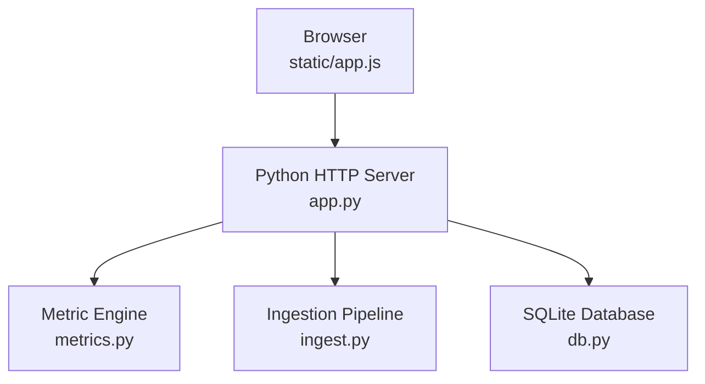
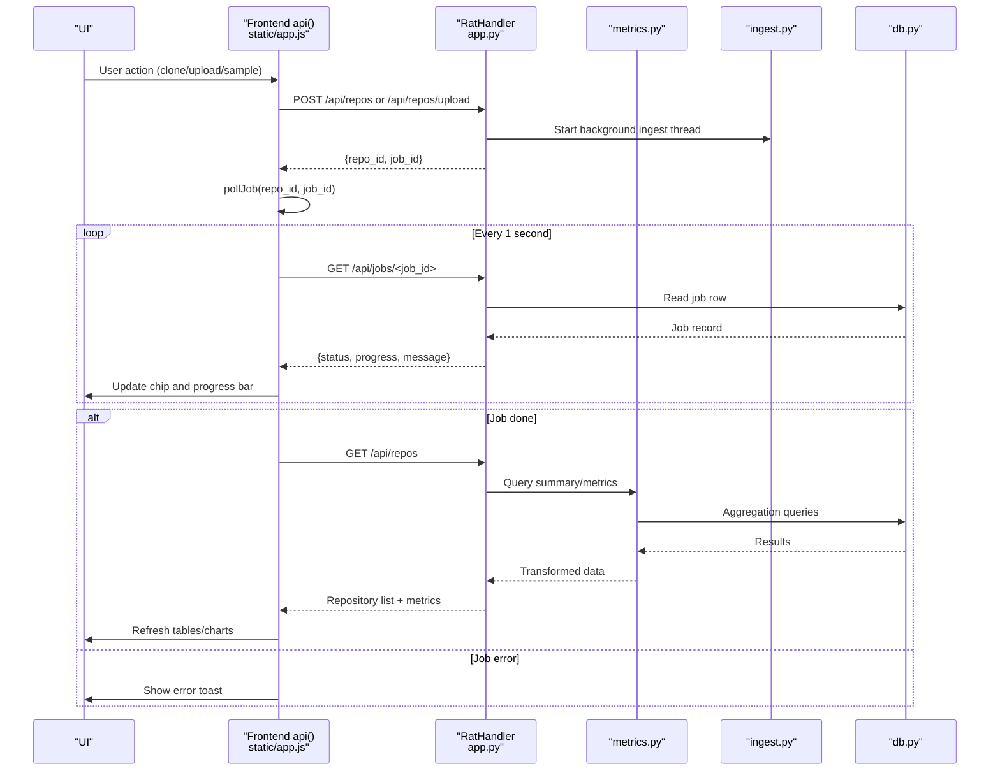
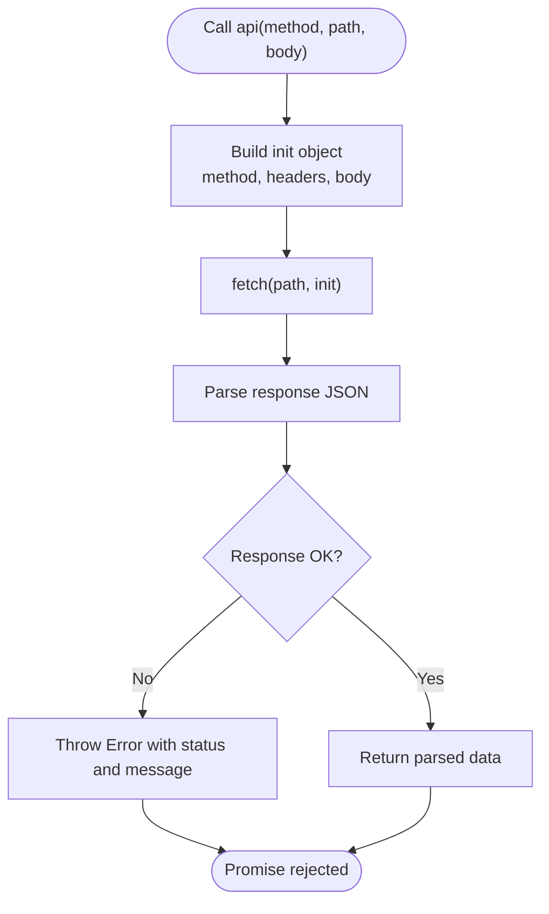
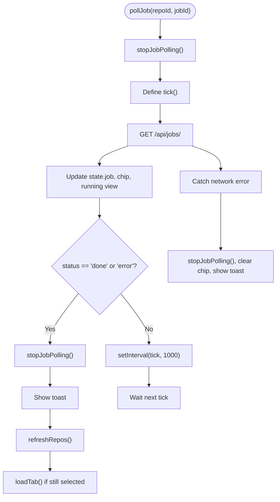
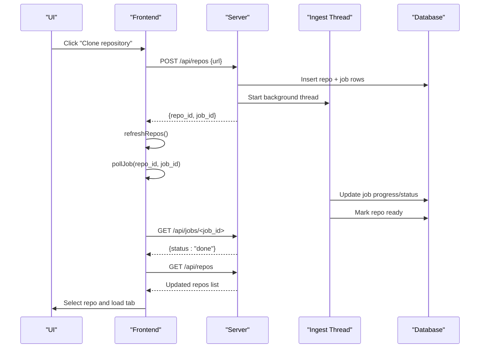
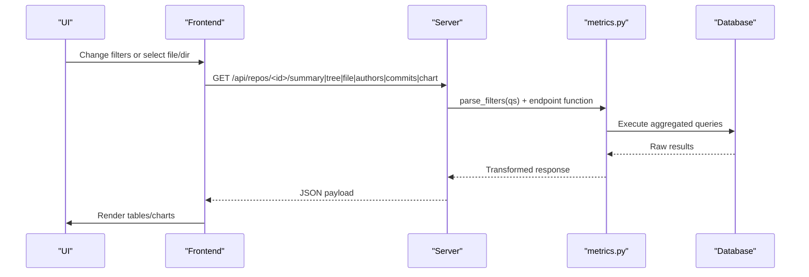
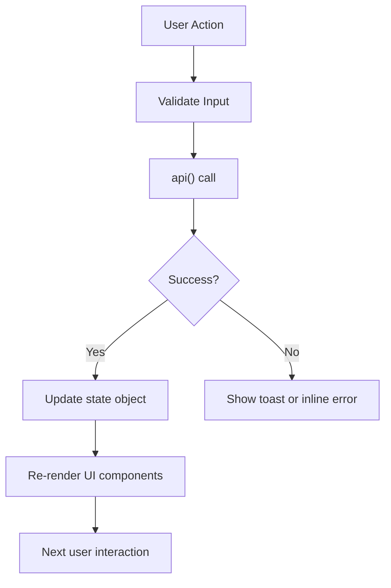
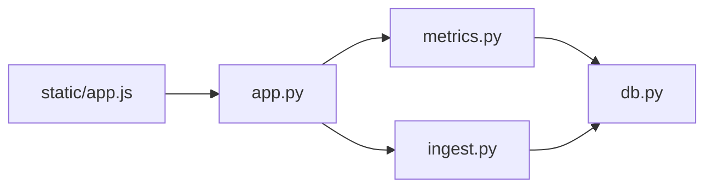

# API Communication Layer

<cite>
**Referenced Files in This Document**
- [app.js](file://static/app.js)
- [app.py](file://app.py)
- [metrics.py](file://metrics.py)
- [db.py](file://db.py)
- [ingest.py](file://ingest.py)
</cite>

## Table of Contents
1. [Introduction](#introduction)
2. [Project Structure](#project-structure)
3. [Core Components](#core-components)
4. [Architecture Overview](#architecture-overview)
5. [Detailed Component Analysis](#detailed-component-analysis)
6. [Dependency Analysis](#dependency-analysis)
7. [Performance Considerations](#performance-considerations)
8. [Troubleshooting Guide](#troubleshooting-guide)
9. [Conclusion](#conclusion)

## Introduction
This document explains the REST API communication layer used by the Repo Analysis Tool (RAT). It focuses on:
- The browser-side fetch wrapper, error handling, and request/response processing.
- Authentication assumptions and security posture.
- Background job polling for repository ingestion progress.
- Request flows for repository operations, metric queries, and real-time updates.
- Response data transformation, caching behavior, and UI state synchronization.
- Network error handling, timeout management, and offline considerations.

The system is a single-page dashboard that communicates with a Python HTTP server exposing JSON endpoints. There is no authentication middleware; access control relies on local deployment and network boundaries.

## Project Structure
The frontend lives under `static/`, primarily in `static/app.js`. The backend is implemented in `app.py` and delegates to:
- `db.py` for SQLite schema, connection management, and path helpers.
- `metrics.py` for query building, filtering, aggregation, and chart generation.
- `ingest.py` for background ingestion jobs, Git history parsing, and progress tracking.

**Diagram sources**
- [app.js:95-114](file://static/app.js#L95-L114)
- [app.py:56-196](file://app.py#L56-L196)
- [metrics.py:50-78](file://metrics.py#L50-L78)
- [db.py:77-86](file://db.py#L77-L86)
- [ingest.py:356-431](file://ingest.py#L356-L431)

**Section sources**
- [app.js:1-114](file://static/app.js#L1-L114)
- [app.py:1-40](file://app.py#L1-L40)

## Core Components
- Fetch wrapper: A small `api(method, path, body)` function centralizes request creation, JSON serialization, response parsing, and error conversion.
- State object: A single JavaScript state drives all views and caches author lists per repository.
- Polling mechanism: An interval-based job poller tracks ingestion progress and updates UI chips and charts.
- Backend router: `app.py` routes `/api/*` requests to handlers that validate inputs, call metrics or ingestion logic, and return JSON.
- Metrics engine: `metrics.py` parses filters, builds SQL fragments, aggregates changes, and formats chart data.
- Database layer: `db.py` provides connections with WAL mode and safe path resolution.
- Ingestion pipeline: `ingest.py` runs background threads, updates job status, and persists commit/file metadata.

**Section sources**
- [app.js:95-114](file://static/app.js#L95-L114)
- [app.js:124-144](file://static/app.js#L124-L144)
- [app.js:248-285](file://static/app.js#L248-L285)
- [app.py:121-196](file://app.py#L121-L196)
- [metrics.py:50-78](file://metrics.py#L50-L78)
- [db.py:77-86](file://db.py#L77-L86)
- [ingest.py:356-431](file://ingest.py#L356-L431)

## Architecture Overview
The communication flow follows a simple client-server pattern:
- The browser calls `api()` to send HTTP requests.
- The server validates paths and parameters, invokes metrics or ingestion logic, and returns JSON.
- The frontend updates its state and re-renders UI components.
- For long-running ingestion tasks, the frontend polls `/api/jobs/<id>` until completion or failure.

**Diagram sources**
- [app.js:95-114](file://static/app.js#L95-L114)
- [app.js:490-531](file://static/app.js#L490-L531)
- [app.js:248-285](file://static/app.js#L248-L285)
- [app.py:177-196](file://app.py#L177-L196)
- [app.py:279-304](file://app.py#L279-L304)
- [app.py:338-381](file://app.py#L338-L381)
- [metrics.py:205-225](file://metrics.py#L205-L225)
- [db.py:77-86](file://db.py#L77-L86)
- [ingest.py:356-431](file://ingest.py#L356-L431)

## Detailed Component Analysis

### Fetch Wrapper and Error Handling
The `api()` function:
- Builds an `init` object with method, headers, and optional body.
- Serializes non-binary bodies as JSON with `Content-Type: application/json`.
- Uses native `fetch()` and converts responses to JSON.
- Throws a typed error when `res.ok` is false, attaching the HTTP status code.
- Returns parsed JSON on success.

Error handling strategy:
- Non-OK responses are converted into errors with a user-friendly message from the server payload or a generic fallback.
- Call sites catch errors and display toasts or inline form errors.
- No automatic retry is implemented at this level; retries must be added by callers if needed.

Authentication:
- No authentication headers or tokens are attached by default.
- Authorization is not enforced by the server; it assumes trusted local access.

Timeouts and offline behavior:
- No explicit timeout is configured in `api()`.
- Network failures propagate as rejected promises; they should be caught by callers.

**Diagram sources**
- [app.js:95-114](file://static/app.js#L95-L114)

**Section sources**
- [app.js:95-114](file://static/app.js#L95-L114)

### Polling Mechanism for Background Jobs
The polling mechanism:
- Starts an interval timer via `setInterval` every 1000 ms.
- Calls `GET /api/jobs/<job_id>` to retrieve current job status.
- Updates the global `state.job`, the job chip UI, and the running view progress bar.
- Stops polling on completion or error, shows a toast, refreshes repositories, and reloads the active tab.
- Provides cleanup through `stopJobPolling()`, which clears the interval and resets the poll reference.
- Resumes running jobs after page navigation using `resumeRunningRepo()`, which queries the latest job for the selected repository.

Interval management and cleanup:
- Each call to `pollJob()` stops any existing interval before starting a new one.
- On success/error branches, the interval is explicitly cleared.
- If polling fails due to a network error, the interval is stopped and an error toast is shown.

**Diagram sources**
- [app.js:244-285](file://static/app.js#L244-L285)

**Section sources**
- [app.js:216-285](file://static/app.js#L216-L285)

### Repository Operations Request Flow
Common repository operations:
- Clone from URL: `POST /api/repos` with `{ url }`.
- Upload zip archive: `POST /api/repos/upload?name=...` with multipart body.
- Load sample repository: `POST /api/repos/sample`.
- List repositories: `GET /api/repos`.
- Delete repository: `DELETE /api/repos/<id>`.

Flow highlights:
- Creation endpoints start a background ingestion job and return `{ repo_id, job_id }`.
- The frontend immediately starts polling the returned job ID.
- After job completion, the frontend refreshes the repository list and selects the newly created repository.
- Deletion removes cached author data and navigates away if the deleted repository was selected.

**Diagram sources**
- [app.js:490-531](file://static/app.js#L490-L531)
- [app.js:558-574](file://static/app.js#L558-L574)
- [app.py:338-381](file://app.py#L338-L381)
- [ingest.py:356-431](file://ingest.py#L356-L431)

**Section sources**
- [app.js:459-574](file://static/app.js#L459-L574)
- [app.py:177-196](file://app.py#L177-L196)
- [app.py:338-381](file://app.py#L338-L381)

### Metric Queries and Real-Time Updates
Metric endpoints:
- Summary: `GET /api/repos/<id>/summary`
- Tree listing: `GET /api/repos/<id>/tree?path=...`
- File detail: `GET /api/repos/<id>/file?path=...`
- Authors table: `GET /api/repos/<id>/authors`
- Commits list: `GET /api/repos/<id>/commits?limit=&offset=&query=`
- Charts: `GET /api/repos/<id>/chart?type=churn|topfiles|authorshare`

Filtering:
- Filters include date range (`from`, `to`), commit hashes (`hashes`), and author identity (`author`).
- The frontend constructs query strings based on `state.filters`.
- The backend parses and validates filters, raising 400 errors for invalid values.

Real-time updates:
- During ingestion, the UI displays a running banner and progress bar.
- Once ingestion completes, the frontend refreshes the repository list and reloads the active tab to reflect new metrics.

**Diagram sources**
- [app.js:146-158](file://static/app.js#L146-L158)
- [app.js:406-412](file://static/app.js#L406-L412)
- [app.py:139-176](file://app.py#L139-L176)
- [metrics.py:50-78](file://metrics.py#L50-L78)
- [metrics.py:205-225](file://metrics.py#L205-L225)
- [metrics.py:228-262](file://metrics.py#L228-L262)
- [metrics.py:265-307](file://metrics.py#L265-L307)
- [metrics.py:310-361](file://metrics.py#L310-L361)
- [metrics.py:399-435](file://metrics.py#L399-L435)
- [metrics.py:463-543](file://metrics.py#L463-L543)

**Section sources**
- [app.js:146-158](file://static/app.js#L146-L158)
- [app.js:406-412](file://static/app.js#L406-L412)
- [app.py:139-176](file://app.py#L139-L176)
- [metrics.py:50-78](file://metrics.py#L50-L78)
- [metrics.py:205-225](file://metrics.py#L205-L225)

### Response Data Transformation and Caching Strategies
Frontend caching:
- Author lists are cached per repository in `state.authorsCache[repoId]` to avoid repeated requests.
- View state (tab, filters, file paths) is stored in `state.view[repoId]` to restore UI context.
- Chart instances are keyed by name and disposed during re-render to prevent memory leaks.

Backend caching:
- Static assets under `/static/vendor/` use longer cache headers; other static files use `no-store`.
- API responses do not set explicit cache-control beyond defaults; they are generally treated as dynamic.

Data transformation:
- The metrics engine transforms raw database rows into structured objects with derived fields like churn, frequency, ownership, and chart series.
- The frontend renders these structures directly into ECharts and tables without additional heavy transformation.

**Section sources**
- [app.js:124-144](file://static/app.js#L124-L144)
- [app.js:406-412](file://static/app.js#L406-L412)
- [app.py:426-440](file://app.py#L426-L440)
- [metrics.py:158-168](file://metrics.py#L158-L168)
- [metrics.py:463-543](file://metrics.py#L463-L543)

### Network Error Handling, Timeout Management, and Offline Scenarios
Network errors:
- `api()` throws errors for non-OK responses; callers catch and display toasts.
- Polling catches job query errors, stops intervals, clears the job chip, and shows an error toast.

Timeouts:
- No explicit fetch timeout is configured in the frontend.
- The backend uses SQLite busy timeouts and connection timeouts, but these do not affect HTTP-level timeouts.

Offline scenarios:
- The application does not implement service workers or offline storage for API responses.
- When offline, fetch calls will fail and UI will show error toasts; there is no fallback to cached data for most endpoints.

Retry logic:
- No automatic retry is implemented in `api()`.
- Retry strategies can be added around specific calls (e.g., exponential backoff for job polling) if required.

**Section sources**
- [app.js:95-114](file://static/app.js#L95-L114)
- [app.js:269-277](file://static/app.js#L269-L277)
- [db.py:77-86](file://db.py#L77-L86)

### Relationship Between API Calls and UI State Updates
- Repository selection triggers author cache loading, resume of running jobs, and tab loading.
- Filter changes save view state, re-render the rail, scope line, and reload the active tab.
- Job polling updates `state.job`, the job chip, and the running view progress bar.
- Successful ingestion refreshes the repository list and reloads the current tab to reflect updated metrics.

**Diagram sources**
- [app.js:414-434](file://static/app.js#L414-L434)
- [app.js:727-739](file://static/app.js#L727-L739)
- [app.js:248-285](file://static/app.js#L248-L285)

**Section sources**
- [app.js:414-434](file://static/app.js#L414-L434)
- [app.js:727-739](file://static/app.js#L727-L739)
- [app.js:248-285](file://static/app.js#L248-L285)

## Dependency Analysis
The frontend depends on the backend’s routing and response contracts. The backend depends on metrics and ingestion modules, which in turn depend on the database layer.

**Diagram sources**
- [app.js:95-114](file://static/app.js#L95-L114)
- [app.py:28-30](file://app.py#L28-L30)
- [metrics.py:1-21](file://metrics.py#L1-L21)
- [ingest.py:30-36](file://ingest.py#L30-L36)
- [db.py:77-86](file://db.py#L77-L86)

**Section sources**
- [app.js:95-114](file://static/app.js#L95-L114)
- [app.py:28-30](file://app.py#L28-L30)
- [metrics.py:1-21](file://metrics.py#L1-L21)
- [ingest.py:30-36](file://ingest.py#L30-L36)
- [db.py:77-86](file://db.py#L77-L86)

## Performance Considerations
- Polling interval: The job poller uses a fixed 1-second interval. For large repositories, consider adaptive intervals or debouncing near completion.
- Batched inserts: Ingestion batches file rows to reduce database writes.
- SQLite configuration: WAL mode and busy timeouts improve concurrency during ingestion.
- Chart rendering: ECharts instances are disposed on re-render to avoid memory growth.
- Filtering limits: Hash filters are capped at 900 entries to prevent excessive query complexity.

[No sources needed since this section provides general guidance]

## Troubleshooting Guide
Common issues and resolutions:
- Non-OK API responses: Check the error message attached to the thrown error; ensure the backend endpoint exists and parameters are valid.
- Job polling stops unexpectedly: Verify that the job ID is correct and the server is reachable; check for network errors in the console.
- Missing sample fixture: The sample repository requires `demo/fixture.zip`; otherwise, the server returns a 500 error indicating the fixture is missing.
- Invalid filters: Ensure dates, hashes, and author IDs conform to expected ranges and formats; the backend returns 400 errors for invalid inputs.
- Offline mode: Since there is no offline caching, API calls will fail when the network is unavailable; bring the app online to proceed.

**Section sources**
- [app.js:95-114](file://static/app.js#L95-L114)
- [app.js:269-277](file://static/app.js#L269-L277)
- [app.py:365-381](file://app.py#L365-L381)
- [metrics.py:50-78](file://metrics.py#L50-L78)

## Conclusion
The RAT API communication layer is straightforward and focused:
- A minimal fetch wrapper handles request construction and error conversion.
- Background ingestion is tracked via periodic polling with clear UI feedback.
- Metric endpoints provide rich, filtered datasets for analysis and visualization.
- Caching is limited to frontend state and static asset headers.
- Authentication is absent; security relies on deployment context.
- Network resilience can be improved with explicit timeouts, retries, and offline strategies if needed.

[No sources needed since this section summarizes without analyzing specific files]