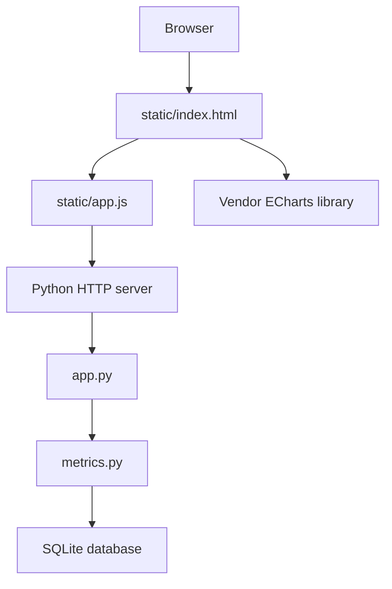
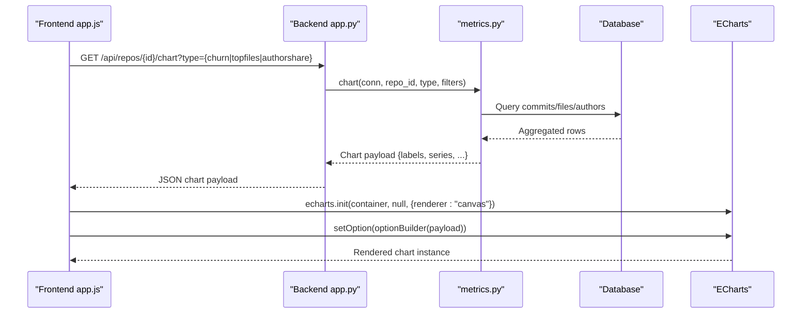
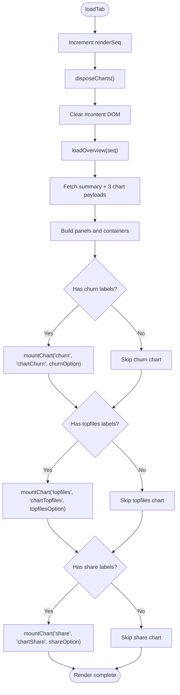
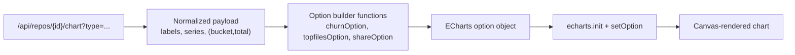
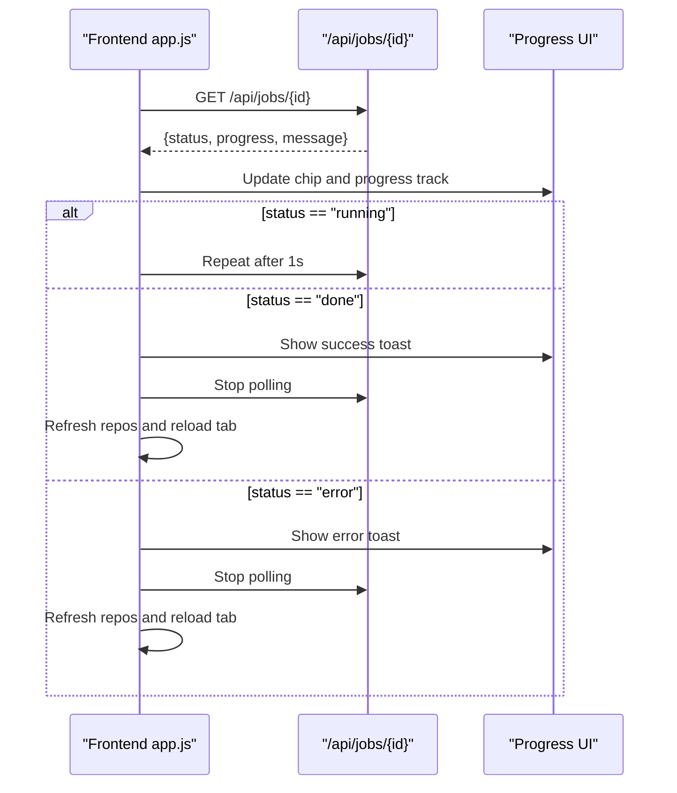
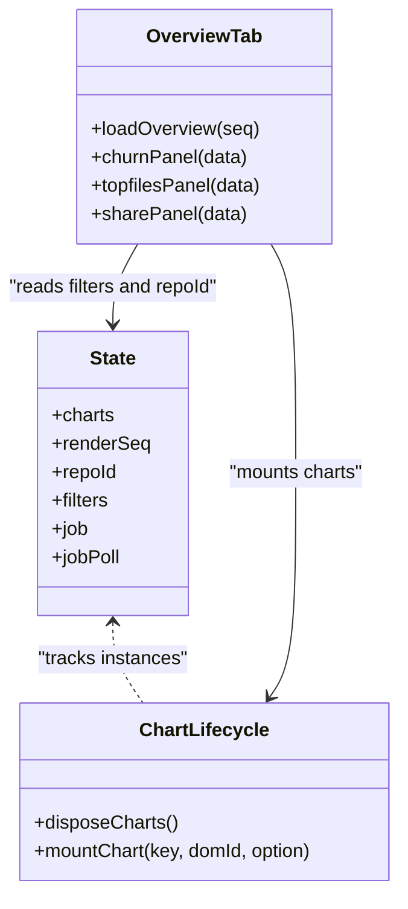
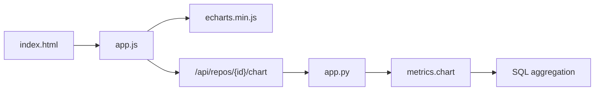

# Chart Integration & Visualization

<cite>
**Referenced Files in This Document**
- [app.py](file://app.py)
- [metrics.py](file://metrics.py)
- [static/app.js](file://static/app.js)
- [static/index.html](file://static/index.html)
</cite>

## Table of Contents
1. [Introduction](#introduction)
2. [Project Structure](#project-structure)
3. [Core Components](#core-components)
4. [Architecture Overview](#architecture-overview)
5. [Detailed Component Analysis](#detailed-component-analysis)
6. [Dependency Analysis](#dependency-analysis)
7. [Performance Considerations](#performance-considerations)
8. [Troubleshooting Guide](#troubleshooting-guide)
9. [Conclusion](#conclusion)

## Introduction
This document explains how the application integrates ECharts for visualization, focusing on chart initialization, configuration, disposal, data transformation from API responses to chart options, real-time progress updates during ingestion, responsive resizing, color and theme handling, accessibility, performance techniques for large datasets, and the relationship between chart components and the frontend state management system.

The dashboard is a single-page JavaScript application that:
- Loads ECharts from a vendor script.
- Fetches repository metrics and chart-ready data through REST endpoints.
- Transforms server-side aggregated results into ECharts option objects.
- Manages chart instances with explicit creation and disposal.
- Updates the UI during background ingestion jobs by polling job status.

## Project Structure
The visualization layer lives primarily in the frontend assets, while the backend provides both metric aggregation and chart-specific aggregation.

**Diagram sources**
- [static/index.html:66-67](file://static/index.html#L66-L67)
- [static/app.js:1068-1078](file://static/app.js#L1068-L1078)
- [app.py:121-196](file://app.py#L121-L196)
- [metrics.py:463-543](file://metrics.py#L463-L543)

**Section sources**
- [static/index.html:1-70](file://static/index.html#L1-L70)
- [static/app.js:1-10](file://static/app.js#L1-L10)
- [app.py:1-31](file://app.py#L1-L31)

## Core Components
- Frontend chart lifecycle:
  - `disposeCharts` destroys all tracked ECharts instances before re-rendering content.
  - `mountChart` creates an ECharts instance with canvas rendering, applies an option object, and stores it under a stable key.
  - The overview tab mounts three charts: churn time series, top files horizontal bar, and author share pie.
- Backend chart data pipeline:
  - `/api/repos/{id}/chart?type=...` routes through `app.py` to `metrics.chart`.
  - `metrics.chart` returns normalized chart payloads with labels, series, and optional totals or bucket metadata.
- Real-time job polling:
  - The frontend polls `/api/jobs/{id}` every second until completion or error, updating progress chips and running views.
- Responsive behavior:
  - A debounced window resize handler calls `resize()` on every tracked chart instance.

**Section sources**
- [static/app.js:1061-1078](file://static/app.js#L1061-L1078)
- [static/app.js:1224-1250](file://static/app.js#L1224-L1250)
- [app.py:169-176](file://app.py#L169-L176)
- [metrics.py:463-543](file://metrics.py#L463-L543)
- [static/app.js:248-285](file://static/app.js#L248-L285)
- [static/app.js:1932-1936](file://static/app.js#L1932-L1936)

## Architecture Overview
The chart integration follows a clear request-response flow:

**Diagram sources**
- [app.py:169-176](file://app.py#L169-L176)
- [metrics.py:463-543](file://metrics.py#L463-L543)
- [static/app.js:1068-1078](file://static/app.js#L1068-L1078)
- [static/app.js:1224-1250](file://static/app.js#L1224-L1250)

## Detailed Component Analysis

### Chart Initialization and Disposal
- Initialization:
  - Each chart is mounted via `mountChart(key, domId, option)`.
  - It checks for ECharts availability; if unavailable, it renders a fallback message.
  - It initializes with canvas renderer and stores the instance in `state.charts[key]`.
- Disposal:
  - Before each tab load, `loadTab` increments a render sequence and calls `disposeCharts`.
  - `disposeCharts` iterates over tracked keys, calls `dispose()` on each instance, and clears references.
- Mounting points:
  - Overview mounts churn, top files, and author share charts only when their payloads contain labels.

**Diagram sources**
- [static/app.js:784-801](file://static/app.js#L784-L801)
- [static/app.js:1061-1078](file://static/app.js#L1061-L1078)
- [static/app.js:1224-1250](file://static/app.js#L1224-L1250)

**Section sources**
- [static/app.js:784-801](file://static/app.js#L784-L801)
- [static/app.js:1061-1078](file://static/app.js#L1061-L1078)
- [static/app.js:1224-1250](file://static/app.js#L1224-L1250)

### Data Transformation Pipeline
The backend produces chart-ready payloads; the frontend converts them into ECharts option objects.

- Churn time series:
  - Backend groups commit timestamps into adaptive day/week/month buckets and returns added, removed, and churn series.
  - Frontend builds a stacked bar chart for added and removed lines plus a line series for churn.
  - X-axis rotation adapts to label count.
- Top files:
  - Backend returns the top ten files by churn with added and removed breakdowns.
  - Frontend renders a horizontal bar chart with labels on the right.
- Author share:
  - Backend aggregates churn per canonical author, caps at top ten plus an “Others” group, and includes total churn.
  - Frontend renders a donut-style pie chart using the CSS palette.

**Diagram sources**
- [metrics.py:463-543](file://metrics.py#L463-L543)
- [static/app.js:1103-1221](file://static/app.js#L1103-L1221)
- [static/app.js:1224-1250](file://static/app.js#L1224-L1250)

**Section sources**
- [metrics.py:440-543](file://metrics.py#L440-L543)
- [static/app.js:1103-1221](file://static/app.js#L1103-L1221)
- [static/app.js:1224-1250](file://static/app.js#L1224-L1250)

### Chart Types and Configurations
- Bar charts:
  - Churn uses stacked bars for added and removed lines.
  - Top files uses a single bar series for churn with value labels.
- Line chart:
  - Churn overlays a line series representing total churn across time buckets.
- Pie chart:
  - Author share uses a donut-style pie with radius-based inner and outer rings.

Key configuration aspects include:
- Animation duration set consistently.
- Tooltips with monospace formatting and dark backgrounds.
- Axis styling derived from CSS variables.
- Series colors taken from the computed palette.

**Section sources**
- [static/app.js:1103-1221](file://static/app.js#L1103-L1221)

### Real-Time Job Progress Polling
During repository ingestion:
- The frontend starts polling `/api/jobs/{id}` once per second.
- On each response, it updates the job chip and running view progress bar.
- When the job completes or fails, polling stops, a toast notification is shown, repositories are refreshed, and the current tab reloads if still selected.
- On page load, if the selected repository is still running, the frontend resumes polling using the latest job endpoint.

**Diagram sources**
- [static/app.js:248-285](file://static/app.js#L248-L285)
- [static/app.js:279-285](file://static/app.js#L279-L285)

**Section sources**
- [static/app.js:216-285](file://static/app.js#L216-L285)

### Responsive Resizing Behavior
- A debounced window resize listener triggers `resize()` on every tracked chart instance.
- Debouncing prevents excessive resize operations during rapid viewport changes.
- Chart instances are only resized if they still exist in `state.charts`, guarding against disposed instances.

**Section sources**
- [static/app.js:1932-1936](file://static/app.js#L1932-L1936)

### Color Palette Management and Theme Customization
- Palette reading:
  - CSS custom properties for ink, muted, hairline, surface, accent, and six semantic series colors are read at runtime.
  - `serColors()` returns the six-series palette used for chart series and legends.
- Theme usage:
  - Chart axes, tooltips, grid lines, and series colors reference these palette values.
  - Tooltip text uses a monospace font family constant.
- Extensibility:
  - Changing CSS variables affects chart colors without modifying JavaScript logic.

**Section sources**
- [static/app.js:80-92](file://static/app.js#L80-L92)
- [static/app.js:1080-1085](file://static/app.js#L1080-L1085)
- [static/app.js:1103-1221](file://static/app.js#L1103-L1221)

### Accessibility Features
- Live regions:
  - Job area, scope line, and content sections use `aria-live` attributes so screen readers announce dynamic updates.
- Interactive elements:
  - Buttons and menu items include `aria-label`, `role`, and `aria-expanded` where appropriate.
- Charts:
  - Tooltips provide structured information for mouse users; keyboard users rely on table and list views.
  - No native chart accessibility APIs are configured beyond standard ECharts defaults.

**Section sources**
- [static/index.html:36-54](file://static/index.html#L36-L54)
- [static/app.js:166-171](file://static/app.js#L166-L171)
- [static/app.js:310-342](file://static/app.js#L310-L342)

### Relationship Between Chart Components and State Management
- Central state:
  - `state.charts` holds active ECharts instances keyed by chart name.
  - `state.renderSeq` ensures late responses do not overwrite newer renders.
  - `state.repoId`, `state.filters`, and other fields drive API queries and chart payloads.
- Lifecycle coupling:
  - Tab switching disposes old charts and rebuilds the DOM before mounting new ones.
  - Repository selection resets relevant state and triggers a fresh load.
- Error resilience:
  - If ECharts is unavailable, mount functions render a fallback message instead of crashing.

**Diagram sources**
- [static/app.js:124-144](file://static/app.js#L124-L144)
- [static/app.js:784-801](file://static/app.js#L784-L801)
- [static/app.js:1061-1078](file://static/app.js#L1061-L1078)
- [static/app.js:1224-1250](file://static/app.js#L1224-L1250)

**Section sources**
- [static/app.js:124-144](file://static/app.js#L124-L144)
- [static/app.js:784-801](file://static/app.js#L784-L801)
- [static/app.js:1061-1078](file://static/app.js#L1061-L1078)
- [static/app.js:1224-1250](file://static/app.js#L1224-L1250)

## Dependency Analysis
- Frontend dependencies:
  - ECharts vendor script loaded before the application script.
  - Application script depends on DOM elements defined in the HTML template.
- Backend dependencies:
  - HTTP routing in `app.py` maps chart types to `metrics.chart`.
  - `metrics.chart` depends on SQL queries and helper functions for filtering and aggregation.

**Diagram sources**
- [static/index.html:66-67](file://static/index.html#L66-L67)
- [app.py:169-176](file://app.py#L169-L176)
- [metrics.py:463-543](file://metrics.py#L463-L543)

**Section sources**
- [static/index.html:66-67](file://static/index.html#L66-L67)
- [app.py:169-176](file://app.py#L169-L176)
- [metrics.py:463-543](file://metrics.py#L463-L543)

## Performance Considerations
- Data sampling and limits:
  - Top files chart is limited to the top ten entries by churn.
  - Author share chart caps visible segments at ten plus an “Others” aggregate.
  - Commit hash filter supports up to 900 hashes, preventing excessively large client-side selections.
- Chart instance management:
  - Explicit disposal prevents memory leaks and stale event listeners.
  - Canvas renderer is used explicitly for consistent performance.
- Rendering efficiency:
  - Debounced resize avoids frequent chart recalculations.
  - Panel visibility is conditional on payload labels, avoiding empty chart mounts.
- Network efficiency:
  - Chart payloads are pre-aggregated server-side, reducing client computation.
  - Job polling interval is one second, balancing responsiveness and server load.

[No sources needed since this section provides general guidance]

## Troubleshooting Guide
- ECharts unavailable:
  - If the vendor script fails to load, charts show a fallback message indicating the library is unavailable.
  - Verify the vendor script path and network access.
- Empty charts:
  - Charts are only mounted when their payloads have labels.
  - Check filters and repository ingestion status; ensure commits match the selected scope.
- Stale or overlapping renders:
  - The render sequence guard prevents older responses from overwriting newer content.
  - If charts appear inconsistent, verify that `loadTab` is called and `disposeCharts` runs before mounting.
- Job polling issues:
  - If progress does not update, check the job endpoint and browser console for errors.
  - Ensure the job ID is valid and the repository ingestion process is active.

**Section sources**
- [static/app.js:1068-1078](file://static/app.js#L1068-L1078)
- [static/app.js:1224-1250](file://static/app.js#L1224-L1250)
- [static/app.js:248-285](file://static/app.js#L248-L285)

## Conclusion
The chart integration combines a simple, robust frontend lifecycle with server-side aggregation to deliver performant visualizations. ECharts instances are created, configured, and disposed deterministically, while the state object coordinates data fetching, rendering, and cleanup. Real-time job polling keeps users informed during ingestion, and responsive resizing ensures charts remain usable across viewport changes. The design favors clarity and maintainability: chart options are built from normalized payloads, colors come from CSS variables, and heavy lifting is done on the backend. For large datasets, the implementation relies on server-side limits, adaptive bucketing, and careful instance management to keep the interface responsive.