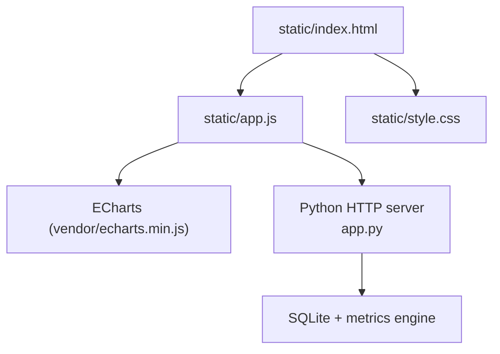
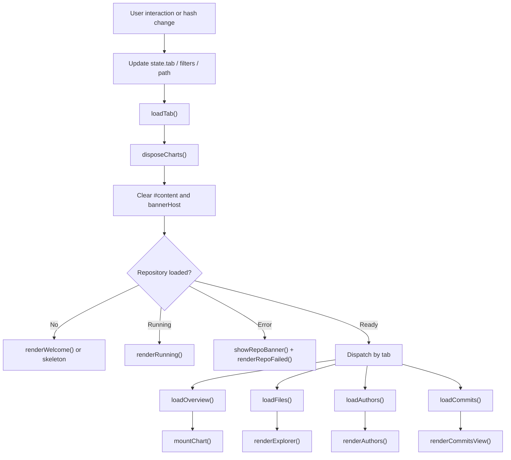
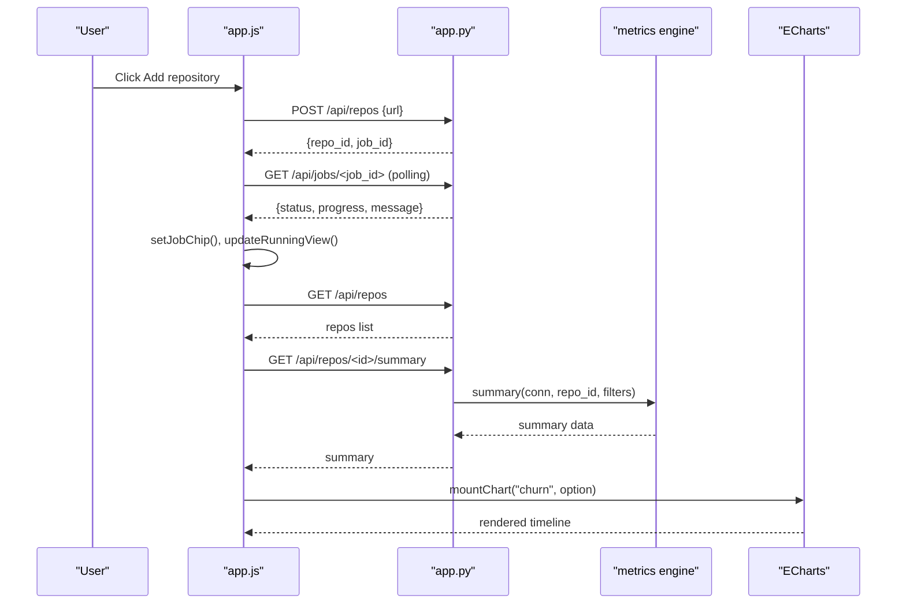
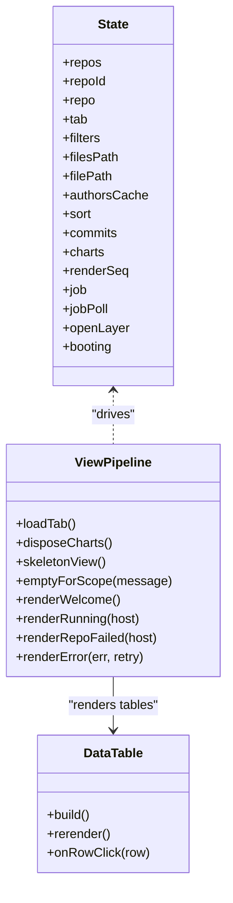
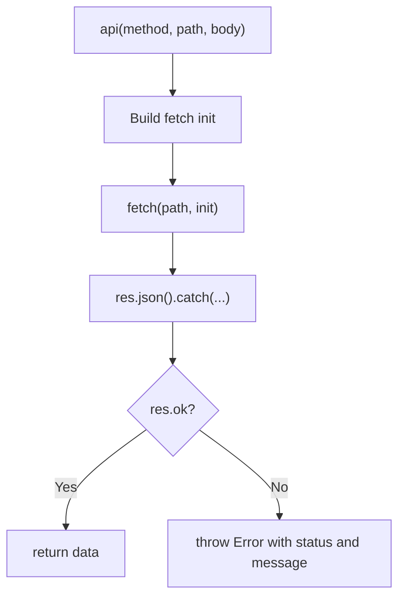
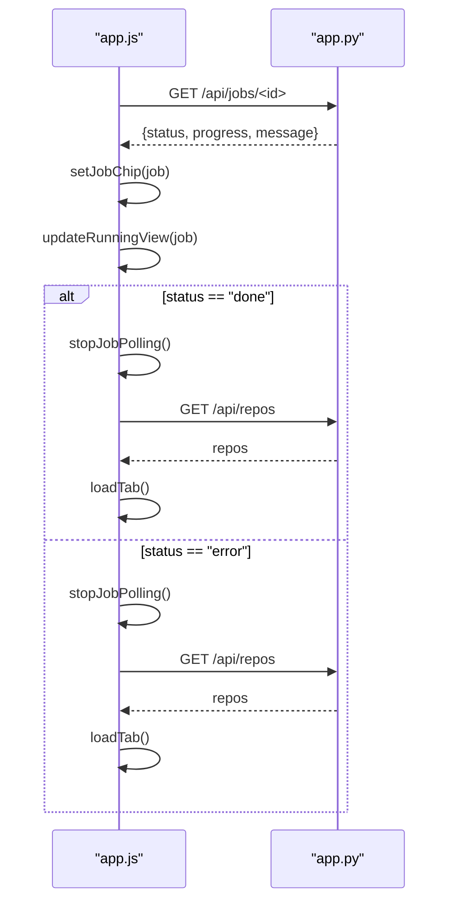
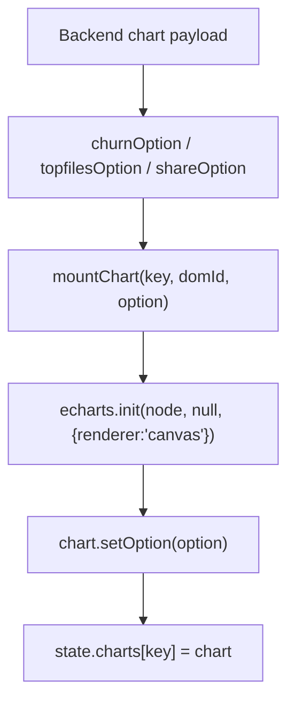
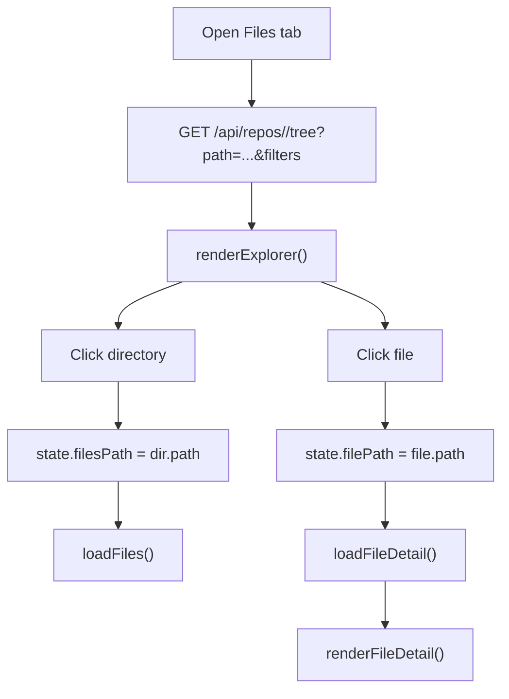
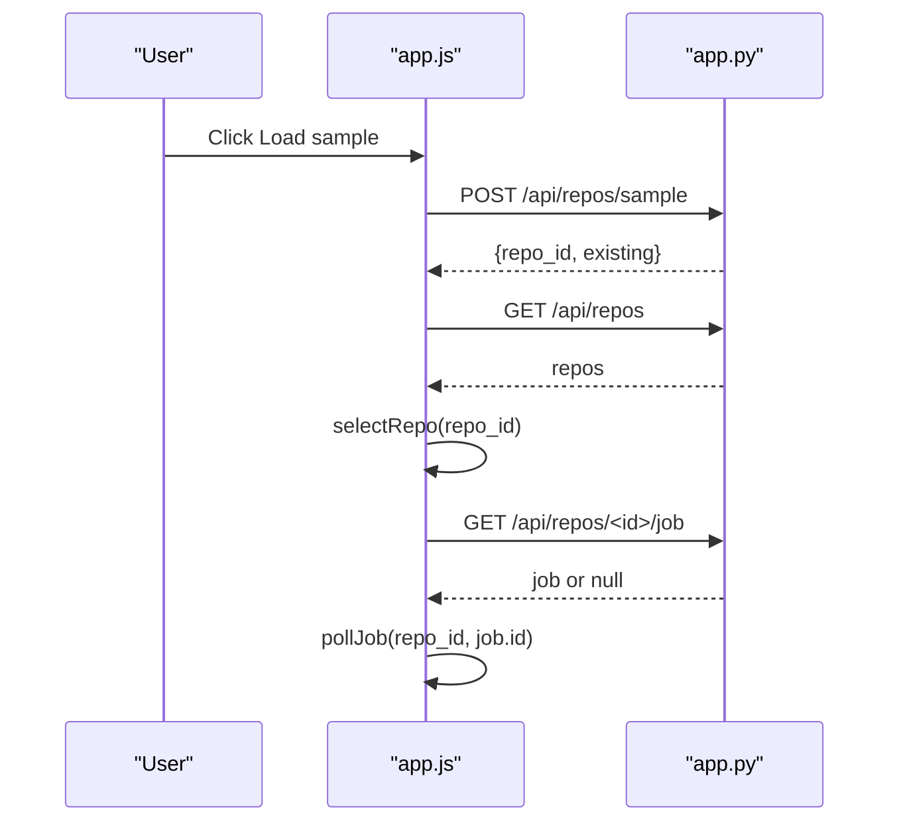
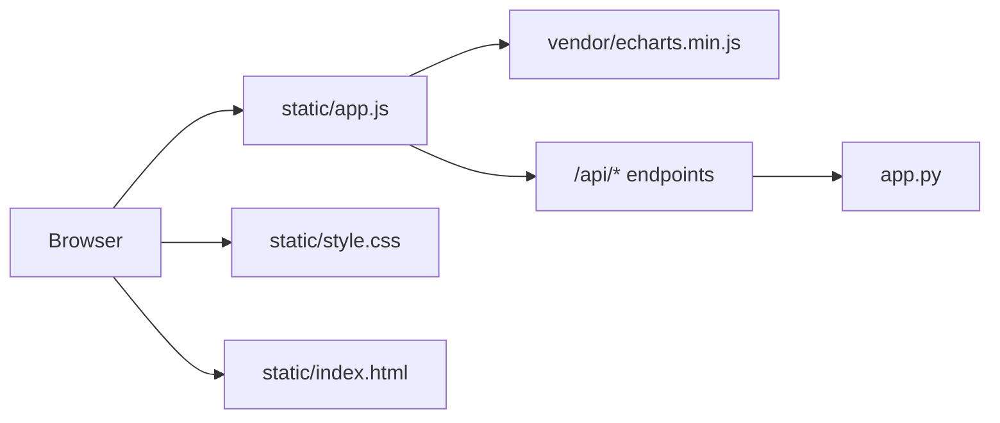

# Frontend Architecture

<cite>
**Referenced Files in This Document**
- [index.html](file://static/index.html)
- [app.js](file://static/app.js)
- [style.css](file://static/style.css)
- [app.py](file://app.py)
- [README.md](file://README.md)
</cite>

## Table of Contents
1. [Introduction](#introduction)
2. [Project Structure](#project-structure)
3. [Core Components](#core-components)
4. [Architecture Overview](#architecture-overview)
5. [Detailed Component Analysis](#detailed-component-analysis)
6. [Dependency Analysis](#dependency-analysis)
7. [Performance Considerations](#performance-considerations)
8. [Troubleshooting Guide](#troubleshooting-guide)
9. [Conclusion](#conclusion)

## Introduction
This document describes the vanilla JavaScript single-page application that powers the Repo Analysis Tool dashboard. The frontend is framework-free, uses a single global state object to drive views, communicates with a Python backend through REST endpoints, and integrates ECharts for interactive visualizations such as churn timelines, top volatile files, and author share pie charts. It also documents repository ingestion progress polling, filter-driven data scoping, table rendering, drawer/popover layering, responsive layout, accessibility attributes, and CSS theme customization.

The project runs locally without a build step: the Python server serves static assets and API routes, while the browser renders the SPA from `static/index.html`, `static/app.js`, and `static/style.css`.

**Section sources**
- [README.md:1-46](file://README.md#L1-L46)

## Project Structure
At the frontend level, the application consists of three primary files:

| File | Responsibility |
| --- | --- |
| `static/index.html` | Application shell, header, filter rail, tab bar, content area, drawer/popover/toast hosts, and script imports including ECharts. |
| `static/app.js` | All runtime logic: DOM helpers, state, API client, job polling, repository selector, filters, tabs, tables, ECharts integration, and startup initialization. |
| `static/style.css` | Design tokens, layout, components, responsive breakpoints, animations, and chart container styles. |

**Diagram sources**
- [index.html:1-70](file://static/index.html#L1-L70)
- [app.js:1-10](file://static/app.js#L1-L10)
- [app.py:1-31](file://app.py#L1-L31)

**Section sources**
- [index.html:1-70](file://static/index.html#L1-L70)
- [app.js:1-10](file://static/app.js#L1-L10)
- [style.css:1-51](file://static/style.css#L1-L51)

## Core Components
The SPA is organized around these core concepts:

- **Global state**: A single `state` object holds repositories, selected repository, active tab, filters, file navigation, authors cache, sort state, commits pagination, chart instances, job progress, and UI layer state.
- **DOM helper factory**: A lightweight `el(tag, props, kids)` builder creates elements, sets attributes, text, inner HTML, dataset values, event listeners, and children.
- **API client**: A small `fetch` wrapper normalizes JSON responses, throws typed errors with HTTP status, and handles both JSON and binary bodies.
- **View pipeline**: Tab selection clears previous charts, clears the content host, shows skeletons or empty states, then loads data per tab and mounts ECharts.
- **Filter rail**: Date presets, date inputs, author radio buttons, commit picker, and active filter chips update `state.filters` and re-render scope and current tab.
- **Tables**: A generic `dataTable` function supports sortable columns, numeric formatting, row click handlers, keyboard activation, and empty states.
- **Layer system**: A reusable `openLayer/closeLayer` mechanism manages popovers, drawers, menus, and backdrops with focus management and escape/click-outside dismissal.
- **Job polling**: An interval-based poller checks `/api/jobs/<id>` until completion or error, updates the header chip and running view, and refreshes repository state afterward.

**Diagram sources**
- [app.js:783-802](file://static/app.js#L783-L802)
- [app.js:1060-1078](file://static/app.js#L1060-L1078)
- [app.js:1223-1254](file://static/app.js#L1223-L1254)
- [app.js:1312-1324](file://static/app.js#L1312-L1324)
- [app.js:1455-1465](file://static/app.js#L1455-L1465)
- [app.js:1586-1602](file://static/app.js#L1586-L1602)

**Section sources**
- [app.js:8-65](file://static/app.js#L8-L65)
- [app.js:94-114](file://static/app.js#L94-L114)
- [app.js:116-144](file://static/app.js#L116-L144)
- [app.js:173-200](file://static/app.js#L173-L200)
- [app.js:216-285](file://static/app.js#L216-L285)
- [app.js:922-1013](file://static/app.js#L922-L1013)

## Architecture Overview
The frontend architecture follows a unidirectional flow: user actions mutate `state`, which triggers view reconstruction. Data comes from the backend via REST endpoints; visualization data is transformed into ECharts option objects.

**Diagram sources**
- [app.js:459-574](file://static/app.js#L459-L574)
- [app.js:248-285](file://static/app.js#L248-L285)
- [app.js:1223-1254](file://static/app.js#L1223-L1254)
- [app.py:177-196](file://app.py#L177-L196)
- [app.py:198-211](file://app.py#L198-L211)

## Detailed Component Analysis

### State Management and View Lifecycle
The SPA maintains one central state object. Key responsibilities include:

- Repository selection and view persistence per repository.
- Filter composition across date range, author, and pinned commit hashes.
- Sorting state per table identifier.
- Commit pagination state with query, offset, limit, total, rows, and selection map.
- Chart instance registry keyed by chart name.
- Job polling lifecycle and open layer tracking.

The view lifecycle ensures that each tab load disposes previous ECharts instances, clears the content area, shows appropriate loading or empty states, and only mounts new charts after successful data resolution. A render sequence counter prevents stale asynchronous responses from overwriting newer views.

**Diagram sources**
- [app.js:116-144](file://static/app.js#L116-L144)
- [app.js:783-802](file://static/app.js#L783-L802)
- [app.js:922-1013](file://static/app.js#L922-L1013)

**Section sources**
- [app.js:116-144](file://static/app.js#L116-L144)
- [app.js:783-802](file://static/app.js#L783-L802)
- [app.js:922-1013](file://static/app.js#L922-L1013)

### REST API Communication Layer
The frontend uses a unified `api(method, path, body)` helper:

- Sets headers and serializes JSON unless the body is a `Blob` or `File`.
- Parses response JSON safely.
- Throws an error when the HTTP response is not OK, attaching the status code and server-provided error message when available.
- Returns parsed data on success.

Backend routing in the Python server maps paths to handlers for health, repositories, jobs, summaries, tree, file detail, authors, commits, charts, sample ingestion, upload, author merging, and deletion. Errors are wrapped as JSON responses with appropriate HTTP status codes.

**Diagram sources**
- [app.js:94-114](file://static/app.js#L94-L114)
- [app.py:73-91](file://app.py#L73-L91)
- [app.py:120-196](file://app.py#L120-L196)

**Section sources**
- [app.js:94-114](file://static/app.js#L94-L114)
- [app.py:120-196](file://app.py#L120-L196)

### Polling Mechanisms for Job Progress
Ingestion jobs are long-running operations. The frontend:

- Starts polling immediately after receiving a job ID.
- Updates a compact job chip in the header with spinner, message, and progress track.
- Updates the running view’s large progress track and note.
- Stops polling on completion or error.
- Refreshes the repository list and reloads the current tab after job completion or failure.
- Resumes any running job after page reload by querying the latest job for the selected repository.

**Diagram sources**
- [app.js:216-285](file://static/app.js#L216-L285)

**Section sources**
- [app.js:216-285](file://static/app.js#L216-L285)

### ECharts Integration for Interactive Visualizations
ECharts is integrated through a small mounting utility:

- `disposeCharts()` disposes all previously mounted instances before re-rendering.
- `mountChart(key, domId, option)` initializes an ECharts instance on a DOM node using canvas rendering and stores it in `state.charts[key]`.
- Chart options are built from backend chart payloads returned by `/api/repos/<id>/chart?type=...`.

Supported chart types include:

- Churn over time: stacked bars for added and removed lines plus a line series for churn.
- Top volatile files: horizontal bar chart showing churn per file path.
- Author churn share: donut-style pie chart with computed totals and percentages.

The palette is read from CSS custom properties so charts inherit the application theme.

**Diagram sources**
- [app.js:1060-1078](file://static/app.js#L1060-L1078)
- [app.js:1103-1221](file://static/app.js#L1103-L1221)

**Section sources**
- [app.js:1060-1078](file://static/app.js#L1060-L1078)
- [app.js:1103-1221](file://static/app.js#L1103-L1221)

### Tree Navigation and File Explorer
The Files tab provides directory traversal and file detail views:

- `loadFiles()` requests the repository tree for the current path and applies filters.
- `renderExplorer()` builds breadcrumbs, a header with directory/file counts, and a sortable table of children.
- Clicking a directory navigates deeper; clicking a file opens its detail view.
- `loadFileDetail()` fetches per-file metrics and author ownership breakdown.
- `renderFileDetail()` shows tiles, an ownership table, and a back button.

This is not a traditional ECharts tree; it is a DOM-based hierarchical explorer backed by the `/api/repos/<id>/tree` endpoint.

**Diagram sources**
- [app.js:1312-1324](file://static/app.js#L1312-L1324)
- [app.js:1350-1394](file://static/app.js#L1350-L1394)
- [app.js:1396-1453](file://static/app.js#L1396-L1453)

**Section sources**
- [app.js:1312-1324](file://static/app.js#L1312-L1324)
- [app.js:1350-1394](file://static/app.js#L1350-L1394)
- [app.js:1396-1453](file://static/app.js#L1396-L1453)

### User Interaction Flows
Key user flows include:

- Adding a repository by URL, uploading a zip, or loading the sample.
- Selecting a repository from the header menu.
- Applying date presets, custom dates, author filters, and pinned commit sets.
- Navigating tabs and filtering data accordingly.
- Searching and paginating commits.
- Selecting commits and applying them as a commit-set filter.
- Merging author identities through a modal drawer.
- Dismissing layers with Escape or backdrop clicks.

**Diagram sources**
- [app.js:558-574](file://static/app.js#L558-L574)
- [app.js:414-457](file://static/app.js#L414-L457)
- [app.js:279-285](file://static/app.js#L279-L285)

**Section sources**
- [app.js:459-574](file://static/app.js#L459-L574)
- [app.js:576-739](file://static/app.js#L576-L739)
- [app.js:1586-1775](file://static/app.js#L1586-L1775)
- [app.js:1777-1885](file://static/app.js#L1777-L1885)

### DOM Manipulation Patterns
The application avoids templates and frameworks by using a declarative element factory:

- `el(tag, props, kids)` creates nodes and assigns attributes, classes, text, inner HTML, dataset entries, event listeners, and child nodes.
- `clear(node)` removes all children efficiently.
- `esc(s)` escapes dangerous characters for safe text insertion.
- Tables and panels are composed by nesting `el` calls rather than concatenating strings.
- Event delegation is used sparingly; most interactions attach listeners directly to created elements.

This pattern keeps rendering predictable and makes it easy to attach accessibility attributes like `aria-label`, `role`, and `aria-live`.

**Section sources**
- [app.js:8-42](file://static/app.js#L8-L42)
- [app.js:922-1013](file://static/app.js#L922-L1013)

### Responsive Design Considerations
Responsive behavior is implemented in CSS:

- On screens below 979px, the filter rail becomes a fixed slide-in panel toggled by a mobile button.
- Panel grids collapse to a single column on smaller screens.
- Drawer width adapts to full viewport width on very small screens.
- Tile grids adapt to two columns on narrow screens.
- Chart containers use percentage widths and fixed heights, and ECharts instances are resized on window resize events.

Accessibility-friendly focus indicators and visible outlines are provided through `:focus-visible`.

**Section sources**
- [style.css:574-602](file://static/style.css#L574-L602)
- [app.js:1932-1936](file://static/app.js#L1932-L1936)

### Accessibility Compliance
The SPA includes several accessibility features:

- Semantic roles such as `tablist`, `tab`, `dialog`, `menu`, `menuitem`, and `alert`.
- Live regions with `aria-live="polite"` for job status, scope summary, and toast notifications.
- Descriptive `aria-label` attributes on inputs, buttons, and interactive elements.
- Keyboard support for tabs, filters, tables, and dismissible layers.
- Escape key closes open layers.
- Focus management prioritizes input fields when opening drawers and popovers.
- `noscript` messaging informs users that JavaScript is required.

**Section sources**
- [index.html:32-60](file://static/index.html#L32-L60)
- [app.js:173-200](file://static/app.js#L173-L200)
- [app.js:1911-1919](file://static/app.js#L1911-L1919)

### Cross-Browser Compatibility
The frontend avoids modern build tools and relies on widely supported browser APIs:

- Uses `fetch`, `Promise`, `Intl.NumberFormat`, `getComputedStyle`, and standard DOM APIs.
- Uses `querySelector` and basic event handling.
- Avoids experimental syntax beyond what is expected in modern browsers.
- ECharts is loaded from a vendor bundle, isolating third-party compatibility concerns.

There is no explicit polyfill strategy in the frontend; compatibility depends on the target environment supporting ES2015+ features and the Fetch API.

**Section sources**
- [app.js:1-10](file://static/app.js#L1-L10)
- [app.js:44-65](file://static/app.js#L44-L65)
- [index.html:66-68](file://static/index.html#L66-L68)

## Dependency Analysis
The frontend has minimal external dependencies:

- ECharts is included as a vendor script.
- The application itself has no package manager dependencies.
- The backend is a self-contained Python HTTP server using only the standard library.

**Diagram sources**
- [index.html:66-68](file://static/index.html#L66-L68)
- [app.js:1-10](file://static/app.js#L1-L10)
- [app.py:1-31](file://app.py#L1-L31)

**Section sources**
- [index.html:66-68](file://static/index.html#L66-L68)
- [app.py:1-31](file://app.py#L1-L31)

## Performance Considerations
Several techniques help keep the SPA responsive:

- **Chart disposal**: Previous ECharts instances are disposed before re-rendering to prevent memory leaks and redundant rendering.
- **Debounced interactions**: Search inputs and window resize handlers use debouncing to reduce frequent API calls and chart resizes.
- **Skeleton views**: Lightweight placeholder structures are shown during initial boot and data loading.
- **Pagination**: Commits are fetched with configurable limit and offset.
- **Author caching**: The authors list is cached per repository to avoid repeated requests.
- **Render sequencing**: A render sequence counter prevents stale asynchronous responses from replacing newer views.
- **Efficient DOM clearing**: `clear(node)` removes children in a loop rather than rebuilding entire trees unnecessarily.
- **Canvas renderer**: ECharts is initialized with canvas rendering for better performance with larger datasets.

Recommendations for even larger datasets:

- Increase pagination limits carefully based on backend constraints.
- Consider virtualized lists if commit tables grow significantly.
- Limit chart series length by aggregating time buckets or truncating top-N results.
- Debounce filter changes more aggressively when combining multiple expensive queries.
- Monitor ECharts instance count and ensure disposal on every tab switch.

**Section sources**
- [app.js:56-64](file://static/app.js#L56-L64)
- [app.js:1060-1078](file://static/app.js#L1060-L1078)
- [app.js:1932-1936](file://static/app.js#L1932-L1936)
- [app.js:783-802](file://static/app.js#L783-L802)

## Troubleshooting Guide
Common issues and their frontend handling:

- **Network or server errors**: The API wrapper throws errors with status and message; views display an error state with a retry action where applicable.
- **Missing ECharts**: If the vendor script is unavailable, chart containers show a fallback message instead of crashing.
- **Job failures**: Polling stops on error, displays an error toast, refreshes repositories, and allows retry or deletion from the failed repository banner.
- **Invalid filters**: Date validation prevents invalid ranges and shows toast messages; rails re-render to reflect corrected state.
- **Stale repository state**: The repository selector self-heals by refreshing the repository list when the selected repository is missing.
- **Layer focus and dismissal**: Layers close on Escape or outside click; focus is moved to specified inputs when opened.

Backend-side error handling wraps unexpected exceptions as JSON 500 responses and validates request bodies, sizes, and parameters.

**Section sources**
- [app.js:906-920](file://static/app.js#L906-L920)
- [app.js:1068-1078](file://static/app.js#L1068-L1078)
- [app.js:248-285](file://static/app.js#L248-L285)
- [app.js:645-667](file://static/app.js#L645-L667)
- [app.js:414-457](file://static/app.js#L414-L457)
- [app.py:73-91](file://app.py#L73-L91)
- [app.py:400-424](file://app.py#L400-L424)

## Conclusion
The RAT frontend is a lean, framework-free SPA that emphasizes clarity, accessibility, and performance. A single state object drives views, ECharts provides interactive visualizations, and a simple REST layer communicates with a Python backend. The design separates concerns cleanly: HTML defines structure, CSS defines tokens and layout, and JavaScript orchestrates state, DOM, events, and network requests. For future enhancements, consider adding optimistic UI updates for mutations, improving large-table virtualization, and extending chart configuration options while preserving the current theme-driven approach.