# SPA Structure & State Management

<cite>
**Referenced Files in This Document**   
- [app.js](file://static/app.js)
- [index.html](file://static/index.html)
- [README.md](file://README.md)
</cite>

## Table of Contents
1. [Introduction](#introduction)
2. [Project Structure](#project-structure)
3. [Core Components](#core-components)
4. [Architecture Overview](#architecture-overview)
5. [Detailed Component Analysis](#detailed-component-analysis)
6. [Dependency Analysis](#dependency-analysis)
7. [Performance Considerations](#performance-considerations)
8. [Troubleshooting Guide](#troubleshooting-guide)
9. [Conclusion](#conclusion)

## Introduction
This document explains the vanilla JavaScript single-page application architecture and its state management patterns. The application is a repository analysis dashboard that uses one central state object to drive every view, including repository selection, tab navigation, filter management, file explorer behavior, author merging, commit search and selection, chart rendering, and layer-based modals, drawers, and popovers. There is no framework or build step: DOM nodes are created with a custom helper function, events are attached directly, and views are rebuilt from API responses.

The frontend runs against a small Python backend and communicates through REST endpoints under `/api`. The HTML shell defines the header, filter rail, tabs, content area, and shared containers for layers, popovers, and toasts.

**Section sources**
- [README.md:1-46](file://README.md#L1-L46)
- [index.html:1-70](file://static/index.html#L1-L70)

## Project Structure
The frontend consists of two primary files:

- `static/index.html`: The application shell. It provides semantic regions such as the repository selector, job progress area, header actions, filter rail, tab bar, scope line, banner host, main content section, drawer host, popover host, and toast host. It also loads ECharts and the application script.
- `static/app.js`: The entire SPA logic. It contains helpers, formatting utilities, an HTTP wrapper, the central state object, repository selection, filter rail, tab dispatch, per-tab loaders, table and chart builders, layer management, job polling, and initialization.

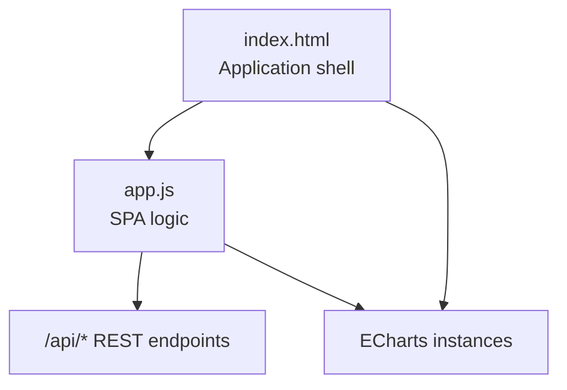

**Diagram sources**
- [index.html:10-68](file://static/index.html#L10-L68)
- [app.js:94-114](file://static/app.js#L94-L114)
- [app.js:1060-1078](file://static/app.js#L1060-L1078)

**Section sources**
- [index.html:10-68](file://static/index.html#L10-L68)
- [app.js:1-10](file://static/app.js#L1-L10)

## Core Components
At the heart of the application is a single central state object. All UI components read from this object and update it in response to user interactions. Views are not incrementally patched; they are cleared and rebuilt based on the current state and fresh API data.

Key responsibilities of the central state include:

| Area | State fields | Purpose |
|---|---|---|
| Repository context | `repos`, `repoId`, `repo` | Tracks available repositories, the selected repository identifier, and the loaded repository metadata. |
| Navigation | `tab` | Current active tab among overview, files, authors, and commits. |
| Filters | `filters.from`, `filters.to`, `filters.hashes`, `filters.author` | Date range, pinned commit hashes, and author identity filter. |
| File explorer | `filesPath`, `filePath` | Current directory path and selected file path within the files tab. |
| View persistence | `view` | Per-repository remembered state including tab, filters, file path, and selected file. |
| Author cache | `authorsCache` | Cached unfiltered author list per repository to power filter options and merge operations. |
| Sorting | `sort` | Per-table sort configuration keyed by table identifier. |
| Commits list | `commits.query`, `commits.offset`, `commits.limit`, `commits.total`, `commits.rows`, `commits.selection` | Search query, pagination, total count, page rows, and selected commit hashes. |
| Charts | `charts` | Map of named ECharts instances, disposed before re-rendering. |
| Rendering coordination | `renderSeq` | Prevents stale asynchronous responses from overwriting newer views. |
| Scope display | `lastH` | Number of commits currently in scope, shown in the scope line. |
| Filter presets | `presetKey` | Active date preset label. |
| Background jobs | `job`, `jobPoll` | Running ingestion job and its polling interval. |
| Layer system | `openLayer` | Currently open modal, drawer, or popover. |
| Boot state | `booting` | First-load flag used to show skeleton views instead of the welcome screen during initial repository loading. |

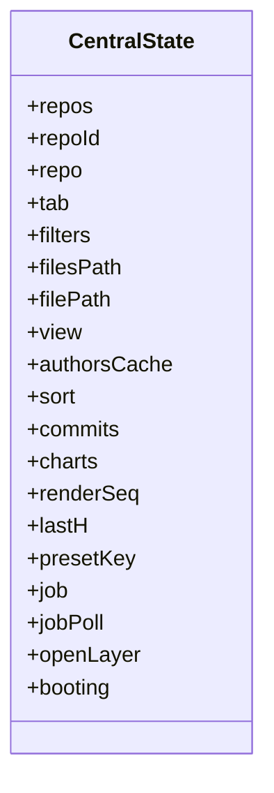

**Diagram sources**
- [app.js:116-144](file://static/app.js#L116-L144)

**Section sources**
- [app.js:116-144](file://static/app.js#L116-L144)

## Architecture Overview
The application follows a unidirectional data flow:

1. User interaction updates the central state.
2. State changes trigger view rebuilds.
3. View loaders call REST APIs.
4. API responses update state and render new DOM trees.
5. Charts are mounted into dedicated container elements and disposed when content is re-rendered.
6. URL hash changes synchronize with the active tab.
7. Layers manage overlays such as popovers, drawers, and confirmation dialogs.

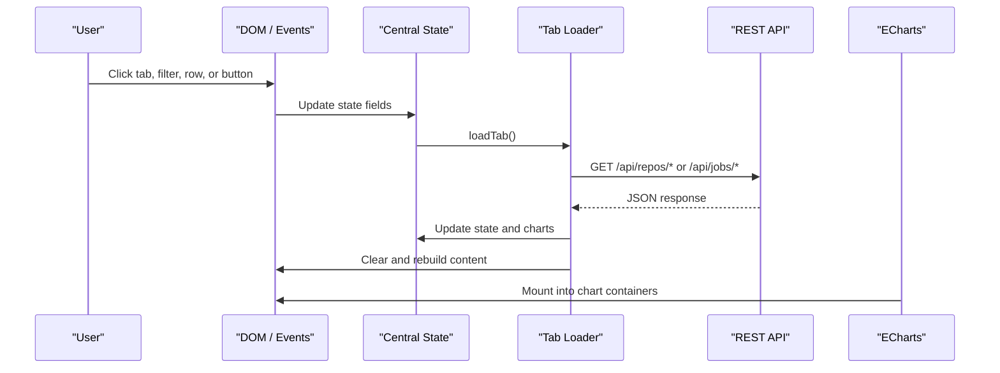

**Diagram sources**
- [app.js:783-801](file://static/app.js#L783-L801)
- [app.js:1224-1254](file://static/app.js#L1224-L1254)
- [app.js:1060-1078](file://static/app.js#L1060-L1078)

**Section sources**
- [app.js:783-801](file://static/app.js#L783-L801)
- [app.js:1224-1254](file://static/app.js#L1224-L1254)

## Detailed Component Analysis

### Central State Object and View Persistence
The central state object is the single source of truth. When switching repositories, the current view is saved so that returning to the same repository restores its tab, filters, file explorer position, and selected file. Loading a repository reads the persisted view and synchronizes the URL hash with the restored tab.

Important behaviors:

- `saveView()` persists the current repository’s tab, filters, file path, and selected file.
- `loadView(id)` restores those values and ensures the URL hash matches the active tab.
- `selectRepo(id)` saves the previous view, resets repository-scoped state, refreshes authors, resumes running ingestion jobs, and loads the appropriate tab.
- `refreshRepos()` updates the repository list, self-heals missing selections, auto-selects a ready repository if none is selected, and renders the initial UI.

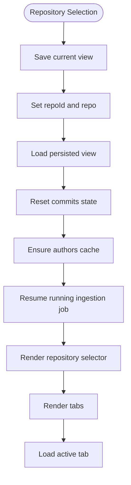

**Diagram sources**
- [app.js:375-404](file://static/app.js#L375-L404)
- [app.js:414-457](file://static/app.js#L414-L457)

**Section sources**
- [app.js:375-404](file://static/app.js#L375-L404)
- [app.js:414-457](file://static/app.js#L414-L457)

### Custom DOM Helper and Event Handling Patterns
The application avoids template engines and frameworks. Instead, it uses a compact `el(tag, props, kids)` helper to create DOM nodes declaratively.

Supported prop behaviors include:

- `class` sets `className`.
- `text` sets `textContent`.
- `html` sets `innerHTML`.
- `dataset` copies dataset entries.
- Properties starting with `on` become event listeners after stripping the prefix and lowercasing the event name.
- `value` sets input values.
- Other properties are set via `setAttribute`.

Children can be strings, numbers, DOM nodes, or arrays, with nullish values ignored. A `clear(node)` utility removes all child nodes, which is used extensively when rebuilding views.

Event handling is direct:

- Buttons, inputs, and rows attach listeners at creation time.
- Row click handlers check for nested interactive elements before acting.
- Keyboard accessibility is added where needed, such as Enter and Space for clickable rows.
- Global keyboard and click listeners close open layers.

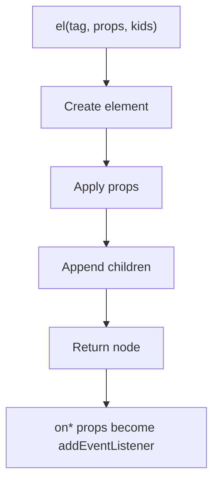

**Diagram sources**
- [app.js:8-36](file://static/app.js#L8-L36)

**Section sources**
- [app.js:8-36](file://static/app.js#L8-L36)

### Repository Selector and Repository Lifecycle
The repository selector shows the currently selected repository, status dot, and menu items. Users can select a repository, delete one, clone from a URL, upload a zip archive, or load the bundled sample repository.

Lifecycle highlights:

- `renderSelector()` builds the selector button and attaches click behavior.
- `openRepoMenu()` opens a popover-style menu anchored to the selector.
- `armDelete()` and `doDelete()` handle destructive deletion safely.
- `refreshRepos()` fetches `/api/repos`, updates state, and decides whether to auto-select a repository.
- `selectRepo()` triggers full view restoration and tab loading.

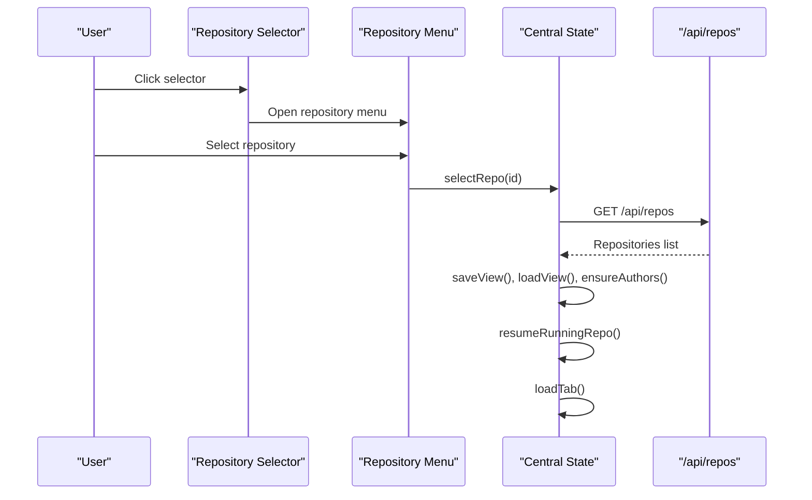

**Diagram sources**
- [app.js:287-373](file://static/app.js#L287-L373)
- [app.js:436-457](file://static/app.js#L436-L457)
- [app.js:414-434](file://static/app.js#L414-L434)

**Section sources**
- [app.js:287-373](file://static/app.js#L287-L373)
- [app.js:414-457](file://static/app.js#L414-L457)

### Tab Navigation and Routing via URL Hash
The application supports four tabs: overview, files, authors, and commits. Tab state is synchronized with the URL hash.

Routing behavior:

- On initialization, the hash is parsed and the matching tab becomes active.
- Changing tabs calls `setTab()`, which updates `state.tab`, replaces the URL hash without creating history entries, re-renders tabs, and loads the tab content.
- A global `hashchange` listener updates state and reloads the tab when the browser back/forward buttons change the hash.
- `loadTab()` increments `renderSeq`, disposes charts, clears the content and banner areas, and dispatches to the correct loader.

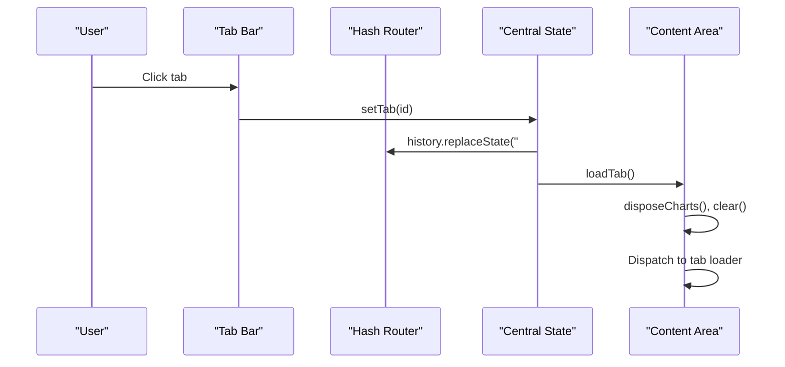

**Diagram sources**
- [app.js:760-781](file://static/app.js#L760-L781)
- [app.js:783-801](file://static/app.js#L783-L801)
- [app.js:1887-1931](file://static/app.js#L1887-L1931)

**Section sources**
- [app.js:760-781](file://static/app.js#L760-L781)
- [app.js:783-801](file://static/app.js#L783-L801)
- [app.js:1887-1931](file://static/app.js#L1887-L1931)

### Filter Management and Scope Display
Filters control the commit set used across all views. The filter rail includes:

- Date range presets and manual date inputs.
- Author radio buttons populated from the cached author list.
- Commit picker to pin explicit commit hashes.
- Active filter chips showing current filters and allowing removal.
- Clear-all action.

Filter changes follow a consistent pattern:

1. Update `state.filters`.
2. Call `applyFilters()`.
3. Persist the view.
4. Re-render the filter rail.
5. Re-render the scope line.
6. Reload the active tab.

The scope line displays the repository name, number of commits in scope, date range, selected author, and pinned commit count.

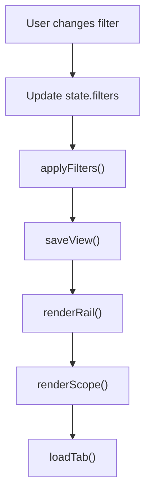

**Diagram sources**
- [app.js:576-739](file://static/app.js#L576-L739)
- [app.js:741-758](file://static/app.js#L741-L758)

**Section sources**
- [app.js:576-739](file://static/app.js#L576-L739)
- [app.js:741-758](file://static/app.js#L741-L758)

### Files Tab and File Detail Navigation
The files tab implements a repository tree explorer. Users navigate directories and open file detail views.

Key behaviors:

- `loadFiles()` fetches the tree for the current path and applies filters.
- `renderExplorer()` builds breadcrumbs, a summary header, and a sortable table of directories and files.
- Clicking a directory updates `state.filesPath`; clicking a file updates `state.filePath`.
- `loadFileDetail()` fetches per-file metrics and author ownership.
- The file detail view includes tiles, an ownership table, and a back button that restores the parent directory.

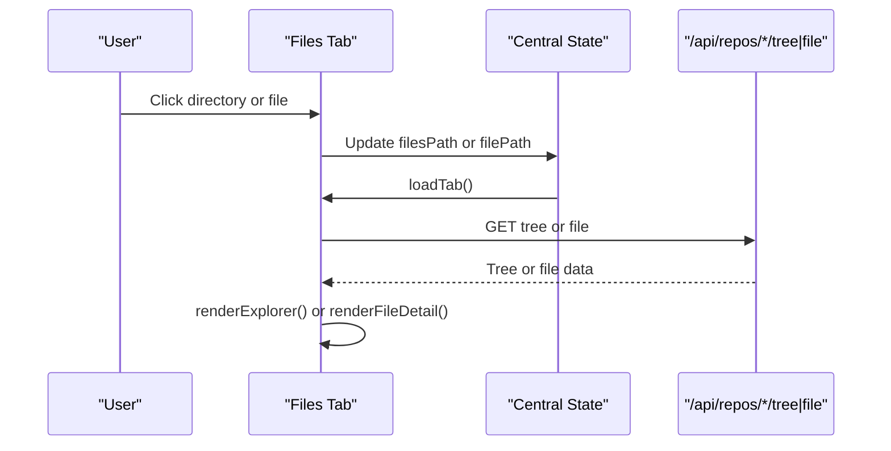

**Diagram sources**
- [app.js:1312-1394](file://static/app.js#L1312-L1394)
- [app.js:1396-1453](file://static/app.js#L1396-L1453)

**Section sources**
- [app.js:1312-1394](file://static/app.js#L1312-L1394)
- [app.js:1396-1453](file://static/app.js#L1396-L1453)

### Authors Tab and Identity Merging
The authors tab lists canonical authors and their identities. Users can merge multiple identities into one canonical author.

Workflow:

- `loadAuthors()` fetches authors filtered by the current scope.
- `renderAuthors()` builds a table with merge controls.
- `openMergeDrawer()` creates a drawer where users choose a canonical author and select identities to absorb.
- The merge request updates the server-side author mapping, clears the author cache, reloads authors, re-renders the filter rail, and reloads the current tab.

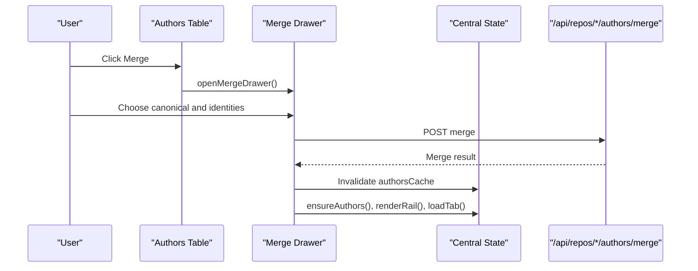

**Diagram sources**
- [app.js:1455-1584](file://static/app.js#L1455-L1584)

**Section sources**
- [app.js:1455-1584](file://static/app.js#L1455-L1584)

### Commits Tab, Search, Pagination, and Selection
The commits tab supports searching, paginating, selecting commits, and applying selected commits as a filter.

Key features:

- Debounced search input updates `state.commits.query` and resets pagination.
- Previous and Next buttons adjust `offset`.
- Selection state is stored in `state.commits.selection`.
- “Select all matching” fetches up to 900 commits and marks them selected.
- Applying selection pins commit hashes to `state.filters.hashes`, switches to the overview tab, and reapplies filters.

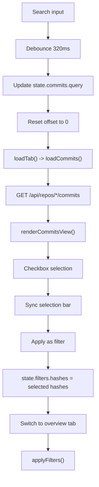

**Diagram sources**
- [app.js:1586-1775](file://static/app.js#L1586-L1775)

**Section sources**
- [app.js:1586-1775](file://static/app.js#L1586-L1775)

### Commit Picker Drawer
The commit picker drawer lets users explicitly pin a commit set as the H filter. It searches commits, allows selecting all matching results, and enforces a maximum of 900 pinned hashes.

Behavior:

- Opens a drawer with search and select-all controls.
- Loads up to 200 commits initially.
- Updates footer buttons based on selection count.
- Applies selected hashes to `state.filters.hashes` and closes the drawer.
- Toasts feedback and reapplies filters.

**Section sources**
- [app.js:1777-1885](file://static/app.js#L1777-L1885)

### Layer Management System for Modals, Drawers, and Popovers
The layer manager provides a unified overlay system. It supports:

- Backdrop-driven overlays.
- Anchored popovers.
- Focus management.
- Cleanup on close.
- Escape key dismissal.
- Global click-to-close behavior.

Types of layers:

- Popovers: Plain overlays anchored to elements, used for adding repositories.
- Drawers: Dialog-like panels with head, body, and foot, used for merging authors and picking commits.
- Confirmation prompts: Inline confirmation states inside menus or drawers.

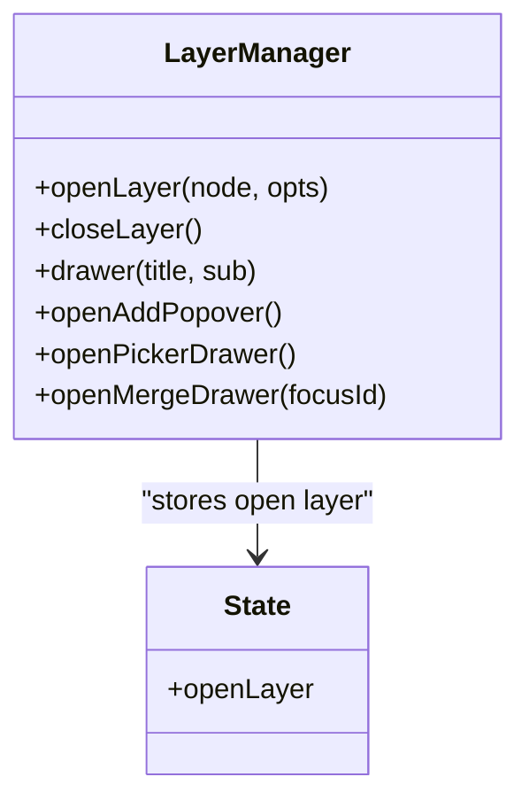

**Diagram sources**
- [app.js:173-214](file://static/app.js#L173-L214)
- [app.js:459-556](file://static/app.js#L459-L556)
- [app.js:1509-1584](file://static/app.js#L1509-L1584)
- [app.js:1777-1885](file://static/app.js#L1777-L1885)

**Section sources**
- [app.js:173-214](file://static/app.js#L173-L214)
- [app.js:459-556](file://static/app.js#L459-L556)
- [app.js:1509-1584](file://static/app.js#L1509-L1584)
- [app.js:1777-1885](file://static/app.js#L1777-L1885)

### Job Progress and Ingestion Flow
When cloning, uploading, or loading the sample repository, the backend starts an ingestion job. The frontend polls `/api/jobs/{id}` until completion or error.

Flow:

- Repository creation returns a job identifier.
- `pollJob()` starts immediate polling and then intervals.
- `setJobChip()` updates the header job chip.
- `updateRunningView()` updates the running ingestion view.
- On success or error, polling stops, a toast is shown, repositories are refreshed, and the current tab is reloaded.
- `resumeRunningRepo()` restarts polling if the selected repository has a running job.

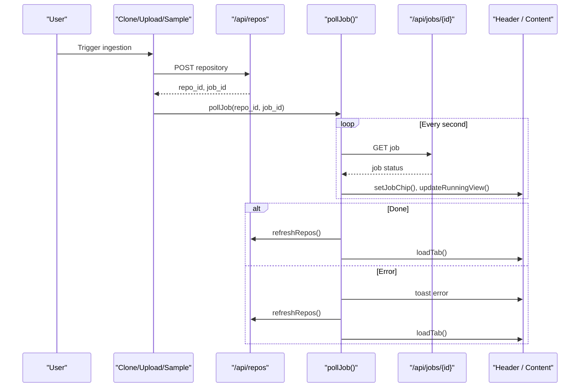

**Diagram sources**
- [app.js:216-285](file://static/app.js#L216-L285)
- [app.js:490-531](file://static/app.js#L490-L531)
- [app.js:558-574](file://static/app.js#L558-L574)

**Section sources**
- [app.js:216-285](file://static/app.js#L216-L285)
- [app.js:490-531](file://static/app.js#L490-L531)
- [app.js:558-574](file://static/app.js#L558-L574)

### Chart Rendering and Lifecycle
Charts are managed through ECharts instances stored in `state.charts`. Before each tab render, all existing charts are disposed to prevent memory leaks and stale canvas contexts.

Rendering steps:

- `disposeCharts()` iterates over chart keys, calls `dispose()`, and deletes references.
- `mountChart(key, domId, option)` initializes a chart only if the container exists and ECharts is available.
- Each tab mounts charts into specific container IDs.
- Resize events debounce chart resizing.

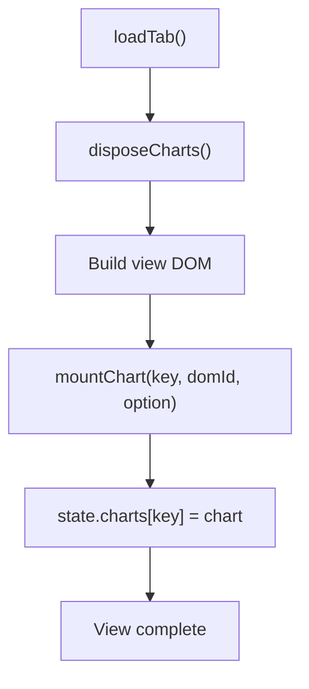

**Diagram sources**
- [app.js:1060-1078](file://static/app.js#L1060-L1078)
- [app.js:1224-1254](file://static/app.js#L1224-L1254)
- [app.js:1932-1936](file://static/app.js#L1932-L1936)

**Section sources**
- [app.js:1060-1078](file://static/app.js#L1060-L1078)
- [app.js:1224-1254](file://static/app.js#L1224-L1254)
- [app.js:1932-1936](file://static/app.js#L1932-L1936)

### Generic Table Builder and Sorting
The generic table builder creates sortable tables with configurable columns, numeric formatting, custom renderers, row click handlers, and empty states.

Features:

- Sort state is stored in `state.sort[tableId]`.
- Columns can define numeric sorting, custom value functions, and custom renderers.
- Clickable rows support both mouse and keyboard activation.
- Tables replace themselves on rerender to keep references stable.

**Section sources**
- [app.js:922-1013](file://static/app.js#L922-L1013)

### Application Initialization
Initialization performs palette reading, tab parsing from the URL hash, initial rendering of tabs, filter rail, and scope line, global event binding, and the first repository fetch.

Key initialization steps:

- Parse hash and set initial tab.
- Bind header buttons, rail toggle, escape key, global click-to-close, hash change, and resize events.
- Call `refreshRepos()` and `loadTab()`.
- Handle bootstrap errors by showing an error view with retry.

**Section sources**
- [app.js:1887-1950](file://static/app.js#L1887-L1950)

## Dependency Analysis
The frontend has a small but important dependency graph:

- `static/index.html` depends on CSS, favicon, ECharts, and `static/app.js`.
- `static/app.js` depends on:
  - Browser DOM APIs.
  - `fetch` for REST communication.
  - ECharts for chart visualization.
  - Backend endpoints under `/api`.

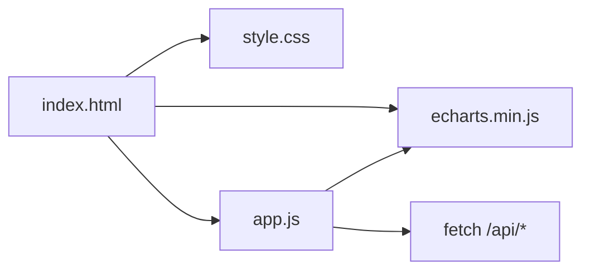

**Diagram sources**
- [index.html:66-67](file://static/index.html#L66-L67)
- [app.js:94-114](file://static/app.js#L94-L114)
- [app.js:1068-1078](file://static/app.js#L1068-L1078)

**Section sources**
- [index.html:66-67](file://static/index.html#L66-L67)
- [app.js:94-114](file://static/app.js#L94-L114)
- [app.js:1068-1078](file://static/app.js#L1068-L1078)

## Performance Considerations
Several patterns in the codebase address performance for large datasets and smooth interactions:

- **View rebuild strategy**: Views are cleared and rebuilt rather than manually diffing DOM. This simplifies state-to-DOM mapping but means expensive operations should be minimized.
- **Chart disposal**: All ECharts instances are disposed before re-rendering to avoid memory leaks and stale canvases.
- **Debouncing**: Search inputs and resize handlers use debouncing to reduce frequent API calls and layout work.
- **Pagination**: The commits tab uses offset and limit to avoid loading entire histories at once.
- **Selection cap**: Commit selection and “select all matching” enforce a maximum of 900 hashes to prevent excessive filter payloads.
- **Author caching**: The unfiltered author list is cached per repository to avoid repeated requests for filter options.
- **Render sequence guard**: `renderSeq` prevents older asynchronous responses from overwriting newer views.
- **Skeleton views**: Initial loading shows skeleton placeholders instead of flashing the welcome screen.
- **Efficient filtering**: Filter queries are built once per API call using `filterQS()`.

Recommendations for further optimization:

- Virtualize very large tables if rows exceed thousands.
- Batch chart updates when multiple charts share data.
- Avoid unnecessary `renderRail()` calls by coalescing filter updates.
- Consider memoizing computed summaries if the same filter set is reused frequently.
- Use `requestAnimationFrame` for heavy synchronous DOM updates if jank appears on low-end devices.

[No sources needed since this section provides general guidance]

## Troubleshooting Guide
Common issues and how the application handles them:

- **Empty scope**: If filters exclude all commits, views show an empty state with an option to clear filters.
- **Repository ingestion failure**: A banner shows the error and offers retry or delete actions.
- **Network errors**: The `api()` wrapper throws structured errors with status codes, and views show an error message with optional retry.
- **Missing ECharts**: Chart containers display a fallback message when the library is unavailable.
- **Stale repository selection**: `refreshRepos()` self-heals when the selected repository is no longer present.
- **Layer not closing**: Global click and Escape handlers close open layers; layers also clean up backdrops and nodes.
- **Chart resize glitches**: Resize events debounce chart resizing.

**Section sources**
- [app.js:823-836](file://static/app.js#L823-L836)
- [app.js:870-904](file://static/app.js#L870-L904)
- [app.js:906-920](file://static/app.js#L906-L920)
- [app.js:1068-1078](file://static/app.js#L1068-L1078)
- [app.js:436-457](file://static/app.js#L436-L457)
- [app.js:1911-1919](file://static/app.js#L1911-L1919)
- [app.js:1932-1936](file://static/app.js#L1932-L1936)

## Conclusion
The RAT frontend is a minimal, framework-free single-page application centered around one mutable state object. All views derive from that state, and user interactions update state before triggering targeted view rebuilds. The architecture separates concerns cleanly:

- Central state holds repository context, navigation, filters, file explorer state, view persistence, sorting, commit pagination, charts, and layer state.
- The DOM helper abstracts node creation and event attachment.
- Tab routing uses URL hash synchronization.
- Filters compose date ranges, authors, and explicit commit sets.
- Layers provide reusable modal, drawer, and popover behavior.
- Jobs and charts have explicit lifecycle management.

This approach keeps the codebase understandable and maintainable while supporting complex repository analysis workflows.

[No sources needed since this section summarizes without analyzing specific files]