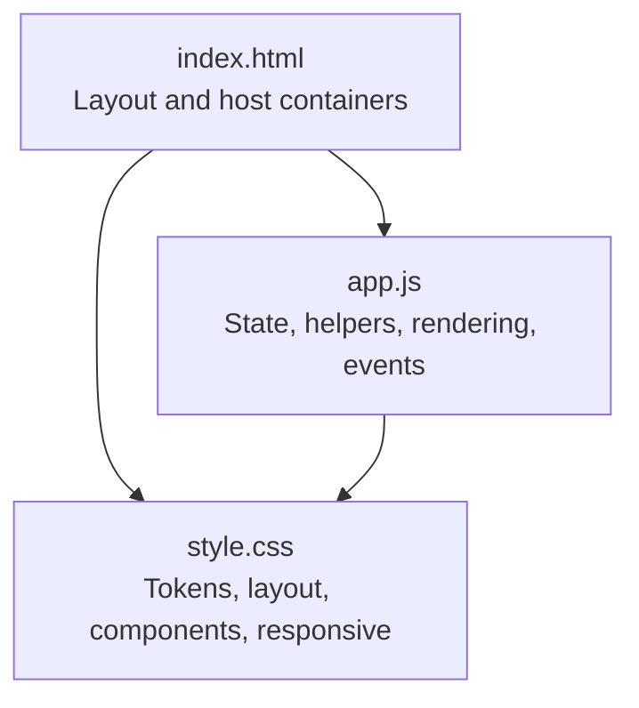
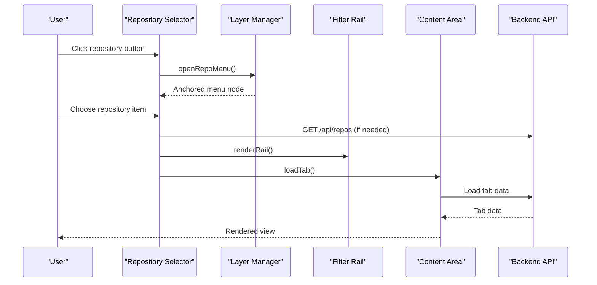
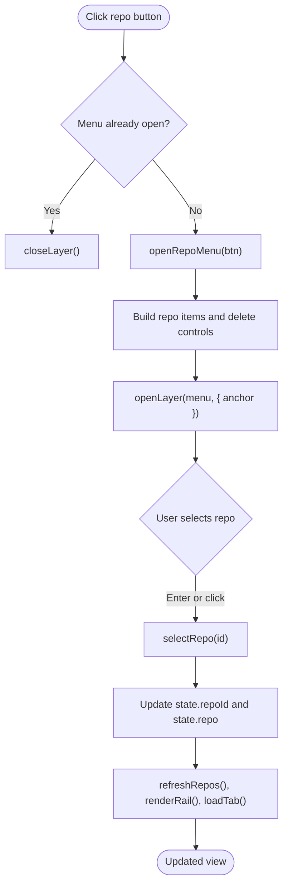
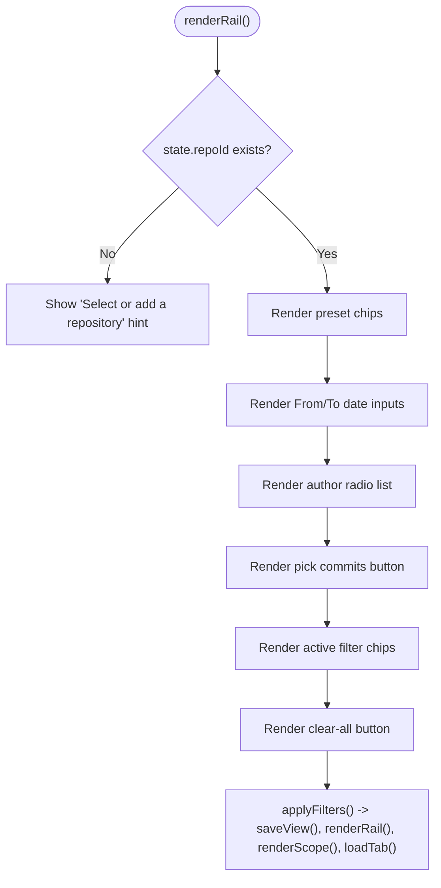
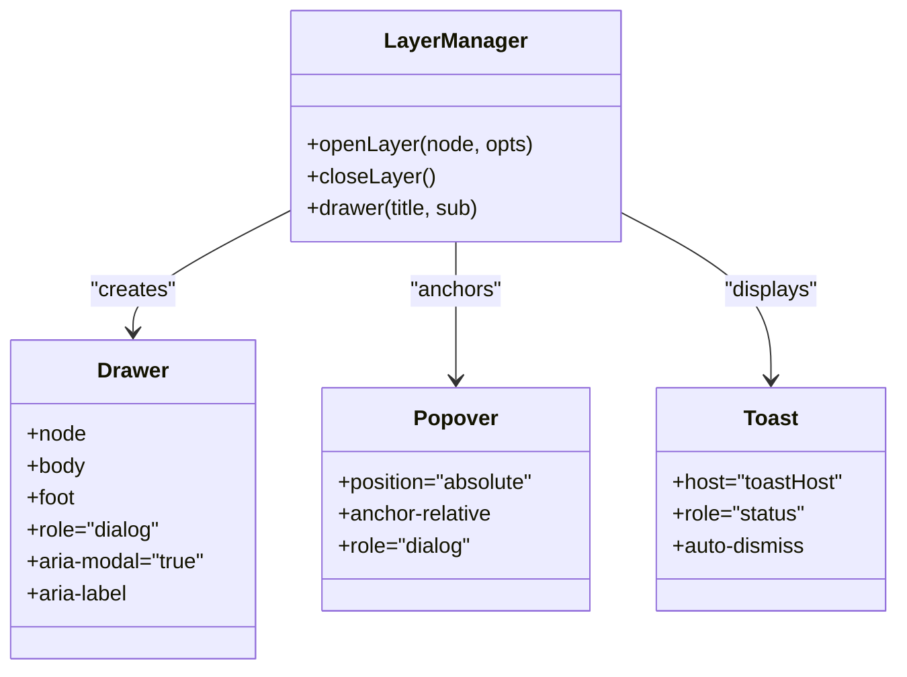
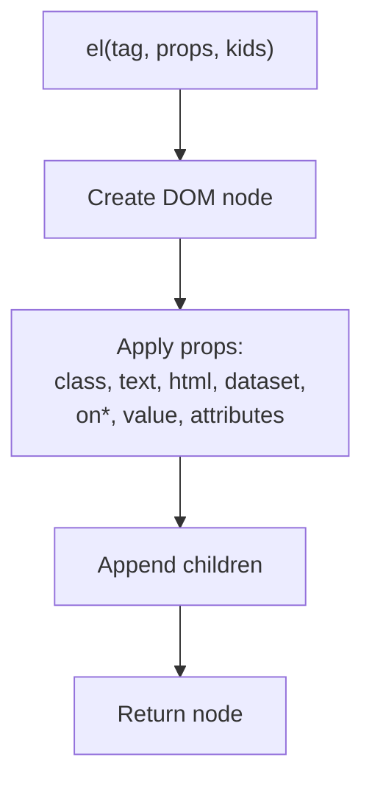
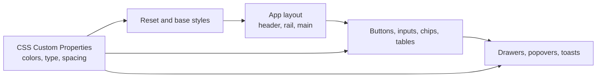
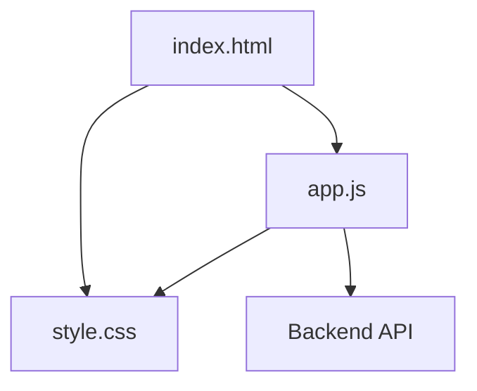

# UI Components & Interactions

<cite>
**Referenced Files in This Document**
- [index.html](file://static/index.html)
- [app.js](file://static/app.js)
- [style.css](file://static/style.css)
</cite>

## Table of Contents
1. [Introduction](#introduction)
2. [Project Structure](#project-structure)
3. [Core Components](#core-components)
4. [Architecture Overview](#architecture-overview)
5. [Detailed Component Analysis](#detailed-component-analysis)
6. [Dependency Analysis](#dependency-analysis)
7. [Performance Considerations](#performance-considerations)
8. [Troubleshooting Guide](#troubleshooting-guide)
9. [Conclusion](#conclusion)

## Introduction
This document explains the custom user interface components and interaction patterns used by the repository analysis dashboard. It focuses on:

- The repository selector dropdown.
- The filter rail interface.
- The modal/drawer/popover layer system.
- The component composition pattern built around the `el()` helper function and attribute binding.
- The styling architecture using CSS custom properties, responsive breakpoints, and accessibility conventions.
- Examples of form inputs, buttons, chips, and status indicators.
- Keyboard navigation, focus management, and screen reader support.
- Cross-browser compatibility and mobile responsiveness.
- The inline SVG icon system and the toast notification system.

The goal is to help both developers and reviewers understand how the UI is composed, styled, and made accessible without relying on a framework.

## Project Structure
The frontend is a minimal single-page application with three primary assets:

- `static/index.html`: Defines the shell layout, header, filter rail, tab bar, content area, drawer/popover/toast hosts, and ARIA landmarks.
- `static/app.js`: Implements all interactive behavior, including the `el()` helper, state management, API calls, rendering functions for selectors, rails, drawers, toasts, and job progress.
- `static/style.css`: Provides design tokens, layout, component styles, animations, and responsive rules.

**Diagram sources**
- [index.html:1-70](file://static/index.html#L1-L70)
- [app.js:1-120](file://static/app.js#L1-L120)
- [style.css:1-60](file://static/style.css#L1-L60)

**Section sources**
- [index.html:1-70](file://static/index.html#L1-L70)
- [app.js:1-120](file://static/app.js#L1-L120)
- [style.css:1-60](file://static/style.css#L1-L60)

## Core Components
This section summarizes the main UI building blocks implemented in the codebase.

| Component | Purpose | Key Implementation Details | Accessibility Notes |
|---|---|---|---|
| Repository selector dropdown | Selects the active repository and shows its status | Button toggles an anchored menu; menu items are keyboard-navigable; delete confirmation is inline | Uses `aria-haspopup`, `aria-expanded`, `role="menu"`, `role="menuitem"`, and `aria-current` |
| Filter rail | Filters commits by date range, author, and pinned commit set | Preset chips, date inputs, radio lists, and active filter chips; re-renders on change | Labels use `aria-label`; presets use `aria-pressed`; clear action is explicit |
| Drawer/popover/modal layer | Presents overlays such as add-repository popover, commit picker, and dialogs | Layer manager creates backdrop, anchors nodes, manages focus, and supports close callbacks | Drawers use `role="dialog"`, `aria-modal`, and `aria-label`; popovers use `role="dialog"` |
| Toast notifications | Shows transient success or error messages | Appends to a live region; auto-dismisses after delay; error variant uses a distinct style | Host has `aria-live="polite"`; messages have `role="status"` |
| Job progress chip | Displays ingestion status and progress | Polls job endpoint; updates spinner/progress track; shows error state | Uses `aria-live="polite"` container |
| Form inputs and buttons | Collects URLs, files, dates, and actions | Styled via shared classes; validation errors shown inline | Inputs have `aria-label`; labels are semantic |
| Chips and status indicators | Show filters, job states, and selection counts | Reusable chip class with remove button; status dots reflect repository/job state | Remove buttons have descriptive `aria-label` |

**Section sources**
- [app.js:11-34](file://static/app.js#L11-L34)
- [app.js:165-200](file://static/app.js#L165-L200)
- [app.js:287-373](file://static/app.js#L287-L373)
- [app.js:576-739](file://static/app.js#L576-L739)
- [style.css:297-342](file://static/style.css#L297-L342)
- [style.css:367-426](file://static/style.css#L367-L426)
- [style.css:532-572](file://static/style.css#L532-L572)
- [style.css:267-286](file://static/style.css#L267-L286)

## Architecture Overview
The UI follows a simple unidirectional flow:

1. State holds repositories, selected repository, filters, tabs, authors cache, charts, and open layers.
2. Rendering functions rebuild DOM fragments using the `el()` helper.
3. Event handlers update state and trigger re-rendering.
4. API calls fetch data and drive view changes.
5. The layer manager controls overlays (drawers/popovers).
6. Toasts provide feedback.

**Diagram sources**
- [app.js:287-373](file://static/app.js#L287-L373)
- [app.js:414-457](file://static/app.js#L414-L457)
- [app.js:576-739](file://static/app.js#L576-L739)
- [app.js:783-800](file://static/app.js#L783-L800)

## Detailed Component Analysis

### Repository Selector Dropdown
The repository selector is a compact button that opens an anchored menu listing available repositories. It shows the current repository name, status dot, and caret icon.

Key behaviors:
- Opens/closes the menu through the layer manager.
- Marks the currently selected repository with `aria-current`.
- Supports keyboard activation via Enter.
- Allows inline deletion with a confirmation prompt inside the menu item.
- Updates the global state and re-renders the rail and content when selection changes.

**Diagram sources**
- [app.js:287-373](file://static/app.js#L287-L373)
- [app.js:414-457](file://static/app.js#L414-L457)

Accessibility highlights:
- Button exposes `aria-haspopup="true"` and `aria-expanded`.
- Menu uses `role="menu"` and items use `role="menuitem"`.
- Selected item uses `aria-current="true"`.
- Delete actions have descriptive `aria-label`.

Styling highlights:
- `.repo-btn` provides the trigger button.
- `.repo-menu` positions the dropdown below the button.
- `.status-dot` reflects repository status: ready, running, error.

**Section sources**
- [app.js:287-373](file://static/app.js#L287-L373)
- [style.css:297-342](file://static/style.css#L297-L342)

### Filter Rail Interface
The filter rail is a sticky sidebar that lets users constrain the commit dataset by:

- Date range presets and manual from/to dates.
- Author radio list.
- Explicitly pinned commit hashes.
- Active filter chips with removal.

Rendering logic:
- If no repository is selected, the rail shows a hint.
- Presets update `state.presetKey` and compute timestamps.
- Manual date inputs validate ordering and show toasts on invalid ranges.
- Author radios update `state.filters.author`.
- Pinned commits open a drawer where users can select commits.
- Active filter chips display concise summaries and allow removal.

**Diagram sources**
- [app.js:576-739](file://static/app.js#L576-L739)

Keyboard and accessibility notes:
- Preset chips use `aria-pressed` to indicate active state.
- Date inputs have explicit `aria-label`.
- Author options are radio inputs with `aria-label`.
- Filter chip remove buttons have descriptive `aria-label`.
- Clear-all action is a standard button.

Responsive behavior:
- On smaller screens, the rail becomes a slide-out panel controlled by a toggle button.
- The toggle button appears only at narrower widths.

**Section sources**
- [app.js:576-739](file://static/app.js#L576-L739)
- [style.css:141-164](file://static/style.css#L141-L164)
- [style.css:367-426](file://static/style.css#L367-L426)
- [style.css:574-593](file://static/style.css#L574-L593)

### Modal, Drawer, and Popover Systems
The layer manager centralizes overlay behavior. It supports:

- Backdrop creation and click-to-close.
- Anchoring overlays to elements.
- Focus management for dialog-like overlays.
- Cleanup and optional close callbacks.

Drawer:
- Used for full-height side panels such as the commit picker.
- Includes head/body/foot regions.
- Uses `role="dialog"`, `aria-modal="true"`, and `aria-label`.

Popover:
- Used for anchored floating panels such as the add-repository form.
- Positioned relative to an anchor element.

Toast:
- Lightweight transient notifications appended to a fixed host.
- Auto-dismissed after a timeout.
- Error toasts use a distinct background color.

**Diagram sources**
- [app.js:165-214](file://static/app.js#L165-L214)
- [style.css:532-572](file://static/style.css#L532-L572)
- [style.css:267-286](file://static/style.css#L267-L286)

Focus management:
- When opening a layer, the manager optionally focuses a target element inside the overlay.
- Closing removes the backdrop and overlay node and invokes any registered close callback.

Accessibility:
- Drawers and popovers declare dialog roles and labels.
- Toast messages are announced via `role="status"` and live regions.

**Section sources**
- [app.js:165-214](file://static/app.js#L165-L214)
- [style.css:532-572](file://static/style.css#L532-L572)
- [style.css:267-286](file://static/style.css#L267-L286)

### Component Composition Pattern Using `el()` and Attribute Binding
The `el(tag, props, kids)` helper is the foundation of component composition. It:

- Creates DOM nodes.
- Applies attributes, classes, text, and inner HTML.
- Binds event listeners using `on*` properties.
- Handles special keys like `dataset`, `value`, and boolean attributes.
- Accepts child nodes or strings.

This pattern enables declarative construction of complex UI trees without a framework. For example:

- Buttons, inputs, and chips are created with shared classes.
- Icons are injected as HTML into spans with `aria-hidden`.
- Lists and menus are assembled from arrays of children.
- Forms combine labels, inputs, hints, and error boxes.

**Diagram sources**
- [app.js:11-34](file://static/app.js#L11-L34)

Best practices derived from usage:
- Prefer semantic attributes (`aria-*`, `role`) over visual-only cues.
- Use `text` for safe plain-text insertion.
- Use `html` sparingly for icons and prebuilt markup.
- Bind events with `onClick`, `onChange`, etc., directly in props.

**Section sources**
- [app.js:11-34](file://static/app.js#L11-L34)
- [app.js:66-78](file://static/app.js#L66-L78)
- [app.js:459-556](file://static/app.js#L459-L556)

### Styling Architecture
The stylesheet defines a token-driven design system:

- Colors: background, surface, ink, muted, hairline, accent, success, danger, and series colors.
- Typography: sans-serif and monospace families, font sizes, and numeric formatting.
- Spacing: an 8px scale.
- Layout: grid-based app body, sticky header, sticky filter rail.
- Components: buttons, inputs, chips, tables, tiles, panels, banners, skeletons, toasts, drawers, and popovers.
- Responsive rules: rail toggle, drawer width, tile grid, and breakpoint-specific adjustments.

Design principles:
- Minimal radius and shadows.
- Monospace for hashes, paths, and numbers.
- Hairline borders for calm, precise visuals.
- No gradients except where explicitly required.

**Diagram sources**
- [style.css:6-51](file://static/style.css#L6-L51)
- [style.css:53-80](file://static/style.css#L53-L80)
- [style.css:82-140](file://static/style.css#L82-L140)
- [style.css:141-216](file://static/style.css#L141-L216)
- [style.css:267-286](file://static/style.css#L267-L286)
- [style.css:532-572](file://static/style.css#L532-L572)

**Section sources**
- [style.css:6-51](file://static/style.css#L6-L51)
- [style.css:53-80](file://static/style.css#L53-L80)
- [style.css:82-140](file://static/style.css#L82-L140)
- [style.css:141-216](file://static/style.css#L141-L216)
- [style.css:267-286](file://static/style.css#L267-L286)
- [style.css:532-572](file://static/style.css#L532-L572)

### Form Inputs, Buttons, Chips, and Status Indicators
Examples across the codebase include:

- Buttons:
  - Primary accent button for cloning or loading samples.
  - Quiet buttons for secondary actions.
  - Small buttons for inline confirmations.
- Inputs:
  - URL input for cloning repositories.
  - File input for uploading zip archives.
  - Date inputs for filtering commit ranges.
- Chips:
  - Preset time-range chips.
  - Active filter chips with remove buttons.
  - Job progress chips with spinner and progress track.
- Status indicators:
  - Repository status dots: ready, running, error.
  - Tile values colored by positive/negative/accent semantics.

Accessibility and UX:
- Inputs have `aria-label` where labels are not visually obvious.
- Error messages are displayed in a dedicated error box.
- Disabled states reduce opacity and pointer events.
- Focus-visible outlines use the accent color.

**Section sources**
- [app.js:459-556](file://static/app.js#L459-L556)
- [app.js:610-725](file://static/app.js#L610-L725)
- [app.js:216-277](file://static/app.js#L216-L277)
- [style.css:104-131](file://static/style.css#L104-L131)
- [style.css:367-426](file://static/style.css#L367-L426)
- [style.css:297-342](file://static/style.css#L297-L342)

### Keyboard Navigation and Focus Management
Keyboard interactions are implemented per component:

- Repository menu:
  - Items are focusable and activated with Enter.
  - Clicking outside closes the layer.
- Tabs:
  - Each tab is a button with `role="tab"` and `aria-selected`.
  - Selection updates the hash and re-renders content.
- Filter rail:
  - Preset chips use `aria-pressed`.
  - Radio inputs group author selections.
  - Clear-all button resets filters.
- Drawers/popovers:
  - Optional focus target is focused after opening.
  - Backdrop click closes the layer.

Screen reader support:
- Live regions announce scope changes and job updates.
- Dialogs expose roles and labels.
- Icon-only buttons use `aria-label`.

**Section sources**
- [app.js:310-342](file://static/app.js#L310-L342)
- [app.js:760-781](file://static/app.js#L760-L781)
- [app.js:173-200](file://static/app.js#L173-L200)
- [index.html:36-60](file://static/index.html#L36-L60)

### Cross-Browser Compatibility and Mobile Responsiveness
Compatibility considerations:

- Uses standard DOM APIs and `fetch`.
- Avoids modern CSS features beyond widely supported custom properties, grid, flexbox, and transitions.
- Uses `::selection` and `accent-color` for consistent styling.
- Relies on `getComputedStyle` for palette reading.

Mobile responsiveness:

- At narrow widths, the filter rail slides out and is toggled by a button.
- Drawer width adapts to viewport width.
- Tile grids collapse to fewer columns.
- Header elements truncate gracefully.

**Section sources**
- [style.css:574-602](file://static/style.css#L574-L602)
- [style.css:428-451](file://static/style.css#L428-L451)
- [style.css:82-140](file://static/style.css#L82-L140)

### Icon System Using Inline SVG
Icons are defined as inline SVG strings and inserted via the `glyph()` helper. They are marked `aria-hidden` because they are decorative.

Available icons include caret, directory, file, back, search, close, and trash.

Usage patterns:
- Decorative icons inside buttons and labels.
- Consistent sizing and stroke color via `currentColor`.
- Accessible alternatives provided through surrounding text or `aria-label`.

**Section sources**
- [app.js:66-78](file://static/app.js#L66-L78)
- [style.css:339-340](file://static/style.css#L339-L340)

### Toast Notification System
Toasts provide brief feedback:

- Success toasts use the default dark style.
- Error toasts use a danger-colored background.
- Messages are appended to a fixed host with `aria-live="polite"`.
- Each toast is removed automatically after a timeout.

Job-related toasts:
- Cloning/uploading starts a toast.
- Completion or failure triggers a toast and refreshes the repository list.

**Section sources**
- [app.js:165-171](file://static/app.js#L165-L171)
- [app.js:248-277](file://static/app.js#L248-L277)
- [app.js:490-531](file://static/app.js#L490-L531)
- [style.css:267-286](file://static/style.css#L267-L286)
- [index.html:60](file://static/index.html#L60)

## Dependency Analysis
High-level dependencies among frontend assets:

- `index.html` loads `style.css` and `app.js`.
- `app.js` reads palette values from computed styles.
- `app.js` renders components that depend on CSS classes.
- `app.js` makes network requests to backend endpoints.

**Diagram sources**
- [index.html:1-70](file://static/index.html#L1-L70)
- [app.js:94-114](file://static/app.js#L94-L114)
- [app.js:80-92](file://static/app.js#L80-L92)

**Section sources**
- [index.html:1-70](file://static/index.html#L1-L70)
- [app.js:80-114](file://static/app.js#L80-L114)

## Performance Considerations
- Rebuilding views clears previous content before inserting new nodes, which avoids stale DOM.
- Debounce utility exists for rate-limiting frequent operations.
- Charts are disposed before re-rendering to prevent memory leaks.
- Job polling uses an interval and stops on completion or error.
- Skeleton views provide perceived performance during initial loads.

Recommendations:
- Keep `el()` usage declarative to minimize repeated DOM mutations.
- Batch state updates where possible before triggering re-renders.
- Avoid unnecessary re-renders of large lists by diffing or caching rendered fragments.

[No sources needed since this section provides general guidance]

## Troubleshooting Guide
Common issues and resolutions:

- No repository selected:
  - The rail shows a hint; load a sample or add a repository.
- Invalid date range:
  - The rail validates from/to ordering and shows an error toast; re-render restores correct state.
- Failed API request:
  - Errors are caught and displayed as toasts; repository list refresh may be triggered.
- Stale repository selection:
  - The selector self-heals by refreshing the repository list if the current selection disappears.
- JavaScript disabled:
  - A noscript message informs users that the dashboard requires JavaScript.

**Section sources**
- [app.js:610-616](file://static/app.js#L610-L616)
- [app.js:645-667](file://static/app.js#L645-L667)
- [app.js:360-373](file://static/app.js#L360-L373)
- [app.js:436-457](file://static/app.js#L436-L457)
- [index.html:62-64](file://static/index.html#L62-L64)

## Conclusion
The dashboard’s UI is built around a lightweight, framework-free approach:

- The `el()` helper enables declarative component composition.
- CSS custom properties define a consistent design system.
- The layer manager standardizes overlays and focus management.
- Accessibility is integrated through roles, labels, live regions, and keyboard support.
- Responsive rules ensure usability across desktop and mobile devices.

By following these patterns, developers can extend the interface with new components while maintaining consistency, clarity, and accessibility.

[No sources needed since this section summarizes without analyzing specific files]