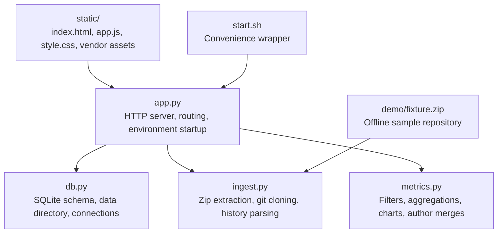
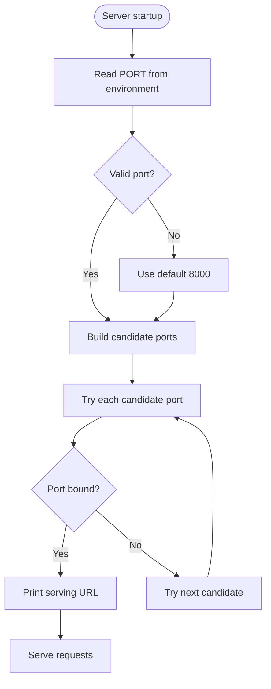
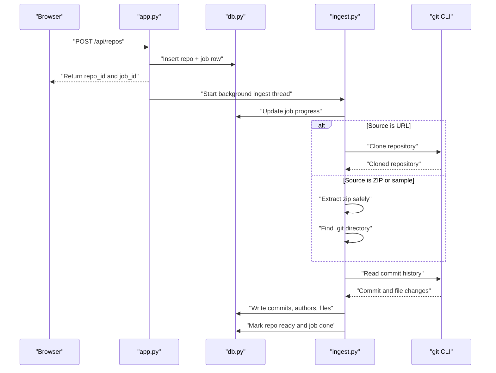

# Getting Started

<cite>
**Referenced Files in This Document**
- [README.md](file://README.md)
- [app.py](file://app.py)
- [start.sh](file://start.sh)
- [db.py](file://db.py)
- [ingest.py](file://ingest.py)
- [metrics.py](file://metrics.py)
</cite>

## Table of Contents
1. [Introduction](#introduction)
2. [Project Structure](#project-structure)
3. [Installation Requirements](#installation-requirements)
4. [Quick Start](#quick-start)
5. [Web Interface and Endpoints](#web-interface-and-endpoints)
6. [Environment Variables](#environment-variables)
7. [How Ingestion Works](#how-ingestion-works)
8. [Troubleshooting](#troubleshooting)
9. [Next Steps](#next-steps)

## Introduction
RAT (Repo Analysis Tool) is a local, offline dashboard for analyzing Git repositories. It ingests either:
- A zip archive containing the full repository history (a `.git` directory), or
- A public clone URL such as a GitHub repository.

Once ingested, RAT computes metrics including added/removed lines, growth, churn, modification counts, churn rate, and author ownership across files, directories, repositories, commit sets, and authors. The server runs entirely from Python’s standard library with no external package installation required.

**Section sources**
- [README.md:1-12](file://README.md#L1-L12)

## Project Structure
The project is intentionally small and flat:

**Diagram sources**
- [app.py:1-30](file://app.py#L1-L30)
- [db.py:1-12](file://db.py#L1-L12)
- [ingest.py:1-35](file://ingest.py#L1-L35)
- [metrics.py:1-21](file://metrics.py#L1-L21)
- [start.sh:1-5](file://start.sh#L1-L5)

**Section sources**
- [app.py:1-30](file://app.py#L1-L30)
- [db.py:1-12](file://db.py#L1-L12)
- [ingest.py:1-35](file://ingest.py#L1-L35)
- [metrics.py:1-21](file://metrics.py#L1-L21)
- [start.sh:1-5](file://start.sh#L1-L5)

## Installation Requirements
Before running RAT, ensure your system has:

- **Python 3.8+**: RAT uses only the Python standard library; no `pip`, virtual environments, or build steps are required.
- **Git CLI**: Required for cloning public repositories and extracting commit history.

You can verify these tools by running:
- `python3 --version`
- `git --version`

If Git is installed but not found, make sure it is available on your system `PATH`.

**Section sources**
- [README.md:9-12](file://README.md#L9-L12)

## Quick Start
Follow these steps to run RAT locally:

1. Open a terminal in the repository root where `app.py` lives.
2. Start the server using one of the following commands:
   - `python3 app.py`
   - `./start.sh`
3. Wait for the console output showing the serving URL. By default, this is `http://127.0.0.1:8000`.
4. Open that URL in your browser.

### Try the Sample Repository
After opening the web interface:
1. Click **Load sample**.
2. RAT ingests the bundled fixture repository (`demo/fixture.zip`) completely offline.
3. Explore the dashboard once ingestion completes.

### Add a Real GitHub Repository
To analyze a real public repository:
1. Click **Add repository**.
2. Paste a public clone URL such as `https://github.com/DaveGamble/cJSON.git`.
3. Wait for the background ingestion job to finish.
4. Review the computed metrics.

**Section sources**
- [README.md:14-26](file://README.md#L14-L26)
- [app.py:455-487](file://app.py#L455-L487)
- [app.py:365-381](file://app.py#L365-L381)
- [app.py:338-349](file://app.py#L338-L349)

## Web Interface and Endpoints
RAT exposes both a static web interface and a JSON API.

### Static Assets
- The root path serves the main HTML page.
- `/static/...` serves JavaScript, CSS, fonts, images, and vendor assets.

### API Endpoints
| Endpoint | Method | Purpose | Notes |
|---|---:|---|---|
| `/api/health` | GET | Health check | Returns service name and version |
| `/api/repos` | GET | List repositories | Includes metadata like status, commits, files, and authors |
| `/api/repos` | POST | Add repository from URL | Request body contains `url` and optional `name` |
| `/api/repos/upload` | POST | Upload a zip archive | Must be a valid zip file under the configured size limit |
| `/api/repos/sample` | POST | Load the bundled sample repository | Uses `demo/fixture.zip` |
| `/api/repos/{id}` | DELETE | Delete a repository | Removes database rows and stored repo data |
| `/api/repos/{id}/job` | GET | Latest ingestion job for a repository | Useful for resuming progress after reload |
| `/api/jobs/{id}` | GET | Get ingestion job status | Poll during long-running ingestion |
| `/api/repos/{id}/summary` | GET | Repository summary metrics | Supports filters |
| `/api/repos/{id}/tree` | GET | Directory tree with metrics | Supports path filtering |
| `/api/repos/{id}/file` | GET | File-level metrics and author breakdown | Requires a file path |
| `/api/repos/{id}/authors` | GET | Authors table with ownership | Supports merging identities |
| `/api/repos/{id}/commits` | GET | Paginated commit list | Supports search, limit, offset, and filters |
| `/api/repos/{id}/chart` | GET | Charts such as churn, top files, author share | Requires chart type parameter |

All API errors are returned as JSON objects with an `error` field.

**Section sources**
- [app.py:56-97](file://app.py#L56-L97)
- [app.py:120-196](file://app.py#L120-L196)
- [app.py:426-440](file://app.py#L426-L440)

## Environment Variables
RAT supports three optional environment variables:

| Variable | Default | Purpose |
|---|---:|---|
| `PORT` | `8000` | First port tried; falls back to `8080`, `8888`, `9000`, then lets the OS assign a port if needed |
| `HOST` | `127.0.0.1` | Bind address for the HTTP server |
| `DATA_DIR` | `<repo>/data` | Directory where the SQLite database and ingested repositories are stored |

### Port Selection Behavior
When starting, RAT tries ports in order:
1. The value of `PORT` if it is a valid integer between `0` and `65535`.
2. `8080`
3. `8888`
4. `9000`
5. `0`, which asks the operating system to choose an available port.

The actual bound host and port are printed at startup.

### Data Directory Behavior
By default, RAT stores data under a `data/` directory next to the application code. If `DATA_DIR` is set, RAT uses that absolute or user-expanded path instead.

**Diagram sources**
- [app.py:444-487](file://app.py#L444-L487)

**Section sources**
- [README.md:28-34](file://README.md#L28-L34)
- [app.py:6-9](file://app.py#L6-L9)
- [app.py:444-487](file://app.py#L444-L487)
- [db.py:65-70](file://db.py#L65-L70)

## How Ingestion Works
Ingestion is asynchronous. When you add a repository, RAT creates a job record and processes it in a background thread while the UI polls for progress.

### Ingestion Flow

**Diagram sources**
- [app.py:306-336](file://app.py#L306-L336)
- [app.py:338-381](file://app.py#L338-L381)
- [ingest.py:356-435](file://ingest.py#L356-L435)
- [ingest.py:181-315](file://ingest.py#L181-L315)

### Key Implementation Details
- **Background jobs**: Ingestion runs in a daemon thread so the HTTP server remains responsive.
- **Progress tracking**: Jobs update progress and messages in the database, allowing the UI to poll `/api/jobs/{id}`.
- **ZIP safety**: ZIP extraction validates paths and rejects unsafe entries.
- **Git integration**: Cloning and history reading use the Git CLI with timeouts and error handling.
- **History parsing**: RAT parses Git log output in a single pass, handling renames, binary files, and large histories efficiently.
- **Failure recovery**: Failed jobs mark the repository and job as errored and clean up partial data.

**Section sources**
- [app.py:306-336](file://app.py#L306-L336)
- [ingest.py:38-67](file://ingest.py#L38-L67)
- [ingest.py:91-143](file://ingest.py#L91-L143)
- [ingest.py:181-315](file://ingest.py#L181-L315)
- [ingest.py:356-435](file://ingest.py#L356-L435)

## Troubleshooting
Common startup and ingestion issues:

### Port Conflicts
- If the configured port is already in use, RAT automatically tries alternative ports.
- Always check the console output for the final URL.
- You can force a specific port by setting `PORT`.

### Git Not Found
- Ensure `git` is installed and available on your system `PATH`.
- If Git is missing, cloning and history extraction will fail.
- The README explicitly notes that Git is required for cloning and history extraction.

### Stuck or Interrupted Jobs
- On restart, any previously running jobs are marked as interrupted.
- You can reset everything by deleting the `data/` directory.
- Deleted repositories remove both database rows and stored repository data.

### Invalid ZIP Uploads
- Only valid ZIP archives are accepted.
- Uploaded files must contain a `.git` directory somewhere in the archive.
- Unsafe ZIP paths are rejected for security.

**Section sources**
- [README.md:36-40](file://README.md#L36-L40)
- [app.py:444-487](file://app.py#L444-L487)
- [ingest.py:91-143](file://ingest.py#L91-L143)
- [ingest.py:443-457](file://ingest.py#L443-L457)

## Next Steps
After successfully loading a repository:

- Explore the repository summary to see overall growth, churn, and activity.
- Browse the directory tree to inspect per-path metrics.
- View file details to understand author ownership and contribution patterns.
- Use the authors table to merge duplicate identities when necessary.
- Inspect the commit list with search and pagination.
- Generate charts for churn over time, top changed files, and author contribution shares.

For development or testing:
- Run `python3 selftest.py` to assert metric engine edge cases against the fixture.
- Regenerate the sample fixture with `python3 demo/make_fixture.py`.

**Section sources**
- [README.md:42-45](file://README.md#L42-L45)
- [metrics.py:205-225](file://metrics.py#L205-L225)
- [metrics.py:228-262](file://metrics.py#L228-L262)
- [metrics.py:265-307](file://metrics.py#L265-L307)
- [metrics.py:310-361](file://metrics.py#L310-L361)
- [metrics.py:399-435](file://metrics.py#L399-L435)
- [metrics.py:463-543](file://metrics.py#L463-L543)