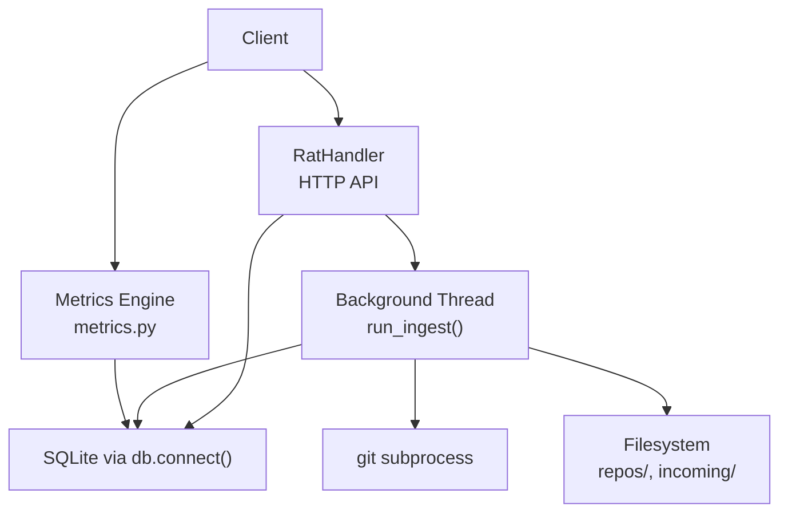
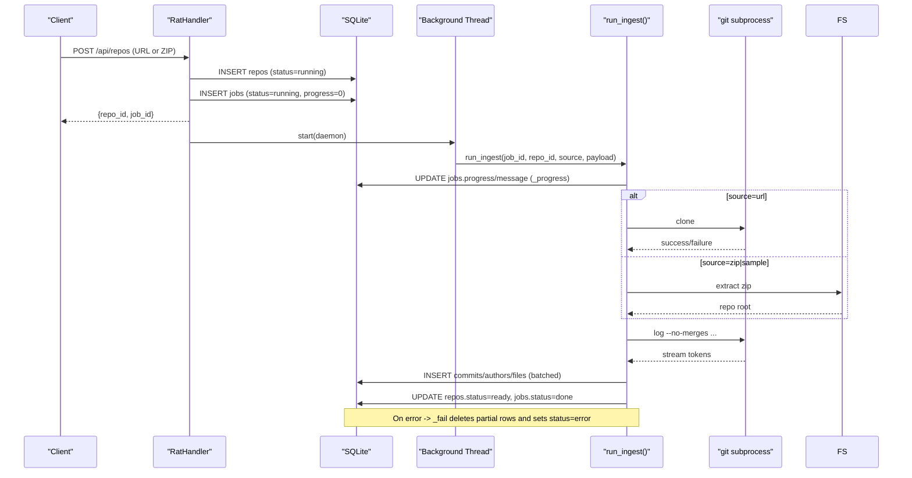
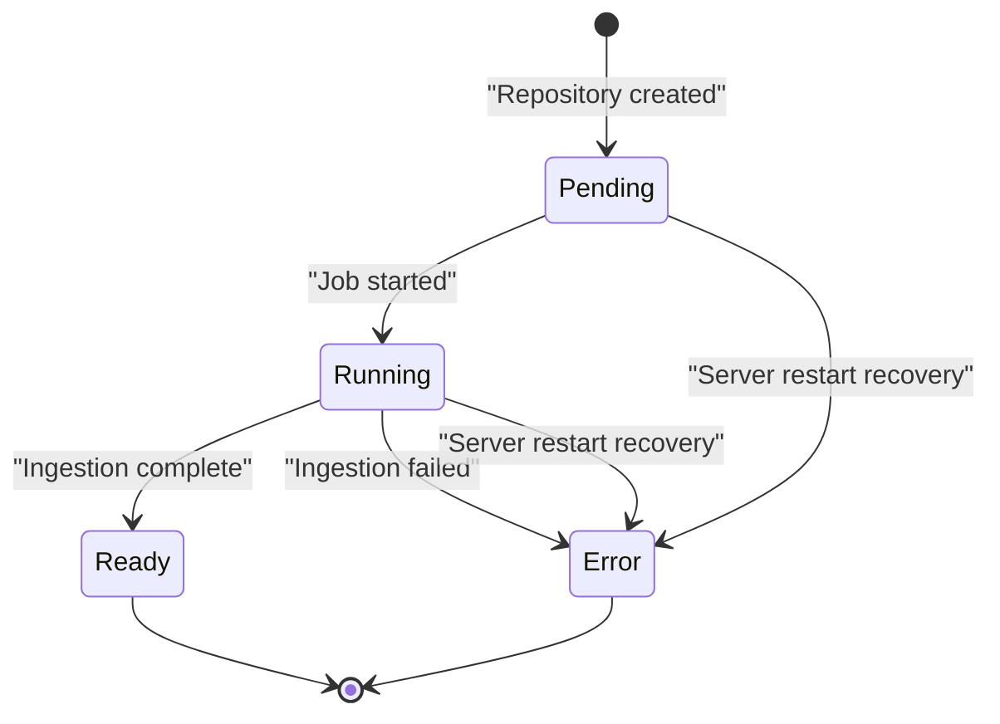
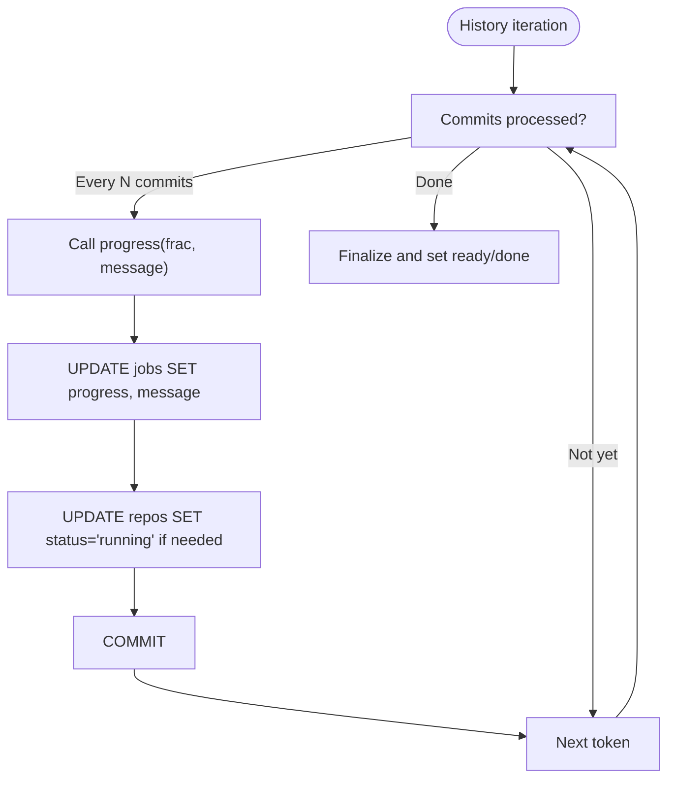
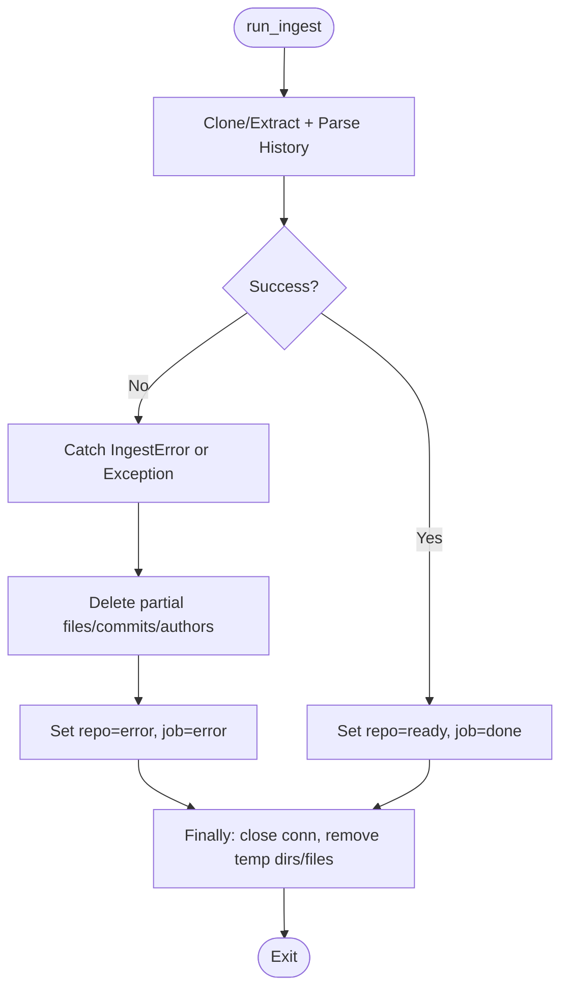
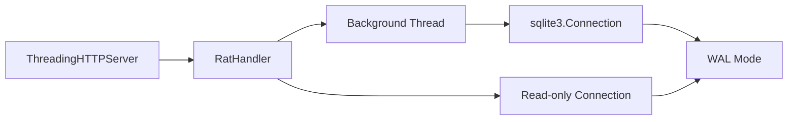
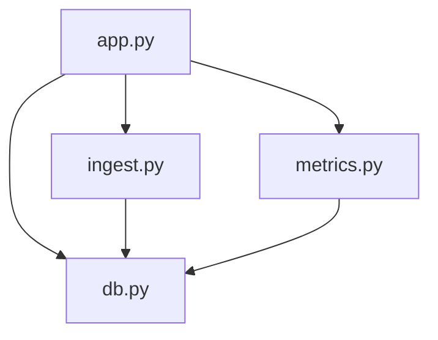

# Background Job Management

<cite>
**Referenced Files in This Document**
- [app.py](file://app.py)
- [ingest.py](file://ingest.py)
- [db.py](file://db.py)
- [metrics.py](file://metrics.py)
- [README.md](file://README.md)
</cite>

## Table of Contents
1. [Introduction](#introduction)
2. [Project Structure](#project-structure)
3. [Core Components](#core-components)
4. [Architecture Overview](#architecture-overview)
5. [Detailed Component Analysis](#detailed-component-analysis)
6. [Dependency Analysis](#dependency-analysis)
7. [Performance Considerations](#performance-considerations)
8. [Troubleshooting Guide](#troubleshooting-guide)
9. [Conclusion](#conclusion)

## Introduction
This document explains the background job execution system used by the Repo Analysis Tool to ingest Git repositories from URLs or ZIP archives, extract commit history into SQLite, and expose real-time progress through HTTP APIs. It focuses on thread-safe job lifecycle management, progress callbacks, error handling and recovery, state transitions, monitoring endpoints, and resource cleanup for long-running ingestion tasks.

The system is built around:
- A threaded HTTP server that accepts repository creation requests.
- A background ingestion thread per job.
- A persistent SQLite database with WAL mode for concurrent reads and writes.
- Progress callbacks that update both job status and repository state in real time.
- Startup recovery logic that marks stale jobs as failed after a server restart.

**Section sources**
- [README.md:1-46](file://README.md#L1-L46)

## Project Structure
The background job system spans four main modules:

- `app.py`: HTTP API, request routing, job creation, and polling endpoints.
- `ingest.py`: Ingestion pipeline, background thread target, progress callback, failure handling, and startup recovery.
- `db.py`: Database schema, connection helpers, data directory management, and WAL configuration.
- `metrics.py`: Read-only metric engine; not directly involved in job execution but consumes the ingested data.

**Diagram sources**
- [app.py:56-196](file://app.py#L56-L196)
- [app.py:306-336](file://app.py#L306-L336)
- [ingest.py:356-441](file://ingest.py#L356-L441)
- [db.py:77-86](file://db.py#L77-L86)
- [metrics.py:179-183](file://metrics.py#L179-L183)

**Section sources**
- [app.py:1-492](file://app.py#L1-L492)
- [ingest.py:1-458](file://ingest.py#L1-L458)
- [db.py:1-100](file://db.py#L1-L100)
- [metrics.py:1-544](file://metrics.py#L1-L544)

## Core Components
- Repository and job persistence:
  - Repositories are created with initial status `running` and later transitioned to `ready` or `error`.
  - Jobs track ingestion progress, message, and final status.
- Background ingestion:
  - Each ingestion runs in a daemon thread started by the HTTP handler.
  - The ingestion process clones or extracts the repository, parses git history, and persists commits, authors, and file changes.
- Progress callback:
  - Throttled updates write to both the `jobs` and `repos` tables, keeping UI and backend consistent.
- Error handling and cleanup:
  - On failure, partial data is deleted, and both repo and job are marked `error`.
  - Temporary upload files under `data/incoming` are removed when safe.
- Recovery on restart:
  - Stale running jobs and pending/running repos are marked `error` at startup.

**Section sources**
- [db.py:15-62](file://db.py#L15-L62)
- [app.py:306-336](file://app.py#L306-L336)
- [ingest.py:320-349](file://ingest.py#L320-L349)
- [ingest.py:356-441](file://ingest.py#L356-L441)
- [ingest.py:443-458](file://ingest.py#L443-L458)

## Architecture Overview
The ingestion workflow proceeds as follows:

**Diagram sources**
- [app.py:338-381](file://app.py#L338-L381)
- [app.py:279-304](file://app.py#L279-L304)
- [ingest.py:356-441](file://ingest.py#L356-L441)
- [ingest.py:181-315](file://ingest.py#L181-L315)
- [db.py:77-86](file://db.py#L77-L86)

## Detailed Component Analysis

### Job Lifecycle and State Transitions
Jobs and repositories follow these states:

- Repository states:
  - `pending`: Initial state before ingestion starts.
  - `running`: Ingestion is active.
  - `ready`: Ingestion completed successfully.
  - `error`: Ingestion failed; includes an error message.
- Job states:
  - `running`: Active ingestion.
  - `done`: Completed successfully.
  - `error`: Failed ingestion.

Key transitions:
- Creation:
  - Repository inserted with `status=running`.
  - Job inserted with `status=running`, `progress=0`, `message='Queued'`.
- Progress updates:
  - `_progress` updates `jobs.progress` and `jobs.message`, and ensures `repos.status` remains `running`.
- Success:
  - Repository set to `ready`, `ref_hash` updated, `error` cleared.
  - Job set to `done`, `progress=1.0`, and a summary message.
- Failure:
  - `_fail` deletes partial `files`, `commits`, and `authors` rows for the repository.
  - Repository set to `error` with the error message.
  - Job set to `error`, `progress=1.0`, and the error message.
- Restart recovery:
  - All jobs with `status=running` become `error` with a restart message.
  - Repositories with `status=pending` or `running` become `error` with a restart message.

**Diagram sources**
- [db.py:15-62](file://db.py#L15-L62)
- [app.py:306-336](file://app.py#L306-L336)
- [ingest.py:320-349](file://ingest.py#L320-L349)
- [ingest.py:443-458](file://ingest.py#L443-L458)

**Section sources**
- [db.py:15-62](file://db.py#L15-L62)
- [app.py:306-336](file://app.py#L306-L336)
- [ingest.py:320-349](file://ingest.py#L320-L349)
- [ingest.py:443-458](file://ingest.py#L443-L458)

### Progress Callback Mechanism
The progress callback updates both job and repository state:

- Throttling:
  - History parsing calls the callback every `PROGRESS_EVERY` commits.
  - The callback maps internal progress fraction to a range between 0.25 and 0.95, leaving room for cloning/extraction and finalization steps.
- Persistence:
  - Updates `jobs.progress` and `jobs.message`.
  - Ensures `repos.status` is `running` if not already.
  - Commits after each update to keep progress visible to pollers.

**Diagram sources**
- [ingest.py:181-315](file://ingest.py#L181-L315)
- [ingest.py:320-329](file://ingest.py#L320-L329)

**Section sources**
- [ingest.py:181-315](file://ingest.py#L181-L315)
- [ingest.py:320-329](file://ingest.py#L320-L329)

### Error Handling and Recovery Procedures
Error handling ensures consistency and recoverability:

- Partial data cleanup:
  - On failure, `_fail` removes all `files`, `commits`, and `authors` rows associated with the repository.
- Status updates:
  - Both repository and job are set to `error` with a descriptive message.
- Process safety:
  - Unexpected exceptions are caught, logged, and converted to failure state.
  - Git processes are killed and waited upon in case of abnormal termination.
- Filesystem cleanup:
  - Temporary destination directories are removed on failure.
  - Uploaded ZIP payloads under `data/incoming` are deleted if they reside within the data directory.
- Server restart recovery:
  - At startup, `recover_stale_jobs` marks all running jobs and pending/running repositories as `error`.

**Diagram sources**
- [ingest.py:356-441](file://ingest.py#L356-L441)
- [ingest.py:332-349](file://ingest.py#L332-L349)

**Section sources**
- [ingest.py:332-349](file://ingest.py#L332-L349)
- [ingest.py:356-441](file://ingest.py#L356-L441)

### Thread Safety and Concurrency Model
Concurrency characteristics:

- Threading model:
  - The HTTP server uses `ThreadingHTTPServer`, creating a new thread per request.
  - Each ingestion job runs in a separate daemon thread named `ingest-<repo_id>`.
- Database concurrency:
  - SQLite is configured with WAL mode, allowing readers to proceed while writers update.
  - Connections are short-lived and opened per call (`connect()`).
  - Busy timeouts and journal pragmas reduce contention during ingestion.
- Synchronization:
  - There is no explicit lock around job state updates; instead, atomic SQL statements and transactions ensure consistency.
  - Progress updates commit immediately to make them visible to pollers.
- Resource isolation:
  - Each ingestion thread owns its connection and cleans it up in `finally`.
  - Filesystem operations use deterministic paths anchored to `DATA_DIR`.

**Diagram sources**
- [app.py:455-487](file://app.py#L455-L487)
- [app.py:330-336](file://app.py#L330-L336)
- [db.py:77-86](file://db.py#L77-L86)

**Section sources**
- [app.py:455-487](file://app.py#L455-L487)
- [app.py:330-336](file://app.py#L330-L336)
- [db.py:77-86](file://db.py#L77-L86)

### Monitoring and Progress APIs
Monitoring endpoints:

- Health check:
  - GET `/api/health` returns service status.
- Repository list:
  - GET `/api/repos` lists repositories with counts and statuses.
- Job status:
  - GET `/api/jobs/<job_id>` returns job details including progress and message.
- Latest job for a repository:
  - GET `/api/repos/<repo_id>/job` returns the most recent job for the repository, enabling UI resumption after reload.

Polling strategy:
- Clients should poll `/api/jobs/<job_id>` until the job reaches `done` or `error`.
- Use `/api/repos/<repo_id>/job` to resume monitoring after page refreshes.

Example flows:
- Create a repository from URL:
  - POST `/api/repos` with `{url, name}`.
  - Receive `{repo_id, job_id, existing}`.
  - Poll `/api/jobs/<job_id>` for progress.
- Create a repository from ZIP:
  - POST `/api/repos/upload?name=<name>.zip` with binary ZIP body.
  - Receive `{repo_id, job_id, existing}`.
  - Poll `/api/jobs/<job_id>` for progress.

**Section sources**
- [app.py:121-196](file://app.py#L121-L196)
- [app.py:279-304](file://app.py#L279-L304)
- [app.py:338-381](file://app.py#L338-L381)

### Failure Notification Mechanisms
Failure notifications are surfaced through:

- Job status:
  - Job `status` becomes `error`.
  - Job `message` contains the failure reason.
  - Job `progress` is set to `1.0`.
- Repository status:
  - Repository `status` becomes `error`.
  - Repository `error` field contains the failure reason.
- Cleanup:
  - Partial ingestion data is removed to prevent inconsistent queries.
- Logging:
  - Unexpected exceptions are printed to standard output for debugging.

Clients can detect failures by checking job status and message fields.

**Section sources**
- [ingest.py:332-349](file://ingest.py#L332-L349)
- [app.py:84-90](file://app.py#L84-L90)

## Dependency Analysis
Component relationships:

- `app.py` depends on:
  - `db.py` for database access and schema initialization.
  - `ingest.py` for ingestion logic and recovery.
  - `metrics.py` for read-only metrics endpoints.
- `ingest.py` depends on:
  - `db.py` for database connections and path utilities.
  - External `git` command for cloning and history extraction.
- `metrics.py` depends on:
  - `db.py` for database connections.

**Diagram sources**
- [app.py:28-30](file://app.py#L28-L30)
- [ingest.py:30-31](file://ingest.py#L30-L31)
- [metrics.py:1-21](file://metrics.py#L1-L21)

**Section sources**
- [app.py:28-30](file://app.py#L28-L30)
- [ingest.py:30-31](file://ingest.py#L30-L31)
- [metrics.py:1-21](file://metrics.py#L1-L21)

## Performance Considerations
- Batched inserts:
  - File records are batched in memory and committed in groups to reduce transaction overhead.
- Throttled progress updates:
  - Progress callbacks are invoked only every `PROGRESS_EVERY` commits to avoid excessive database writes.
- SQLite tuning:
  - WAL mode enables concurrent reads and writes.
  - Busy timeout reduces lock contention during heavy ingestion.
- Subprocess management:
  - Git commands are executed without shell invocation for security and performance.
  - Timeouts are applied to cloning and other long-running operations.
- Memory usage:
  - Binary streams are parsed incrementally to avoid loading entire histories into memory.

[No sources needed since this section provides general guidance]

## Troubleshooting Guide
Common issues and resolutions:

- Port conflicts:
  - The server tries multiple ports automatically; the actual bound address is printed at startup.
- Missing Git:
  - Ensure `git` is installed and available on PATH; required for cloning and history extraction.
- Corrupted ZIP uploads:
  - Uploads must be valid ZIP archives; invalid files return a client error.
- Large payloads:
  - Upload size is limited; exceeding the limit results in a 413 response.
- Data reset:
  - Delete the `data/` directory to reset the database and ingested repositories.
- Stale jobs after restart:
  - Running jobs are marked `error` on startup; clients should re-ingest or handle the error state.

**Section sources**
- [README.md:36-46](file://README.md#L36-L46)
- [app.py:444-487](file://app.py#L444-L487)
- [ingest.py:443-458](file://ingest.py#L443-L458)

## Conclusion
The background job execution system provides a robust, thread-safe mechanism for ingesting Git repositories, tracking progress in real time, and handling errors gracefully. By combining a threaded HTTP API, background ingestion threads, SQLite with WAL mode, and careful cleanup procedures, the system supports long-running ingestion tasks while maintaining data consistency and observability. Clients can monitor job progress via dedicated endpoints and rely on automatic recovery mechanisms to handle server restarts and transient failures.

[No sources needed since this section summarizes without analyzing specific files]