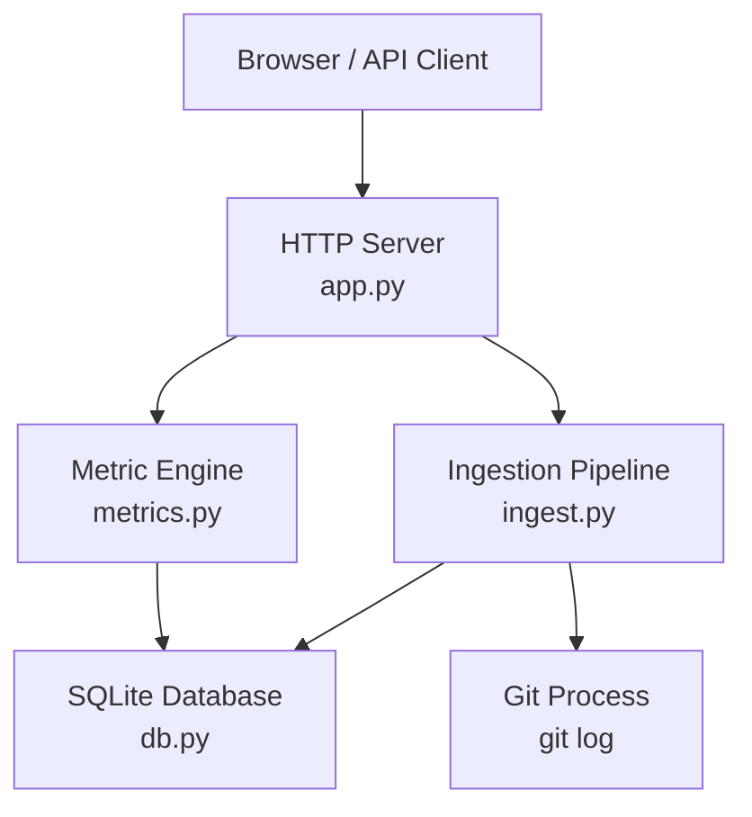
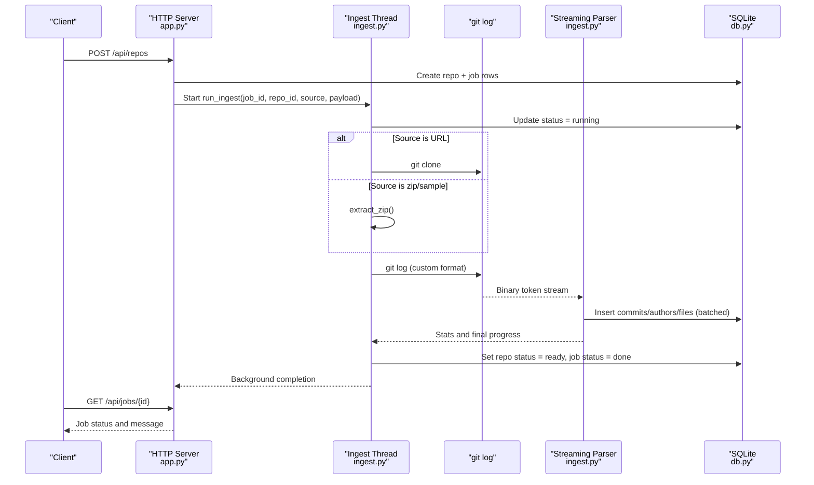
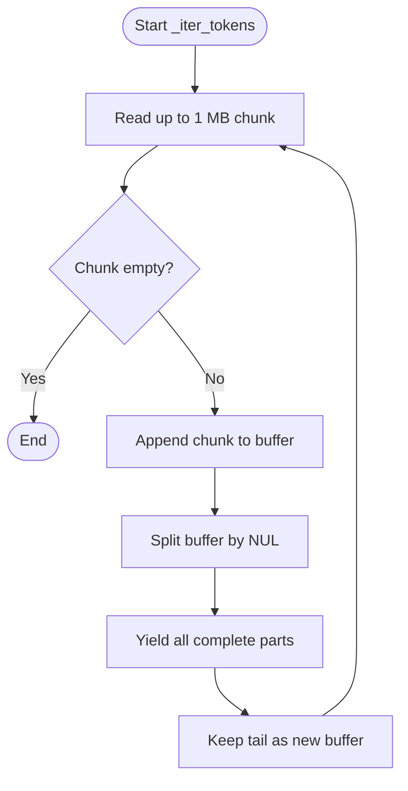
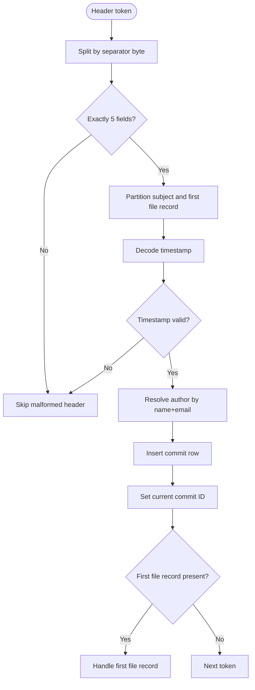
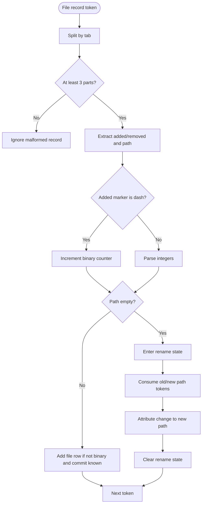
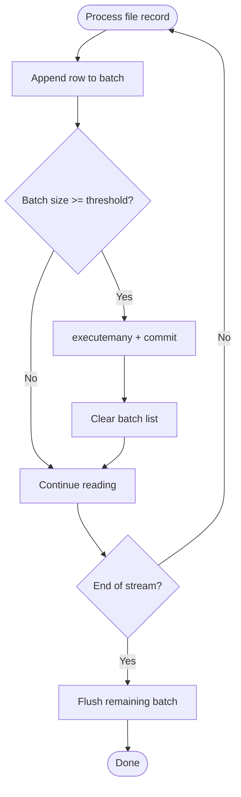
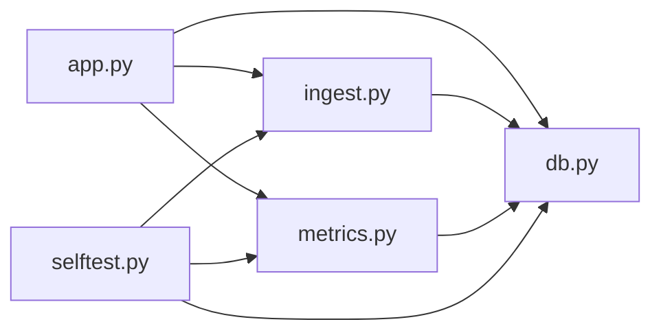

# Git History Parsing Engine

<cite>
**Referenced Files in This Document**
- [README.md](file://README.md)
- [app.py](file://app.py)
- [ingest.py](file://ingest.py)
- [db.py](file://db.py)
- [metrics.py](file://metrics.py)
- [selftest.py](file://selftest.py)
</cite>

## Table of Contents
1. [Introduction](#introduction)
2. [Project Structure](#project-structure)
3. [Core Components](#core-components)
4. [Architecture Overview](#architecture-overview)
5. [Detailed Component Analysis](#detailed-component-analysis)
6. [Dependency Analysis](#dependency-analysis)
7. [Performance Considerations](#performance-considerations)
8. [Troubleshooting Guide](#troubleshooting-guide)
9. [Conclusion](#conclusion)

## Introduction
This document explains the optimized Git history parsing engine used by the Repo Analysis Tool. The system ingests a Git repository from a URL or a zip archive, extracts commit and file-change data using `git log`, parses a custom binary token stream, persists results into SQLite, and exposes metrics through a local web API.

The key performance idea is to avoid loading entire histories into Python objects: instead, the parser reads `git log` output as a chunked NUL-separated binary stream, decodes only what it needs, aggregates file changes in batches, and writes them directly to SQLite. Progress updates are persisted so the UI can resume after reloads.

**Section sources**
- [README.md:1-46](file://README.md#L1-L46)

## Project Structure
At a high level, the application consists of:
- A lightweight HTTP server that routes API requests.
- An ingestion pipeline that clones or extracts repositories and runs the streaming parser.
- A SQLite-backed schema for repositories, authors, commits, files, and jobs.
- A metric engine that computes growth, churn, ownership, and charts over stored data.
- A self-test suite that validates parsing and metric semantics against a deterministic fixture.

**Diagram sources**
- [app.py:56-196](file://app.py#L56-L196)
- [ingest.py:181-315](file://ingest.py#L181-L315)
- [db.py:15-62](file://db.py#L15-L62)
- [metrics.py:205-225](file://metrics.py#L205-L225)

**Section sources**
- [app.py:1-492](file://app.py#L1-L492)
- [ingest.py:1-458](file://ingest.py#L1-L458)
- [db.py:1-100](file://db.py#L1-L100)
- [metrics.py:1-544](file://metrics.py#L1-L544)

## Core Components
- Custom binary format: `git log --no-merges --use-mailmap -M50% --numstat -z --pretty=format:...` produces NUL-separated tokens with a special header marker and field separator bytes.
- Streaming tokenizer: `_iter_tokens` reads large chunks and yields complete NUL-delimited tokens without loading everything into memory.
- Commit header parser: splits fields by the internal separator byte, decodes UTF-8 safely, converts timestamps, and inserts commits and authors.
- File change record processor: handles normal line counts, binary markers, rename records, and path reconstruction.
- Batched insertion: accumulates file rows and flushes them to SQLite in fixed-size batches.
- Job progress reporting: throttled updates to the jobs table during ingestion.
- SQLite integration: connection helpers, schema initialization, WAL mode, and indexes.

**Section sources**
- [ingest.py:7-20](file://ingest.py#L7-L20)
- [ingest.py:159-176](file://ingest.py#L159-L176)
- [ingest.py:221-315](file://ingest.py#L221-L315)
- [db.py:15-62](file://db.py#L15-L62)

## Architecture Overview
The ingestion workflow starts when the HTTP server creates a repository job and launches a background thread. The thread either clones a URL or extracts a zip, verifies the repository root, then streams `git log` output through the custom parser. Each commit becomes a row in `commits`; each file change becomes a row in `files`. Authors are normalized and deduplicated. Progress is written to `jobs`, and the repository status transitions from pending to running to ready or error.

**Diagram sources**
- [app.py:306-336](file://app.py#L306-L336)
- [ingest.py:356-441](file://ingest.py#L356-L441)
- [ingest.py:181-315](file://ingest.py#L181-L315)
- [db.py:77-86](file://db.py#L77-L86)

## Detailed Component Analysis

### Custom Binary Format Used by `git log`
The parser relies on a documented layout produced by a specific `git log` command:
- Records are separated by NUL bytes.
- A commit-header token begins with a special marker byte followed by fields separated by another control byte.
- The header includes hash, author name, author email, committer timestamp, and subject.
- Immediately after the header’s newline, the first file record may appear in the same token.
- Rename records have an empty path field; the next two NUL tokens carry old and new paths.
- Binary files are marked with a dash instead of numeric line counts.
- Empty tokens separate commits.

This design allows one-pass processing: the parser does not need to buffer full diffs or reconstruct trees. It only tracks minimal state for renames and current commit context.

**Section sources**
- [ingest.py:7-20](file://ingest.py#L7-L20)
- [ingest.py:188-196](file://ingest.py#L188-L196)

### Token-Based Streaming Parser
The streaming tokenizer reads up to one megabyte at a time, concatenates partial chunks, splits on NUL, yields complete tokens, and keeps any trailing incomplete token for the next read. This avoids loading the entire history into memory while guaranteeing correct token boundaries even when a token spans multiple reads.

Key characteristics:
- Chunked I/O reduces peak memory usage.
- Buffer reuse minimizes allocations.
- Final partial buffer is yielded to handle edge cases where the last token ends exactly at EOF.

**Diagram sources**
- [ingest.py:159-173](file://ingest.py#L159-L173)

**Section sources**
- [ingest.py:159-176](file://ingest.py#L159-L176)

### Commit Header Parsing
For each header token:
1. Strip the header marker byte.
2. Split into five fields using the internal separator byte.
3. Separate the subject from the first file record using the embedded newline.
4. Decode author name, email, hash, and subject safely with UTF-8 replacement.
5. Convert the timestamp to an integer; skip malformed headers.
6. Resolve or insert the author identity.
7. Insert the commit and capture its database ID for later file attribution.

Author resolution uses a small in-memory cache keyed by name and email to avoid repeated lookups. If the author does not exist, it is inserted and then selected again to obtain the stable ID.

**Diagram sources**
- [ingest.py:262-290](file://ingest.py#L262-L290)
- [ingest.py:221-236](file://ingest.py#L221-L236)

**Section sources**
- [ingest.py:262-290](file://ingest.py#L262-L290)
- [ingest.py:221-236](file://ingest.py#L221-L236)

### File Change Record Processing
Each file record is tab-separated and contains added lines, removed lines, and path. The parser supports:
- Normal text changes: parse numeric line counts.
- Binary files: detected by a dash marker; these are skipped for line aggregation but still counted.
- Renames: when the path field is empty, the parser enters rename state and consumes the next two tokens as old and new paths. The change is attributed to the new path.
- Path safety: paths may contain tabs, so the parser joins remaining parts after the second tab.

Rename handling ensures that pure renames contribute zero churn, while rename-plus-edit contributes line changes under the new path.

**Diagram sources**
- [ingest.py:238-300](file://ingest.py#L238-L300)

**Section sources**
- [ingest.py:238-300](file://ingest.py#L238-L300)

### Batched Database Insertion Strategy
To optimize write performance and manage memory:
- File rows are accumulated in a list.
- When the batch reaches a configured size, they are inserted via a bulk operation and the connection is committed.
- The batch size is tuned to balance throughput and memory pressure.
- After the loop, any remaining rows are flushed.

This strategy avoids per-row commits and reduces transaction overhead while keeping memory bounded.

**Diagram sources**
- [ingest.py:198-219](file://ingest.py#L198-L219)
- [ingest.py:301-301](file://ingest.py#L301-L301)

**Section sources**
- [ingest.py:198-219](file://ingest.py#L198-L219)
- [ingest.py:301-301](file://ingest.py#L301-L301)

### Progress Reporting Mechanisms
Progress is reported in two ways:
- During history parsing, a throttled callback updates the job’s progress fraction and message every N commits.
- The ingestion wrapper maps the parser’s relative progress into a global range and also marks the repository as running until completion.

This allows the UI to poll job status and show meaningful messages such as “Reading history - X of Y commits”.

**Section sources**
- [ingest.py:286-289](file://ingest.py#L286-L289)
- [ingest.py:320-329](file://ingest.py#L320-L329)
- [ingest.py:408-410](file://ingest.py#L408-L410)

### Error Handling for Malformed Data
The parser is defensive:
- Malformed header tokens are skipped rather than failing the whole ingestion.
- Invalid timestamps cause the header to be skipped.
- Malformed file records are ignored.
- Git process failures raise ingestion errors with user-readable messages.
- Zip extraction rejects unsafe paths and invalid archives.
- URL validation enforces allowed schemes and formats.

When ingestion fails, the helper clears partially ingested data and marks both the job and repository as errored.

**Section sources**
- [ingest.py:266-275](file://ingest.py#L266-L275)
- [ingest.py:248-251](file://ingest.py#L248-L251)
- [ingest.py:50-67](file://ingest.py#L50-L67)
- [ingest.py:91-143](file://ingest.py#L91-L143)
- [ingest.py:70-86](file://ingest.py#L70-L86)
- [ingest.py:332-349](file://ingest.py#L332-L349)

### Integration with SQLite
The database layer provides:
- Schema creation for repositories, authors, commits, files, and jobs.
- Connection helpers that enable WAL mode, busy timeout, and row factories.
- Indexes on frequently queried columns such as commit IDs, paths, timestamps, and hashes.
- A data directory abstraction that respects environment configuration.

The ingestion pipeline uses these helpers to insert authors, commits, and file rows, and to update job and repository status.

**Section sources**
- [db.py:15-62](file://db.py#L15-L62)
- [db.py:65-86](file://db.py#L65-L86)
- [ingest.py:221-236](file://ingest.py#L221-L236)
- [ingest.py:277-282](file://ingest.py#L277-L282)
- [ingest.py:320-329](file://ingest.py#L320-L329)

## Dependency Analysis
The main runtime dependencies are:
- `app.py` depends on `db`, `ingest`, and `metrics`.
- `ingest.py` depends on `db` and the external `git` process.
- `metrics.py` depends on `db` and performs SQL aggregation over stored data.
- `selftest.py` imports `db`, `ingest`, and `metrics` to validate behavior.

**Diagram sources**
- [app.py:28-30](file://app.py#L28-L30)
- [ingest.py:30-30](file://ingest.py#L30-L30)
- [selftest.py:37-39](file://selftest.py#L37-L39)

**Section sources**
- [app.py:28-30](file://app.py#L28-L30)
- [ingest.py:30-30](file://ingest.py#L30-L30)
- [metrics.py:1-21](file://metrics.py#L1-L21)
- [selftest.py:37-39](file://selftest.py#L37-L39)

## Performance Considerations
- Streaming parser: Reads `git log` output in chunks and processes tokens incrementally, avoiding large Python object graphs.
- Batched inserts: Uses a fixed batch size to reduce transaction overhead and improve SQLite write throughput.
- SQLite WAL mode: Allows readers to continue while ingestion writes, improving concurrency for API queries.
- Indexed queries: Commits and files are indexed on commonly filtered columns.
- Throttled progress updates: Avoids excessive database writes during parsing.
- Git options: Disables merges and uses mailmap normalization to reduce noise and normalize identities.

Recommendations:
- Tune batch size based on repository size and available memory.
- Monitor SQLite WAL file growth for very large repositories.
- Use the existing filter limits to prevent overly broad queries in the metric engine.

[No sources needed since this section provides general guidance]

## Troubleshooting Guide
Common issues and their likely causes:
- Git timeout: Cloning or history extraction exceeded the configured timeout.
- Not a valid repository: The extracted archive lacks `.git` or HEAD cannot be resolved.
- Invalid zip: The uploaded file is not a zip or contains unsafe paths.
- Unknown endpoint: The API route does not match expected patterns.
- Filter errors: Invalid dates, hash prefixes, or too many hashes in filters.
- Missing sample fixture: The bundled sample zip is absent.

Recovery steps:
- Ensure `git` is installed and accessible.
- Reset state by deleting the data directory.
- Re-run ingestion and poll job status until completion or error.
- For failed ingestions, the system cleans partial data and marks jobs and repositories as errored.

**Section sources**
- [ingest.py:50-67](file://ingest.py#L50-L67)
- [ingest.py:125-143](file://ingest.py#L125-L143)
- [ingest.py:91-104](file://ingest.py#L91-L104)
- [app.py:121-196](file://app.py#L121-L196)
- [metrics.py:40-47](file://metrics.py#L40-L47)
- [app.py:377-380](file://app.py#L377-L380)
- [ingest.py:332-349](file://ingest.py#L332-L349)

## Conclusion
The Git history parsing engine combines a carefully designed binary token format, a streaming tokenizer, and batched SQLite writes to efficiently transform raw `git log` output into structured analytics data. It handles renames, binary files, malformed input, and progress reporting while maintaining low memory usage and good write performance. The surrounding components provide a robust ingestion workflow, safe persistence, and a comprehensive metric engine backed by SQLite.

[No sources needed since this section summarizes without analyzing specific files]