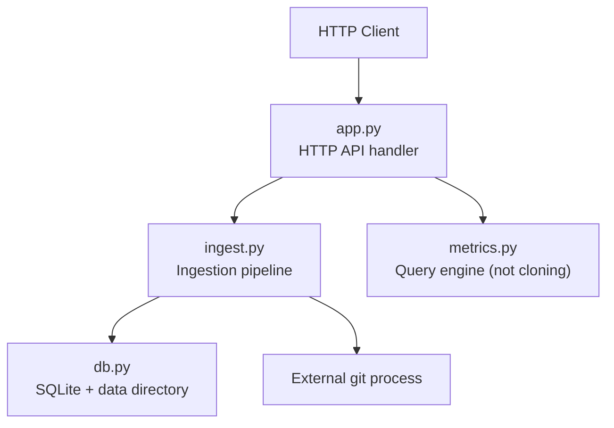
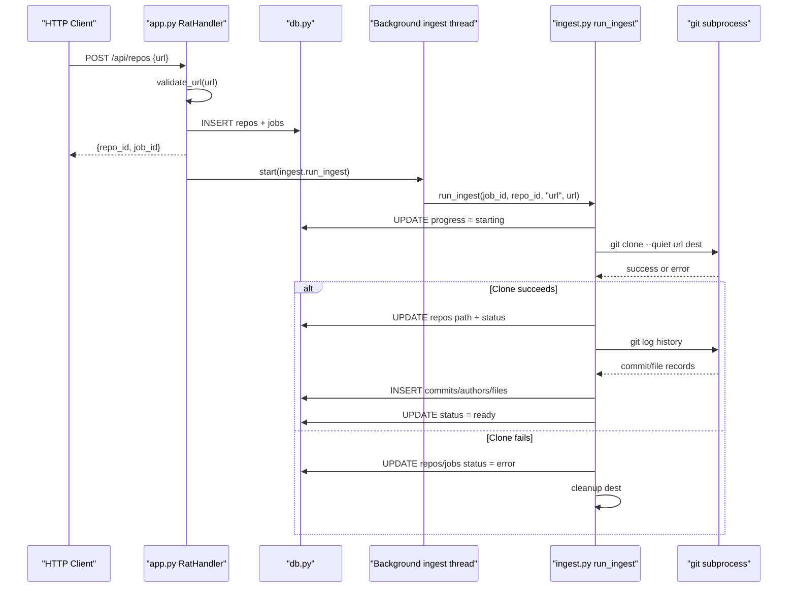
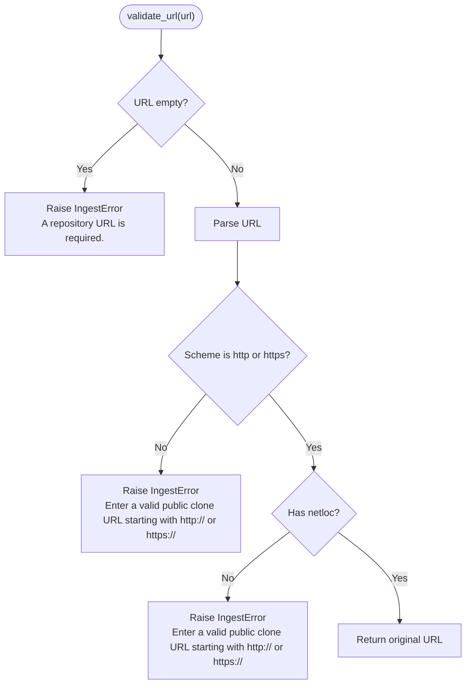
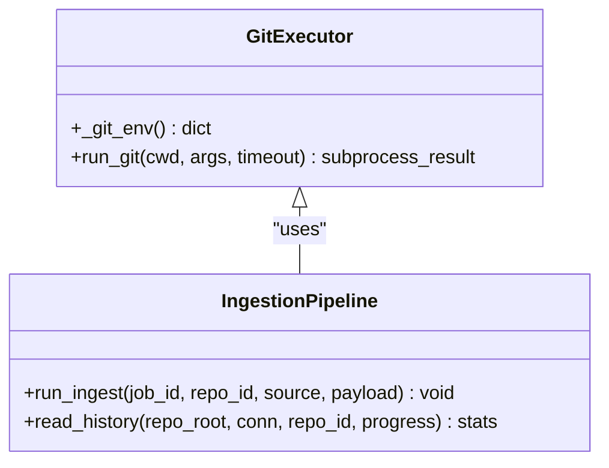
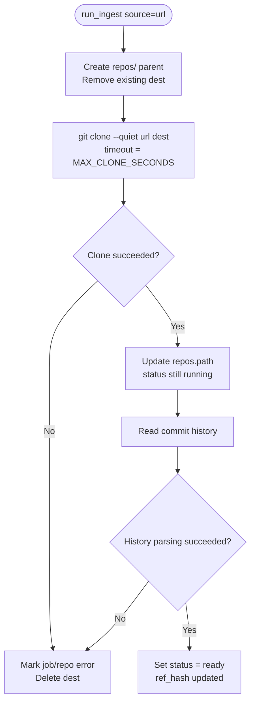
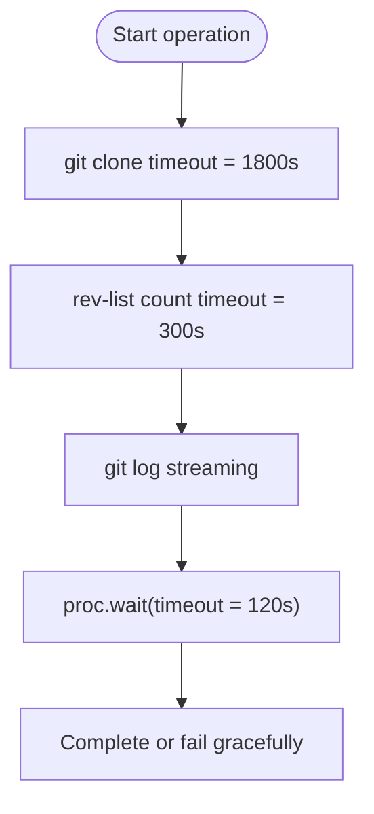
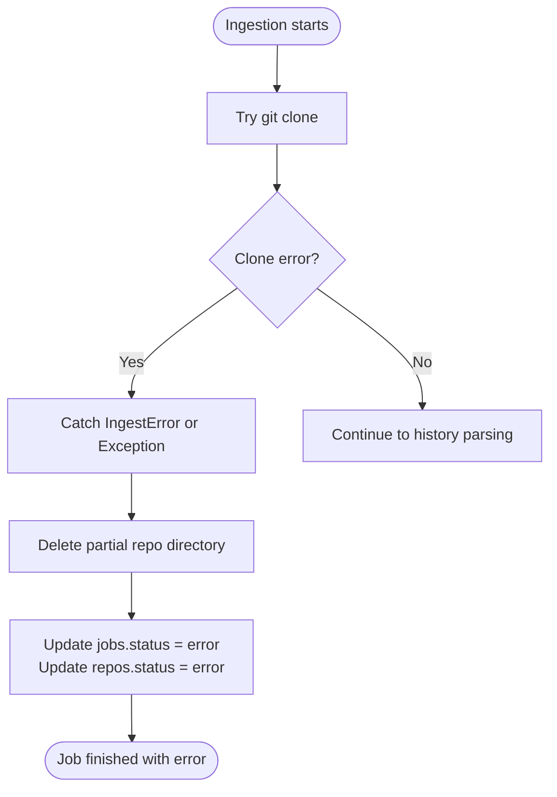
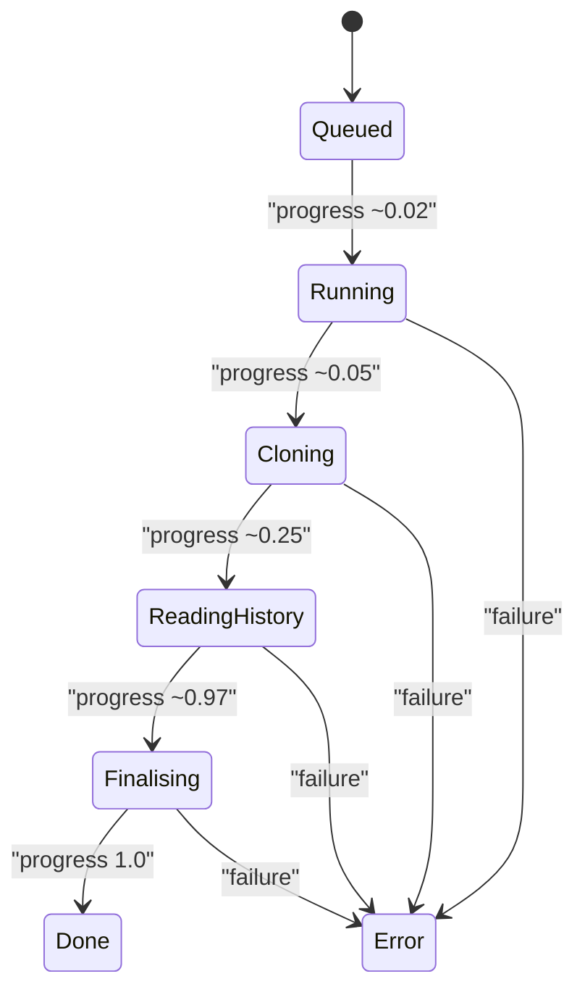
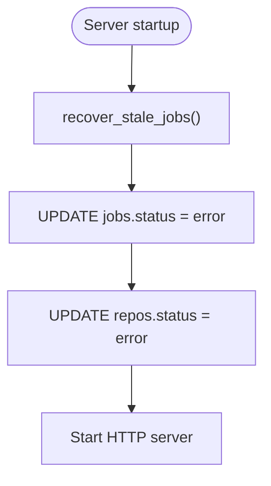
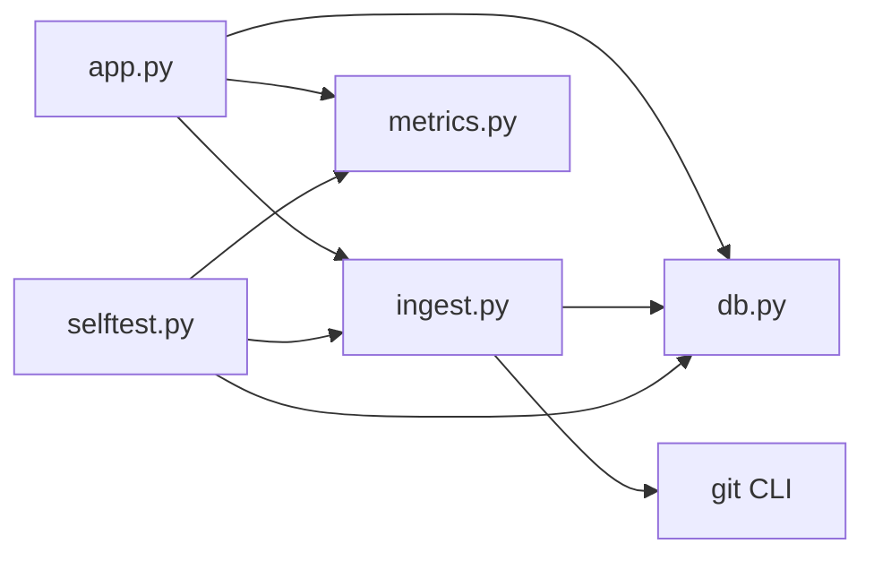

# Git Repository Cloning

<cite>
**Referenced Files in This Document**
- [app.py](file://app.py)
- [ingest.py](file://ingest.py)
- [db.py](file://db.py)
- [metrics.py](file://metrics.py)
- [selftest.py](file://selftest.py)
- [README.md](file://README.md)
</cite>

## Table of Contents
1. [Introduction](#introduction)
2. [Project Structure](#project-structure)
3. [Core Components](#core-components)
4. [Architecture Overview](#architecture-overview)
5. [Detailed Component Analysis](#detailed-component-analysis)
6. [Dependency Analysis](#dependency-analysis)
7. [Performance Considerations](#performance-considerations)
8. [Troubleshooting Guide](#troubleshooting-guide)
9. [Conclusion](#conclusion)

## Introduction
This document explains the Git repository cloning subsystem used by the Repo Analysis Tool (RAT). It focuses on how public repositories are accepted, validated, cloned securely, monitored for progress, and recovered when failures occur. The subsystem supports:
- Public HTTP/HTTPS Git clone URLs
- ZIP archives containing a complete `.git` directory
- Background ingestion with job status tracking
- Secure subprocess execution that avoids interactive prompts
- Timeouts for large clones and history parsing
- Resource cleanup and recovery of stale jobs after server restarts

The repository is a local Python web application using only the standard library plus `git`. Git must be available on the system PATH because cloning and history extraction are delegated to the `git` command-line tool.

**Section sources**
- [README.md:1-12](file://README.md#L1-L12)
- [README.md:23-40](file://README.md#L23-L40)

## Project Structure
The cloning subsystem spans three main modules:
- `app.py`: HTTP API entry point, request validation, job creation, and background thread dispatch.
- `ingest.py`: URL validation, secure Git execution, ZIP extraction, history parsing, job progress, failure handling, and cleanup.
- `db.py`: SQLite schema, connection helpers, data directory management, and startup-time database initialization.

**Diagram sources**
- [app.py:121-196](file://app.py#L121-L196)
- [ingest.py:356-441](file://ingest.py#L356-L441)
- [db.py:65-86](file://db.py#L65-L86)
- [metrics.py:179-183](file://metrics.py#L179-L183)

**Section sources**
- [app.py:1-31](file://app.py#L1-L31)
- [ingest.py:1-35](file://ingest.py#L1-L35)
- [db.py:1-13](file://db.py#L1-L13)

## Core Components
The cloning subsystem is centered around these responsibilities:

| Component | Responsibility | Key Behaviors |
|---|---|---|
| HTTP API handler | Accepts repository creation requests | Validates JSON input, delegates to ingestion, returns job identifiers |
| URL validator | Ensures only trusted HTTP/HTTPS clone URLs are accepted | Rejects empty strings, missing network locations, and non-HTTP schemes |
| Git executor | Runs `git` commands safely | Non-interactive environment, no shell invocation, timeout support, error translation |
| Job runner | Executes ingestion in a background thread | Updates job and repository status, tracks progress, handles failures |
| Data manager | Manages persistent storage and paths | Creates data directories, stores repo paths relative to `DATA_DIR`, uses WAL mode SQLite |
| Recovery helper | Restarts cleanly after server restart | Marks running jobs as failed and resets inconsistent repository states |

**Section sources**
- [app.py:338-349](file://app.py#L338-L349)
- [ingest.py:44-67](file://ingest.py#L44-L67)
- [ingest.py:70-86](file://ingest.py#L70-L86)
- [ingest.py:356-441](file://ingest.py#L356-L441)
- [db.py:65-86](file://db.py#L65-L86)
- [ingest.py:443-457](file://ingest.py#L443-L457)

## Architecture Overview
The repository cloning workflow follows this sequence:

**Diagram sources**
- [app.py:338-349](file://app.py#L338-L349)
- [app.py:306-336](file://app.py#L306-L336)
- [ingest.py:356-441](file://ingest.py#L356-L441)
- [ingest.py:320-349](file://ingest.py#L320-L349)

## Detailed Component Analysis

### URL Validation and Trusted Source Enforcement
Only HTTP and HTTPS clone URLs are accepted. The validation logic checks:
- The URL is not empty
- The parsed scheme is exactly `http` or `https`
- A network location (`netloc`) exists

This prevents unsafe protocols such as `ftp`, `file`, SSH-style URLs without proper handling, and malformed inputs.

**Diagram sources**
- [ingest.py:70-78](file://ingest.py#L70-L78)

Supported repository formats include:
- Public Git clone URLs using HTTP or HTTPS
- ZIP archives containing a full Git repository with a `.git` directory

Examples from the codebase and tests:
- `https://github.com/DaveGamble/cJSON.git` is accepted
- FTP URLs and invalid strings are rejected
- Name derivation strips trailing `.git` and extracts the final path segment

**Section sources**
- [ingest.py:70-86](file://ingest.py#L70-L86)
- [selftest.py:399-406](file://selftest.py#L399-L406)
- [README.md:23-27](file://README.md#L23-L27)

### Secure Git Execution Environment
The Git execution layer is designed to prevent interactive prompts and ensure safe, predictable behavior:

- `GIT_TERMINAL_PROMPT=0` is set so Git never blocks waiting for authentication input.
- Git is invoked through an explicit argument list, never via a shell, reducing injection risk.
- The working directory is explicitly set to the destination parent during cloning.
- Standard output and standard error are captured rather than printed interactively.
- Errors are translated into user-readable `IngestError` messages.

**Diagram sources**
- [ingest.py:44-67](file://ingest.py#L44-L67)
- [ingest.py:356-441](file://ingest.py#L356-L441)

**Section sources**
- [ingest.py:44-67](file://ingest.py#L44-L67)

### Cloning Workflow and Temporary Directory Management
When a URL-based repository is created:
1. The API validates the URL and creates repository and job rows.
2. A background thread starts the ingestion pipeline.
3. The pipeline prepares the destination under `<DATA_DIR>/repos/<repo_id>`.
4. Any existing destination is removed before cloning.
5. Git runs with `--quiet` and a strict timeout.
6. On success, the repository path is stored and status becomes ready.
7. On failure, the repository and job are marked as errored and the destination is cleaned up.

**Diagram sources**
- [ingest.py:356-441](file://ingest.py#L356-L441)
- [ingest.py:320-349](file://ingest.py#L320-L349)

Temporary directory behavior:
- Repositories are stored under `<DATA_DIR>/repos/<repo_id>`.
- Failed ingestion removes the destination directory.
- Uploaded ZIP payloads inside `DATA_DIR` are deleted after successful processing.
- The `_is_inside` helper ensures cleanup only affects files within the data directory.

**Section sources**
- [ingest.py:356-441](file://ingest.py#L356-L441)
- [db.py:65-74](file://db.py#L65-L74)

### Timeout Mechanisms for Large Repositories
Two important timeouts protect against long-running operations:

| Operation | Timeout Behavior | Purpose |
|---|---|---|
| Git clone | `MAX_CLONE_SECONDS` (1800 seconds) | Prevents indefinite network waits for very large or slow repositories |
| Git rev-list count | 300 seconds | Prevents hanging while estimating total commit count |
| Git log history wait | 120 seconds in `proc.wait(timeout=120)` | Ensures history parsing does not hang indefinitely |
| Subprocess timeout wrapper | Raises `IngestError` on timeout | Converts OS-level timeout into a user-readable ingestion failure |

**Diagram sources**
- [ingest.py:35](file://ingest.py#L35)
- [ingest.py:151-156](file://ingest.py#L151-L156)
- [ingest.py:302-312](file://ingest.py#L302-L312)
- [ingest.py:377-381](file://ingest.py#L377-L381)

**Section sources**
- [ingest.py:35](file://ingest.py#L35)
- [ingest.py:151-156](file://ingest.py#L151-L156)
- [ingest.py:302-312](file://ingest.py#L302-L312)
- [ingest.py:377-381](file://ingest.py#L377-L381)

### Error Handling Strategies for Network Failures
Network and Git-related failures are handled at multiple layers:

- `run_git` converts non-zero return codes and timeouts into `IngestError`.
- The stderr output is inspected to provide a meaningful last line as the error message.
- `run_ingest` catches `IngestError` and generic exceptions separately.
- Failed jobs update both the `jobs` and `repos` tables with `status = error`.
- Partially ingested data is removed to avoid inconsistent state.
- Server restart recovery marks interrupted jobs and repositories as errored.

**Diagram sources**
- [ingest.py:50-67](file://ingest.py#L50-L67)
- [ingest.py:332-349](file://ingest.py#L332-L349)
- [ingest.py:427-441](file://ingest.py#L427-L441)
- [ingest.py:443-457](file://ingest.py#L443-L457)

**Section sources**
- [ingest.py:50-67](file://ingest.py#L50-L67)
- [ingest.py:332-349](file://ingest.py#L332-L349)
- [ingest.py:427-441](file://ingest.py#L427-L441)
- [ingest.py:443-457](file://ingest.py#L443-L457)

### Authentication Handling
Authentication is intentionally non-interactive:
- `GIT_TERMINAL_PROMPT=0` prevents Git from prompting for credentials.
- If authentication is required, the clone will fail rather than block.
- Clients should configure Git credential helpers or use tokens embedded in supported HTTPS URLs if their hosting provider allows it.
- The implementation does not implement custom credential prompts or token managers.

This design favors automation and server safety over interactive authentication flows.

**Section sources**
- [ingest.py:44-47](file://ingest.py#L44-L47)

### Progress Tracking During Cloning and History Parsing
Progress is reported through the `jobs` table and can be polled via `/api/jobs/<job_id>`:

| Stage | Approximate Progress Value | Message Pattern |
|---|---:|---|
| Starting | 0.02 | `Starting` |
| Cloning | 0.05 | `Cloning <url>` |
| Clone complete | 0.25 | `Clone complete - reading history` |
| History parsing | 0.25 to 0.95 | `Reading history - X of Y commits` |
| Finalizing | 0.97 | `Finalising` |
| Done | 1.0 | `Ready - X commits, Y file rows` |

Progress updates are throttled every 200 commits during history parsing.

**Diagram sources**
- [ingest.py:320-349](file://ingest.py#L320-L349)
- [ingest.py:372-420](file://ingest.py#L372-L420)
- [app.py:279-304](file://app.py#L279-L304)

**Section sources**
- [ingest.py:320-349](file://ingest.py#L320-L349)
- [ingest.py:372-420](file://ingest.py#L372-L420)
- [app.py:279-304](file://app.py#L279-L304)

### Supported Repository Formats
The ingestion pipeline supports two repository formats:

| Format | Input Type | Behavior |
|---|---|---|
| Public Git URL | `source = "url"` | Validates HTTP/HTTPS, clones into `<DATA_DIR>/repos/<repo_id>` |
| ZIP archive | `source = "zip"` or `"sample"` | Extracts zip-slip-safe archive, locates `.git`, parses history |

ZIP extraction includes:
- Zip-slip protection against directory traversal
- Support for `.git` at archive root or inside one or two nested top-level folders
- Rejection of archives without a `.git` directory

**Section sources**
- [ingest.py:91-143](file://ingest.py#L91-L143)
- [ingest.py:356-398](file://ingest.py#L356-L398)
- [selftest.py:389-397](file://selftest.py#L389-L397)

### Resource Cleanup and Recovery Procedures
Cleanup and recovery are critical for reliability:

- Failed ingestion deletes the partially created repository directory.
- Uploaded ZIP files inside `DATA_DIR` are removed after successful processing.
- `_is_inside` ensures cleanup targets remain under the data directory.
- `recover_stale_jobs` runs at startup and marks interrupted jobs as errored.
- Repository status is reset to error for pending or running repositories after restart.

**Diagram sources**
- [ingest.py:443-457](file://ingest.py#L443-L457)
- [app.py:455-457](file://app.py#L455-L457)

**Section sources**
- [ingest.py:432-441](file://ingest.py#L432-L441)
- [ingest.py:443-457](file://ingest.py#L443-L457)
- [app.py:455-457](file://app.py#L455-L457)

## Dependency Analysis
The cloning subsystem has clear boundaries:

- `app.py` depends on `db.py`, `ingest.py`, and `metrics.py`.
- `ingest.py` depends on `db.py` and external `git`.
- `metrics.py` is used for query endpoints but is not part of the cloning pipeline.
- `selftest.py` exercises ingestion and metrics logic against a fixture.

**Diagram sources**
- [app.py:28-30](file://app.py#L28-L30)
- [ingest.py:30-35](file://ingest.py#L30-L35)
- [selftest.py:37-39](file://selftest.py#L37-L39)

**Section sources**
- [app.py:28-30](file://app.py#L28-L30)
- [ingest.py:30-35](file://ingest.py#L30-L35)
- [selftest.py:37-39](file://selftest.py#L37-L39)

## Performance Considerations
- Cloning uses `git clone --quiet` to reduce console noise and subprocess overhead.
- History parsing streams `git log` output and processes NUL-separated tokens incrementally.
- File change rows are batched and committed every 5000 rows to reduce database pressure.
- Progress callbacks are throttled every 200 commits to avoid excessive database writes.
- SQLite uses WAL mode, busy timeout, and synchronous normal settings for concurrency-friendly reads during ingestion.

These choices balance memory usage, disk I/O, and responsiveness for large repositories.

**Section sources**
- [ingest.py:181-214](file://ingest.py#L181-L214)
- [ingest.py:286-289](file://ingest.py#L286-L289)
- [db.py:77-86](file://db.py#L77-L86)

## Troubleshooting Guide
Common issues and recommended actions:

| Symptom | Likely Cause | Recommended Action |
|---|---|---|
| Clone fails immediately | Invalid URL or unsupported protocol | Use an HTTP or HTTPS public clone URL |
| Clone hangs or times out | Very large repository or slow network | Increase system resources or retry later; check network connectivity |
| Authentication prompt appears | Interactive Git configuration | Configure Git credential helpers or use tokenized HTTPS URLs |
| Job remains running after restart | Server was interrupted during ingestion | Restart the server; `recover_stale_jobs` will mark interrupted jobs as errored |
| Repository shows error status | Cloning or history parsing failed | Inspect job message and repository error field |
| Data directory permissions issue | `DATA_DIR` is not writable | Ensure the process can write to `DATA_DIR` or default `data/` directory |
| Git command not found | Git is not installed or not on PATH | Install Git and verify it is available in the system PATH |

Recovery steps:
- Delete the `data/` directory to reset all repositories and jobs.
- Restart the server to recover stale jobs.
- Verify that `git` is accessible from the same environment where `app.py` runs.

**Section sources**
- [README.md:36-40](file://README.md#L36-L40)
- [ingest.py:443-457](file://ingest.py#L443-L457)
- [app.py:455-457](file://app.py#L455-L457)

## Conclusion
The Git repository cloning subsystem prioritizes security, predictability, and recoverability. It accepts only HTTP/HTTPS public clone URLs, enforces non-interactive Git execution, applies timeouts to prevent indefinite hangs, and provides structured progress tracking through background jobs. Failed clones are isolated, partially ingested data is cleaned up, and server restarts are handled gracefully. For production use, operators should ensure Git is available, configure appropriate network and storage resources, and monitor job status through the API.