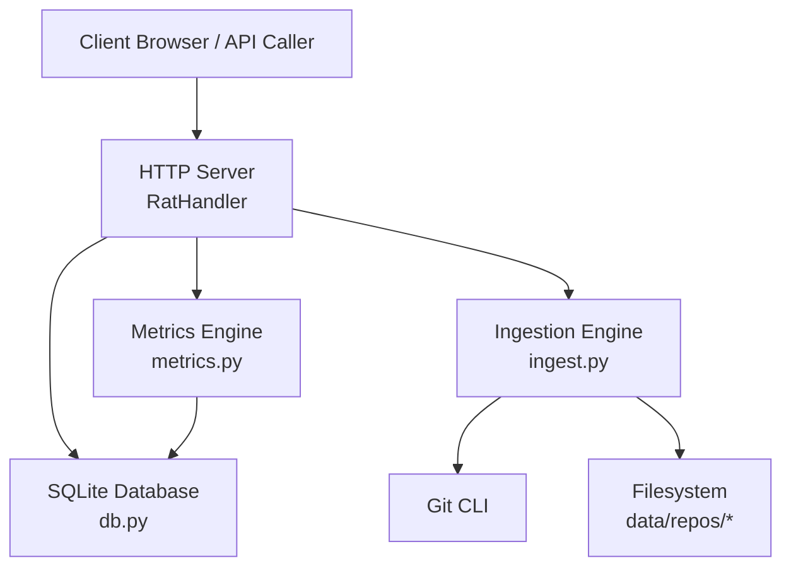
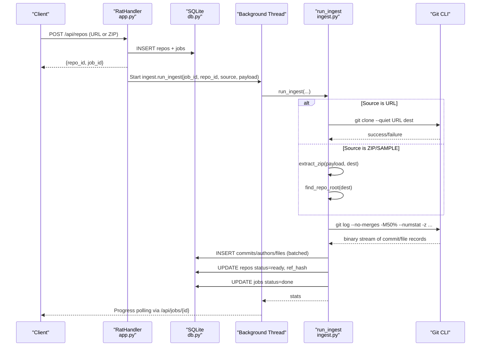
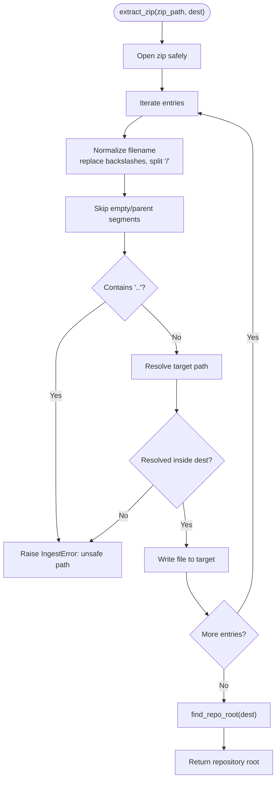
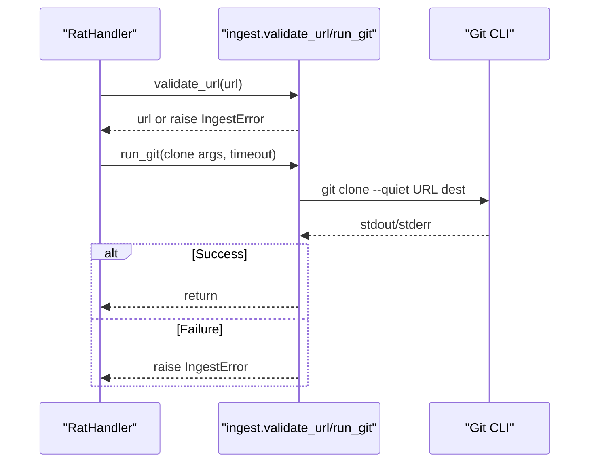
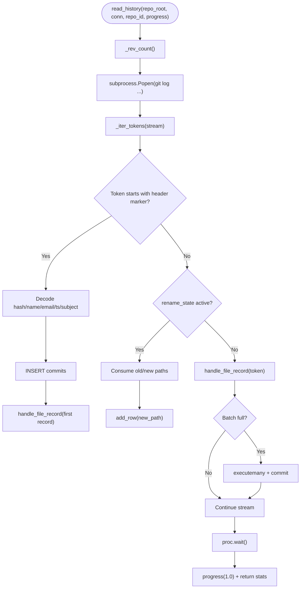
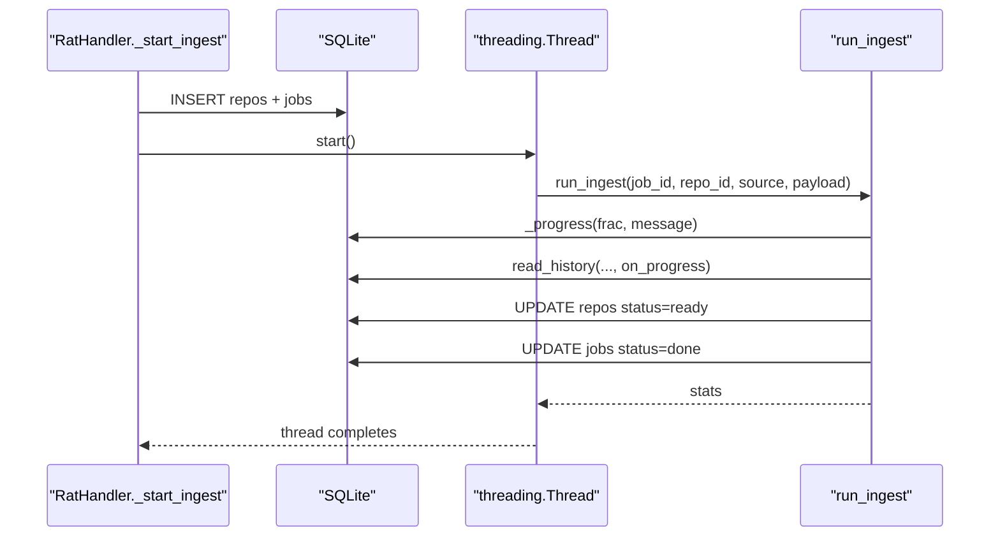
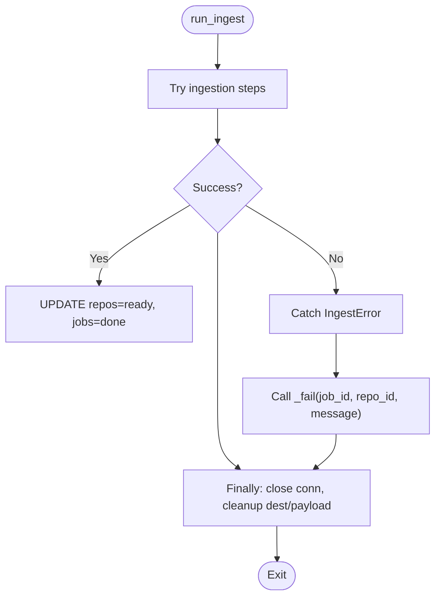
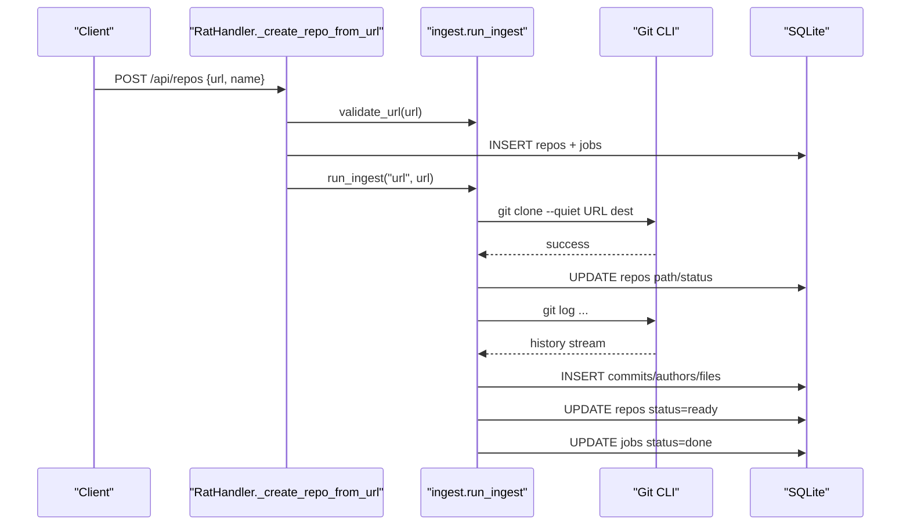
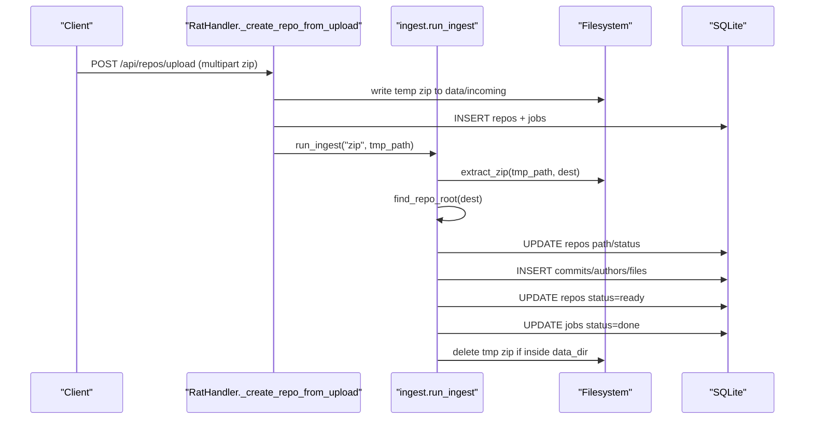
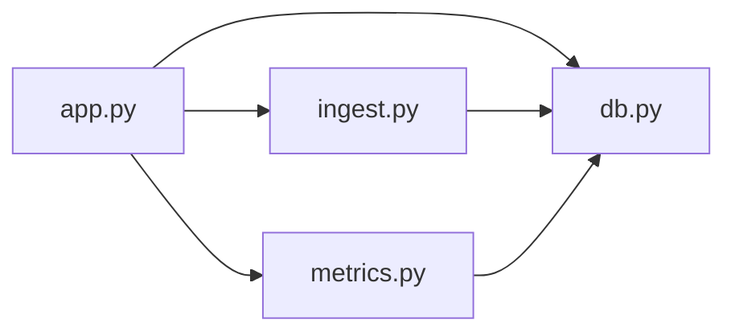

# Ingestion Pipeline

<cite>
**Referenced Files in This Document**
- [ingest.py](file://ingest.py)
- [app.py](file://app.py)
- [db.py](file://db.py)
- [metrics.py](file://metrics.py)
- [README.md](file://README.md)
</cite>

## Table of Contents
1. [Introduction](#introduction)
2. [Project Structure](#project-structure)
3. [Core Components](#core-components)
4. [Architecture Overview](#architecture-overview)
5. [Detailed Component Analysis](#detailed-component-analysis)
6. [Dependency Analysis](#dependency-analysis)
7. [Performance Considerations](#performance-considerations)
8. [Troubleshooting Guide](#troubleshooting-guide)
9. [Conclusion](#conclusion)

## Introduction
This document explains the ingestion pipeline that powers the repository analysis tool. It covers how the system ingests Git repositories from two sources:
- A local zip archive containing a complete `.git` directory.
- A public HTTP(S) Git clone URL.

The pipeline performs secure extraction, safe cloning, optimized single-pass history parsing into SQLite, background job execution with progress callbacks, error handling and recovery, and integration with the metrics engine and database layer.

## Project Structure
The ingestion pipeline is implemented across four main modules:
- `app.py`: HTTP API server, request validation, upload handling, and background thread dispatch.
- `ingest.py`: Secure zip extraction, Git cloning, history parsing, background job execution, and recovery helpers.
- `db.py`: SQLite schema, connection management, data directory configuration, and path helpers.
- `metrics.py`: Query filters, aggregation logic, and chart endpoints; not part of ingestion but consumes ingested data.

**Diagram sources**
- [app.py:56-196](file://app.py#L56-L196)
- [ingest.py:356-441](file://ingest.py#L356-L441)
- [db.py:15-86](file://db.py#L15-L86)
- [metrics.py:50-124](file://metrics.py#L50-L124)

**Section sources**
- [app.py:1-492](file://app.py#L1-L492)
- [ingest.py:1-458](file://ingest.py#L1-L458)
- [db.py:1-100](file://db.py#L1-L100)
- [metrics.py:1-544](file://metrics.py#L1-L544)
- [README.md:1-46](file://README.md#L1-L46)

## Core Components
- Secure zip extraction with zip-slip protection.
- Git repository cloning with environment isolation and timeouts.
- Optimized single-pass Git history parsing using NUL-separated tokens.
- Background job execution with progress callbacks and thread safety.
- Error handling, cleanup, and recovery procedures.
- Integration with SQLite via connection-per-call pattern and WAL mode.
- Metrics engine integration for post-ingestion queries.

**Section sources**
- [ingest.py:91-143](file://ingest.py#L91-L143)
- [ingest.py:181-315](file://ingest.py#L181-L315)
- [ingest.py:356-441](file://ingest.py#L356-L441)
- [db.py:65-86](file://db.py#L65-L86)
- [metrics.py:50-124](file://metrics.py#L50-L124)

## Architecture Overview
The ingestion workflow starts at the HTTP API, validates inputs, creates repository and job records, and then spawns a background thread to perform the actual ingestion. The ingestion thread interacts with Git, the filesystem, and SQLite, publishing progress updates back to the jobs table.

**Diagram sources**
- [app.py:306-381](file://app.py#L306-L381)
- [ingest.py:356-441](file://ingest.py#L356-L441)
- [ingest.py:181-315](file://ingest.py#L181-L315)
- [db.py:15-86](file://db.py#L15-L86)

## Detailed Component Analysis

### Secure Zip Extraction with Zip-Slip Protection
The zip extraction process ensures that no file escapes the destination directory by validating each entry’s path components and resolved target path. It also detects unsafe patterns such as parent directory traversal and rejects archives that do not contain a valid `.git` directory.

Key behaviors:
- Rejects invalid zip files.
- Normalizes paths and strips empty segments.
- Blocks entries containing `..`.
- Resolves target paths and verifies they remain under the destination root.
- Locates the repository root by searching for `.git` at the archive root, one-level nested folder, or two-level nested folder.

**Diagram sources**
- [ingest.py:91-143](file://ingest.py#L91-L143)

**Section sources**
- [ingest.py:91-143](file://ingest.py#L91-L143)

### Git Repository Cloning Workflow
Cloning is performed through a subprocess call to Git with a sanitized environment that disables interactive prompts. The clone operation uses a configurable timeout and raises a user-readable error on failure.

Key behaviors:
- Environment isolation: disables terminal prompts.
- Argument list invocation (no shell).
- Timeout enforcement.
- Error decoding and wrapping in `IngestError`.
- URL validation before cloning.

**Diagram sources**
- [ingest.py:44-78](file://ingest.py#L44-L78)
- [ingest.py:50-67](file://ingest.py#L50-L67)

**Section sources**
- [ingest.py:44-87](file://ingest.py#L44-L87)

### Optimized History Parsing Algorithm
History parsing uses a single pass over Git’s output stream, tokenizing NUL-separated records and decoding commit headers and file change records. It batches inserts for performance and tracks renames and binary files.

Key behaviors:
- Uses `git log` with specific format flags for efficient parsing.
- Streams output in 1 MiB chunks to avoid loading entire history into memory.
- Parses commit header tokens starting with a special marker.
- Handles rename records by consuming subsequent tokens.
- Skips binary files while counting them.
- Batches file inserts for performance.
- Publishes progress throttled every N commits.

**Diagram sources**
- [ingest.py:151-176](file://ingest.py#L151-L176)
- [ingest.py:181-315](file://ingest.py#L181-L315)

**Section sources**
- [ingest.py:151-315](file://ingest.py#L151-L315)

### Background Job Execution System
Ingestion runs in a daemon thread spawned by the HTTP handler. Progress callbacks update the jobs table and set repository status to running. Thread safety is ensured by using a new SQLite connection per job and committing after batch inserts.

Key behaviors:
- Spawns a daemon thread named `ingest-{repo_id}`.
- Updates job progress and repository status during ingestion.
- Cleans up partial data on failure.
- Removes temporary uploaded zip files if within the data directory.

**Diagram sources**
- [app.py:306-336](file://app.py#L306-L336)
- [ingest.py:320-349](file://ingest.py#L320-L349)
- [ingest.py:356-441](file://ingest.py#L356-L441)

**Section sources**
- [app.py:306-336](file://app.py#L306-L336)
- [ingest.py:320-441](file://ingest.py#L320-L441)

### Error Handling Strategies, Retry Mechanisms, and Recovery Procedures
The pipeline uses explicit exceptions for ingestion failures and wraps unexpected errors to ensure jobs never fail silently. On failure, it cleans up partially ingested rows and marks both job and repository as errored.

Key behaviors:
- `IngestError` for user-readable failures.
- `_fail` function deletes partial data and updates statuses.
- `recover_stale_jobs` resets interrupted jobs on server restart.
- Subprocess timeouts and non-zero return codes are converted to `IngestError`.
- Background threads catch all exceptions and mark jobs failed.

**Diagram sources**
- [ingest.py:38-40](file://ingest.py#L38-L40)
- [ingest.py:332-349](file://ingest.py#L332-L349)
- [ingest.py:427-441](file://ingest.py#L427-L441)
- [ingest.py:443-458](file://ingest.py#L443-L458)

**Section sources**
- [ingest.py:38-40](file://ingest.py#L38-L40)
- [ingest.py:332-349](file://ingest.py#L332-L349)
- [ingest.py:427-441](file://ingest.py#L427-L441)
- [ingest.py:443-458](file://ingest.py#L443-L458)

### Concrete Ingestion Examples

#### Example: Ingesting a Remote Repository
Steps:
1. Client sends `POST /api/repos` with JSON body containing `url` and optional `name`.
2. API validates URL and creates repository/job records.
3. Background thread clones the repository using Git.
4. History is parsed and inserted into SQLite.
5. Job status is updated to done with statistics.

**Diagram sources**
- [app.py:338-349](file://app.py#L338-L349)
- [ingest.py:356-426](file://ingest.py#L356-L426)

**Section sources**
- [app.py:338-349](file://app.py#L338-L349)
- [ingest.py:356-426](file://ingest.py#L356-L426)

#### Example: Ingesting a Zip Archive
Steps:
1. Client uploads a zip file to `POST /api/repos/upload`.
2. API validates the zip magic bytes and writes to a temporary file.
3. Background thread extracts the zip securely and locates the repository root.
4. History is parsed and inserted into SQLite.
5. Temporary zip file is deleted if within the data directory.

**Diagram sources**
- [app.py:351-363](file://app.py#L351-L363)
- [ingest.py:91-143](file://ingest.py#L91-L143)
- [ingest.py:356-441](file://ingest.py#L356-L441)

**Section sources**
- [app.py:351-363](file://app.py#L351-L363)
- [ingest.py:91-143](file://ingest.py#L91-L143)
- [ingest.py:356-441](file://ingest.py#L356-L441)

### Configuration Options and Performance Tuning Parameters
Configuration options include:
- `PORT`: First port tried by the HTTP server.
- `HOST`: Bind address for the HTTP server.
- `DATA_DIR`: Directory for SQLite database and ingested repositories.
- `MAX_UPLOAD_BYTES`: Maximum upload size for zip archives (1 GiB default).
- `MAX_CLONE_SECONDS`: Timeout for Git clone operations (1800 seconds default).
- `BATCH_ROWS`: Number of file rows to batch before committing (5000 default).
- `PROGRESS_EVERY`: Commit count threshold for progress callbacks (200 default).

Performance tuning parameters:
- SQLite WAL mode improves concurrency.
- Batch inserts reduce transaction overhead.
- Streaming Git log output avoids loading entire history into memory.
- Throttled progress updates reduce database write frequency.

**Section sources**
- [app.py:32-33](file://app.py#L32-L33)
- [app.py:444-452](file://app.py#L444-L452)
- [ingest.py:32-35](file://ingest.py#L32-L35)
- [db.py:65-86](file://db.py#L65-L86)
- [README.md:28-35](file://README.md#L28-L35)

### Resource Management
Resource management includes:
- Closing SQLite connections in finally blocks.
- Killing long-running Git processes if they do not exit normally.
- Cleaning up temporary directories and uploaded files.
- Using streaming I/O for large Git outputs.

**Section sources**
- [ingest.py:302-315](file://ingest.py#L302-L315)
- [ingest.py:432-441](file://ingest.py#L432-L441)
- [app.py:400-424](file://app.py#L400-L424)

### Integration with Database Layer and Metrics Calculation Engine
The ingestion pipeline integrates with the database layer by:
- Creating repository, author, commit, file, and job records.
- Using connection-per-call pattern with WAL mode for concurrency.
- Updating repository status and reference hash upon completion.

The metrics engine integrates by:
- Reading ingested data through standardized query filters.
- Computing aggregates like churn, growth, and ownership.
- Providing chart and summary endpoints.

**Section sources**
- [db.py:15-86](file://db.py#L15-L86)
- [ingest.py:204-236](file://ingest.py#L204-L236)
- [ingest.py:413-421](file://ingest.py#L413-L421)
- [metrics.py:50-124](file://metrics.py#L50-L124)
- [metrics.py:205-225](file://metrics.py#L205-L225)

## Dependency Analysis
The ingestion pipeline has clear dependencies:
- `app.py` depends on `ingest.py`, `db.py`, and `metrics.py`.
- `ingest.py` depends on `db.py` and external Git CLI.
- `metrics.py` depends on `db.py` for data access.
- All modules use standard library modules only.

**Diagram sources**
- [app.py:28-30](file://app.py#L28-L30)
- [ingest.py:30](file://ingest.py#L30)
- [metrics.py:1-21](file://metrics.py#L1-L21)

**Section sources**
- [app.py:28-30](file://app.py#L28-L30)
- [ingest.py:30](file://ingest.py#L30)
- [metrics.py:1-21](file://metrics.py#L1-L21)

## Performance Considerations
- Use WAL mode in SQLite to allow concurrent reads during ingestion.
- Batch insert file records to reduce transaction overhead.
- Stream Git log output in chunks to minimize memory usage.
- Throttle progress updates to reduce database write frequency.
- Limit upload size to prevent excessive memory consumption.
- Use Git’s optimized log format to parse history efficiently.

[No sources needed since this section provides general guidance]

## Troubleshooting Guide
Common issues and resolutions:
- Invalid zip archive: Ensure the uploaded file is a valid zip and contains a `.git` directory.
- Unsafe path in zip: Archive contains path traversal attempts; repackage the repository safely.
- Git clone timeout: Network issues or large repositories may exceed the timeout; check connectivity and repository size.
- Not a valid Git repository: Ensure the extracted directory contains a `.git` directory.
- Stale jobs after restart: Server restart clears running jobs; use recovery procedure to reset statuses.
- Port conflicts: HTTP server falls back to alternative ports automatically.

**Section sources**
- [ingest.py:103-104](file://ingest.py#L103-L104)
- [ingest.py:114-118](file://ingest.py#L114-L118)
- [ingest.py:140-143](file://ingest.py#L140-L143)
- [ingest.py:61-67](file://ingest.py#L61-L67)
- [ingest.py:443-458](file://ingest.py#L443-L458)
- [app.py:444-452](file://app.py#L444-L452)

## Conclusion
The ingestion pipeline provides a secure, efficient, and robust mechanism for ingesting Git repositories from zip archives and remote URLs. It combines secure extraction, optimized history parsing, background job execution, and comprehensive error handling to deliver reliable repository analysis. Integration with the metrics engine enables powerful querying and visualization of repository changes over time. Proper configuration and resource management ensure scalability and stability for diverse repository sizes and ingestion workloads.

[No sources needed since this section summarizes without analyzing specific files]