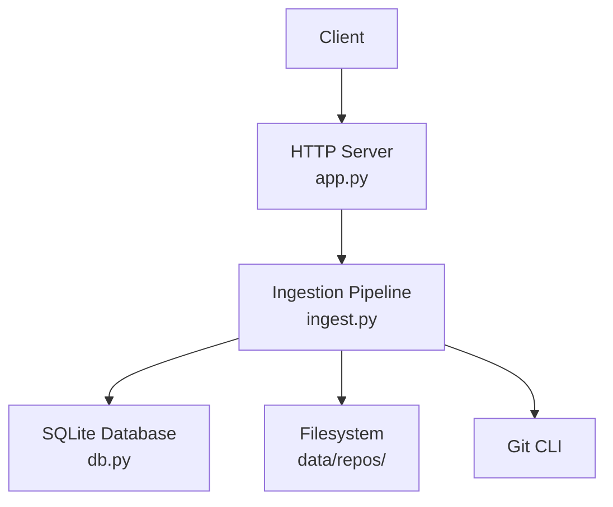
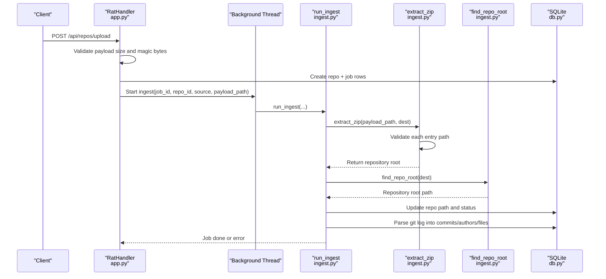
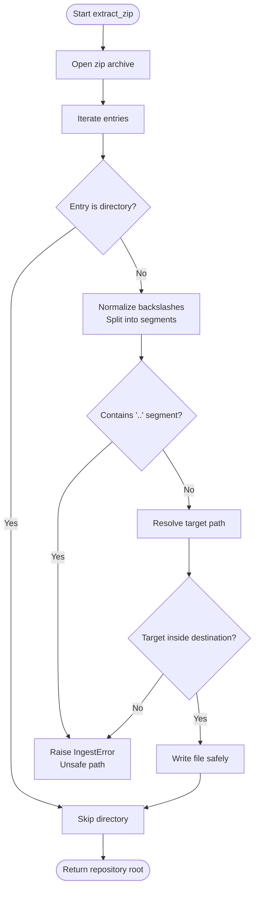
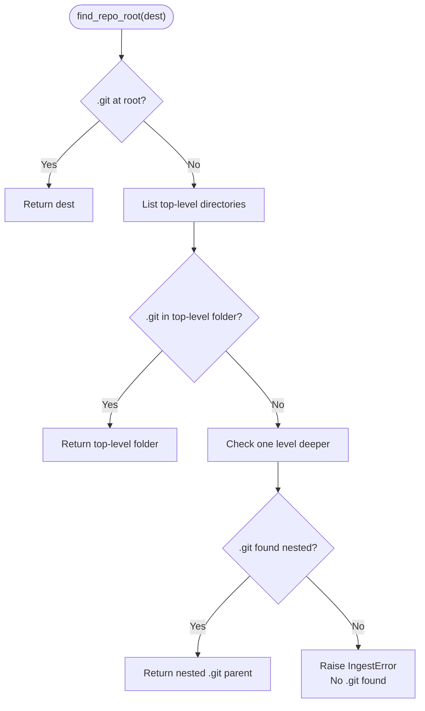
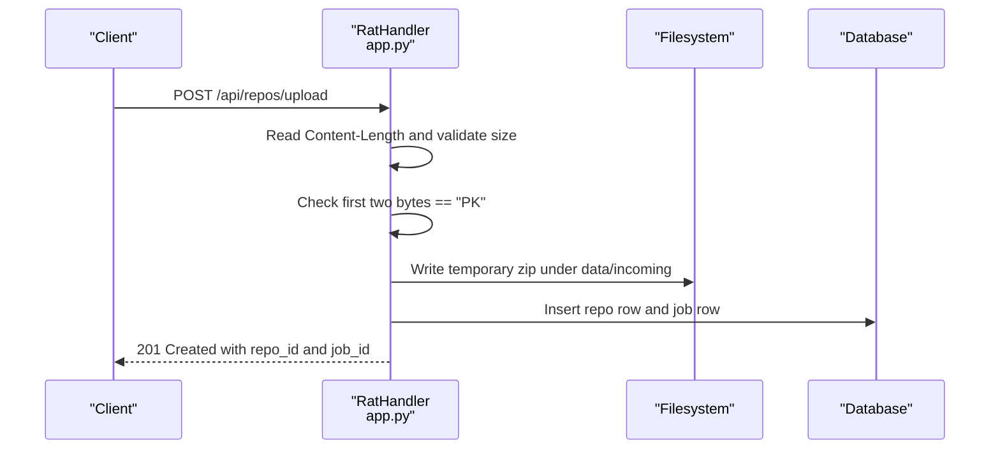
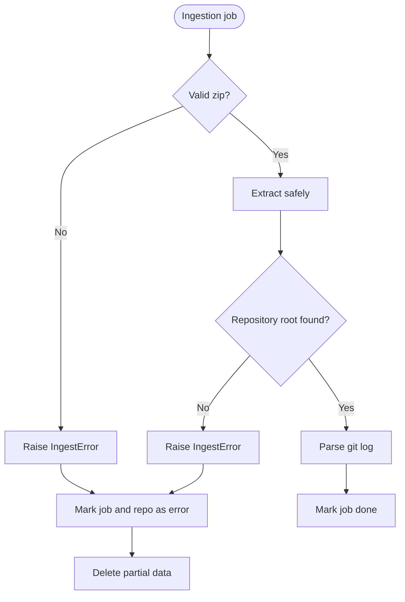
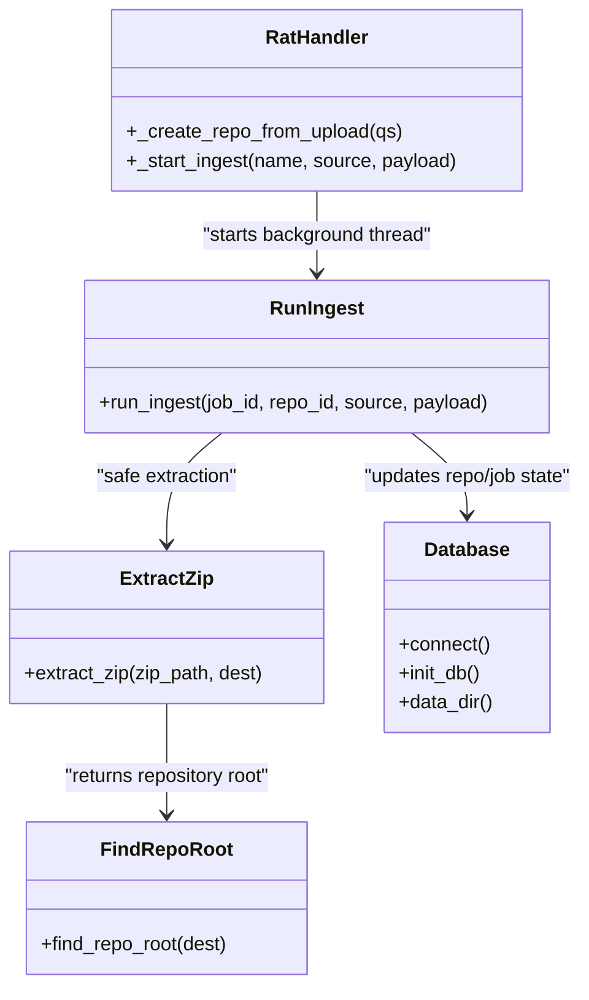
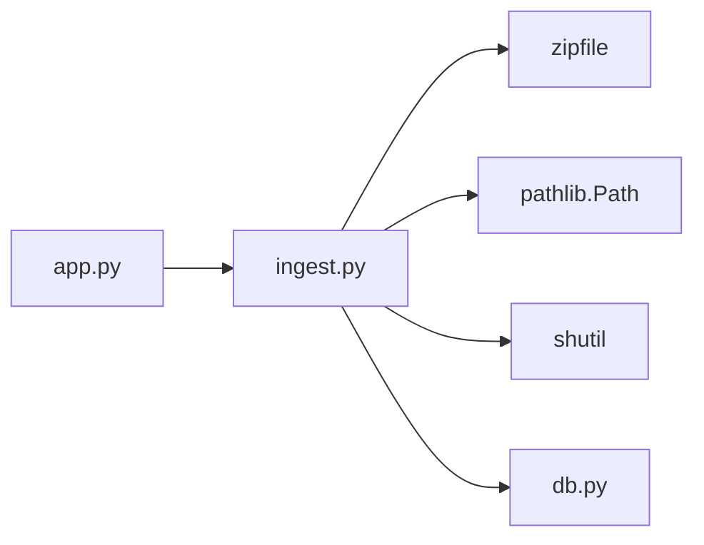

# Zip Extraction & Security

<cite>
**Referenced Files in This Document**
- [app.py](file://app.py)
- [ingest.py](file://ingest.py)
- [db.py](file://db.py)
- [selftest.py](file://selftest.py)
- [README.md](file://README.md)
</cite>

## Table of Contents
1. [Introduction](#introduction)
2. [Project Structure](#project-structure)
3. [Core Components](#core-components)
4. [Architecture Overview](#architecture-overview)
5. [Detailed Component Analysis](#detailed-component-analysis)
6. [Dependency Analysis](#dependency-analysis)
7. [Performance Considerations](#performance-considerations)
8. [Troubleshooting Guide](#troubleshooting-guide)
9. [Conclusion](#conclusion)

## Introduction
This document explains the secure zip extraction system used by the Repo Analysis Tool (RAT). It focuses on how malicious zip archives are rejected, how repository structure is detected at different nesting levels, and how ingestion integrates with the web server, database, and cleanup procedures.

The system accepts:
- A public Git URL to clone.
- A zip archive containing a complete Git repository (including `.git`).

For zip uploads, the implementation validates that extracted files remain inside the intended destination directory and rejects any path traversal attempts before writing anything to disk. After safe extraction, it locates the repository root and proceeds to parse Git history into SQLite.

## Project Structure
The relevant parts for zip extraction and security live in three modules:
- `app.py`: HTTP API, upload handling, job lifecycle, and temporary file placement.
- `ingest.py`: Secure zip extraction, repository root detection, Git cloning, and history parsing.
- `db.py`: Data directory resolution, schema, and connection helpers.
- `selftest.py`: Automated tests including zip-slip rejection and validation behavior.
- `README.md`: High-level usage and environment variables.

**Diagram sources**
- [app.py:306-363](file://app.py#L306-L363)
- [ingest.py:356-440](file://ingest.py#L356-L440)
- [db.py:65-86](file://db.py#L65-L86)

**Section sources**
- [app.py:1-492](file://app.py#L1-L492)
- [ingest.py:1-458](file://ingest.py#L1-L458)
- [db.py:1-100](file://db.py#L1-L100)
- [selftest.py:1-439](file://selftest.py#L1-L439)
- [README.md:1-46](file://README.md#L1-L46)

## Core Components
- **Zip-slip-safe extraction**: Validates every entry before writing, rejecting paths with traversal components or resolved targets outside the destination.
- **Repository root detection**: Finds `.git` at the archive root, inside one top-level folder, or one level deeper.
- **Upload boundary enforcement**: Rejects non-zip payloads and limits upload size.
- **Job isolation**: Ingestion runs in a background thread; failures mark jobs and repositories as errored and clean up partial data.
- **Data directory anchoring**: All persistent paths are anchored under a controlled data directory.

**Section sources**
- [ingest.py:91-143](file://ingest.py#L91-L143)
- [app.py:351-363](file://app.py#L351-L363)
- [ingest.py:356-440](file://ingest.py#L356-L440)
- [db.py:65-86](file://db.py#L65-L86)

## Architecture Overview
The zip ingestion flow starts at the HTTP API, moves through the ingestion pipeline, performs secure extraction, detects the repository root, and then parses Git history.

**Diagram sources**
- [app.py:351-363](file://app.py#L351-L363)
- [app.py:306-336](file://app.py#L306-L336)
- [ingest.py:356-440](file://ingest.py#L356-L440)
- [ingest.py:91-143](file://ingest.py#L91-L143)
- [db.py:65-86](file://db.py#L65-L86)

## Detailed Component Analysis

### Zip-Slip Attack Prevention
The extraction function prevents zip-slip attacks using two complementary checks:

1. **Path component validation**:
   - Normalizes backslashes to forward slashes.
   - Splits the filename into path segments.
   - Rejects any segment equal to `..`.

2. **Resolved target boundary check**:
   - Computes the absolute target path.
   - Resolves both the destination and target.
   - Ensures the resolved target equals the destination or is strictly under it.

If either check fails, an ingestion error is raised before any file is written.

**Diagram sources**
- [ingest.py:91-122](file://ingest.py#L91-L122)

**Section sources**
- [ingest.py:91-122](file://ingest.py#L91-L122)

### Archive Structure Detection
After safe extraction, the system determines where the Git repository lives. It supports three common archive layouts:

- **Root repository**: `.git` exists directly under the extracted destination.
- **Single top-level folder**: `.git` exists under exactly one immediate subdirectory.
- **Nested folder**: `.git` exists one level deeper when needed.

If no `.git` is found, ingestion fails with a clear message indicating that RAT requires the full Git history.

**Diagram sources**
- [ingest.py:125-143](file://ingest.py#L125-L143)

**Section sources**
- [ingest.py:125-143](file://ingest.py#L125-L143)

### Upload Validation and Safe File Resolution
Before ingestion begins, the HTTP handler enforces upload boundaries:

- Maximum upload size is enforced via request body length validation.
- The uploaded file must start with the ZIP magic bytes `PK`.
- The file is written to a controlled `data/incoming` directory with a randomized name.
- The ingestion job receives the temporary path as the payload.

**Diagram sources**
- [app.py:351-363](file://app.py#L351-L363)
- [app.py:401-412](file://app.py#L401-L412)

**Section sources**
- [app.py:351-363](file://app.py#L351-L363)
- [app.py:401-412](file://app.py#L401-L412)

### Error Handling for Corrupted Archives
Corrupted or invalid archives are handled at multiple layers:

- **HTTP layer**: Invalid JSON, missing headers, oversized payloads, and unknown endpoints return structured JSON errors.
- **Upload layer**: Non-zip payloads raise a user-facing error.
- **Extraction layer**: Invalid zip archives raise an ingestion error.
- **Repository layer**: Missing `.git` raises an ingestion error.
- **Job layer**: Failures update the job and repository status to `error`, delete partially ingested rows, and optionally remove the destination directory.

**Diagram sources**
- [ingest.py:91-143](file://ingest.py#L91-L143)
- [ingest.py:332-349](file://ingest.py#L332-L349)
- [ingest.py:427-440](file://ingest.py#L427-L440)

**Section sources**
- [ingest.py:91-143](file://ingest.py#L91-L143)
- [ingest.py:332-349](file://ingest.py#L332-L349)
- [ingest.py:427-440](file://ingest.py#L427-L440)

### Integration with Repository Root Detection and Cleanup
The ingestion pipeline coordinates:
- Temporary upload storage.
- Destination directory creation.
- Safe extraction.
- Repository root discovery.
- Database updates.
- Cleanup of failed jobs and temporary files.

**Diagram sources**
- [app.py:306-363](file://app.py#L306-L363)
- [ingest.py:356-440](file://ingest.py#L356-L440)
- [ingest.py:91-143](file://ingest.py#L91-L143)
- [db.py:65-86](file://db.py#L65-L86)

**Section sources**
- [app.py:306-363](file://app.py#L306-L363)
- [ingest.py:356-440](file://ingest.py#L356-L440)
- [ingest.py:91-143](file://ingest.py#L91-L143)
- [db.py:65-86](file://db.py#L65-L86)

## Dependency Analysis
The secure extraction logic depends on:
- Python’s standard library `zipfile` module.
- `pathlib.Path` for safe path resolution.
- `shutil.copyfileobj` for streaming file contents.
- The ingestion pipeline for job coordination.
- The database module for data directory anchoring and persistence.

**Diagram sources**
- [app.py:28-30](file://app.py#L28-L30)
- [ingest.py:22-30](file://ingest.py#L22-L30)
- [db.py:1-12](file://db.py#L1-L12)

**Section sources**
- [app.py:28-30](file://app.py#L28-L30)
- [ingest.py:22-30](file://ingest.py#L22-L30)
- [db.py:1-12](file://db.py#L1-L12)

## Performance Considerations
- **Streaming extraction**: Files are copied using a streaming copy operation rather than loading entire archives into memory.
- **Directory skipping**: Directory entries are skipped during iteration to avoid unnecessary work.
- **Batched history parsing**: Git history is parsed in a single pass with batched inserts to reduce database round-trips.
- **Progress throttling**: Progress updates are emitted periodically rather than per commit.
- **Large archive limits**: Upload size is capped at 1 GiB at the HTTP layer.
- **Temporary file cleanup**: Failed jobs remove partial destinations; successful jobs may remove temporary incoming files if they reside under the data directory.

[No sources needed since this section provides general guidance]

## Troubleshooting Guide
Common issues and their likely causes:

- **Uploaded file is not a zip archive**:
  - Cause: Payload does not start with ZIP magic bytes.
  - Action: Verify the client sends a valid zip file.

- **Zip contains an unsafe path**:
  - Cause: Entry contains `..` or resolves outside the destination.
  - Action: Rebuild the archive so all files stay within the repository folder.

- **No .git directory found**:
  - Cause: Archive does not contain a complete Git repository.
  - Action: Include the full `.git` directory in the zip.

- **Job marked as error after restart**:
  - Cause: Background threads do not survive server restarts.
  - Action: Restart ingestion or inspect the job and repository status.

- **Data directory location**:
  - Cause: Custom `DATA_DIR` environment variable changes where repos and the database are stored.
  - Action: Check `DATA_DIR` and ensure the process has write permissions.

**Section sources**
- [app.py:351-363](file://app.py#L351-L363)
- [ingest.py:91-143](file://ingest.py#L91-L143)
- [ingest.py:443-458](file://ingest.py#L443-L458)
- [db.py:65-70](file://db.py#L65-L70)
- [README.md:28-40](file://README.md#L28-L40)

## Conclusion
The RAT zip extraction system prioritizes safety by validating every path before writing, enforcing strict destination boundaries, and requiring a complete Git repository. It supports common archive layouts, integrates cleanly with the HTTP API and database, and provides robust error handling and cleanup. For large archives, it uses streaming I/O and batched database operations while keeping upload sizes bounded. Automated tests confirm that zip-slip attacks are rejected and that URL validation behaves as expected.

[No sources needed since this section summarizes without analyzing specific files]