# Aggregation Engine

<cite>
**Referenced Files in This Document**
- [app.py](file://app.py)
- [db.py](file://db.py)
- [metrics.py](file://metrics.py)
- [ingest.py](file://ingest.py)
- [README.md](file://README.md)
</cite>

## Table of Contents
1. [Introduction](#introduction)
2. [Project Structure](#project-structure)
3. [Core Components](#core-components)
4. [Architecture Overview](#architecture-overview)
5. [Detailed Component Analysis](#detailed-component-analysis)
6. [Dependency Analysis](#dependency-analysis)
7. [Performance Considerations](#performance-considerations)
8. [Troubleshooting Guide](#troubleshooting-guide)
9. [Conclusion](#conclusion)

## Introduction
This document explains the SQL-based aggregation engine used by the Repo Analysis Tool (RAT). The engine computes per-object metrics such as added lines, removed lines, growth, churn, modifications, modification frequency, and churn rate over a selected commit set. It supports:
- Exact file matching
- Directory subtree matching
- Commit-set filtering by time range, author identity, explicit commit hashes, or hash prefixes
- Efficient joins between the `files` and `commits` tables
- Author-level attribution and ownership calculations

The primary implementation lives in the metric engine module, with database schema and connection helpers in the database module, HTTP routing in the application module, and ingestion logic that populates the underlying tables.

**Section sources**
- [README.md:1-46](file://README.md#L1-L46)

## Project Structure
The repository is a small Python web service with four main modules:
- `app.py`: HTTP server, request routing, parameter validation, and JSON responses.
- `metrics.py`: Metric computation, filter parsing, path clauses, aggregation queries, and chart generation.
- `db.py`: SQLite schema, indexes, connection helper, and data directory handling.
- `ingest.py`: Git history extraction, batched inserts into `commits`, `authors`, and `files`.

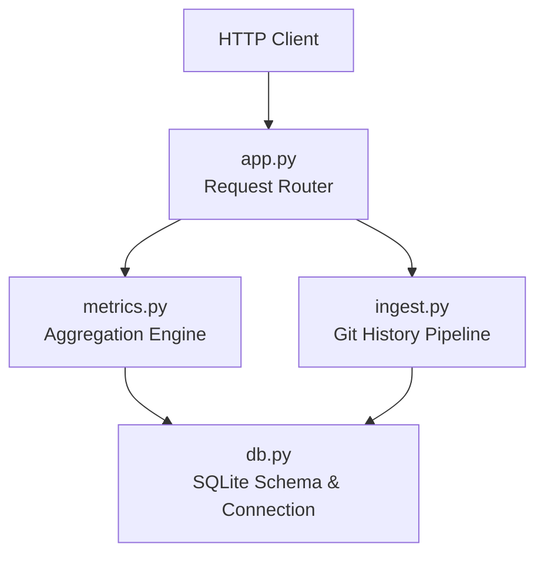

**Diagram sources**
- [app.py:120-196](file://app.py#L120-L196)
- [metrics.py:50-176](file://metrics.py#L50-L176)
- [db.py:15-62](file://db.py#L15-L62)
- [ingest.py:181-315](file://ingest.py#L181-L315)

**Section sources**
- [app.py:1-492](file://app.py#L1-L492)
- [metrics.py:1-544](file://metrics.py#L1-L544)
- [db.py:1-100](file://db.py#L1-L100)
- [ingest.py:1-458](file://ingest.py#L1-L458)

## Core Components
The aggregation engine centers around these responsibilities:
- Commit-set filtering: building WHERE fragments for time ranges, authors, and commit hashes.
- Path matching: exact file match versus directory subtree match using safe substring predicates.
- Aggregation query: efficient JOIN between `files` and `commits`, computing added, removed, and modifications.
- Derived metrics: churn, growth, frequency, and churn rate based on commit-set size.
- Endpoint-specific aggregations: summary, tree, file detail, authors table, commits list, and charts.

Key functions:
- `_commit_where`: builds commit-set filters.
- `_path_clause`: generates path-matching SQL and parameters.
- `_agg`: executes the core aggregation query.
- `_derived`: converts raw counts into derived metrics.

**Section sources**
- [metrics.py:91-168](file://metrics.py#L91-L168)

## Architecture Overview
The HTTP layer routes requests to metric functions. Each metric function parses filters, computes commit-set size, builds WHERE clauses, and calls `_agg` for core metrics. The database layer provides a connection with WAL mode and appropriate PRAGMAs for concurrent reads during ingestion.

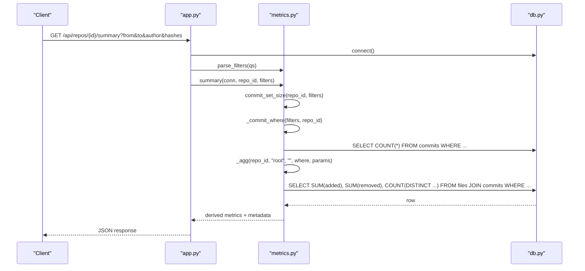

**Diagram sources**
- [app.py:139-142](file://app.py#L139-L142)
- [metrics.py:205-225](file://metrics.py#L205-L225)
- [metrics.py:171-176](file://metrics.py#L171-L176)
- [metrics.py:138-155](file://metrics.py#L138-L155)
- [db.py:77-86](file://db.py#L77-L86)

## Detailed Component Analysis

### Commit-Set Filtering: `_commit_where`
The commit-set filter supports:
- Repository scoping via `repo_id`.
- Time range filtering: inclusive lower bound (`ts >= from`) and exclusive upper bound (`ts < to`).
- Author filtering through canonical identity resolution using `COALESCE(canonical_id, id)`.
- Explicit commit hashes or prefixes:
  - Exact 12-character prefixes are matched using `substr(c.hash, 1, 12) IN (...)`.
  - Shorter prefixes use `c.hash LIKE ? || '%'`.
  - An empty token list represents an empty commit set.

Parameters are built alongside the SQL fragment to avoid string concatenation vulnerabilities.

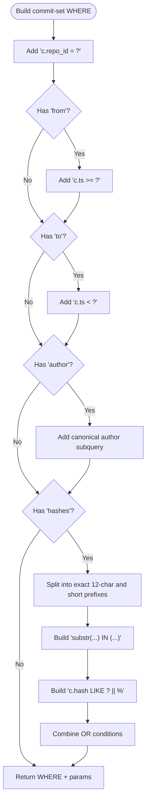

**Diagram sources**
- [metrics.py:91-124](file://metrics.py#L91-L124)

**Section sources**
- [metrics.py:50-78](file://metrics.py#L50-L78)
- [metrics.py:91-124](file://metrics.py#L91-L124)

### Path Matching: `_path_clause`
Path matching distinguishes three cases:
- Root: no path predicate.
- File: exact match using `f.path = ?`.
- Directory: subtree match using `substr(f.path, 1, length(?) + 1) = ? || '/'`.

This avoids unsafe `LIKE` usage and ensures correct directory boundaries.

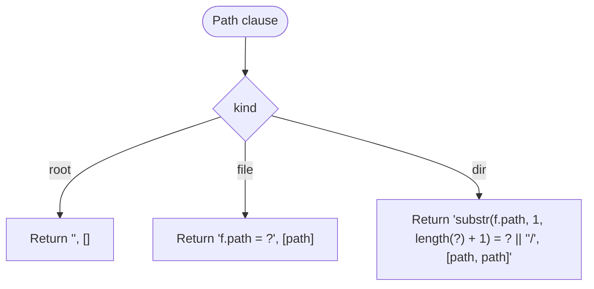

**Diagram sources**
- [metrics.py:129-135](file://metrics.py#L129-L135)

**Section sources**
- [metrics.py:129-135](file://metrics.py#L129-L135)

### Core Aggregation: `_agg`
The `_agg` function computes:
- Added lines: `SUM(f.added)`
- Removed lines: `SUM(f.removed)`
- Modifications: number of distinct commits where `f.added + f.removed > 0`

It joins `files` and `commits` on `commit_id`, applies repository scoping, optional path predicate, and commit-set WHERE clause. Parameters are concatenated safely.

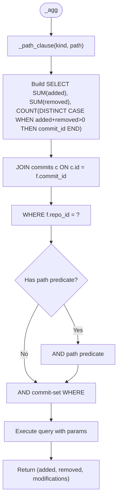

**Diagram sources**
- [metrics.py:138-155](file://metrics.py#L138-L155)
- [metrics.py:129-135](file://metrics.py#L129-L135)

**Section sources**
- [metrics.py:138-155](file://metrics.py#L138-L155)

### Derived Metrics: `_derived`
Derived metrics include:
- Growth: `added - removed`
- Churn: `added + removed`
- Frequency: `modifications / |H|`
- Churn rate: `churn / |H|`

When the commit-set size is zero, frequency and churn rate default to zero.

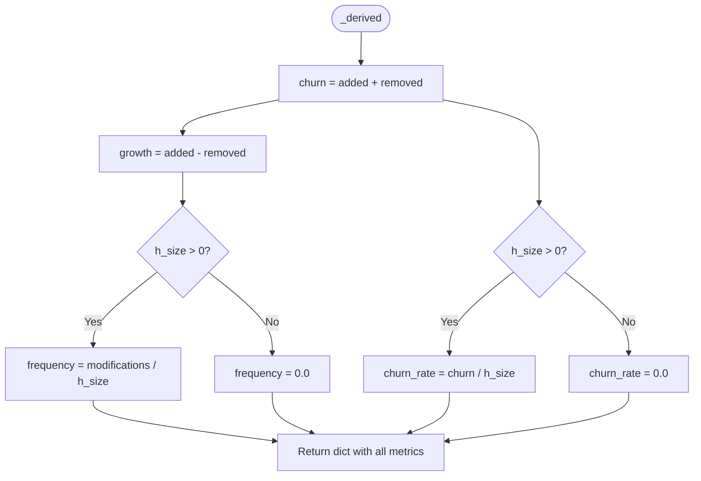

**Diagram sources**
- [metrics.py:158-168](file://metrics.py#L158-L168)

**Section sources**
- [metrics.py:158-168](file://metrics.py#L158-L168)

### Summary Endpoint
The summary endpoint computes repository-wide metrics for the selected commit set:
- Adds, removes, modifications via `_agg` with root path.
- Distinct file count across the filtered commit set.
- Distinct author count using canonical identity.

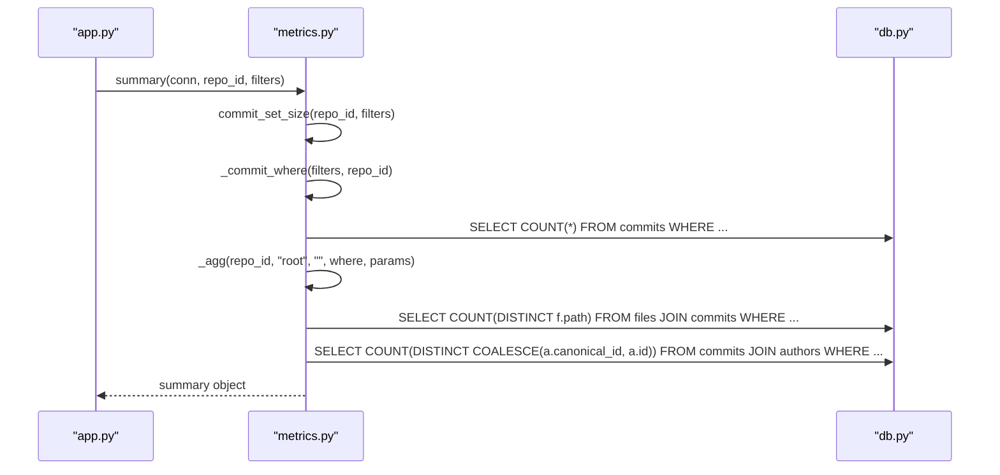

**Diagram sources**
- [metrics.py:205-225](file://metrics.py#L205-L225)
- [metrics.py:171-176](file://metrics.py#L171-L176)
- [metrics.py:138-155](file://metrics.py#L138-L155)

**Section sources**
- [metrics.py:205-225](file://metrics.py#L205-L225)

### Tree Endpoint
The tree endpoint lists immediate children of a directory:
- First, it fetches distinct paths under the base directory using a root or directory path predicate.
- For each child, it determines whether it is a file or directory.
- Then it calls `_agg` with either exact file matching or directory subtree matching.

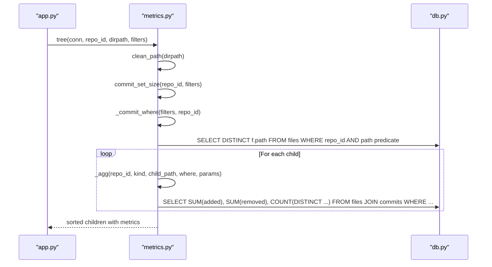

**Diagram sources**
- [metrics.py:228-262](file://metrics.py#L228-L262)
- [metrics.py:129-135](file://metrics.py#L129-L135)
- [metrics.py:138-155](file://metrics.py#L138-L155)

**Section sources**
- [metrics.py:228-262](file://metrics.py#L228-L262)

### File Detail Endpoint
The file detail endpoint computes per-file metrics and per-author breakdown:
- Overall file metrics via `_agg`.
- Per-author aggregates including commits, modifications, added, removed, churn, and ownership share.

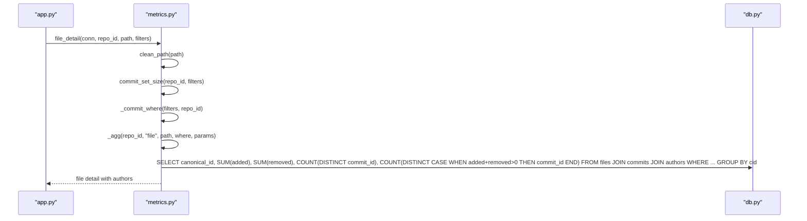

**Diagram sources**
- [metrics.py:265-307](file://metrics.py#L265-L307)
- [metrics.py:138-155](file://metrics.py#L138-L155)

**Section sources**
- [metrics.py:265-307](file://metrics.py#L265-L307)

### Authors Table Endpoint
The authors table endpoint computes per-author statistics:
- Total churn across the commit set.
- Per-author commits, modifications, churn, and ownership share.
- Identity merging via canonical IDs.

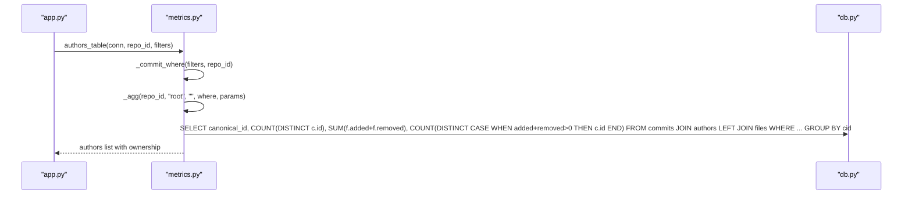

**Diagram sources**
- [metrics.py:310-361](file://metrics.py#L310-L361)
- [metrics.py:138-155](file://metrics.py#L138-L155)

**Section sources**
- [metrics.py:310-361](file://metrics.py#L310-L361)

### Commits List Endpoint
The commits list endpoint returns paginated commits with optional search:
- Search matches commit hash prefix or subject substring.
- Joins authors and canonical identity for display name.

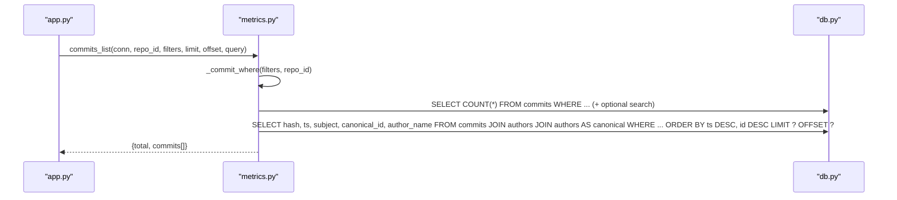

**Diagram sources**
- [metrics.py:399-435](file://metrics.py#L399-L435)

**Section sources**
- [metrics.py:399-435](file://metrics.py#L399-L435)

### Chart Endpoints
Charts compute time-series and top-level aggregations:
- Churn chart: groups by day/week/month buckets, preserving commits even if they have no measured files.
- Top files chart: groups by file path and orders by churn.
- Author share chart: groups by canonical author and shows top contributors plus an "Others" bucket.

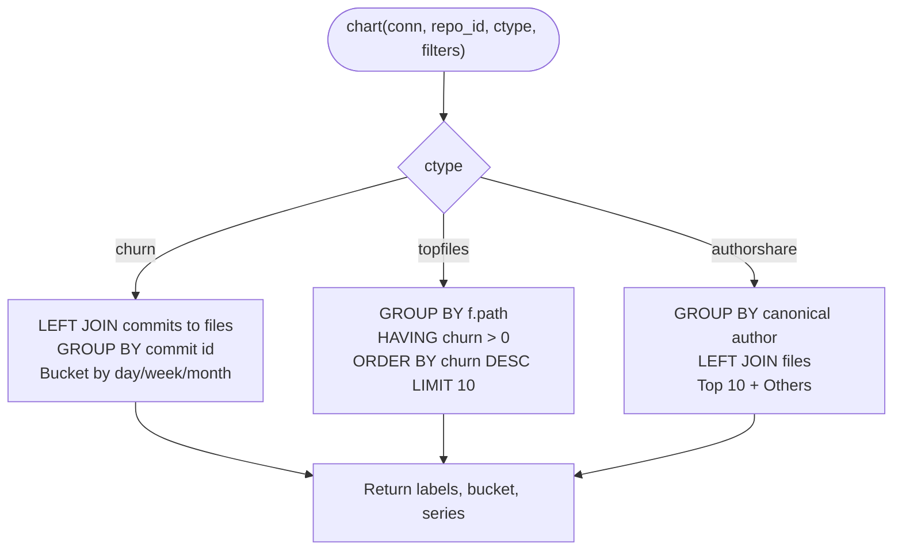

**Diagram sources**
- [metrics.py:463-543](file://metrics.py#L463-L543)

**Section sources**
- [metrics.py:463-543](file://metrics.py#L463-L543)

## Dependency Analysis
The aggregation engine depends on:
- Database schema and indexes defined in `db.py`.
- HTTP routing and parameter validation in `app.py`.
- Ingestion pipeline populating `commits`, `authors`, and `files` in `ingest.py`.

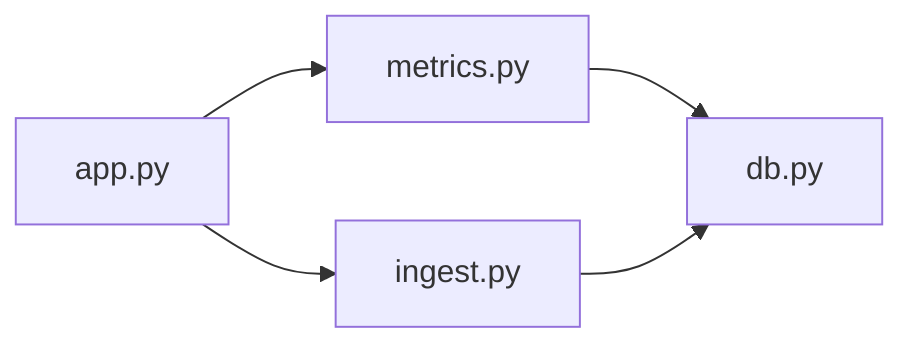

**Diagram sources**
- [app.py:28-30](file://app.py#L28-L30)
- [metrics.py:1-21](file://metrics.py#L1-L21)
- [db.py:15-62](file://db.py#L15-L62)
- [ingest.py:181-315](file://ingest.py#L181-L315)

**Section sources**
- [app.py:120-196](file://app.py#L120-L196)
- [metrics.py:1-544](file://metrics.py#L1-L544)
- [db.py:15-62](file://db.py#L15-L62)
- [ingest.py:181-315](file://ingest.py#L181-L315)

## Performance Considerations
Key performance characteristics:
- Index usage:
  - `idx_files_commit` on `(repo_id, commit_id)` supports joins between `files` and `commits`.
  - `idx_files_path` on `(repo_id, path)` supports exact file and directory subtree matching.
  - `idx_commits_ts` on `(repo_id, ts)` supports time-range filtering.
  - `idx_commits_hash` on `(repo_id, hash)` supports hash prefix matching.
- Query patterns:
  - `_agg` uses a single aggregated SELECT with a JOIN, minimizing round trips.
  - Commit-set size is computed separately to derive frequency and churn rate.
  - Directory listing first fetches distinct paths, then aggregates per child; this reduces repeated full scans.
- Concurrency:
  - SQLite WAL mode allows readers to proceed while ingestion writes.
  - Busy timeout and synchronous settings balance durability and throughput.
- Large repositories:
  - Avoid expensive `LIKE` on paths; use `substr` predicates for directories.
  - Limit hash prefixes to exact 12-character matches when possible to leverage index-friendly equality checks.
  - Use pagination for commits list endpoints to avoid large result sets.

[No sources needed since this section provides general guidance]

## Troubleshooting Guide
Common issues and resolutions:
- Invalid integer parameters:
  - Filter parsing raises `FilterError` for out-of-range or malformed integers.
- Invalid paths:
  - Path normalization rejects segments like `.` or `..` and enforces maximum length.
- Unknown entities:
  - Repository lookup raises `NotFound` when the repository does not exist.
- Git errors:
  - Ingestion wraps subprocess failures and timeouts in `IngestError`.
- Server errors:
  - Unhandled exceptions in request handlers return JSON 500 responses.

Recommended debugging steps:
- Validate query parameters before calling metric functions.
- Check repository status and job messages after ingestion.
- Inspect SQLite indexes and ensure they exist.
- Use the health endpoint to verify server availability.

**Section sources**
- [metrics.py:30-35](file://metrics.py#L30-L35)
- [metrics.py:40-47](file://metrics.py#L40-L47)
- [metrics.py:81-88](file://metrics.py#L81-L88)
- [metrics.py:179-183](file://metrics.py#L179-L183)
- [ingest.py:50-67](file://ingest.py#L50-L67)
- [app.py:73-90](file://app.py#L73-L90)

## Conclusion
The aggregation engine provides a robust, index-aware SQL layer for computing repository metrics. Its design separates concerns cleanly:
- Filters and path predicates are generated safely with parameterized queries.
- Core aggregation is centralized in `_agg`, ensuring consistent semantics across endpoints.
- Derived metrics are computed deterministically from raw counts and commit-set size.
- The system scales to large repositories through careful indexing, efficient joins, and controlled query patterns.

For further optimization:
- Monitor query execution plans for hot paths.
- Tune SQLite pragmas based on workload characteristics.
- Consider materialized views or precomputed aggregates for frequently accessed dashboards.

[No sources needed since this section summarizes without analyzing specific files]