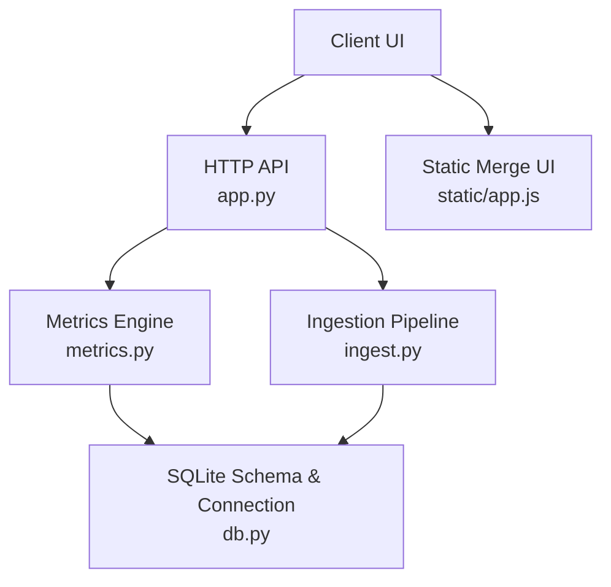
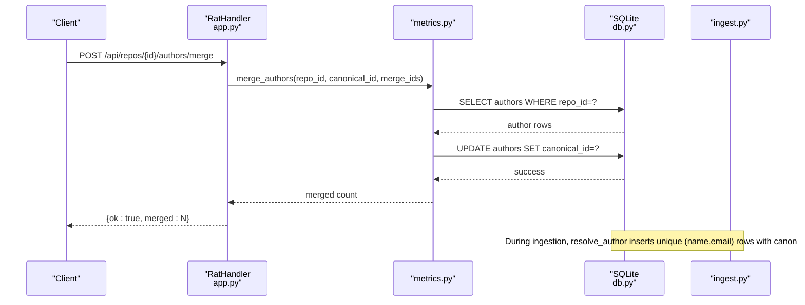
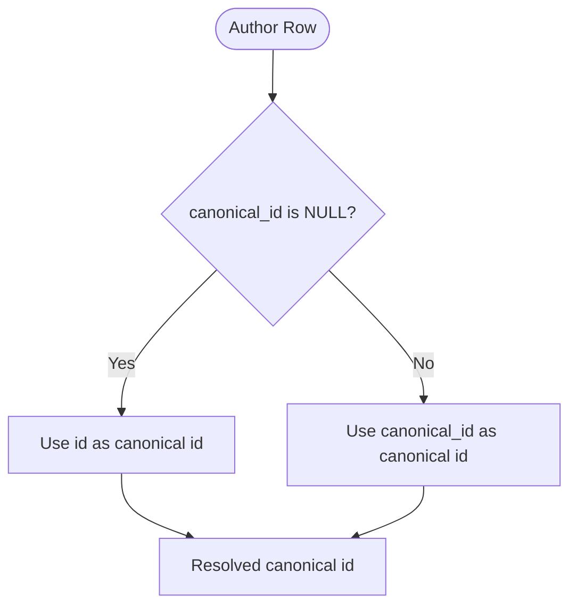
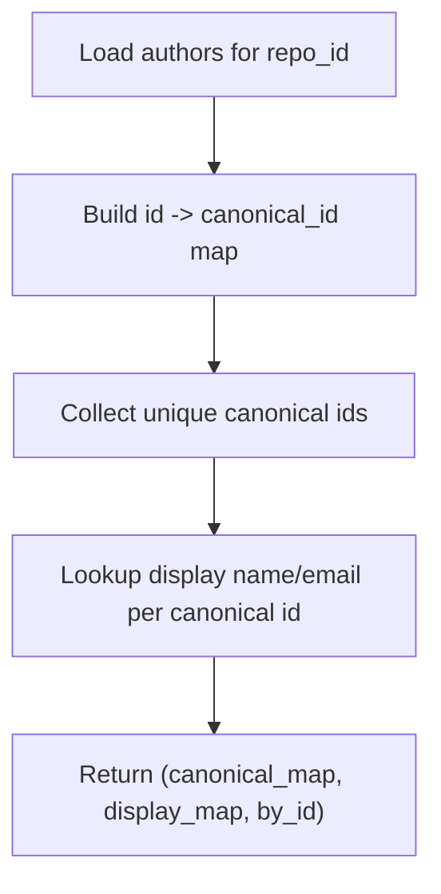
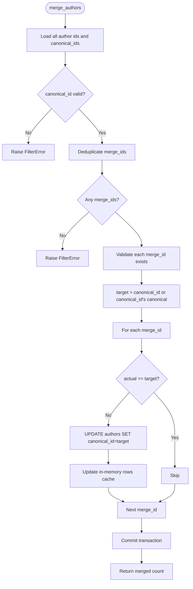
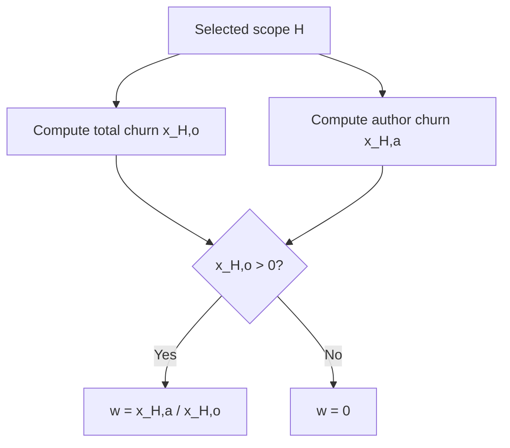
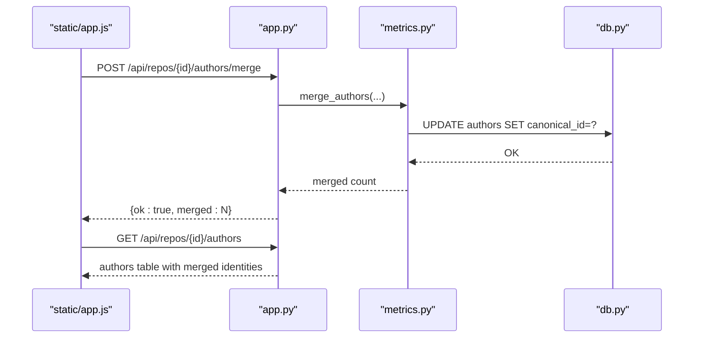
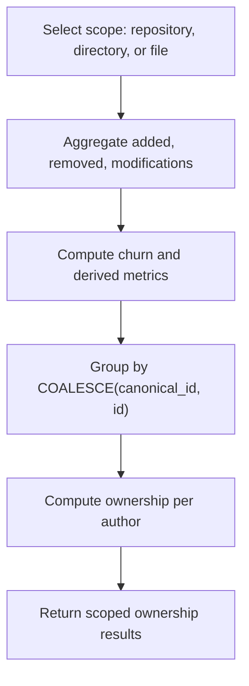
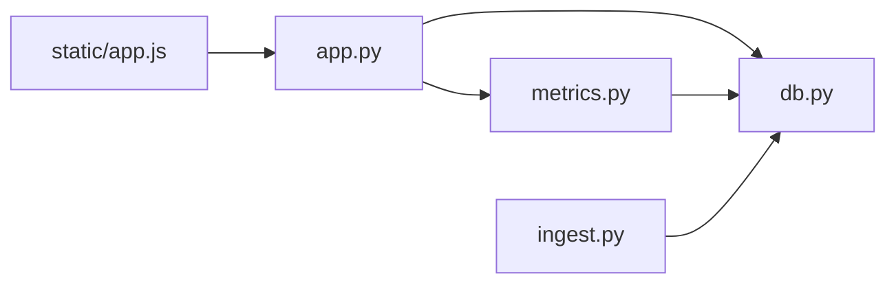

# Author Management

<cite>
**Referenced Files in This Document**
- [app.py](file://app.py)
- [db.py](file://db.py)
- [metrics.py](file://metrics.py)
- [ingest.py](file://ingest.py)
- [selftest.py](file://selftest.py)
- [static/app.js](file://static/app.js)
</cite>

## Table of Contents
1. [Introduction](#introduction)
2. [Project Structure](#project-structure)
3. [Core Components](#core-components)
4. [Architecture Overview](#architecture-overview)
5. [Detailed Component Analysis](#detailed-component-analysis)
6. [Dependency Analysis](#dependency-analysis)
7. [Performance Considerations](#performance-considerations)
8. [Troubleshooting Guide](#troubleshooting-guide)
9. [Conclusion](#conclusion)

## Introduction
This document explains how the system manages author identities and calculates ownership across repository history. The core idea is that multiple Git author records can represent the same real person, and the system merges them into a unified canonical identity. Ownership is then computed as the share of churn contributed by an author relative to the total churn for the selected scope.

Key concepts:
- Canonical ID: a stable identifier used to group multiple author rows into one logical author.
- Identity resolution: every query resolves an author row `a` using `COALESCE(a.canonical_id, a.id)`.
- Manual merging: an API endpoint lets users consolidate several author identities under one canonical identity.
- Ownership calculation: for a commit set `H`, file or directory object `o`, and author `a`, ownership is `w = x_H,a / x_H,o`, where `x_H,a` is the author’s churn and `x_H,o` is the total churn for the object.

## Project Structure
The author management logic spans four main modules:
- Database schema and connection helpers define the authors table and its canonical relationship.
- Ingestion creates author rows from Git history.
- Metrics computes filters, aggregations, canonical maps, ownership, and merge operations.
- The HTTP API exposes endpoints for listing authors and merging identities.

**Diagram sources**
- [app.py:120-196](file://app.py#L120-L196)
- [metrics.py:186-200](file://metrics.py#L186-L200)
- [db.py:15-62](file://db.py#L15-L62)
- [ingest.py:221-236](file://ingest.py#L221-L236)
- [static/app.js:1509-1584](file://static/app.js#L1509-L1584)

**Section sources**
- [app.py:120-196](file://app.py#L120-L196)
- [db.py:15-62](file://db.py#L15-L62)
- [metrics.py:186-200](file://metrics.py#L186-L200)
- [ingest.py:221-236](file://ingest.py#L221-L236)
- [static/app.js:1509-1584](file://static/app.js#L1509-L1584)

## Core Components
- Authors table: stores per-repository author identities with a nullable `canonical_id` pointing to another author row.
- Canonical mapping: builds a map from each author id to its effective canonical id and display name/email.
- Commit-set filtering: supports time range, explicit hash list, and author filter based on canonical identity.
- Aggregation engine: computes added, removed, growth, churn, modifications, frequency, and churn rate for files, directories, and repositories.
- Ownership calculation: divides an author’s churn by the total churn for the selected scope.
- Manual merge API: consolidates multiple author ids under one canonical id.

**Section sources**
- [db.py:26-33](file://db.py#L26-L33)
- [metrics.py:186-200](file://metrics.py#L186-L200)
- [metrics.py:127-168](file://metrics.py#L127-L168)
- [metrics.py:310-361](file://metrics.py#L310-L361)
- [metrics.py:364-396](file://metrics.py#L364-L396)

## Architecture Overview
The end-to-end flow for author management involves ingestion, storage, querying, and user-driven consolidation.

**Diagram sources**
- [app.py:242-259](file://app.py#L242-L259)
- [metrics.py:364-396](file://metrics.py#L364-L396)
- [ingest.py:221-236](file://ingest.py#L221-L236)
- [db.py:26-33](file://db.py#L26-L33)

## Detailed Component Analysis

### Canonical ID System and Identity Resolution
The canonical ID system unifies multiple author rows into one logical identity. Each author row has:
- `id`: primary key for the row.
- `repo_id`: repository scope.
- `name`, `email`: identity attributes.
- `canonical_id`: null means the row is itself canonical; otherwise it points to another row’s id.

Identity resolution uses `COALESCE(canonical_id, id)` everywhere:
- Filtering commits by author uses the resolved canonical id.
- Counting distinct authors uses the resolved canonical id.
- Displaying author details uses the canonical id’s display name and email.

**Diagram sources**
- [metrics.py:186-200](file://metrics.py#L186-L200)
- [metrics.py:101-106](file://metrics.py#L101-L106)
- [metrics.py:218-224](file://metrics.py#L218-L224)

**Section sources**
- [db.py:26-33](file://db.py#L26-L33)
- [metrics.py:186-200](file://metrics.py#L186-L200)
- [metrics.py:101-106](file://metrics.py#L101-L106)
- [metrics.py:218-224](file://metrics.py#L218-L224)

### The `_canonical_map` Function
`_canonical_map(conn, repo_id)` performs three tasks:
1. Loads all author rows for the repository.
2. Builds a mapping from each author id to its effective canonical id (`canonical_id or id`).
3. Builds a display map from canonical id to `(name, email)` by looking up the canonical row.

Complexity:
- Time: O(A), where A is the number of author rows.
- Space: O(A) for dictionaries.

Optimization opportunities:
- Avoid repeated lookups by caching the result within a single request when multiple metrics functions are called.
- Ensure the canonical row exists before building the display map; unknown canonical ids fall back to unknown display values.

**Diagram sources**
- [metrics.py:186-200](file://metrics.py#L186-L200)

**Section sources**
- [metrics.py:186-200](file://metrics.py#L186-L200)

### The `merge_authors` Function
`merge_authors(conn, repo_id, canonical_id, merge_ids)` consolidates multiple author identities into one canonical identity. It:
- Validates that the canonical id exists in the repository.
- Deduplicates and validates merge ids.
- Computes the target canonical id by following existing canonical links.
- Updates all matching rows so their canonical id points to the target.
- Returns the number of identities actually merged.

Edge cases handled:
- Unknown canonical id raises a validation error.
- Empty merge list raises a validation error.
- Unknown merge ids raise a validation error.
- Already merged identities are skipped without double updates.
- Chained canonical links are normalized by updating both direct and indirect references.

**Diagram sources**
- [metrics.py:364-396](file://metrics.py#L364-L396)

**Section sources**
- [metrics.py:364-396](file://metrics.py#L364-L396)

### Ownership Calculation
Ownership measures how much of the churn in a scope belongs to an author. The formula is:

`w = x_H,a / x_H,o`

Where:
- `H` is the selected commit set.
- `a` is the author.
- `o` is the object (file, directory, or repository).
- `x_H,a` is the author’s churn in the scope.
- `x_H,o` is the total churn in the scope.
- If `x_H,o` is zero, ownership is zero.

Application across endpoints:
- File detail: per-file ownership for each canonical author.
- Authors table: per-author ownership across the repository scope.
- Author share chart: top authors by churn with total churn context.

**Diagram sources**
- [metrics.py:158-168](file://metrics.py#L158-L168)
- [metrics.py:265-307](file://metrics.py#L265-L307)
- [metrics.py:310-361](file://metrics.py#L310-L361)
- [metrics.py:514-542](file://metrics.py#L514-L542)

**Section sources**
- [metrics.py:158-168](file://metrics.py#L158-L168)
- [metrics.py:265-307](file://metrics.py#L265-L307)
- [metrics.py:310-361](file://metrics.py#L310-L361)
- [metrics.py:514-542](file://metrics.py#L514-L542)

### Author Merging Workflows
There are two complementary workflows:

1. Automatic identity creation during ingestion:
   - Each unique `(name, email)` pair becomes an author row with `canonical_id = NULL`.
   - Git’s mailmap can normalize names and emails before insertion.

2. Manual identity consolidation via the API:
   - The client selects a canonical author and one or more identities to absorb.
   - The server updates all matching rows to point to the canonical target.
   - The UI refreshes the authors table and shows merged counts.

**Diagram sources**
- [static/app.js:1509-1584](file://static/app.js#L1509-L1584)
- [app.py:187-190](file://app.py#L187-L190)
- [app.py:242-259](file://app.py#L242-L259)
- [metrics.py:364-396](file://metrics.py#L364-L396)

**Section sources**
- [ingest.py:221-236](file://ingest.py#L221-L236)
- [static/app.js:1509-1584](file://static/app.js#L1509-L1584)
- [app.py:187-190](file://app.py#L187-L190)
- [app.py:242-259](file://app.py#L242-L259)
- [metrics.py:364-396](file://metrics.py#L364-L396)

### Ownership Analysis Across Scopes
- Repository scope: total churn is computed across all files and commits in the selected commit set.
- Directory scope: churn is aggregated for all files under the directory path.
- File scope: churn is aggregated for a specific file path.

In each case, ownership is calculated per canonical author by dividing their churn by the scope’s total churn.

**Diagram sources**
- [metrics.py:138-168](file://metrics.py#L138-L168)
- [metrics.py:265-307](file://metrics.py#L265-L307)
- [metrics.py:310-361](file://metrics.py#L310-L361)

**Section sources**
- [metrics.py:138-168](file://metrics.py#L138-L168)
- [metrics.py:265-307](file://metrics.py#L265-L307)
- [metrics.py:310-361](file://metrics.py#L310-L361)

### Edge Cases in Author Attribution and Identity Conflicts
- Binary-only commits: they contribute no measured churn but still belong to the commit set. Tests verify that such scopes produce zero churn and zero ownership.
- Missing canonical display rows: if a canonical id does not resolve to a known row, display falls back to unknown.
- Duplicate merge requests: deduplication prevents redundant updates.
- Chained canonical links: merging may involve indirect references; the implementation normalizes these by updating both direct and indirect matches.
- Invalid inputs: unknown ids, empty merge lists, and malformed integers raise validation errors surfaced as HTTP 400 responses.

**Section sources**
- [selftest.py:320-339](file://selftest.py#L320-L339)
- [metrics.py:186-200](file://metrics.py#L186-L200)
- [metrics.py:364-396](file://metrics.py#L364-L396)
- [app.py:242-259](file://app.py#L242-L259)

## Dependency Analysis
The author management components have clear dependencies:
- The HTTP API depends on metrics for business logic and db for connections.
- Metrics depends on db for SQL execution and on ingest indirectly through data produced by ingestion.
- Ingestion depends on db for schema and writes.
- The static UI depends on the API for merge operations and author listings.

**Diagram sources**
- [app.py:28-30](file://app.py#L28-L30)
- [metrics.py:1-21](file://metrics.py#L1-L21)
- [ingest.py:30-31](file://ingest.py#L30-L31)
- [static/app.js:1509-1584](file://static/app.js#L1509-L1584)

**Section sources**
- [app.py:28-30](file://app.py#L28-L30)
- [metrics.py:1-21](file://metrics.py#L1-L21)
- [ingest.py:30-31](file://ingest.py#L30-L31)
- [static/app.js:1509-1584](file://static/app.js#L1509-L1584)

## Performance Considerations
- Canonical mapping is O(A) and should be reused within a request when multiple metrics functions access author data.
- Aggregation queries use indexed columns (`repo_id`, `commit_id`, `path`) to improve performance.
- Batched file inserts during ingestion reduce database round-trips.
- Ownership calculations avoid division by zero by returning zero when total churn is zero.
- Large hash lists in filters are capped to prevent excessive query construction.

[No sources needed since this section provides general guidance]

## Troubleshooting Guide
Common issues and resolutions:
- Unknown canonical author id: ensure the canonical id exists in the repository before merging.
- No author identities selected to merge: select at least one identity to merge.
- Unknown author id: verify that merge ids belong to the repository.
- Binary-only commits show zero ownership: this is expected because binary changes are not measured.
- Invalid integer parameters: validate `canonical_id` and `merge_ids` as integers.

**Section sources**
- [metrics.py:364-396](file://metrics.py#L364-L396)
- [selftest.py:320-339](file://selftest.py#L320-L339)
- [app.py:242-259](file://app.py#L242-L259)

## Conclusion
The author management system provides a robust mechanism for unifying fragmented Git author identities and computing meaningful ownership metrics. By consistently resolving identities through `COALESCE(canonical_id, id)` and exposing a manual merge endpoint, the system ensures accurate attribution across files, directories, and repositories. Ownership calculations are straightforward, well-defined, and applied uniformly across endpoints, making the tool suitable for both automated analysis and interactive exploration.

[No sources needed since this section summarizes without analyzing specific files]