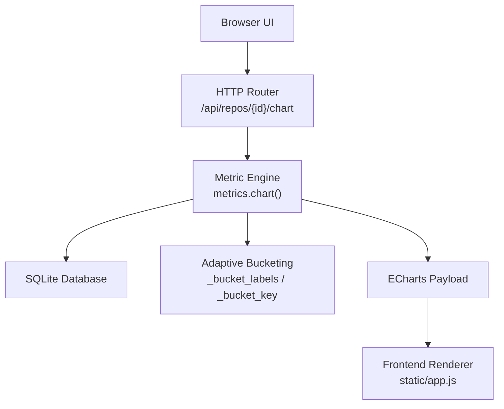
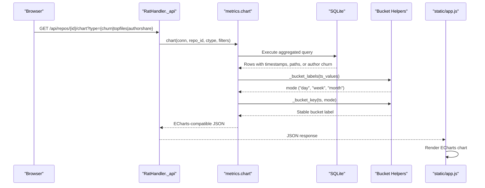
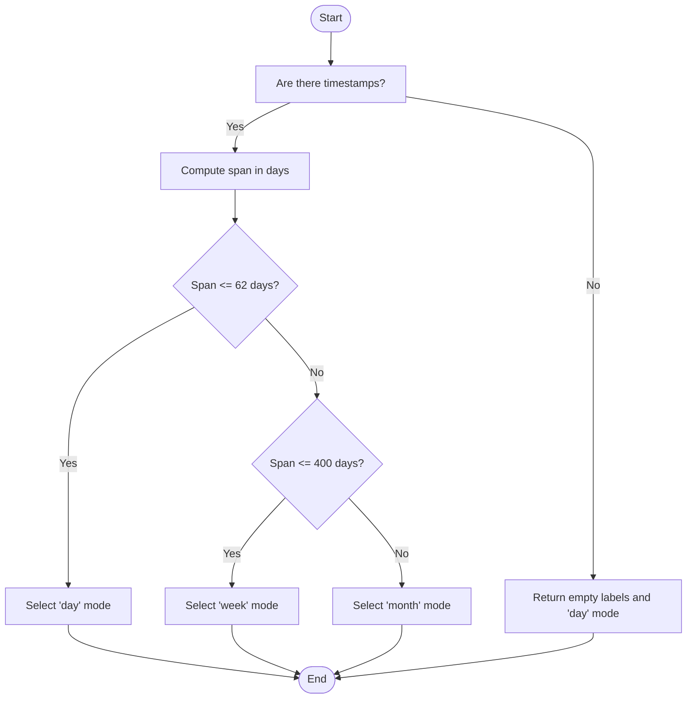
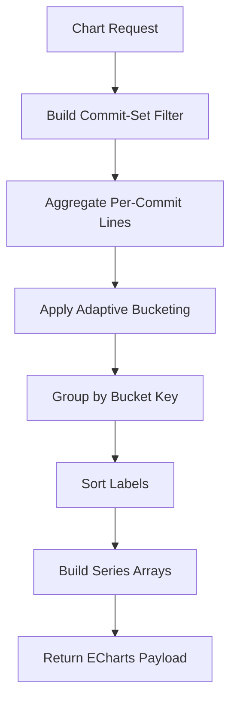
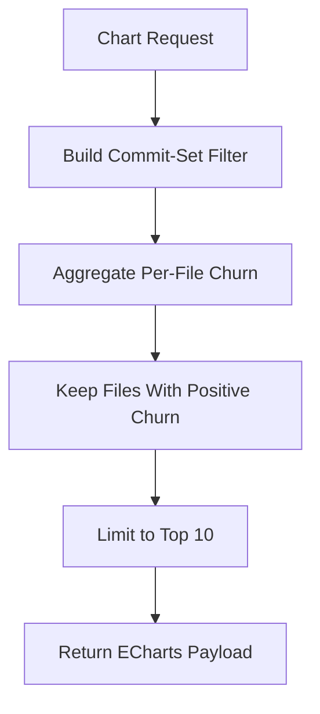
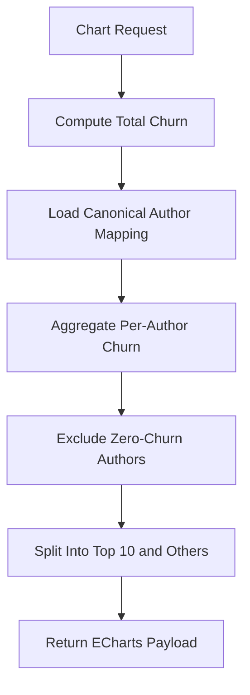
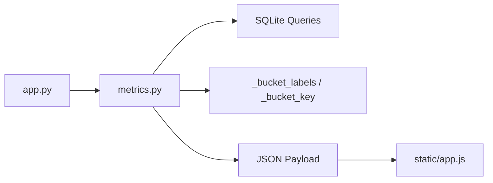

# Chart Data Preparation

<cite>
**Referenced Files in This Document**
- [metrics.py](file://metrics.py)
- [app.py](file://app.py)
- [static/app.js](file://static/app.js)
- [README.md](file://README.md)
</cite>

## Table of Contents
1. [Introduction](#introduction)
2. [Project Structure](#project-structure)
3. [Core Components](#core-components)
4. [Architecture Overview](#architecture-overview)
5. [Detailed Component Analysis](#detailed-component-analysis)
6. [Dependency Analysis](#dependency-analysis)
7. [Performance Considerations](#performance-considerations)
8. [Troubleshooting Guide](#troubleshooting-guide)
9. [Conclusion](#conclusion)

## Introduction
This document explains the chart data preparation layer that transforms raw repository metrics into visualization-ready formats. It focuses on:

- The adaptive bucketing system used by the churn timeline to automatically select day, week, or month granularity based on the selected time span.
- The three supported chart types: churn timeline, top files distribution, and author share pie chart.
- The data structure transformations from database rows to ECharts-compatible payloads.
- Examples of expected outputs for different time periods and repository sizes.
- Performance optimizations and memory management considerations during chart generation.

The implementation is part of a local offline dashboard that ingests Git repositories and computes line-level metrics such as added lines, removed lines, growth, churn, modifications, churn rate, and author ownership.

**Section sources**
- [README.md:1-6](file://README.md#L1-L6)

## Project Structure
The chart pipeline spans three layers:

| Layer | Responsibility | Primary File |
|---|---|---|
| HTTP API routing | Receives `/api/repos/{id}/chart?type=...` requests, validates filters, and delegates to the metric engine | [app.py](file://app.py) |
| Metric engine | Builds commit-set filters, executes SQL aggregation, applies adaptive bucketing, and returns ECharts-compatible JSON | [metrics.py](file://metrics.py) |
| Frontend renderer | Consumes the JSON payload and renders ECharts charts | [static/app.js](file://static/app.js) |

**Diagram sources**
- [app.py:169-176](file://app.py#L169-L176)
- [metrics.py:463-543](file://metrics.py#L463-L543)
- [static/app.js:1103-1220](file://static/app.js#L1103-L1220)

**Section sources**
- [app.py:169-176](file://app.py#L169-L176)
- [metrics.py:463-543](file://metrics.py#L463-L543)
- [static/app.js:1103-1220](file://static/app.js#L1103-L1220)

## Core Components
The chart subsystem centers on one public entry point and two helper functions:

| Function | Purpose | Input | Output |
|---|---|---|---|
| `metrics.chart` | Dispatches chart type and builds the final ECharts-compatible payload | Connection, repository ID, chart type, parsed filters | JSON object with labels, series, and optional metadata |
| `_bucket_labels` | Selects adaptive granularity: day, week, or month | List of commit timestamps | Mode string |
| `_bucket_key` | Converts a timestamp into a stable bucket label | Timestamp and mode | String key such as date, ISO week, or year-month |

Key responsibilities:

- **Churn timeline**: Aggregates per-commit added and removed lines, then groups them into adaptive buckets.
- **Top files distribution**: Finds the ten most volatile files by churn within the filter scope.
- **Author share pie chart**: Computes per-author churn, shows the top ten authors, and groups the rest into an “Others” slice.

**Section sources**
- [metrics.py:440-460](file://metrics.py#L440-L460)
- [metrics.py:463-543](file://metrics.py#L463-L543)

## Architecture Overview
The request flow for chart data preparation is:

**Diagram sources**
- [app.py:169-176](file://app.py#L169-L176)
- [metrics.py:463-543](file://metrics.py#L463-L543)
- [metrics.py:440-460](file://metrics.py#L440-L460)
- [static/app.js:1103-1220](file://static/app.js#L1103-L1220)

## Detailed Component Analysis

### Adaptive Bucketing System
The adaptive bucketing system ensures that the churn timeline remains readable across short and long time spans.

#### Granularity Selection
- If no timestamps are present, the function returns an empty label list and defaults to day mode.
- Otherwise, it calculates the span in days from the minimum and maximum timestamps.
- Day mode is selected when the span is less than or equal to 62 days.
- Week mode is selected when the span is greater than 62 days and less than or equal to 400 days.
- Month mode is selected for spans longer than 400 days.

#### Bucket Key Generation
- Day mode uses a calendar date string.
- Month mode uses a year-month string.
- Week mode uses ISO calendar year and week number.

**Diagram sources**
- [metrics.py:440-451](file://metrics.py#L440-L451)

**Section sources**
- [metrics.py:440-460](file://metrics.py#L440-L460)

### Churn Timeline Chart
The churn timeline visualizes added lines, removed lines, and total churn over time.

#### Data Flow
1. The endpoint receives the chart request.
2. The metric engine builds a commit-set filter.
3. A query aggregates added and removed lines per commit, using a left join so commits without measured file changes still appear in the timeline.
4. Adaptive bucketing selects the granularity.
5. Rows are grouped by bucket key.
6. Labels are sorted chronologically.
7. Three series are produced: Added, Removed, and Churn.

#### ECharts-Compatible Output
The churn chart returns:

| Field | Type | Meaning |
|---|---|---|
| `labels` | Array of strings | Chronological bucket labels |
| `bucket` | String | Selected granularity: day, week, or month |
| `series` | Array of series objects | Added, Removed, and Churn data aligned to labels |

**Diagram sources**
- [metrics.py:463-496](file://metrics.py#L463-L496)

**Section sources**
- [metrics.py:463-496](file://metrics.py#L463-L496)

### Top Files Distribution Chart
The top files distribution identifies the most volatile files by churn within the selected commit set.

#### Data Flow
1. The metric engine builds the commit-set filter.
2. A query sums added, removed, and churn values per file path.
3. Only files with positive churn are included.
4. Results are ordered by churn descending, then path ascending.
5. The top ten entries are returned.

#### ECharts-Compatible Output
The top files chart returns:

| Field | Type | Meaning |
|---|---|---|
| `labels` | Array of strings | File paths |
| `series` | Array of series objects | Churn, Added, and Removed arrays aligned to labels |

**Diagram sources**
- [metrics.py:497-513](file://metrics.py#L497-L513)

**Section sources**
- [metrics.py:497-513](file://metrics.py#L497-L513)

### Author Share Pie Chart
The author share pie chart shows how churn is distributed among authors.

#### Data Flow
1. The metric engine computes total churn for the selected scope.
2. A canonical author mapping is loaded.
3. A query aggregates churn per canonical author.
4. Authors with zero churn are excluded.
5. The top ten authors are kept as individual slices.
6. Remaining authors are grouped into an “Others” slice.
7. The total churn is included as metadata.

#### ECharts-Compatible Output
The author share chart returns:

| Field | Type | Meaning |
|---|---|---|
| `labels` | Array of strings | Author names, including “Others” if applicable |
| `series` | Array of series objects | Churn values aligned to labels |
| `total` | Number | Total churn in scope |

**Diagram sources**
- [metrics.py:514-542](file://metrics.py#L514-L542)

**Section sources**
- [metrics.py:514-542](file://metrics.py#L514-L542)

### Frontend Rendering Contract
The frontend expects the backend to provide structured JSON that maps directly to ECharts options.

| Backend Field | Frontend Usage |
|---|---|
| `labels` | X-axis categories, bar labels, or pie slice names |
| `series` | Data arrays for each metric |
| `bucket` | Displayed as panel metadata for the churn timeline |
| `total` | Used as the pie chart title value when present |

The frontend constructs ECharts option objects for each chart type and binds them to rendered containers.

**Section sources**
- [static/app.js:1103-1220](file://static/app.js#L1103-L1220)

## Dependency Analysis
The chart subsystem has clear boundaries between routing, computation, and rendering.

**Diagram sources**
- [app.py:169-176](file://app.py#L169-L176)
- [metrics.py:463-543](file://metrics.py#L463-L543)
- [static/app.js:1103-1220](file://static/app.js#L1103-L1220)

**Section sources**
- [app.py:169-176](file://app.py#L169-L176)
- [metrics.py:463-543](file://metrics.py#L463-L543)
- [static/app.js:1103-1220](file://static/app.js#L1103-L1220)

## Performance Considerations
The current implementation includes several performance-oriented design choices:

| Area | Optimization | Impact |
|---|---|---|
| Database aggregation | Uses SQL `SUM`, `COUNT`, and `GROUP BY` instead of Python-side accumulation | Reduces in-memory work and leverages SQLite indexing where available |
| Left join for churn timeline | Includes commits even when no measured file lines exist | Prevents gaps in time-series buckets while avoiding unnecessary joins for unmeasured data |
| Adaptive bucketing | Chooses coarse granularity for long spans | Keeps label count manageable and improves readability |
| Top-N limits | Limits top files to ten entries | Controls label and series size |
| Author grouping | Groups remaining authors into “Others” after the top ten | Prevents excessively large pie charts |
| Filter validation | Enforces maximum hash count and input ranges | Avoids oversized queries and malformed requests |

Memory management during chart generation is primarily handled by:

- Returning compact JSON structures rather than large intermediate objects.
- Using integer conversions for numeric fields to keep payloads predictable.
- Sorting only the necessary subsets, such as labels or top entries.

For very large repositories, additional improvements could include:

- Server-side pagination for top files and author shares.
- Precomputed materialized views for frequently accessed aggregations.
- Time-range partitioning to avoid scanning entire histories.
- Streaming aggregation for extremely large commit sets.

[No sources needed since this section provides general guidance]

## Troubleshooting Guide
Common issues and their likely causes:

| Symptom | Likely Cause | Resolution |
|---|---|---|
| Empty churn timeline | No measured lines in the selected time range | Adjust the time window or verify ingestion completeness |
| Unexpected granularity | Time span crosses bucket thresholds | Review the selected `from` and `to` timestamps |
| Missing bucket labels | Empty timestamp list passed to bucketing | Ensure the commit set contains at least one commit |
| Unknown chart type error | Invalid `type` query parameter | Use `churn`, `topfiles`, or `authorshare` |
| Too many hashes error | More than the allowed number of commit hashes in the filter | Reduce the number of hashes or use shorter prefixes |
| Invalid path error | Malformed or overly long path | Normalize the path and remove invalid segments |

Error handling is centralized:

- The HTTP handler wraps every request and converts unexpected exceptions into JSON responses.
- Metric-layer errors raise specific exceptions that map to client-facing status codes.
- Repository existence is validated before processing chart requests.

**Section sources**
- [app.py:73-90](file://app.py#L73-L90)
- [app.py:199-210](file://app.py#L199-L210)
- [metrics.py:30-35](file://metrics.py#L30-L35)
- [metrics.py:40-78](file://metrics.py#L40-L78)
- [metrics.py:81-88](file://metrics.py#L81-L88)
- [metrics.py:543](file://metrics.py#L543)

## Conclusion
The chart data preparation layer provides a clean separation between HTTP routing, metric aggregation, adaptive bucketing, and frontend rendering. The adaptive bucketing system automatically selects day, week, or month granularity based on the selected time span, ensuring that the churn timeline remains readable across short and long histories. The three chart types—churn timeline, top files distribution, and author share pie chart—return compact, ECharts-compatible payloads that the frontend can render directly.

For small repositories, the current approach is straightforward and efficient. For large repositories, the existing SQL-driven aggregation, top-N limits, and author grouping already reduce memory pressure, but further optimizations such as precomputation, partitioning, and pagination may be worthwhile depending on workload patterns.

[No sources needed since this section summarizes without analyzing specific files]