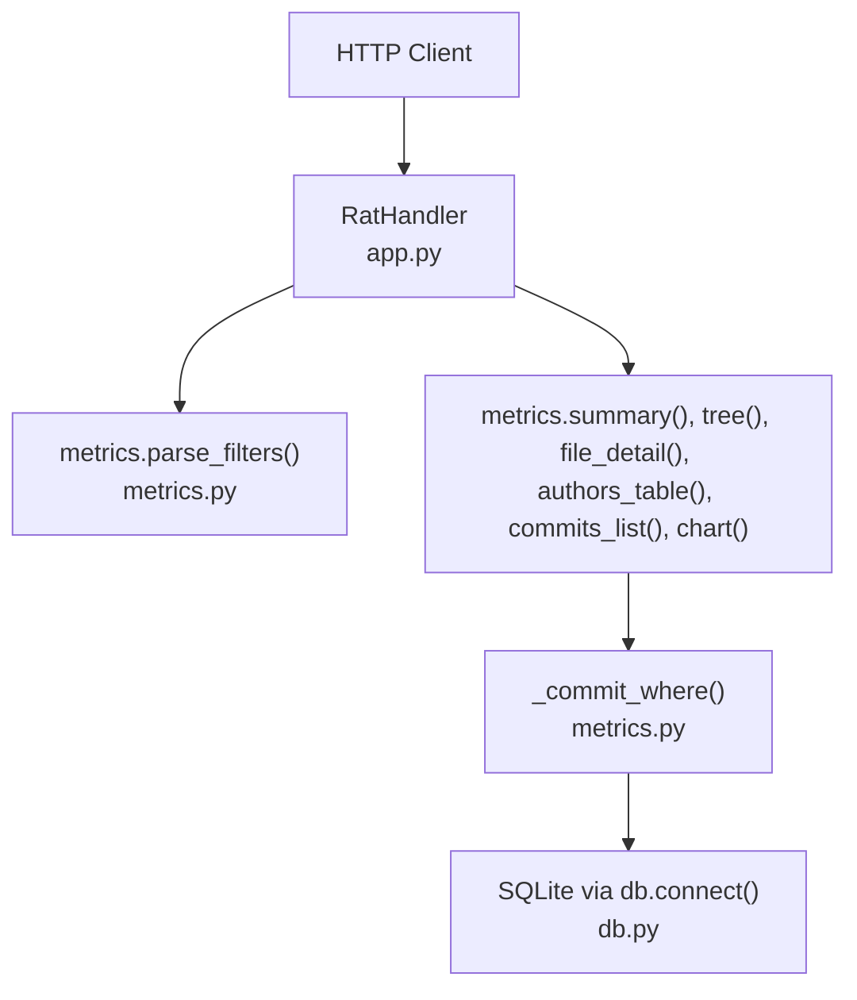
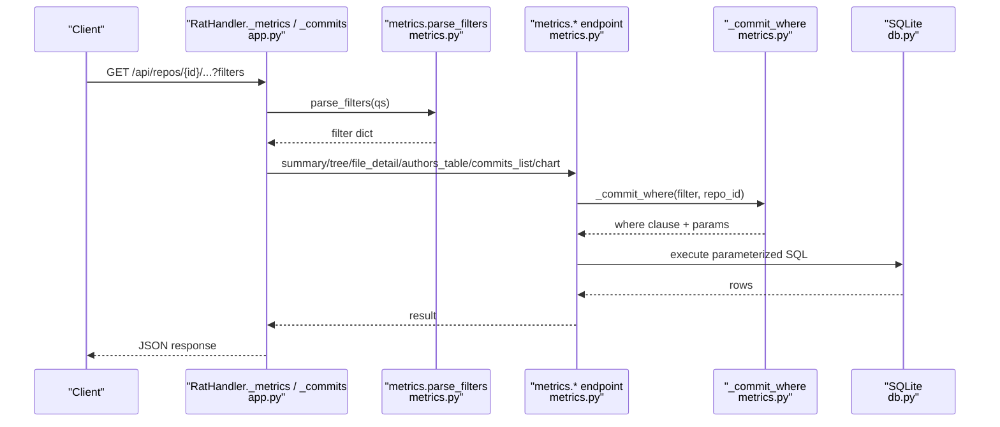
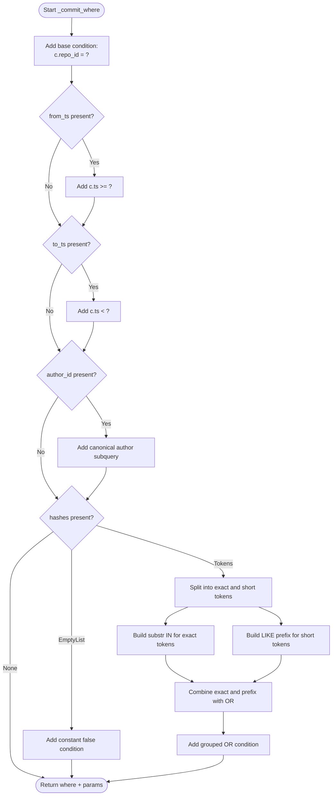
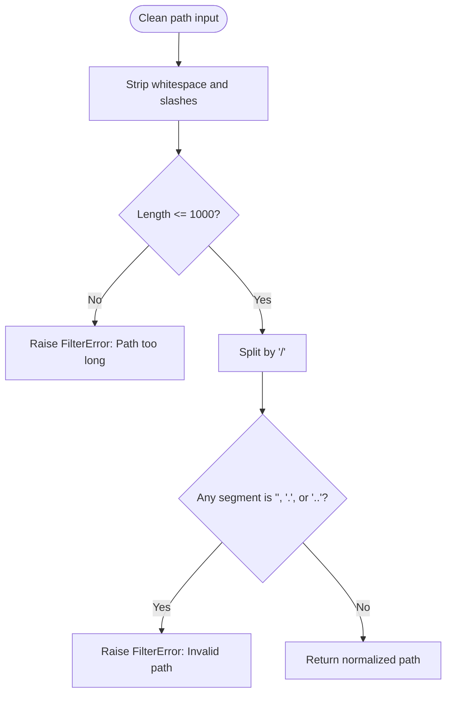
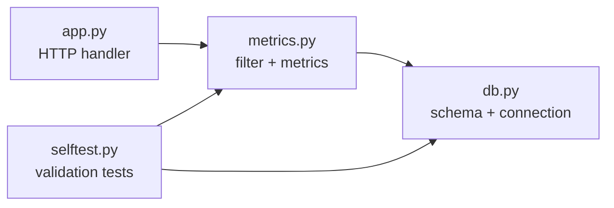

# Filter System

<cite>
**Referenced Files in This Document**
- [app.py](file://app.py)
- [metrics.py](file://metrics.py)
- [db.py](file://db.py)
- [selftest.py](file://selftest.py)
</cite>

## Table of Contents
1. [Introduction](#introduction)
2. [Project Structure](#project-structure)
3. [Core Components](#core-components)
4. [Architecture Overview](#architecture-overview)
5. [Detailed Component Analysis](#detailed-component-analysis)
6. [Dependency Analysis](#dependency-analysis)
7. [Performance Considerations](#performance-considerations)
8. [Troubleshooting Guide](#troubleshooting-guide)
9. [Conclusion](#conclusion)

## Introduction
This document explains the flexible filtering system used to select commit sets for analysis. The filter supports:
- Date range filtering using epoch seconds, with an exclusive upper bound.
- Commit hash filtering supporting exact matches and prefixes.
- Author filtering by canonical author identity.
- Path-based filtering for files versus directories.

The system parses HTTP query parameters into a validated filter object, builds parameterized SQL WHERE clauses, and applies filters consistently across repository summaries, file details, directory trees, author tables, commit lists, and charts.

## Project Structure
The filtering logic is primarily implemented in the metrics engine and consumed by the HTTP API layer. Database schema and connection helpers are provided separately.

**Diagram sources**
- [app.py:121-196](file://app.py#L121-L196)
- [metrics.py:50-78](file://metrics.py#L50-L78)
- [metrics.py:91-124](file://metrics.py#L91-L124)
- [db.py:77-86](file://db.py#L77-L86)

**Section sources**
- [app.py:121-196](file://app.py#L121-L196)
- [metrics.py:1-21](file://metrics.py#L1-L21)
- [db.py:15-62](file://db.py#L15-L62)

## Core Components
- `parse_filters`: Converts raw query parameters into a validated filter dictionary.
- `_commit_where`: Builds a parameterized SQL WHERE fragment and its bound parameters for commit selection.
- `clean_path`: Normalizes and validates repo-relative paths for file and directory filtering.
- `_path_clause`: Selects between exact file matching and directory subtree matching.
- `_agg`: Aggregates added, removed, and modification counts under path and commit filters.
- Metric endpoints: `summary`, `tree`, `file_detail`, `authors_table`, `commits_list`, and `chart` all use the same filter pipeline.

Key constants:
- `MAX_HASHES = 900`: Maximum number of hash tokens allowed in a single filter request.
- `HEX = "0123456789abcdef"`: Allowed characters for commit hashes.

Filter fields:
- `from_ts`: Lower-bound timestamp (inclusive).
- `to_ts`: Upper-bound timestamp (exclusive).
- `hashes`: List of lowercase hex strings; empty list means no commits.
- `author_id`: Canonical author identifier.

**Section sources**
- [metrics.py:26-27](file://metrics.py#L26-L27)
- [metrics.py:50-78](file://metrics.py#L50-L78)
- [metrics.py:81-88](file://metrics.py#L81-L88)
- [metrics.py:91-124](file://metrics.py#L91-L124)
- [metrics.py:129-155](file://metrics.py#L129-L155)

## Architecture Overview
The HTTP handler receives query parameters, delegates parsing to `metrics.parse_filters`, then passes the resulting filter to the requested metric function. All metric functions build their SQL through `_commit_where`, ensuring consistent AND combination of date, author, and hash filters.

**Diagram sources**
- [app.py:198-240](file://app.py#L198-L240)
- [metrics.py:50-78](file://metrics.py#L50-L78)
- [metrics.py:91-124](file://metrics.py#L91-L124)
- [metrics.py:205-225](file://metrics.py#L205-L225)
- [metrics.py:228-262](file://metrics.py#L228-L262)
- [metrics.py:265-307](file://metrics.py#L265-L307)
- [metrics.py:310-361](file://metrics.py#L310-L361)
- [metrics.py:399-435](file://metrics.py#L399-L435)
- [metrics.py:463-543](file://metrics.py#L463-L543)
- [db.py:77-86](file://db.py#L77-L86)

## Detailed Component Analysis

### Filter Parsing: `parse_filters`
`parse_filters` reads query parameters and returns a normalized filter dictionary. It enforces:
- Integer validation for timestamps and author IDs.
- Timestamp bounds from zero up to a large positive integer.
- Hash token limits and character validation.
- Empty hash list semantics meaning an empty commit set.

Validation rules:
- `from` and `to` must be valid integers within `[0, 2^62]`.
- `hashes` is split on commas, trimmed, lowercased, and filtered for non-empty tokens.
- If more than `MAX_HASHES` tokens are present, a filter error is raised.
- Each hash token must have length between 4 and 40 and contain only hexadecimal characters.
- `author` must be a positive integer within `[1, 2^62]`.

Error handling:
- Invalid integers or out-of-range values raise `FilterError`.
- Invalid hash tokens raise `FilterError`.
- Too many hash tokens raise `FilterError`.

Examples of parsed results:
- No filters: all commits are considered.
- Only `from_ts`: selects commits at or after the given timestamp.
- Only `to_ts`: selects commits before the given timestamp.
- Both `from_ts` and `to_ts`: selects commits in `[from_ts, to_ts)`.
- `hashes=[]`: selects no commits.
- `hashes=["abc123", "def"]`: selects commits whose full hash starts with any of the tokens.
- `author_id=3`: selects commits authored by canonical author ID 3.

Complex combinations:
- Date range plus author: selects commits by that author within the time window.
- Hash prefix plus date range: selects matching commits in the time window.
- Multiple hash prefixes: OR logic among prefixes, combined with AND logic against other filters.

**Section sources**
- [metrics.py:40-47](file://metrics.py#L40-L47)
- [metrics.py:50-78](file://metrics.py#L50-L78)
- [selftest.py:375-387](file://selftest.py#L375-L387)

### Commit WHERE Builder: `_commit_where`
`_commit_where` constructs a safe SQL WHERE fragment over the commits alias `c`, along with its bound parameters. It always includes the repository scope condition.

Behavior:
- Base condition: `c.repo_id = ?`.
- Date filters:
  - `from_ts` adds `c.ts >= ?`.
  - `to_ts` adds `c.ts < ?`.
- Author filter:
  - Adds a subquery that resolves the canonical author identity: `(SELECT COALESCE(auth2.canonical_id, auth2.id) FROM authors auth2 WHERE auth2.id = c.author_id) = ?`.
- Hash filter:
  - If `hashes` is `None`, no hash condition is added.
  - If `hashes` is an empty list, the condition becomes a constant false expression so the result set is empty.
  - Otherwise, it splits tokens into:
    - Exact matches: tokens with length at least 12 are treated as exact 12-character prefixes using `substr(c.hash, 1, 12) IN (...)`.
    - Short prefixes: tokens shorter than 12 characters use `c.hash LIKE ? || '%'`.
  - Exact and short conditions are combined with OR inside a grouped expression.
- All parts are joined with AND.

Parameter binding:
- Parameters are appended in the same order as placeholders appear.
- Repository ID is always first.
- Date values, author ID, exact hash prefixes, and short prefixes are appended as needed.

Security properties:
- Uses parameter binding for all user-supplied values.
- Avoids direct string interpolation for user data except for placeholder count generation.
- Rejects invalid hash formats before building SQL.

**Diagram sources**
- [metrics.py:91-124](file://metrics.py#L91-L124)

**Section sources**
- [metrics.py:91-124](file://metrics.py#L91-L124)

### Path-Based Filtering: `clean_path` and `_path_clause`
Path filtering distinguishes between exact file paths and directory subtrees.

`clean_path`:
- Strips whitespace and leading/trailing slashes.
- Enforces a maximum path length.
- Rejects path segments that are empty, `.`, or `..`.
- Returns a normalized relative path.

`_path_clause`:
- For root queries, returns no additional path condition.
- For file queries, uses exact equality: `f.path = ?`.
- For directory queries, uses a substring predicate that ensures directory boundaries: `substr(f.path, 1, length(?) + 1) = ? || '/'`.

This design avoids unsafe `LIKE` usage for directory matching and prevents accidental matches like `src/main.py` matching `src/main.py.bak`.

**Diagram sources**
- [metrics.py:81-88](file://metrics.py#L81-L88)

**Section sources**
- [metrics.py:81-88](file://metrics.py#L81-L88)
- [metrics.py:129-135](file://metrics.py#L129-L135)

### Integration Points Across Metrics
All metric functions follow the same pattern:
1. Validate or normalize inputs.
2. Compute commit set size when needed.
3. Build WHERE clause and parameters via `_commit_where`.
4. Apply path filtering via `_path_clause`.
5. Aggregate metrics using `_agg`.
6. Return structured results.

Endpoints using this pipeline:
- Repository summary: `summary`.
- Directory tree listing: `tree`.
- File detail with author ownership: `file_detail`.
- Author table with canonical grouping: `authors_table`.
- Paginated commit list with optional subject search: `commits_list`.
- Charts including churn, top files, and author share: `chart`.

**Section sources**
- [metrics.py:171-176](file://metrics.py#L171-L176)
- [metrics.py:205-225](file://metrics.py#L205-L225)
- [metrics.py:228-262](file://metrics.py#L228-L262)
- [metrics.py:265-307](file://metrics.py#L265-L307)
- [metrics.py:310-361](file://metrics.py#L310-L361)
- [metrics.py:399-435](file://metrics.py#L399-L435)
- [metrics.py:463-543](file://metrics.py#L463-L543)

### HTTP API Entry Points
The HTTP handler routes requests to metric functions and converts exceptions into JSON responses.

Key behaviors:
- Query parameters are parsed with `keep_blank_values=True`.
- `/api/repos/{id}/summary`, `/tree`, `/file`, `/authors`, `/commits`, and `/chart` accept filters.
- `/api/repos/{id}/commits` also accepts pagination parameters `limit` and `offset`, plus an optional text `query`.
- `FilterError` maps to HTTP 400.
- `NotFound` maps to HTTP 404.

Pagination validation:
- `limit` defaults to 500 and is clamped to `[1, 5000]`.
- `offset` defaults to 0 and is clamped to `[0, 10^9]`.

**Section sources**
- [app.py:121-196](file://app.py#L121-L196)
- [app.py:198-240](file://app.py#L198-L240)

## Dependency Analysis
The filter system has clear separation of concerns:
- `app.py` handles HTTP routing, parameter extraction, and error mapping.
- `metrics.py` implements filter parsing, WHERE construction, path handling, aggregation, and metric endpoints.
- `db.py` provides database connection, schema, and path anchoring.

**Diagram sources**
- [app.py:121-196](file://app.py#L121-L196)
- [metrics.py:50-78](file://metrics.py#L50-L78)
- [db.py:77-86](file://db.py#L77-L86)
- [selftest.py:375-387](file://selftest.py#L375-L387)

**Section sources**
- [app.py:121-196](file://app.py#L121-L196)
- [metrics.py:1-21](file://metrics.py#L1-L21)
- [db.py:15-62](file://db.py#L15-L62)
- [selftest.py:375-387](file://selftest.py#L375-L387)

## Performance Considerations
- Hash filtering separates exact and short prefixes to allow efficient `IN` checks for exact matches and `LIKE` prefix checks for short prefixes.
- Deduplication of exact and short tokens reduces redundant conditions.
- Parameter binding avoids SQL injection and allows the database engine to reuse execution plans.
- Directory matching uses substring comparison with explicit boundary checks instead of unsafe `LIKE` patterns.
- Commit set size is computed once per metric call when needed, avoiding repeated scans.
- Pagination limits prevent excessive result sets.

Recommendations:
- Keep `hashes` below `MAX_HASHES` to avoid request rejection and large parameter lists.
- Prefer longer hash prefixes when possible to improve index utilization.
- Use precise date ranges to reduce scan scope.
- Avoid overly broad directory paths when detailed file-level metrics are not required.

[No sources needed since this section provides general guidance]

## Troubleshooting Guide
Common filter errors and their meanings:
- Invalid integer for `from`, `to`, or `author`: ensure numeric values.
- Value out of range: timestamps must be non-negative and within supported bounds; author IDs must be positive.
- Too many hashes: limit the number of comma-separated hash tokens to 900.
- Invalid commit hash: each token must be 4–40 lowercase hexadecimal characters.
- Empty commit set: passing `hashes=` with no tokens intentionally selects zero commits.
- Invalid path: reject paths containing `.` or `..` segments or exceeding length limits.

HTTP-level symptoms:
- 400 Bad Request: filter validation failures.
- 404 Not Found: unknown repository or endpoint.
- 500 Internal Server Error: unexpected server-side exception.

Verification examples from tests:
- Invalid `from` value raises a filter error.
- Non-hex hash characters raise a filter error.
- More than 900 hash tokens raise a filter error.
- Empty hash list produces an empty commit set.
- Combined date and author filters produce expected commit counts.

**Section sources**
- [metrics.py:30-35](file://metrics.py#L30-L35)
- [metrics.py:40-47](file://metrics.py#L40-L47)
- [metrics.py:50-78](file://metrics.py#L50-L78)
- [selftest.py:375-387](file://selftest.py#L375-L387)

## Conclusion
The filter system provides a robust, secure, and consistent way to select commit sets for analysis. It validates inputs strictly, builds parameterized SQL safely, and applies filters uniformly across all metric endpoints. Date ranges, commit hashes, canonical author identities, and path-based selections combine predictably with AND logic, while hash tokens combine with OR logic internally. Security measures include parameter binding, hex-only hash validation, path traversal protection, and strict path normalization.

[No sources needed since this section summarizes without analyzing specific files]