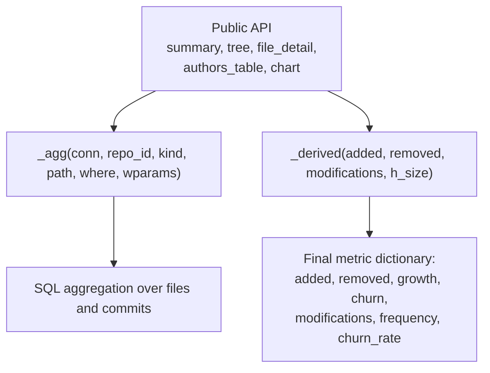
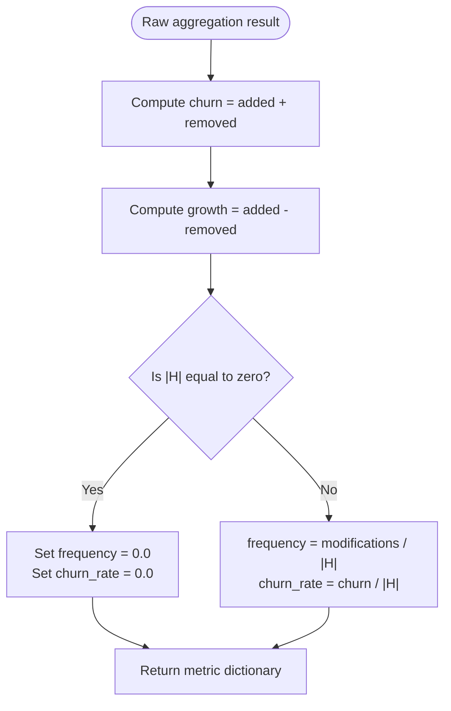
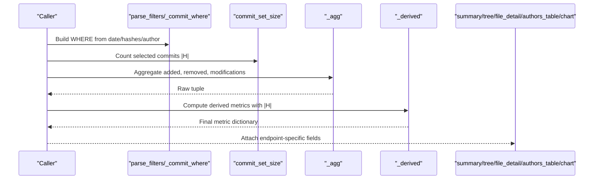
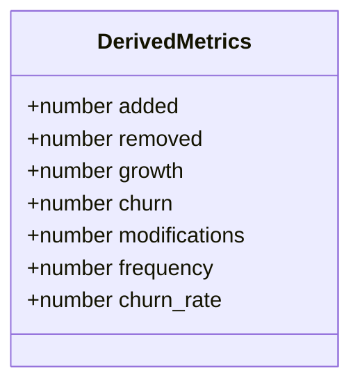
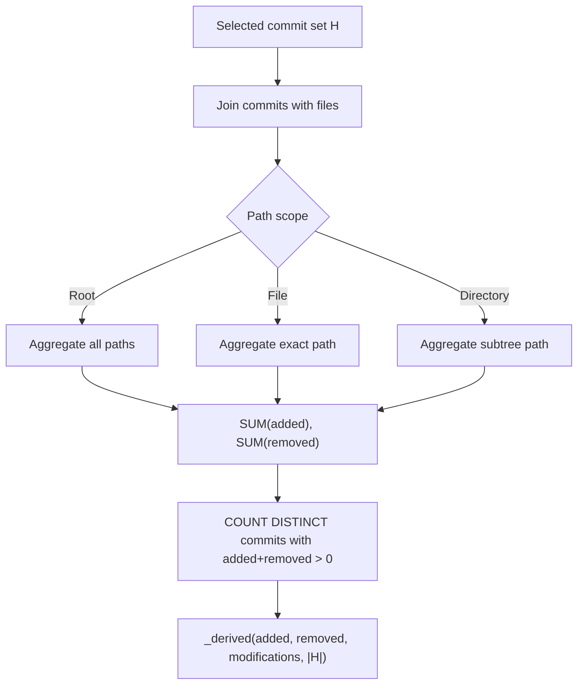
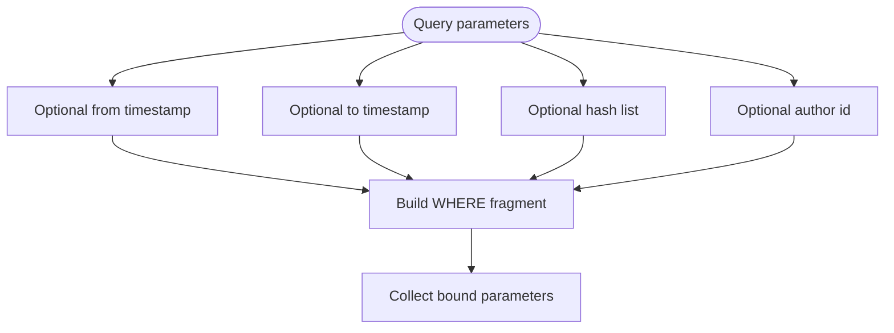
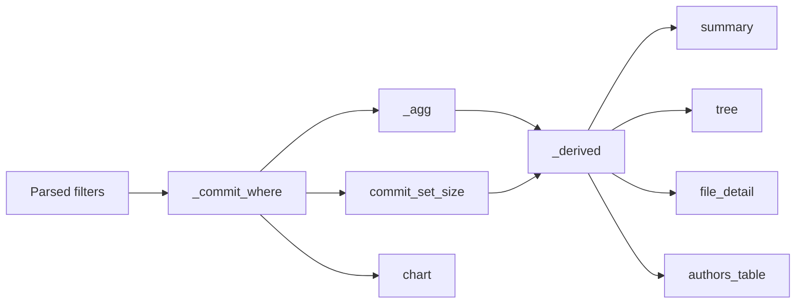

# Metric Calculations

<cite>
**Referenced Files in This Document**
- [metrics.py](file://metrics.py)
- [selftest.py](file://selftest.py)
- [README.md](file://README.md)
</cite>

## Table of Contents
1. [Introduction](#introduction)
2. [Project Structure](#project-structure)
3. [Core Components](#core-components)
4. [Architecture Overview](#architecture-overview)
5. [Detailed Component Analysis](#detailed-component-analysis)
6. [Dependency Analysis](#dependency-analysis)
7. [Performance Considerations](#performance-considerations)
8. [Troubleshooting Guide](#troubleshooting-guide)
9. [Conclusion](#conclusion)

## Introduction
This document explains the core metric calculation algorithms used by the Repo Analysis Tool (RAT). It focuses on how per-commit line changes are aggregated into per-object metrics across commit sets, and how the `_derived` function computes the final values returned to callers.

The fundamental metrics are:
- Added lines `l+`: total added lines for an object under a commit set.
- Removed lines `l-`: total removed lines for an object under a commit set.
- Growth `d = l+ - l-`: net change.
- Churn `x = l+ + l-`: total line churn.
- Modifications count `n_H`: number of commits in the selected commit set `H` that changed the object with at least one added or removed line.
- Frequency `n_H / |H|`: fraction of commits in `H` that modified the object; zero when `|H| = 0`.
- Churn rate `x_H / |H|`: average churn per commit in `H`; zero when `|H| = 0`.

These definitions apply uniformly to files, directories, repository roots, authors, and chart series. The implementation enforces these semantics through SQL aggregation and a single derived-metrics helper.

**Section sources**
- [README.md:1-5](file://README.md#L1-L5)
- [metrics.py:1-21](file://metrics.py#L1-L21)

## Project Structure
The metric engine lives in a single module. The most relevant parts for this document are:
- Commit-set filtering helpers that build SQL `WHERE` clauses from date ranges, explicit hashes, and author identity.
- An aggregation helper that returns `(added, removed, modifications)` for a path scope under a commit filter.
- The `_derived` function that turns raw aggregation results into the documented metric fields.
- Public endpoints such as `summary`, `tree`, `file_detail`, `authors_table`, and `chart`, which all rely on the same aggregation and derivation logic.

**Diagram sources**
- [metrics.py:138-168](file://metrics.py#L138-L168)
- [metrics.py:205-225](file://metrics.py#L205-L225)
- [metrics.py:228-262](file://metrics.py#L228-L262)
- [metrics.py:265-307](file://metrics.py#L265-L307)
- [metrics.py:310-361](file://metrics.py#L310-L361)
- [metrics.py:463-543](file://metrics.py#L463-L543)

**Section sources**
- [metrics.py:38-124](file://metrics.py#L38-L124)
- [metrics.py:127-177](file://metrics.py#L127-L177)
- [metrics.py:203-361](file://metrics.py#L203-L361)
- [metrics.py:438-543](file://metrics.py#L438-L543)

## Core Components
The metric engine is centered around three cooperating pieces:

1. **Commit-set filters**
   - Date range: `from_ts` inclusive, `to_ts` exclusive.
   - Explicit hash list: exact prefixes of length 12 or longer, plus shorter prefix matches.
   - Author filter: canonical author identity via `COALESCE(canonical_id, id)`.
   - All filters combine with AND.
   - An empty hash list represents an empty commit set.

2. **Aggregation helper `_agg`**
   - Returns `(added, removed, modifications)` for a given path scope:
     - Root: no path predicate.
     - File: exact path match.
     - Directory: subtree match using a substring predicate.
   - Uses `SUM(f.added)`, `SUM(f.removed)`, and `COUNT(DISTINCT ...)` over commits where `f.added + f.removed > 0`.

3. **Derived-metrics helper `_derived`**
   - Computes `churn = added + removed`.
   - Computes `growth = added - removed`.
   - Computes `frequency = modifications / |H|`, returning `0.0` when `|H| = 0`.
   - Computes `churn_rate = churn / |H|`, returning `0.0` when `|H| = 0`.

**Diagram sources**
- [metrics.py:158-168](file://metrics.py#L158-L168)

**Section sources**
- [metrics.py:38-124](file://metrics.py#L38-L124)
- [metrics.py:138-168](file://metrics.py#L138-L168)

## Architecture Overview
The end-to-end flow for computing per-object metrics is:

1. Parse query parameters into a filter dictionary.
2. Compute `|H|` using `commit_set_size`.
3. Build the commit `WHERE` clause with `_commit_where`.
4. Aggregate raw metrics with `_agg`.
5. Convert raw metrics to final metrics with `_derived`.
6. Attach endpoint-specific metadata such as paths, names, authors, and ownership.

**Diagram sources**
- [metrics.py:50-78](file://metrics.py#L50-L78)
- [metrics.py:91-124](file://metrics.py#L91-L124)
- [metrics.py:171-176](file://metrics.py#L171-L176)
- [metrics.py:138-155](file://metrics.py#L138-L155)
- [metrics.py:158-168](file://metrics.py#L158-L168)
- [metrics.py:205-225](file://metrics.py#L205-L225)

## Detailed Component Analysis

### Fundamental Metrics and Their Semantics
- `l+` (added): Sum of added lines for the target object under the selected commit set.
- `l-` (removed): Sum of removed lines for the target object under the selected commit set.
- `d` (growth): Net change, computed as `l+ - l-`.
- `x` (churn): Total line churn, computed as `l+ + l-`.
- `n_H` (modifications): Number of distinct commits in `H` where the object had at least one added or removed line.
- Frequency: `n_H / |H|`; zero when there are no selected commits.
- Churn rate: `x_H / |H|`; zero when there are no selected commits.

These values are produced by combining SQL aggregation with the `_derived` helper.

**Section sources**
- [metrics.py:1-21](file://metrics.py#L1-L21)
- [metrics.py:138-168](file://metrics.py#L138-L168)

### The `_derived` Function
The `_derived` function is the central computation point for the documented metrics. It takes:
- `added`: raw added lines.
- `removed`: raw removed lines.
- `modifications`: raw modification count.
- `h_size`: size of the commit set `|H|`.

It returns a dictionary containing:
- `added`
- `removed`
- `growth`
- `churn`
- `modifications`
- `frequency`
- `churn_rate`

Division by zero is handled explicitly: when `h_size` is zero, both `frequency` and `churn_rate` are set to `0.0`.

**Diagram sources**
- [metrics.py:158-168](file://metrics.py#L158-L168)

**Section sources**
- [metrics.py:158-168](file://metrics.py#L158-L168)

### Per-Commit to Per-Object Aggregation
Per-commit data is stored as rows with added and removed line counts. Per-object aggregation works as follows:

- For a file: aggregate only rows matching the exact file path.
- For a directory: aggregate rows whose path starts with the directory path followed by `/`.
- For the repository root: aggregate all paths.
- Modifications count uses a distinct commit count where `added + removed > 0`, so pure renames without line changes do not increase `n_H`.

**Diagram sources**
- [metrics.py:129-155](file://metrics.py#L129-L155)
- [metrics.py:158-168](file://metrics.py#L158-L168)

**Section sources**
- [metrics.py:129-168](file://metrics.py#L129-L168)

### Commit Set Filtering
Commit sets support three main filters:
- Date range: `ts >= from` and `ts < to`.
- Hashes: comma-separated commit hashes or prefixes. Exact prefixes of length 12 or more use equality on the first 12 characters; shorter prefixes use `LIKE`.
- Author: canonical author identity via `COALESCE(canonical_id, id)`.

An empty hash list produces an empty commit set. All filters combine with AND.

**Diagram sources**
- [metrics.py:50-78](file://metrics.py#L50-L78)
- [metrics.py:91-124](file://metrics.py#L91-L124)

**Section sources**
- [metrics.py:50-78](file://metrics.py#L50-L78)
- [metrics.py:91-124](file://metrics.py#L91-L124)

### Concrete Examples

#### Single Commit Example
When filtering by a single commit:
- `|H| = 1`.
- `frequency = n_H / 1`, so it equals `n_H`.
- `churn_rate = x_H / 1`, so it equals `x_H`.

Example behavior is validated by tests that select a single initial commit and assert:
- `commits = 1`.
- `modifications = 1`.
- `frequency = 1.0`.
- `churn_rate = 20.0`.

**Section sources**
- [selftest.py:210-218](file://selftest.py#L210-L218)
- [metrics.py:158-168](file://metrics.py#L158-L168)

#### Date Range Example
When filtering by a date range:
- Only commits with timestamps in `[from, to)` are included.
- Metrics are aggregated over those commits.

Example behavior is validated by tests that select two commits within February 2026:
- `commits = 2`.
- `added = 1`, `removed = 1`, `churn = 2`, `growth = 0`.
- `modifications = 1`.
- `frequency = 0.5`.
- `churn_rate = 1.0`.

**Section sources**
- [selftest.py:187-195](file://selftest.py#L187-L195)
- [metrics.py:91-124](file://metrics.py#L91-L124)
- [metrics.py:158-168](file://metrics.py#L158-L168)

#### Author Filter Example
When filtering by author:
- Commits are matched by canonical author identity.
- Ownership percentages are computed relative to total churn in the selected commit set.

Example behavior is validated by tests that select Bob’s commits:
- `commits = 3`.
- `added = 4`, `removed = 5`, `growth = -1`, `churn = 9`.
- `modifications = 3`.
- Author ownership equals `1.0` because Bob is the only author in the filtered set.

**Section sources**
- [selftest.py:227-237](file://selftest.py#L227-L237)
- [metrics.py:101-106](file://metrics.py#L101-L106)
- [metrics.py:310-361](file://metrics.py#L310-L361)

#### Combined Filters
Filters combine with AND. Tests validate combining a date range with an author filter, selecting two commits from a specific author after a given date.

**Section sources**
- [selftest.py:239-247](file://selftest.py#L239-L247)
- [metrics.py:91-124](file://metrics.py#L91-L124)

### Edge Cases

#### Zero Commit Sets
When `|H| = 0`:
- `added`, `removed`, `churn`, and `modifications` are zero.
- `frequency = 0.0`.
- `churn_rate = 0.0`.
- Author lists can be empty.
- File detail churn is zero and authors list is empty.

This is enforced by the conditional division in `_derived` and confirmed by tests for an empty date range.

**Section sources**
- [metrics.py:158-168](file://metrics.py#L158-L168)
- [selftest.py:197-208](file://selftest.py#L197-L208)

#### Binary Files
Binary files are excluded from measured line metrics:
- No `files` rows are created for binary assets.
- A commit containing only binary changes still contributes to `|H|` and author counts, but adds no lines.
- Charts use a left join from commits so binary-only commits still appear in time buckets even though they contribute no line measurements.

Tests assert that a binary-only commit yields zero added, removed, modifications, and files, while still counting as one commit and one author.

**Section sources**
- [metrics.py:463-496](file://metrics.py#L463-L496)
- [selftest.py:174-184](file://selftest.py#L174-L184)
- [selftest.py:335-339](file://selftest.py#L335-L339)

#### Pure Renames Without Line Changes
A rename without added or removed lines has:
- `added = 0`, `removed = 0`, `churn = 0`, `modifications = 0`.
- `frequency = 0.0`, `churn_rate = 0.0`.
- The commit still belongs to `H`.

Tests validate this behavior for a pure rename commit.

**Section sources**
- [selftest.py:149-156](file://selftest.py#L149-L156)
- [metrics.py:138-155](file://metrics.py#L138-L155)
- [metrics.py:158-168](file://metrics.py#L158-L168)

#### Division by Zero Handling
Division by zero is avoided by checking `h_size` before dividing:
- If `h_size == 0`, both `frequency` and `churn_rate` are set to `0.0`.
- Ownership calculations also guard against zero total churn by returning `0.0`.

**Section sources**
- [metrics.py:158-168](file://metrics.py#L158-L168)
- [metrics.py:302-303](file://metrics.py#L302-L303)
- [metrics.py:357-358](file://metrics.py#L357-L358)

## Dependency Analysis
The metric calculation pipeline has clear dependencies:

- Public endpoints depend on `_agg` and `_derived`.
- `_agg` depends on path-scoped SQL predicates and commit filters.
- Commit filters depend on parsed query parameters.
- Chart endpoints additionally depend on bucketing helpers for time-series grouping.

**Diagram sources**
- [metrics.py:50-78](file://metrics.py#L50-L78)
- [metrics.py:91-124](file://metrics.py#L91-L124)
- [metrics.py:138-176](file://metrics.py#L138-L176)
- [metrics.py:205-361](file://metrics.py#L205-L361)
- [metrics.py:463-543](file://metrics.py#L463-L543)

**Section sources**
- [metrics.py:50-176](file://metrics.py#L50-L176)
- [metrics.py:205-361](file://metrics.py#L205-L361)
- [metrics.py:463-543](file://metrics.py#L463-L543)

## Performance Considerations
- Aggregation is performed in SQL using `SUM` and `COUNT DISTINCT`, which avoids loading full row histories into Python.
- Path matching uses substring predicates for directories rather than pattern matching functions that require escaping.
- Commit filtering builds parameterized SQL fragments, reducing injection risk and allowing database optimization.
- Binary files are excluded from measured metrics, preventing large binary diffs from inflating line-based metrics.
- Chart bucketing adapts to day, week, or month granularity based on the time span, keeping visualization data manageable.

[No sources needed since this section provides general guidance]

## Troubleshooting Guide
Common issues and their expected behavior:

- **Empty commit set**: Expect zero metrics and zero rates. Verify date ranges and hash filters.
- **Binary-only commits**: Expect zero line metrics but non-zero commit and author counts.
- **Pure renames**: Expect zero churn and zero modifications unless line changes accompany the rename.
- **Invalid filters**: Invalid integers, invalid hash characters, too many hashes, or invalid paths raise validation errors.
- **Zero ownership**: When total churn is zero, ownership is defined as `0.0`.

Validation and edge-case behavior are covered by the test suite.

**Section sources**
- [metrics.py:30-47](file://metrics.py#L30-L47)
- [metrics.py:81-88](file://metrics.py#L81-L88)
- [selftest.py:375-387](file://selftest.py#L375-L387)
- [selftest.py:197-208](file://selftest.py#L197-L208)
- [selftest.py:174-184](file://selftest.py#L174-L184)
- [selftest.py:149-156](file://selftest.py#L149-L156)

## Conclusion
The RAT metric engine implements a consistent, well-defined set of line-change metrics. Per-commit data is aggregated into per-object metrics through SQL aggregation, then normalized by commit-set size using `_derived`. The design cleanly separates filtering, aggregation, and derivation, making the semantics easy to verify and extend. Edge cases such as empty commit sets, binary files, pure renames, and division by zero are handled explicitly and verified by automated tests.

[No sources needed since this section summarizes without analyzing specific files]