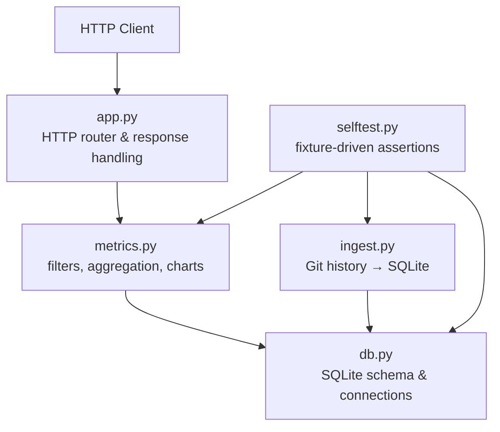
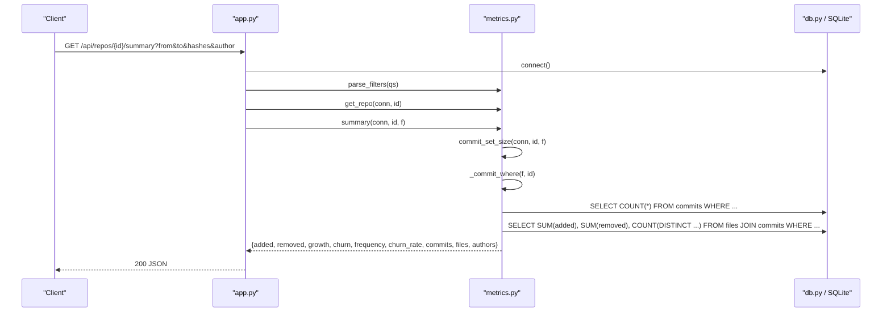
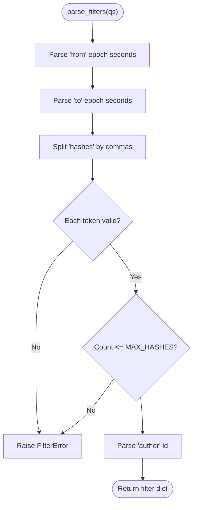
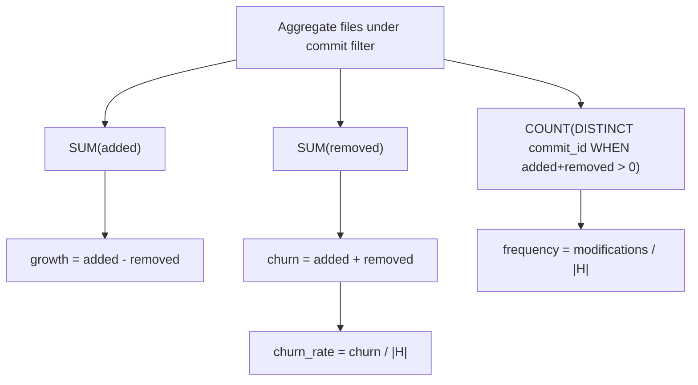
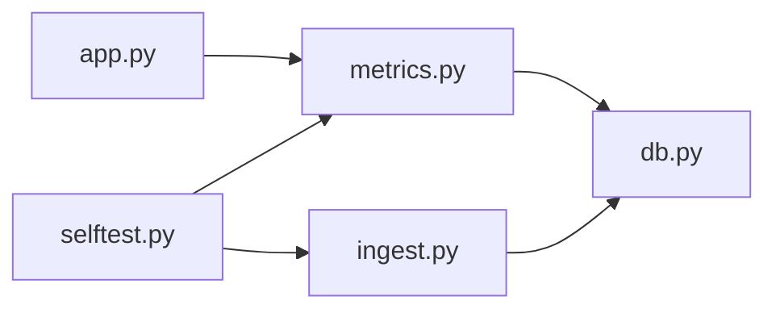

# Metrics Engine

<cite>
**Referenced Files in This Document**
- [metrics.py](file://metrics.py)
- [app.py](file://app.py)
- [db.py](file://db.py)
- [ingest.py](file://ingest.py)
- [selftest.py](file://selftest.py)
- [README.md](file://README.md)
</cite>

## Table of Contents
1. [Introduction](#introduction)
2. [Project Structure](#project-structure)
3. [Core Components](#core-components)
4. [Architecture Overview](#architecture-overview)
5. [Detailed Component Analysis](#detailed-component-analysis)
6. [Dependency Analysis](#dependency-analysis)
7. [Performance Considerations](#performance-considerations)
8. [Troubleshooting Guide](#troubleshooting-guide)
9. [Conclusion](#conclusion)
10. [Appendices](#appendices)

## Introduction
This document explains the metrics calculation engine that powers RAT (Repo Analysis Tool). It covers how added and removed lines, growth, churn, modification frequency, and ownership are computed; how commit-set filters combine date ranges, commit hashes, authors, and paths; how SQL aggregation queries are constructed and executed; how chart data is prepared; and how accuracy, edge cases, and performance are validated through tests and fixtures.

The engine operates over a SQLite database populated by an ingestion pipeline that parses Git history into commits, authors, and per-file change rows. The HTTP API layer routes requests to metric functions, which return structured results suitable for dashboard visualization.

**Section sources**
- [README.md:1-46](file://README.md#L1-L46)

## Project Structure
RAT is a small Python application with four main modules relevant to the metrics engine:

- `db.py`: Database schema, connection helpers, and WAL configuration.
- `ingest.py`: Background ingestion from URLs or zip archives into SQLite.
- `metrics.py`: Filter parsing, aggregation, derived metrics, endpoints, and chart preparation.
- `app.py`: HTTP server routing, request validation, and error mapping.
- `selftest.py`: Automated fixture-based assertions validating metric semantics.

**Diagram sources**
- [app.py:121-196](file://app.py#L121-L196)
- [metrics.py:50-124](file://metrics.py#L50-L124)
- [db.py:15-62](file://db.py#L15-L62)
- [ingest.py:181-315](file://ingest.py#L181-L315)
- [selftest.py:55-103](file://selftest.py#L55-L103)

**Section sources**
- [app.py:1-492](file://app.py#L1-L492)
- [db.py:1-100](file://db.py#L1-L100)
- [ingest.py:1-458](file://ingest.py#L1-L458)
- [metrics.py:1-544](file://metrics.py#L1-L544)
- [selftest.py:1-439](file://selftest.py#L1-L439)

## Core Components
The metrics engine provides:

- Commit-set filtering: date range (`from`, `to`), explicit hash list or prefixes, author identity, and path scope.
- Aggregation: sum of added/removed lines, distinct modifications, and derived metrics such as growth, churn, frequency, and churn rate.
- Object-level metrics: repository root, directory subtree, and individual file.
- Author analysis: per-author churn, ownership share, and identity merging.
- Chart data: time-bucketed churn, top files, and author share.
- Commit listing: paginated, searchable commit metadata.

Key responsibilities:

| Component | Responsibility |
|---|---|
| Filter parser | Validates and normalizes query parameters into a filter object. |
| WHERE builder | Builds parameterized SQL fragments combining repo, date, author, and hash constraints. |
| Path clause generator | Matches exact file paths or directory subtrees without unsafe `LIKE`. |
| Aggregator | Computes added, removed, and modifications under a commit set. |
| Derived metrics calculator | Converts raw aggregates into growth, churn, frequency, and churn rate. |
| Endpoint functions | Expose summary, tree, file detail, authors table, commits list, and charts. |
| Identity map builder | Resolves canonical author identities and display names. |

**Section sources**
- [metrics.py:30-200](file://metrics.py#L30-L200)
- [metrics.py:205-435](file://metrics.py#L205-L435)
- [metrics.py:438-544](file://metrics.py#L438-L544)

## Architecture Overview
The metrics engine sits between the HTTP API and the SQLite database. Requests enter through `app.py`, which validates the endpoint, resolves the repository, parses filters, and calls the appropriate function in `metrics.py`. The metrics module constructs SQL using safe parameter binding and returns JSON-friendly structures.

**Diagram sources**
- [app.py:139-142](file://app.py#L139-L142)
- [app.py:199-210](file://app.py#L199-L210)
- [metrics.py:50-78](file://metrics.py#L50-L78)
- [metrics.py:91-124](file://metrics.py#L91-L124)
- [metrics.py:171-176](file://metrics.py#L171-L176)
- [metrics.py:205-225](file://metrics.py#L205-L225)

## Detailed Component Analysis

### Filter System
The filter system converts URL query parameters into a validated internal filter object. Supported inputs:

- `from`: epoch seconds, inclusive lower bound.
- `to`: epoch seconds, exclusive upper bound.
- `hashes`: comma-separated commit hash tokens; supports full hashes and short prefixes.
- `author`: canonical author id.

Validation rules:

- Integer fields must be within safe bounds.
- Hash tokens must be hexadecimal, length between 4 and 40 characters.
- Too many hash tokens raise a filter error.
- Empty `hashes` means an empty commit set.

Path normalization:

- Root is represented as an empty string.
- Leading/trailing slashes are stripped.
- Segments cannot be empty, `.`, or `..`.
- Maximum path length is enforced.

Commit WHERE construction:

- Always scoped to `repo_id`.
- Date filters use `ts >= from` and `ts < to`.
- Author filter uses canonical identity resolution via `COALESCE(canonical_id, id)`.
- Hash filter splits tokens into exact 12-character prefixes and short prefixes, building safe parameterized conditions.

**Diagram sources**
- [metrics.py:40-78](file://metrics.py#L40-L78)
- [metrics.py:91-124](file://metrics.py#L91-L124)

**Section sources**
- [metrics.py:30-88](file://metrics.py#L30-L88)
- [metrics.py:91-124](file://metrics.py#L91-L124)

### Added/Removed Lines, Growth, Churn, Modifications
For each commit `h` and file `f`, the ingestion pipeline stores:

- `files.added`
- `files.removed`

Derived metrics:

- `growth = added - removed`
- `churn = added + removed`
- `modifications = number of commits in H where `added + removed > 0`
- `frequency = modifications / |H|`
- `churn_rate = churn / |H|`

When `|H| = 0`, both frequency and churn rate are zero.

Aggregation SQL:

- Sums `added` and `removed`.
- Counts distinct commit ids where there was actual change.
- Joins `files` with `commits` to apply commit-set filters.

**Diagram sources**
- [metrics.py:138-168](file://metrics.py#L138-L168)

**Section sources**
- [metrics.py:138-168](file://metrics.py#L138-L168)

### Repository Summary
Repository summary computes:

- Total added, removed, growth, churn, modifications.
- Number of commits in the selected set.
- Number of distinct file paths affected.
- Number of distinct authors (by canonical identity).
- Frequency and churn rate based on commit set size.

Implementation steps:

1. Compute commit set size.
2. Build commit WHERE fragment.
3. Aggregate root-level file changes.
4. Count distinct file paths.
5. Count distinct authors.

**Section sources**
- [metrics.py:171-225](file://metrics.py#L171-L225)

### Directory Tree and Subtree Metrics
Directory listing:

- Lists immediate children of a given path.
- Classifies entries as directories or files.
- Computes metrics per child using the same commit filter.

Path matching:

- Root matches all paths.
- File matches exact path.
- Directory matches subtree using substring predicate, avoiding unsafe `LIKE`.

Children are sorted into directories first, then files, both alphabetically by name.

**Section sources**
- [metrics.py:129-136](file://metrics.py#L129-L136)
- [metrics.py:228-262](file://metrics.py#L228-L262)

### File Detail and Ownership Analysis
File detail returns:

- Per-file added, removed, growth, churn, modifications.
- Per-author breakdown including commits, modifications, added, removed, churn, and ownership.

Ownership calculation:

- For a file, total churn is the denominator.
- Each author’s churn divided by total churn gives ownership share.
- If total churn is zero, ownership is zero.

Author identity resolution:

- Uses canonical author id.
- Groups multiple identities under one canonical author.
- Displays canonical name and email.

Sorting:

- Authors sorted by churn descending, then name ascending.

**Section sources**
- [metrics.py:265-307](file://metrics.py#L265-L307)
- [metrics.py:186-200](file://metrics.py#L186-L200)

### Authors Table
Authors table aggregates across the entire repository under the commit filter:

- Commits per canonical author.
- Total churn per canonical author.
- Modifications per canonical author.
- Ownership share relative to repository churn.

Identity merging:

- Multiple author rows can point to the same canonical id.
- Manual merge updates canonical pointers and refreshes in-memory maps.

**Section sources**
- [metrics.py:310-361](file://metrics.py#L310-L361)
- [metrics.py:364-396](file://metrics.py#L364-L396)

### Commit Listing
Commit listing supports:

- Pagination via `limit` and `offset`.
- Search by hash prefix or subject substring.
- Canonical author id and display name.
- Ordering by timestamp descending, then commit id descending.

Query construction:

- Applies commit WHERE fragment.
- Adds optional search condition.
- Returns total count and paginated rows.

**Section sources**
- [metrics.py:399-435](file://metrics.py#L399-L435)

### Chart Data Preparation
Chart types:

- `churn`: Time-bucketed series for added, removed, and churn.
- `topfiles`: Top 10 files by churn with added and removed series.
- `authorshare`: Top 10 authors by churn, grouping the rest as “Others”.

Bucketing logic:

- Day mode for spans up to about 62 days.
- Week mode for spans up to about 400 days.
- Month mode for longer spans.

Churn chart behavior:

- Uses LEFT JOIN from commits so commits with only binary changes still appear in time buckets.
- Aggregates per commit, then groups by bucket key.

Top files chart:

- Filters out files with zero churn.
- Orders by churn descending, then path ascending.

Author share chart:

- Includes only authors with positive churn.
- Caps labels at top 10; remaining churn is aggregated into “Others”.

**Section sources**
- [metrics.py:440-544](file://metrics.py#L440-L544)

### SQL-Based Aggregation Queries
The engine builds SQL dynamically but always uses parameter binding for user-supplied values. Key patterns:

- Commit WHERE fragment reused across queries.
- Path clause generated per object kind.
- Aggregation uses `COALESCE(SUM(...), 0)` to handle missing rows.
- Distinct counts used for modifications and file/author cardinality.
- Indexes on `files(repo_id, commit_id)`, `files(repo_id, path)`, `commits(repo_id, ts)`, and `commits(repo_id, hash)` support efficient filtering and joins.

Example query shapes:

- Repository summary: aggregate files joined with commits under commit WHERE.
- File detail: group by canonical author id with churn and modifications.
- Authors table: left join files to include authors with binary-only commits.
- Charts: group by commit timestamp or path, then transform into series.

**Section sources**
- [metrics.py:138-155](file://metrics.py#L138-L155)
- [metrics.py:277-286](file://metrics.py#L277-L286)
- [metrics.py:333-343](file://metrics.py#L333-L343)
- [metrics.py:469-476](file://metrics.py#L469-L476)
- [metrics.py:498-505](file://metrics.py#L498-L505)
- [metrics.py:518-525](file://metrics.py#L518-L525)
- [db.py:58-62](file://db.py#L58-L62)

### Visualization Data Structures
Chart responses follow consistent structures:

- `labels`: ordered list of bucket keys or entity names.
- `series`: array of named series with numeric data arrays.
- Optional metadata such as `bucket`, `total`, or `commits`.

Examples:

- Churn chart: labels are day/week/month keys; series include Added, Removed, Churn.
- Top files chart: labels are file paths; series include Churn, Added, Removed.
- Author share chart: labels are author names; series include Churn; includes total churn.

**Section sources**
- [metrics.py:485-496](file://metrics.py#L485-L496)
- [metrics.py:506-513](file://metrics.py#L506-L513)
- [metrics.py:538-542](file://metrics.py#L538-L542)

## Dependency Analysis
The metrics module depends on:

- `db.connect()` for SQLite access.
- `ingest` indirectly through tests and ingestion pipeline.
- `app.py` for HTTP routing and error translation.

Coupling:

- `metrics.parse_filters` is used by every metrics endpoint.
- `_commit_where` centralizes commit filtering logic.
- `_agg` centralizes file aggregation.
- `_derived` centralizes derived metric computation.
- `_canonical_map` centralizes author identity resolution.

External dependencies:

- SQLite with WAL enabled.
- Git CLI for ingestion.

Potential circular dependencies:

- None observed; `metrics` does not import `app`.

Integration points:

- HTTP API maps `FilterError` to 400 and `NotFound` to 404.
- Ingestion populates tables consumed by metrics.

**Diagram sources**
- [app.py:28-30](file://app.py#L28-L30)
- [metrics.py:1-25](file://metrics.py#L1-L25)
- [db.py:77-86](file://db.py#L77-L86)
- [ingest.py:30-36](file://ingest.py#L30-L36)
- [selftest.py:37-39](file://selftest.py#L37-L39)

**Section sources**
- [app.py:121-196](file://app.py#L121-L196)
- [metrics.py:1-25](file://metrics.py#L1-L25)
- [db.py:77-86](file://db.py#L77-L86)
- [ingest.py:30-36](file://ingest.py#L30-L36)
- [selftest.py:37-39](file://selftest.py#L37-L39)

## Performance Considerations
Optimizations implemented:

- Parameterized queries prevent SQL injection and allow query plan reuse.
- SQLite WAL mode allows concurrent readers during ingestion writes.
- Busy timeout reduces lock contention.
- Batched file inserts during ingestion reduce round trips.
- Indexes on frequently filtered columns improve lookup speed.
- Adaptive chart bucketing avoids excessive label granularity.
- Hash filter optimization separates exact 12-character prefixes from short prefixes.

Caching strategies:

- No in-process caching of query results.
- Canonical author map is built per endpoint call; could be cached if read-heavy workloads justify it.
- Static assets are served with cache headers.

Query execution considerations:

- Commit WHERE fragment is reused to avoid duplication.
- Aggregation uses indexed joins and grouped sums.
- Binary-only commits are handled gracefully without inflating file metrics.

Recommendations:

- Monitor slow queries when commit sets are large.
- Consider materialized summaries for very large repositories if latency becomes critical.
- Keep indexes aligned with query patterns already present.

[No sources needed since this section provides general guidance]

## Troubleshooting Guide
Common issues and resolutions:

- Invalid integer filter values: ensure `from`, `to`, and `author` are integers within allowed ranges.
- Invalid commit hash format: ensure hex strings between 4 and 40 characters.
- Too many hash tokens: limit to the configured maximum.
- Invalid path segments: remove empty segments, `.`, and `..`.
- Missing repository: verify repository id exists before querying metrics.
- Binary-only commits: expect zero file metrics but non-zero commit and author counts.
- Zero churn ownership: ownership is zero when total churn is zero.

Error mapping:

- `FilterError` → HTTP 400.
- `NotFound` → HTTP 404.
- Unexpected exceptions → HTTP 500.

Test coverage highlights:

- Fixture ingestion stats.
- Merge commit exclusion.
- Pure rename zero impact.
- Rename plus edit attributed to new path.
- Deletion counting.
- Binary exclusion.
- Date range and empty commit set.
- Hash prefix and empty hashes.
- Author filter and combined filters.
- Directory structure and filtered tree.
- File author ownership and identity merging.
- Chart bucketing and series totals.
- Commit listing pagination and search.

**Section sources**
- [app.py:73-90](file://app.py#L73-L90)
- [app.py:199-210](file://app.py#L199-L210)
- [selftest.py:123-185](file://selftest.py#L123-L185)
- [selftest.py:187-247](file://selftest.py#L187-L247)
- [selftest.py:249-319](file://selftest.py#L249-L319)
- [selftest.py:321-363](file://selftest.py#L321-L363)
- [selftest.py:366-406](file://selftest.py#L366-L406)
- [selftest.py:409-435](file://selftest.py#L409-L435)

## Conclusion
The metrics engine provides precise, test-validated calculations for repository analytics. Its design emphasizes safe parameterized SQL, clear separation of concerns, and robust handling of edge cases such as pure renames, binary files, empty commit sets, and author identity merges. The chart subsystem adapts to different time spans, while the filter system supports flexible, composable queries. Validation against the fixture ensures correctness across typical and unusual scenarios.

[No sources needed since this section summarizes without analyzing specific files]

## Appendices

### Metric Definitions Reference
| Metric | Definition |
|---|---|
| Added | Sum of `files.added` under the commit filter. |
| Removed | Sum of `files.removed` under the commit filter. |
| Growth | Added minus removed. |
| Churn | Added plus removed. |
| Modifications | Distinct commits where added plus removed is greater than zero. |
| Frequency | Modifications divided by commit set size; zero when size is zero. |
| Churn Rate | Churn divided by commit set size; zero when size is zero. |
| Ownership | Author churn divided by total churn for the object; zero when total churn is zero. |

**Section sources**
- [metrics.py:158-168](file://metrics.py#L158-L168)
- [metrics.py:291-303](file://metrics.py#L291-L303)

### Filter Parameters Reference
| Parameter | Type | Behavior |
|---|---|---|
| `from` | Epoch seconds | Inclusive lower bound on commit timestamp. |
| `to` | Epoch seconds | Exclusive upper bound on commit timestamp. |
| `hashes` | Comma-separated hex tokens | Exact or prefix match; empty means no commits. |
| `author` | Author id | Matches canonical author identity. |
| `path` | Repo-relative path | Exact file or directory subtree scope. |

**Section sources**
- [metrics.py:50-78](file://metrics.py#L50-L78)
- [metrics.py:81-88](file://metrics.py#L81-L88)
- [metrics.py:129-136](file://metrics.py#L129-L136)