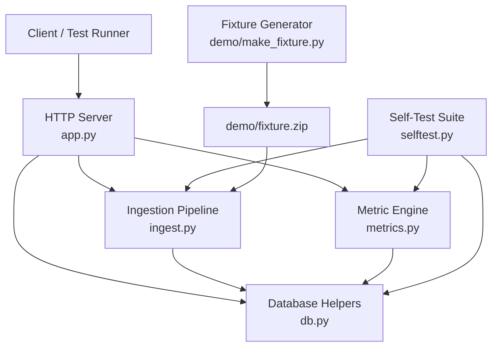
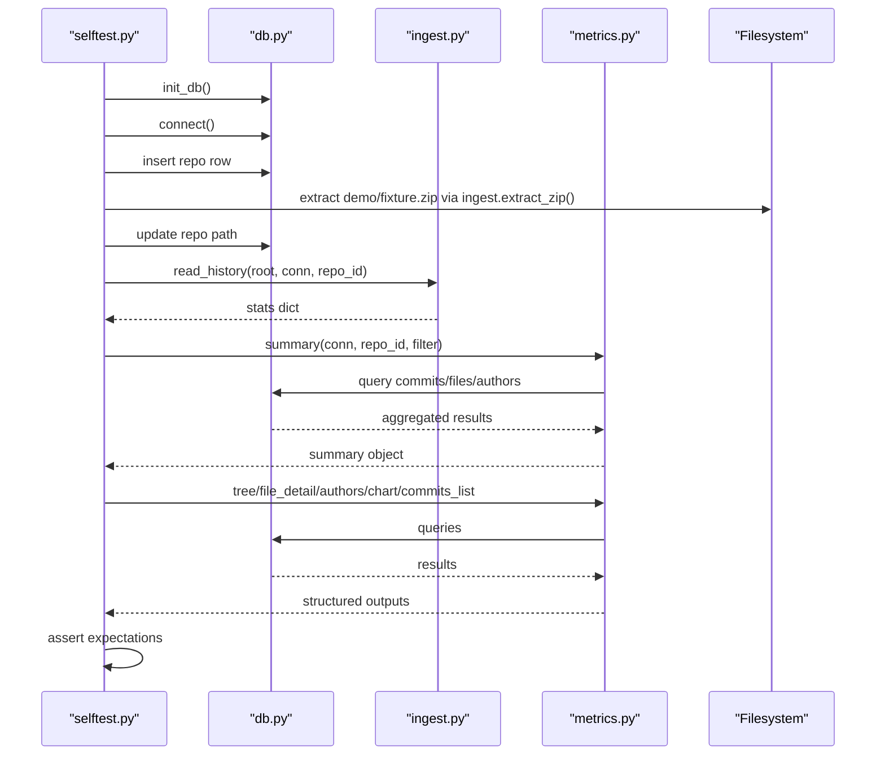
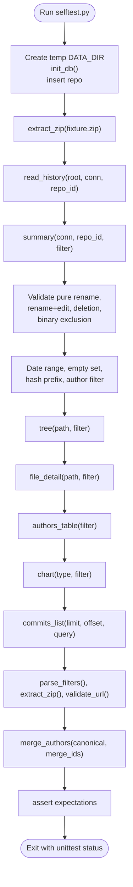
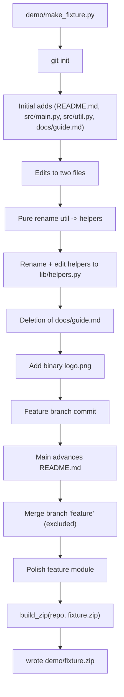
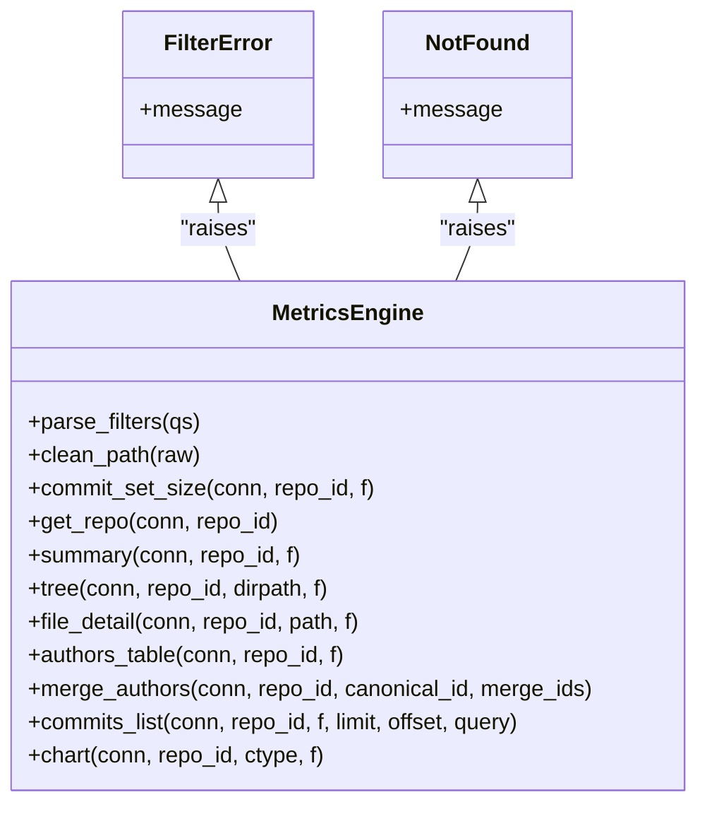
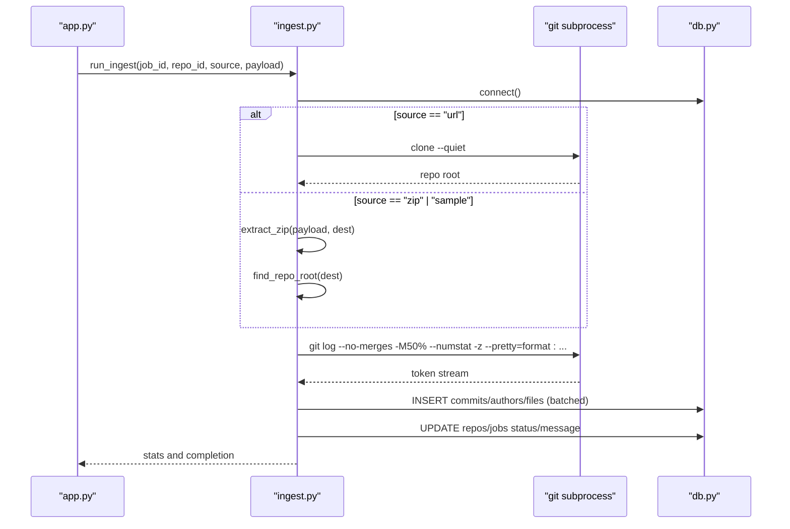
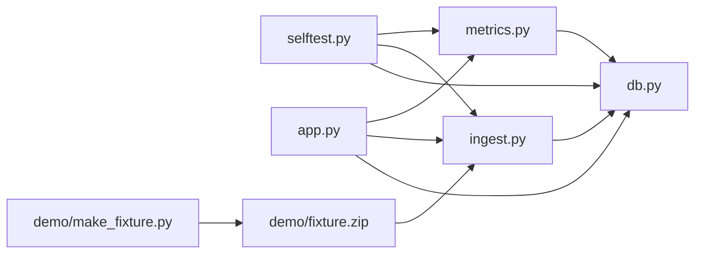

# Testing & Development

<cite>
**Referenced Files in This Document**
- [selftest.py](file://selftest.py)
- [make_fixture.py](file://demo/make_fixture.py)
- [metrics.py](file://metrics.py)
- [ingest.py](file://ingest.py)
- [app.py](file://app.py)
- [db.py](file://db.py)
- [start.sh](file://start.sh)
- [README.md](file://README.md)
</cite>

## Table of Contents
1. [Introduction](#introduction)
2. [Project Structure](#project-structure)
3. [Core Components](#core-components)
4. [Architecture Overview](#architecture-overview)
5. [Detailed Component Analysis](#detailed-component-analysis)
6. [Dependency Analysis](#dependency-analysis)
7. [Performance Considerations](#performance-considerations)
8. [Troubleshooting Guide](#troubleshooting-guide)
9. [Conclusion](#conclusion)
10. [Appendices](#appendices)

## Introduction
This document explains how to test, extend, and develop RAT with confidence. It focuses on:
- The self-test suite that validates metric engine behavior against deterministic fixture data.
- The fixture generation process that creates a reproducible Git history covering edge cases.
- The testing strategy across unit, integration, and end-to-end validation.
- Guidance for writing new tests, extending fixtures, validating metrics, adding metrics, extending ingestion, and maintaining backward compatibility.
- Development workflow, debugging techniques, performance profiling, code quality standards, and contribution guidance.

RAT is a local, offline dashboard that ingests Git repositories from zip archives or public clone URLs and computes metrics such as added/removed lines, growth, churn, modifications, frequency, churn rate, and ownership per file, directory, repository, commit set, and author.

**Section sources**
- [README.md:1-46](file://README.md#L1-L46)

## Project Structure
The project is intentionally small and layered:
- `app.py`: HTTP server, routing, request validation, and API endpoints.
- `ingest.py`: Zip extraction, URL cloning, Git history parsing, and background job execution.
- `metrics.py`: Metric calculations, filters, aggregation, charts, and identity merging.
- `db.py`: SQLite schema, connection helpers, and data directory management.
- `selftest.py`: Automated assertions over the real ingestion pipeline and metric engine.
- `demo/make_fixture.py`: Deterministic fixture generator producing `demo/fixture.zip`.
- `start.sh`: Convenience wrapper to run the server.
- `static/`: Frontend assets served by the server.

**Diagram sources**
- [app.py:121-196](file://app.py#L121-L196)
- [metrics.py:205-544](file://metrics.py#L205-L544)
- [ingest.py:181-458](file://ingest.py#L181-L458)
- [db.py:15-100](file://db.py#L15-L100)
- [selftest.py:55-439](file://selftest.py#L55-L439)
- [make_fixture.py:189-268](file://demo/make_fixture.py#L189-L268)

**Section sources**
- [app.py:1-492](file://app.py#L1-L492)
- [ingest.py:1-458](file://ingest.py#L1-L458)
- [metrics.py:1-544](file://metrics.py#L1-L544)
- [db.py:1-100](file://db.py#L1-L100)
- [selftest.py:1-439](file://selftest.py#L1-L439)
- [make_fixture.py:1-268](file://demo/make_fixture.py#L1-L268)
- [start.sh:1-5](file://start.sh#L1-L5)
- [README.md:1-46](file://README.md#L1-L46)

## Core Components
- Self-test suite (`selftest.py`): Creates an isolated temporary data directory, initializes the database, inserts a sample repo, extracts the fixture zip through the real ingestion path, reads history, and asserts expected metrics across summary, tree, file detail, authors, charts, commits list, filter validation, zip-slip protection, URL validation, and identity merging.
- Fixture generator (`demo/make_fixture.py`): Builds a small Git repository deterministically using fixed timestamps and authors, exercises initial adds, edits, pure renames, rename+edit, deletions, binary files, merge commits, and branch merges, then packages it into `demo/fixture.zip`.
- Metric engine (`metrics.py`): Implements filters, aggregation, derived metrics (growth, churn, frequency, churn_rate), per-object summaries, directory trees, file details with author ownership, author tables, commit lists, charts, and manual identity merging.
- Ingestion pipeline (`ingest.py`): Validates URLs, safely extracts zips, finds repository roots, parses Git log output in one pass, handles renames and binaries, batches file rows, updates progress, and manages background jobs.
- Database layer (`db.py`): Defines schema, indexes, connection configuration (WAL, busy timeout), and data directory resolution.
- Application server (`app.py`): Routes HTTP requests, validates inputs, invokes ingestion and metrics, and serves static frontend assets.

**Section sources**
- [selftest.py:55-439](file://selftest.py#L55-L439)
- [make_fixture.py:189-268](file://demo/make_fixture.py#L189-L268)
- [metrics.py:30-544](file://metrics.py#L30-L544)
- [ingest.py:70-458](file://ingest.py#L70-L458)
- [db.py:15-100](file://db.py#L15-L100)
- [app.py:121-441](file://app.py#L121-L441)

## Architecture Overview
The testing and development architecture centers around deterministic fixtures and a self-contained test harness that exercises the full ingestion and metric pipeline.

**Diagram sources**
- [selftest.py:55-115](file://selftest.py#L55-L115)
- [ingest.py:181-315](file://ingest.py#L181-L315)
- [metrics.py:205-544](file://metrics.py#L205-L544)
- [db.py:77-95](file://db.py#L77-L95)

## Detailed Component Analysis

### Self-Test Suite (`selftest.py`)
The self-test suite is the primary automated validation mechanism. It:
- Sets up an isolated temporary data directory and environment variable for data storage.
- Initializes the database and inserts a sample repository record.
- Extracts the bundled fixture zip through the real ingestion pipeline.
- Reads the repository history and stores hashes and author mappings for targeted filtering.
- Exercises ingestion statistics, merge exclusion, repository totals, edge-case commits (pure rename, rename+edit, deletion, binary exclusion), date range filters, empty commit sets, hash prefix filters, author filters, combined filters, directory tree structure, filtered tree semantics, file detail ownership, author table ordering and ownership, chart bucketing and series sums, top-files chart exclusions, authorshare totals, commits list pagination and search, filter validation errors, zip-slip rejection, URL validation, and manual identity merging.

Key behaviors validated:
- Merge commits are excluded from metrics.
- Pure renames produce zero impact but still count as a file entry under the new path.
- Rename+edits attribute changes to the new path.
- Deletions contribute removed lines and negative growth.
- Binary files are excluded from line metrics but still count as commits and authors.
- Date ranges use inclusive lower bound and exclusive upper bound.
- Empty hash filters yield an empty commit set.
- Hash prefixes shorter than 12 characters are matched via LIKE; longer tokens are matched exactly at 12-character precision.
- Author filters resolve canonical identities.
- Directory trees remain filter-independent for structure while metrics reflect the active commit set.
- Ownership is zero when total churn is zero.
- Charts adapt bucket granularity based on time span.
- Top-files excludes zero-churn paths.
- Filter validation raises specific errors for invalid integers, out-of-range values, malformed hashes, too many hashes, and invalid paths.
- Zip extraction rejects unsafe paths.
- URL validation accepts only http/https with a netloc.
- Manual identity merging consolidates author records and recalculates ownership.

**Diagram sources**
- [selftest.py:55-439](file://selftest.py#L55-L439)

**Section sources**
- [selftest.py:55-439](file://selftest.py#L55-L439)

### Fixture Generation (`demo/make_fixture.py`)
The fixture generator builds a deterministic repository with fixed authors and timestamps spanning January to April 2026 in a +02:00 timezone. It covers:
- Initial adds across multiple directories and root-level files.
- Edits to two files in one commit.
- A pure rename (zero metric impact).
- A rename plus edit attributed to the new path.
- A deletion counted as removed lines.
- A binary PNG file excluded from metrics.
- A merge commit that must be excluded.
- A feature branch commit and subsequent mainline advancement.
- Final polish of the feature module.

It uses Git commands with controlled environment variables to ensure deterministic author/committer metadata and timestamps. The resulting repository is packaged into `demo/fixture.zip`, which the self-test suite consumes directly.

**Diagram sources**
- [make_fixture.py:189-268](file://demo/make_fixture.py#L189-L268)

**Section sources**
- [make_fixture.py:1-268](file://demo/make_fixture.py#L1-L268)

### Metric Engine (`metrics.py`)
The metric engine implements:
- Filter parsing with strict validation for integer ranges, hash token length and character set, maximum number of hashes, and path normalization.
- Commit-set size calculation and WHERE fragment construction combining date bounds, author canonical identity, and hash matching (exact 12-char prefix vs short prefix LIKE).
- Aggregation functions for added/removed/modifications across files joined to commits.
- Derived metrics including growth, churn, frequency, and churn_rate with safe division by zero handling.
- Repository summary including distinct file and author counts.
- Directory tree listing independent of filters for structure, with child metrics computed under the active commit set.
- File detail with per-author churn, modifications, commits, and ownership normalized by total churn.
- Author table aggregating canonical identities, identity lists, commits, modifications, churn, and ownership.
- Manual identity merging updating canonical references and recomputing display names and emails.
- Commit list with pagination, optional search by hash prefix or subject substring, and canonical author display.
- Charts for churn time series (adaptive day/week/month buckets), top files by churn, and author share distribution.

**Diagram sources**
- [metrics.py:30-544](file://metrics.py#L30-L544)

**Section sources**
- [metrics.py:30-544](file://metrics.py#L30-L544)

### Ingestion Pipeline (`ingest.py`)
The ingestion pipeline provides:
- URL validation ensuring http/https schemes and presence of a netloc.
- Safe zip extraction with zip-slip protection, rejecting unsafe paths and verifying resolved targets remain within the destination directory.
- Repository root detection supporting single top-level folder archives and nested single-folder archives.
- One-pass Git history parsing using a custom NUL-separated token stream, handling commit headers, file records, renames, and binary exclusions.
- Batched file insertion and progress callbacks throttled during large histories.
- Background job execution with progress updates, error handling, cleanup of partial data, and stale job recovery.

**Diagram sources**
- [app.py:306-381](file://app.py#L306-L381)
- [ingest.py:356-458](file://ingest.py#L356-L458)
- [ingest.py:181-315](file://ingest.py#L181-L315)
- [db.py:77-95](file://db.py#L77-L95)

**Section sources**
- [ingest.py:70-458](file://ingest.py#L70-L458)

### Database Layer (`db.py`)
The database layer defines:
- Schema for repositories, authors, commits, files, and jobs.
- Indexes optimizing lookups by commit, path, timestamp, and hash.
- Connection configuration enabling WAL mode, busy timeouts, and row factories.
- Data directory resolution with environment override and default location.

**Section sources**
- [db.py:15-100](file://db.py#L15-L100)

### Application Server (`app.py`)
The application server:
- Routes GET/POST/DELETE requests to API handlers.
- Validates JSON payloads and query parameters.
- Invokes ingestion and metrics with proper error mapping to HTTP status codes.
- Serves static frontend assets with appropriate content types and cache headers.
- Provides health check, repository listing, job polling, sample fixture loading, and author merging endpoints.

**Section sources**
- [app.py:56-441](file://app.py#L56-L441)

## Dependency Analysis
The components have clear dependency relationships:
- `selftest.py` depends on `db.py`, `ingest.py`, and `metrics.py`.
- `app.py` depends on `db.py`, `ingest.py`, and `metrics.py`.
- `ingest.py` depends on `db.py`.
- `metrics.py` depends on `db.py`.
- `demo/make_fixture.py` is standalone and produces `demo/fixture.zip`.

**Diagram sources**
- [selftest.py:34-39](file://selftest.py#L34-L39)
- [app.py:28-30](file://app.py#L28-L30)
- [ingest.py:30-30](file://ingest.py#L30-L30)
- [metrics.py:1-21](file://metrics.py#L1-L21)
- [make_fixture.py:33-34](file://demo/make_fixture.py#L33-L34)

**Section sources**
- [selftest.py:34-39](file://selftest.py#L34-L39)
- [app.py:28-30](file://app.py#L28-L30)
- [ingest.py:30-30](file://ingest.py#L30-L30)
- [metrics.py:1-21](file://metrics.py#L1-L21)
- [make_fixture.py:33-34](file://demo/make_fixture.py#L33-L34)

## Performance Considerations
- Ingestion uses batched file inserts and throttled progress callbacks to handle large histories efficiently.
- SQLite is configured with WAL mode and busy timeouts to support concurrent readers during ingestion writes.
- Metric queries aggregate across joins and use COUNT(DISTINCT ...) to compute modifications and distinct entities accurately.
- Chart bucketing adapts granularity based on time span to avoid excessive labels.
- Top-files and author-share charts limit results to reduce payload size.

Recommendations:
- Keep fixture sizes small for fast self-tests.
- Use targeted filters in tests to minimize query scope.
- Profile ingestion with larger repositories using Python’s built-in profilers if needed.
- Monitor SQLite WAL performance and consider tuning PRAGMAs if workload changes significantly.

[No sources needed since this section provides general guidance]

## Troubleshooting Guide
Common issues and resolutions:
- Missing `git` executable: Ensure Git is installed and available on PATH; required for cloning and history extraction.
- Occupied ports: The server automatically tries fallback ports; the actual URL is printed at startup.
- Corrupted or missing fixture: Regenerate `demo/fixture.zip` using the fixture generator.
- Stale jobs after restart: The server recovers interrupted jobs and marks them as failed.
- Invalid filter inputs: The metric engine raises specific errors for invalid integers, out-of-range values, malformed hashes, too many hashes, and invalid paths.
- Zip-slip attacks: Extraction rejects unsafe paths and prevents directory traversal.
- URL validation failures: Only http/https URLs with a netloc are accepted.

Debugging techniques:
- Run `python3 selftest.py` to validate metric engine semantics against the fixture.
- Inspect the temporary data directory created by the self-test suite to examine SQLite state.
- Use the health endpoint `/api/health` to verify server availability.
- Poll job status via `/api/jobs/<id>` and `/api/repos/<repo_id>/job` to track ingestion progress.
- Reset state by deleting the `data/` directory to clear all ingested repositories and jobs.

**Section sources**
- [README.md:36-46](file://README.md#L36-L46)
- [ingest.py:332-358](file://ingest.py#L332-L358)
- [metrics.py:40-88](file://metrics.py#L40-L88)
- [app.py:121-196](file://app.py#L121-L196)

## Conclusion
RAT’s testing and development model relies on a deterministic fixture and a comprehensive self-test suite that validates the entire ingestion and metric pipeline. By following the guidance in this document, you can confidently add new metrics, extend the ingestion pipeline, write robust tests, maintain backward compatibility, and keep code quality high. The architecture is simple, secure, and optimized for local, offline analysis.

[No sources needed since this section summarizes without analyzing specific files]

## Appendices

### Testing Strategy
- Unit tests: Focus on individual functions in `metrics.py` and `ingest.py` where applicable; the self-test suite already covers core logic thoroughly.
- Integration tests: Use the self-test pattern to initialize a temporary database, ingest a fixture, and assert end-to-end behavior.
- End-to-end validation: Start the server, load the sample fixture, and exercise API endpoints to confirm UI and backend consistency.

Guidance for writing new tests:
- Add new test methods to `selftest.py` under relevant categories (e.g., repository totals, edge-case commits, filters, tree, file detail, authors, charts, commits list, validation, identity merging).
- Use helper methods like `summary`, `tree`, `file`, `authors`, and `author_of` to simplify assertions.
- For new metrics, extend `metrics.py` and add corresponding assertions in `selftest.py` that cover normal cases, edge cases, and filter combinations.

Extending the fixture dataset:
- Modify `demo/make_fixture.py` to introduce new commits, authors, paths, or edge cases.
- Re-run the generator to regenerate `demo/fixture.zip`.
- Update expectations in `selftest.py` to match the new fixture semantics.

Validating metric calculations:
- Verify derived metrics (growth, churn, frequency, churn_rate) for each scenario.
- Confirm ownership calculations normalize correctly, especially when total churn is zero.
- Ensure directory trees preserve structure while reflecting filtered metrics.

Adding new metrics:
- Implement the calculation in `metrics.py` with clear input/output contracts.
- Expose the metric via an API endpoint in `app.py` if user-facing.
- Add tests in `selftest.py` covering normal, boundary, and error conditions.

Extending the ingestion pipeline:
- Extend `ingest.py` to parse additional Git metadata or handle new archive formats.
- Maintain zip-slip safety and URL validation rules.
- Update progress reporting and error handling consistently.

Maintaining backward compatibility:
- Preserve existing API responses and metric field names.
- Introduce new fields as optional or additive.
- Validate filters and inputs strictly to prevent regressions.

Code quality standards and contribution guidelines:
- Follow standard library-only constraints; no external dependencies.
- Keep functions focused and well-documented.
- Use explicit error types (`FilterError`, `NotFound`, `IngestError`, `ApiError`) for clear error propagation.
- Prefer deterministic behavior in tests and fixtures.
- Run `python3 selftest.py` before submitting changes.
- Use `./start.sh` or `python3 app.py` to start the server locally.

Development workflow:
- Generate fixtures: `python3 demo/make_fixture.py`
- Run self-tests: `python3 selftest.py`
- Start server: `python3 app.py` or `./start.sh`
- Optional environment variables: `PORT`, `HOST`, `DATA_DIR`

**Section sources**
- [selftest.py:55-439](file://selftest.py#L55-L439)
- [make_fixture.py:189-268](file://demo/make_fixture.py#L189-L268)
- [metrics.py:205-544](file://metrics.py#L205-L544)
- [ingest.py:70-458](file://ingest.py#L70-L458)
- [app.py:121-441](file://app.py#L121-L441)
- [README.md:42-46](file://README.md#L42-L46)